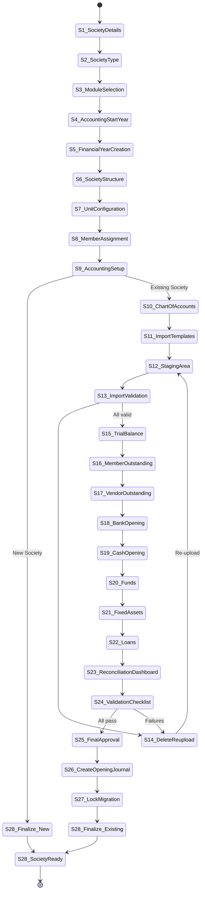
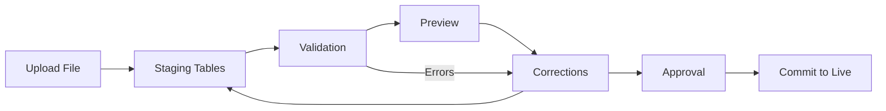
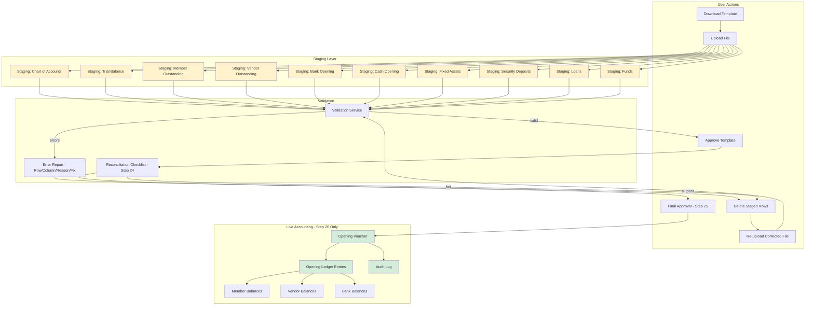
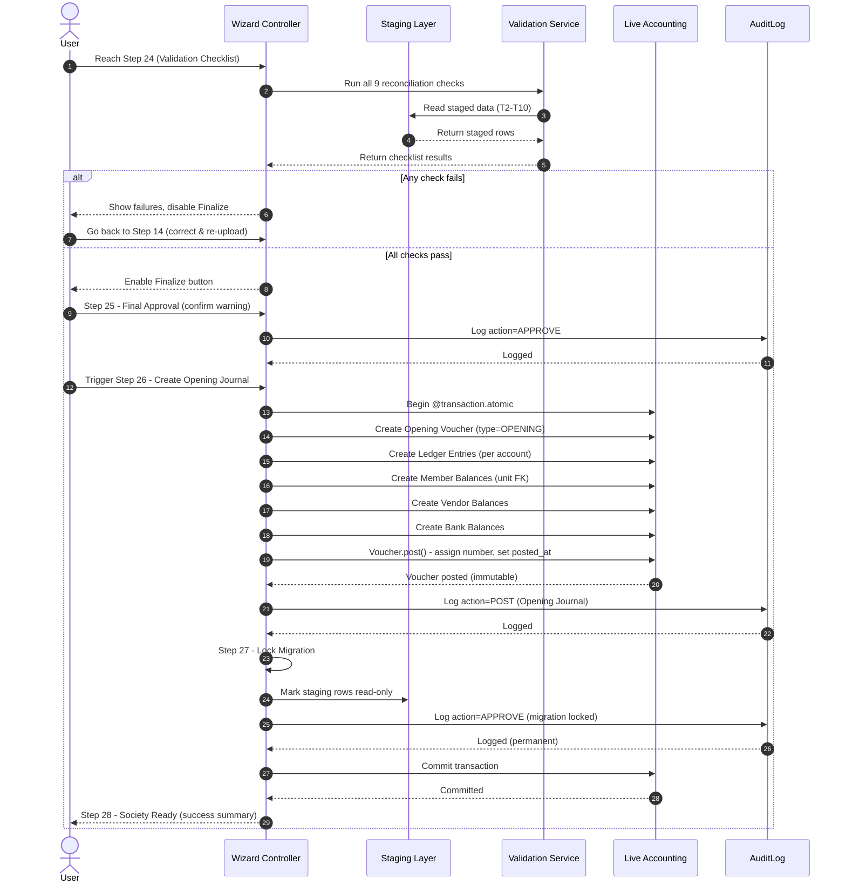

# Housynk — Society Creation & Accounting Migration Wizard Specification

> **Document type:** Formal Technical Specification
> **Status:** Ready for implementation
> **Companion document:** [`WIZARD_ARCHITECTURE_ANALYSIS.md`](WIZARD_ARCHITECTURE_ANALYSIS.md:1)
> **Project root:** [`housing_accounting/`](../housing_accounting/:1)

---

## Table of Contents

1. [Overview](#1-overview)
2. [Wizard Flow](#2-wizard-flow)
3. [Design Principles](#3-design-principles)
4. [Important Rules](#4-important-rules)
5. [Wizard State Machine](#5-wizard-state-machine)
6. [Step Specifications](#6-step-specifications)
   - [Step 1 — Society Details](#step-1--society-details)
   - [Step 2 — Select Society Type](#step-2--select-society-type)
   - [Step 3 — Module Selection](#step-3--module-selection)
   - [Step 4 — Accounting Start Year](#step-4--accounting-start-year)
   - [Step 5 — Financial Year Creation](#step-5--financial-year-creation)
   - [Step 6 — Society Structure](#step-6--society-structure)
   - [Step 7 — Unit Configuration](#step-7--unit-configuration)
   - [Step 8 — Member Assignment](#step-8--member-assignment)
   - [Step 9 — Accounting Setup](#step-9--accounting-setup)
   - [Steps 10–27 — Accounting Migration Wizard](#steps-1027--accounting-migration-wizard-existing-society-only)
   - [Step 28 — Society Ready](#step-28--society-ready)
7. [Staging Area Data Flow](#7-staging-area-data-flow)
8. [Migration Finalization Sequence](#8-migration-finalization-sequence)
9. [Import Templates](#9-import-templates)
10. [Validation Rules](#10-validation-rules)
11. [Codebase Component Mapping](#11-codebase-component-mapping)
12. [Glossary](#12-glossary)

---

## 1. Overview

The **Society Creation & Accounting Migration Wizard** ("the Wizard") is a guided, multi-step onboarding flow that provisions a fully functional housing society in the Housynk platform. It supports two distinct paths:

- **Brand New Society** — A society starting from scratch with zero opening balances. The Wizard auto-creates the standard chart of accounts, voucher types, accounting configuration, and tax configuration, then finalizes.
- **Existing Society (Migrating from another software)** — A society that already operates in another system and must import its opening balances, member outstanding, vendor outstanding, bank balances, funds, fixed assets, and loans. The Wizard launches the **Accounting Migration Wizard**, which uses staging tables, full validation, reconciliation checks, and a single immutable Opening Journal.

The Wizard is **resumable**, **auditable**, and **non-destructive** until final approval. No imported data ever touches live accounting tables until the final commit.

### Scope

| Capability | In scope | Out of scope |
|------------|----------|--------------|
| Society record creation | ✅ | |
| Module enablement | ✅ | Module internals configuration |
| Financial year & period creation | ✅ | Historical period re-opening |
| Structure / unit / member provisioning | ✅ | Bulk member CSV import (separate feature) |
| Standard chart of accounts bootstrap | ✅ | Custom COA design tooling |
| Accounting migration (existing society) | ✅ | Migrating historical transactions |
| Opening journal creation & lock | ✅ | Post-opening voucher editing |
| Billing / receipt generation | ✅ (optional first bill) | Recurring scheduler setup |

---

## 2. Wizard Flow

The end-to-end flow is a linear pipeline with a conditional branch at Step 9 that splits the path for new vs. existing societies.

```
Start
  → Step 1: Create Society (Society Details)
  → Step 2: Choose Society Type
  → Step 3: Select Modules
  → Step 4: Choose Accounting Start Year
  → Step 5: Create Financial Year
  → Step 6: Create Accounting Periods
  → Step 7: Configure Society
  → Step 8: Create Structure
  → Step 9: Create Units
  → Step 10: Assign Members
  → Step 11: Accounting Setup
      ├─ NEW SOCIETY     → auto-create defaults → proceed to Finalize
      └─ EXISTING SOCIETY → Steps 10–27 (Accounting Migration Wizard)
  → Migration Validation
  → Finalize
  → Step 28: Society Ready
```

> **Note on step numbering:** The user-facing flow is sequential (Start → … → Society Ready). The 28 numbered specification steps below map the detailed sub-steps, where Steps 10–27 are the Accounting Migration Wizard sub-flow that only runs for an existing society. Step 9 is the branch point.

---

## 3. Design Principles

The Wizard is governed by the following non-negotiable design principles. Every implementation decision must be traceable to one or more of these.

| # | Principle | Rationale |
|---|-----------|-----------|
| DP-1 | Keep onboarding simple | A first-time admin should reach "Society Ready" without accounting expertise. |
| DP-2 | Support both new and existing societies | One Wizard, two paths; the branch is explicit at Step 9. |
| DP-3 | Never require manual database changes | All provisioning is service-layer only; no SQL, no shell, no admin-site data entry. |
| DP-4 | Never import data directly into live accounting tables | All imports land in staging tables first. |
| DP-5 | Every import must go through validation | No file is committed without full structural and cross-file validation. |
| DP-6 | Every migration must be fully auditable | Every action is recorded in [`AuditLog`](auditlog/models.py:21). |
| DP-7 | User should be able to stop and continue later | Wizard state is persisted; resuming returns the user to the exact step. |
| DP-8 | User should be able to delete imported data and upload corrected files before finalization | Unlimited re-upload attempts before Step 25 (Final Approval). |
| DP-9 | No partial imports into production accounting | A file either fully validates and commits, or it does not commit at all. |
| DP-10 | Migration should create one immutable Opening Journal after successful validation | Exactly one `OPENING` voucher; read-only and permanent after posting. |

---

## 4. Important Rules

These rules are enforceable invariants. The implementation must actively prevent violations.

| # | Rule | Enforcement |
|---|------|-------------|
| R-1 | Never import directly into production tables | Import service writes only to staging models; commit service is the sole writer to live tables. |
| R-2 | Always use staging tables | Every import template has a dedicated staging model. |
| R-3 | Never allow partial imports | Commit is all-or-nothing per template inside a single `@transaction.atomic` block. |
| R-4 | Every uploaded file must be validated completely | Validation runs over 100% of rows before any commit. |
| R-5 | Users may delete and re-upload files before final approval | Staging rows are deletable until Step 25. |
| R-6 | Keep migration resumable | `WizardSession` persists `current_step`, `society_id`, and per-template staging state. |
| R-7 | Every migration action must be recorded in the audit log | All uploads, validations, deletions, approvals, and commits call [`AuditLog.log()`](auditlog/models.py:94). |
| R-8 | System accounts cannot be deleted | Accounts with `system_protected=True` (see [`Account`](accounting/models/model_Account.py:8)) reject deletion. |
| R-9 | Custom accounts may be added during migration | Step 10 allows adding accounts; custom accounts have `system_protected=False`. |
| R-10 | Users must use Housynk-provided Excel/CSV templates | Upload rejects files whose header row does not match the template schema. |
| R-11 | System must prevent finalization until all reconciliation checks pass | Step 24 checklist gates Step 25; the Finalize button is disabled until all checks are green. |
| R-12 | After finalization, opening balances become immutable | The Opening Journal is posted and locked; future corrections require reversal vouchers. |

---

## 5. Wizard State Machine

The Wizard transitions through a finite set of states. Each state corresponds to a step. Backward navigation is allowed for review/correction up to the commit boundary (Step 25). After Step 25, the migration is locked.



---

## 6. Step Specifications

Each step below documents: purpose, inputs, actions, outputs, validation, and the codebase components it maps to.

### Step 1 — Society Details

**Purpose:** Capture the society's legal identity and locale configuration. This creates the [`Society`](societies/models/model_Society.py:4) record and the owner [`Membership`](societies/models/model_Membership.py:4).

**Inputs:**

| Field | Type | Required | Validation | Notes |
|-------|------|----------|------------|-------|
| Society Name | CharField(200) | ✅ | Non-empty, unique per creator | Maps to `Society.name` |
| Registration Number | CharField | ✅ | Non-empty | Maps to `Society.registration_number` |
| Registration Date | DateField | ✅ | Not in future | Stored on `Society` (extend model if absent) |
| Society Type | Choice | ✅ | Enum: Residential / Commercial / Mixed | Drives Step 2 default |
| Address | TextField | ✅ | Non-empty | Maps to `Society.address` |
| City | CharField | ✅ | Non-empty | |
| State | CharField | ✅ | Non-empty | |
| Country | CharField | ✅ | Non-empty | Default: India |
| PIN Code | CharField | ✅ | Regex `^\d{6}$` (India) | |
| PAN | CharField | ✅ | Regex `^[A-Z]{5}\d{4}[A-Z]$` | |
| GST Number | CharField | ❌ | Regex `^\d{2}[A-Z]{5}\d{4}[A-Z]{1}\d{1}[A-Z]{1}\d{1}$` if provided | |
| TAN | CharField | ❌ | Regex `^[A-Z]{4}\d{5}[A-Z]$` if provided | |
| Email | EmailField | ✅ | Valid email | Society contact email |
| Phone | CharField | ✅ | Regex `^\+?\d{10,15}$` | |
| Time Zone | Choice | ✅ | Valid tz database name | Default: `Asia/Kolkata` |
| Currency | Choice | ✅ | ISO 4217 | Default: `INR` |
| Financial Year Pattern | Choice | ✅ | April–March / Jan–Dec / Jul–Jun | Drives Step 4 & 5 |

**Actions:**
1. Validate all fields.
2. Call [`create_society()`](societies/services.py:36) atomically — creates `Society` + `Membership(role=OWNER)`.
3. Persist extended fields (registration date, city, state, country, PIN, PAN, GST, TAN, email, phone, time zone, currency, FY pattern) to [`SocietyConfig`](societies/models/model_SocietyConfig.py:9) or a society-profile extension.
4. Log via [`AuditLog.log()`](auditlog/models.py:94) with `action=CREATE`, `entity_type="Society"`.
5. Set the session scope to the new society via [`selection.py`](housing_accounting/selection.py:1).

**Outputs:** `society_id`, `membership_id`.

**Codebase mapping:** [`SocietyCreateView`](housing/views.py:635), [`create_society()`](societies/services.py:36), [`SocietyConfig`](societies/models/model_SocietyConfig.py:9), [`SocietyMiddleware`](societies/middleware.py:5).

---

### Step 2 — Select Society Type

**Purpose:** Determine whether this is a brand-new society or an existing society migrating from another system. This choice controls whether the Accounting Migration Wizard (Steps 10–27) runs.

**Inputs:**

| Option | Effect |
|--------|--------|
| Brand New Society | Opening balances = zero; skip Steps 10–27; auto-create defaults at Step 9. |
| Existing Society (Migrating from another software) | Launch Accounting Migration Wizard at Step 9; run Steps 10–27. |

**Actions:**
1. Store `society_type = NEW | EXISTING` on `WizardSession`.
2. Log the selection.

**Validation:** Exactly one option must be selected.

**Codebase mapping:** `WizardSession` (new model), [`AuditLog.log()`](auditlog/models.py:94).

---

### Step 3 — Module Selection

**Purpose:** Choose which Housynk modules are enabled for this society. Core modules are mandatory; optional modules may be enabled later by an admin.

**Inputs:**

| Category | Modules | Selectable? |
|----------|---------|-------------|
| **Core (Mandatory)** | Accounting, Billing, Members, Society Administration | ❌ Always enabled; cannot be deselected. |
| **Optional** | Parking Management, Visitor Management, Gate Management, Complaint Management, Facility Booking, Staff Management, Vendor Management, Inventory, Asset Register, Share Certificate Management, Bank Reconciliation, AMC Management, Notice Board, Document Management, Email, SMS, WhatsApp, Analytics, AI Assistant | ✅ User toggles each. |

**Actions:**
1. Persist the enabled-module set on `WizardSession` (or `SocietyConfig.enabled_modules`).
2. Unselected modules remain **disabled** at the platform level for this society.
3. An admin may enable a disabled module later via the society admin screen ([`SocietyAdminView`](housing/views.py:1)).
4. Log the module set.

**Validation:** Core modules are always included regardless of user input.

**Codebase mapping:** [`SocietyConfig`](societies/models/model_SocietyConfig.py:9), [`SocietyAdminView`](housing/views.py:1), existing apps: [`parking/`](parking/:1), [`gateops/`](gateops/:1), [`reconciliation/`](reconciliation/:1), [`shares/`](shares/:1), [`notifications/`](notifications/:1).

---

### Step 4 — Accounting Start Year

**Purpose:** Let the user pick the financial year that will become the active accounting year (e.g., 2026-27, 2025-26, 2024-25).

**Inputs:**

| Field | Type | Required | Validation |
|-------|------|----------|------------|
| Financial Year | Choice | ✅ | One of the supported FY ranges derived from the FY pattern chosen in Step 1. |

**Actions:**
1. Store `accounting_start_year` on `WizardSession`.
2. This FY becomes the **active accounting year** for the society once Step 5 creates it.

**Validation:** The selected FY must be consistent with the FY pattern from Step 1 (e.g., April–March → `2026-27` means 2026-04-01 to 2027-03-31).

**Codebase mapping:** [`FinancialYear`](accounting/models/model_FinancialYear.py:9), [`get_default_financial_year_for_society()`](housing_accounting/selection.py:11).

---

### Step 5 — Financial Year Creation

**Purpose:** Automatically create the [`FinancialYear`](accounting/models/model_FinancialYear.py:9), its monthly [`AccountingPeriod`](accounting/models/model_AccountingPeriod.py:8) records, and the period lock configuration.

**Actions:**
1. Create `FinancialYear` with `start_date`/`end_date` derived from the Step 4 selection and Step 1 FY pattern.
   - `FinancialYear.save()` auto-creates monthly `AccountingPeriod` records via `_create_accounting_periods()`.
   - Periods up to today's date are opened; future periods remain closed until needed.
2. Create a **Period Lock Configuration** record (per-period lock policy) — this controls which periods accept voucher posting.
3. Set this FY as the society's active FY in the session scope.
4. Log creation.

**Outputs:** `financial_year_id`, list of `accounting_period_id`s.

**Validation:**
- Only one open FY per society at a time (enforced by `get_open_year_for_date`).
- Period date ranges must not overlap.

**Codebase mapping:** [`FinancialYear`](accounting/models/model_FinancialYear.py:9) (auto-creates periods in `save()`), [`AccountingPeriod`](accounting/models/model_AccountingPeriod.py:8), [`period_workflow.py`](accounting/services/period_workflow.py:1), [`seed_deepsagar._ensure_open_financial_year()`](housing/management/commands/seed_deepsagar.py:323).

---

### Step 6 — Society Structure

**Purpose:** Configure the physical structure of the society: buildings, wings, floors, and the unit hierarchy. Supports four topology modes.

**Topology modes:**

| Mode | Description | Example |
|------|-------------|---------|
| Single Building | One building, optional wings/floors | Tower A only |
| Multiple Buildings | Several buildings, each with wings/floors | Towers A, B, C |
| Commercial Units | Shops/offices, possibly no wings | A shopping block |
| Mixed Society | Residential + commercial in one society | Flats + shops |

**Inputs:**

| Field | Type | Required | Validation |
|-------|------|----------|------------|
| Topology mode | Choice | ✅ | One of the four modes |
| Structures (tree) | Nested | ✅ | Each node: `structure_type` (BUILDING/WING/BLOCK/TOWER/FLOOR), `name`, `parent`, `display_order` | Nesting depth validated by [`Structure.clean()`](members/models/model_Structure.py:5). |

**Actions:**
1. Create [`Structure`](members/models/model_Structure.py:5) records respecting `unique_together = (society, parent, name)`.
2. Validate nesting depth.
3. Log each structure creation.

**Codebase mapping:** [`Structure`](members/models/model_Structure.py:5), [`StructureCreateView`](housing/views.py:1), [`seed_deepsagar._ensure_structure_and_units()`](housing/management/commands/seed_deepsagar.py:398).

---

### Step 7 — Unit Configuration

**Purpose:** Configure the individual units (flats, shops, offices) within the structures created in Step 6.

**Inputs (per unit):**

| Field | Type | Required | Validation | Notes |
|-------|------|----------|------------|-------|
| Flat Number / Identifier | CharField | ✅ | Unique within structure | Maps to `Unit.identifier` (e.g., "A1-101") |
| Area | DecimalField | ✅ | > 0 | Maps to `Unit.area_sqft` |
| Usage Type | Choice | ✅ | Residential / Commercial / Shop / Office | Maps to `Unit.unit_type` (FLAT/SHOP/OFFICE/OTHER) |
| Parking Allocation | Choice/Decimal | ❌ | If Parking module enabled | Slots or count |
| Maintenance Calculation Method | Choice | ✅ | Fixed / Per-sqft / Per-person / Custom formula | Drives [`ChargeTemplate.charge_type`](billing/models/model_ChargeTemplate.py:10) |

**Actions:**
1. Create [`Unit`](members/models/model_Unit.py:4) records.
2. Optionally set `chargeable_area_sqft` (falls back to `area_sqft` via `billing_area_sqft` property).
3. Support bulk creation via the [`BulkUnitCreateView`](housing/views.py:711) grid pattern.
4. Log creation.

**Codebase mapping:** [`Unit`](members/models/model_Unit.py:4), [`BulkUnitCreateView`](housing/views.py:711), [`UnitCreateView`](housing/views.py:1), [`ChargeTemplate.charge_type`](billing/models/model_ChargeTemplate.py:10).

---

### Step 8 — Member Assignment

**Purpose:** Assign members to units with their roles, contacts, and occupancy status.

**Inputs (per member):**

| Field | Type | Required | Validation | Notes |
|-------|------|----------|------------|-------|
| Owner | Member ref | ✅ (for owned units) | Full name + email | Maps to `Member(role=OWNER)` |
| Associate Member | Member ref | ❌ | | Additional owners / co-owners |
| Tenant | Member ref | ❌ | Tenancy start/end dates | Maps to `Member(role=TENANT)` |
| Nominee | Member ref | ❌ | | Maps to `Member(role=NOMINEE)` / [`Nominee`](housing/migrations/0009_nominee.py:1) |
| Emergency Contacts | Contact list | ❌ | Name + phone | |
| Occupation Status | Choice | ✅ | Owner-occupied / Tenant-occupied / Vacant | Drives [`UnitOccupancy.occupancy_type`](members/models/model_UnitOccupancy.py:6) |

**Relationship rules:**
- One member can own **multiple units**.
- One unit can have **multiple associated members** (owner + associate + nominee).

**Actions:**
1. Create [`Member`](members/models/model_Member.py:7) records (`unique_together = (society, unit, full_name, role)`).
2. Auto-provision a [`User`](housing_accounting/users/:1) from email via [`_resolve_owner_user()`](housing/services/membership_lifecycle.py:14).
3. Call [`sync_member_unit_lifecycle(member)`](housing/services/membership_lifecycle.py:36) to create [`UnitOwnership`](members/models/model_UnitOwnership.py:6) and [`UnitOccupancy`](members/models/model_UnitOccupancy.py:6).
4. Log creation.

**Codebase mapping:** [`Member`](members/models/model_Member.py:7), [`MemberCreateView`](housing/views.py:935), [`sync_member_unit_lifecycle()`](housing/services/membership_lifecycle.py:36), [`UnitOwnership`](members/models/model_UnitOwnership.py:6), [`UnitOccupancy`](members/models/model_UnitOccupancy.py:6), [`MemberFormOptionsAPIView`](housing/views.py:1032).

---

### Step 9 — Accounting Setup

**Purpose:** Branch point. For a **new society**, auto-create all accounting defaults with zero opening balances and proceed to finalize. For an **existing society**, launch the Accounting Migration Wizard (Steps 10–27).

#### 9a. New Society Path

**Actions (all idempotent):**
1. [`ensure_standard_categories(society)`](accounting/services/standard_accounts.py:620) — creates the 5 root [`AccountCategory`](accounting/models/model_AccountCategory.py:7) records.
2. [`create_default_accounts_for_society(society)`](accounting/services/standard_accounts.py:642) — creates ~150 accounts from `NEW_ACCOUNT_TREE`.
3. [`AccountMapping.ensure_for_society(society)`](accounting/models/model_AccountMapping.py:141) — maps semantic concepts (share capital, bank, entrance fee, etc.).
4. Create **Default Voucher Types** — the [`Voucher.vvoucher_type`](accounting/models/model_Voucher.py:14) choices (GENERAL, RECEIPT, PAYMENT, ADJUSTMENT, OPENING, JOURNAL, BILL) are available by default.
5. Create **Default Accounting Configuration** — period lock policy, voucher numbering via [`VoucherSequence`](accounting/models/model_voucher_sequence.py:1).
6. Create **Default Tax Configuration** — GST settings on GST-flagged accounts.
7. **Opening Balances = Zero.** No migration. No opening journal needed (or a zero-balance opening journal may be created for consistency).
8. Proceed to **Finalize** → Step 28.

#### 9b. Existing Society Path

**Actions:**
1. Perform the same default account/category bootstrap as 9a (the standard COA is the starting point; Step 10 lets the user add custom accounts).
2. Launch the **Accounting Migration Wizard** (Steps 10–27).

**Codebase mapping:** [`ensure_standard_accounts()`](accounting/services/standard_accounts.py:729), [`create_default_accounts_for_society()`](accounting/services/standard_accounts.py:642), [`AccountMapping.ensure_for_society()`](accounting/models/model_AccountMapping.py:141), [`AccountCodes`](accounting/services/gst_vouchers.py:1), [`Voucher`](accounting/models/model_Voucher.py:14), [`VoucherSequence`](accounting/models/model_voucher_sequence.py:1).

---

### Steps 10–27 — Accounting Migration Wizard (Existing Society only)

These steps run **only** when Step 2 selected "Existing Society". They implement the staging-based import, validation, reconciliation, and finalization pipeline.

#### Step 10 — Chart of Accounts

**Purpose:** Load the standard chart of accounts and allow the user to add custom accounts. System accounts cannot be deleted.

**Actions:**
1. Display the standard COA created in Step 9 (from [`NEW_ACCOUNT_TREE`](accounting/services/standard_accounts.py:1)).
2. Allow the user to **add custom accounts** (with `system_protected=False`).
3. **System accounts cannot be deleted** — enforced by [`Account.system_protected`](accounting/models/model_Account.py:8).
4. Custom account codes must match regex `^\d+(\.\d+)*$` and maintain parent-child prefix consistency (validated by [`Account.clean()`](accounting/models/model_Account.py:8)).
5. Log all additions.

**Validation:**
- Code format and hierarchy consistency.
- `account_type` must match `category.account_type`.
- Sibling code uniqueness.

**Codebase mapping:** [`Account`](accounting/models/model_Account.py:8), [`AccountCategory`](accounting/models/model_AccountCategory.py:7), [`standard_accounts.py`](accounting/services/standard_accounts.py:1), [`AccountCodes`](accounting/services/gst_vouchers.py:1).

---

#### Step 11 — Import Templates

**Purpose:** Provide and validate Housynk-provided Excel/CSV templates for each migration data category.

**Available templates (see [§9 Import Templates](#9-import-templates) for column definitions):**

| # | Template | Purpose |
|---|----------|---------|
| T1 | Chart of Accounts | Custom account additions |
| T2 | Trial Balance | Opening trial balance |
| T3 | Member Outstanding | Per-flat outstanding balances |
| T4 | Vendor Outstanding | Per-vendor outstanding balances |
| T5 | Bank Opening Balances | Per-bank opening balances |
| T6 | Cash Opening Balance | Cash opening balance |
| T7 | Fixed Assets | Asset register opening values |
| T8 | Security Deposits | Security deposit liabilities |
| T9 | Loans | Loan outstanding balances |
| T10 | Funds | Restricted fund balances |

**Actions:**
1. User downloads the Housynk-provided template for each category.
2. User fills and uploads the file.
3. The system validates the header row against the template schema (R-10).
4. Files with mismatched headers are rejected.

**Validation:** Header must exactly match the template's required columns.

**Codebase mapping:** New `ImportTemplate` / staging models; [`AuditLog.log()`](auditlog/models.py:94).

---

#### Step 12 — Staging Area

**Purpose:** Provide a safe staging area where uploaded data is validated, previewed, corrected, and approved before any commit to live accounting. **Staging never updates live accounting.**

**Pipeline:**



**Stages:**
1. **Upload** — File parsed into staging table rows.
2. **Staging Tables** — Each template has a dedicated staging model (e.g., `StagingTrialBalanceRow`). Rows are isolated per `WizardSession`.
3. **Validation** — Full structural + cross-file validation (Step 13).
4. **Preview** — Rendered preview of staged data with error annotations.
5. **Corrections** — User fixes the source file and re-uploads, or deletes staged rows.
6. **Approval** — User approves a template's staged data for commit.
7. **Commit** — Only at Step 26, after all checks pass.

**Rule:** Staging tables are the **only** destination for imported data until Step 26.

**Codebase mapping:** New staging models; [`AuditLog.log()`](auditlog/models.py:94); `@transaction.atomic` commit service.

---

#### Step 13 — Import Validation

**Purpose:** Validate every uploaded file completely before any commit. Display row-level, column-level errors with reasons and suggested fixes.

**Validation checks (per template — see [§10 Validation Rules](#10-validation-rules) for full tables):**

| Check | Applies to |
|-------|------------|
| Required columns present | All templates |
| Duplicate rows | All templates |
| Invalid amounts | All amount-bearing templates |
| Invalid dates | Date-bearing templates |
| Account mapping (code exists in COA) | T2, T7, T8, T9, T10 |
| Debit–credit balance | T2 (Trial Balance) |
| Trial balance matching | T2 totals |
| Member matching (flat → unit) | T3 |
| Vendor matching | T4 |
| Bank matching (account → COA bank account) | T5 |

**Error display:** Each error row shows — Row #, Column, Reason, Suggested Fix.

**Rule:** No file with validation errors may proceed to commit (R-3, R-4).

**Codebase mapping:** New validation service; staging models; [`Account`](accounting/models/model_Account.py:8) lookups; [`Unit`](members/models/model_Unit.py:4) lookups.

---

#### Step 14 — Delete and Re-upload

**Purpose:** Allow unlimited delete-and-re-upload attempts before finalization.

**Actions:**
1. User may delete all staged rows for a template.
2. User may re-upload a corrected file.
3. No limit on attempts **before** Step 25 (Final Approval).
4. Each delete and re-upload is logged.

**Rule:** R-5, R-8.

**Codebase mapping:** Staging model `.delete()`; [`AuditLog.log()`](auditlog/models.py:94) with `action=DELETE`.

---

#### Step 15 — Opening Trial Balance

**Purpose:** Import the opening trial balance. **Total Debit must equal Total Credit**, else the user cannot continue.

**Inputs (Template T2):** See [§9.2](#92-template-t2--trial-balance).

**Validation:**
- Every account code exists in the COA (Step 10).
- `Σ Debit == Σ Credit` (hard gate — cannot proceed if unbalanced).
- No account appears twice.
- Debit and credit are not both non-zero on the same row.

**Codebase mapping:** [`Account`](accounting/models/model_Account.py:8), [`LedgerEntry`](accounting/models/model_LedgerEntry.py:10) (target at commit), [`reports/`](reports/:1) trial balance.

---

#### Step 16 — Member Outstanding

**Purpose:** Import flat-wise member outstanding balances and reconcile against the Maintenance Receivable Ledger.

**Inputs (Template T3):** See [§9.3](#93-template-t3--member-outstanding).

**Categories captured:**
- Flat-wise outstanding (debit to member receivable).
- Advance maintenance (credit to member).
- Credit balance.
- Late fees.
- Interest receivable.

**Reconciliation:** Compare the sum of member outstanding against the **Maintenance Receivable Ledger** account (`AccountCodes.MAINTENANCE_DUE = "1.5.1.1"`). Mismatch is a validation error.

**Codebase mapping:** [`AccountCodes.MAINTENANCE_DUE`](accounting/services/gst_vouchers.py:1), [`Member`](members/models/model_Member.py:7), [`Unit`](members/models/model_Unit.py:4), [`outstanding.py`](housing/services/outstanding.py:1).

---

#### Step 17 — Vendor Outstanding

**Purpose:** Import vendor outstanding balances and reconcile against the Vendor Control Account.

**Inputs (Template T4):** See [§9.4](#94-template-t4--vendor-outstanding).

**Categories captured:**
- Vendor outstanding amount.
- Advance paid to vendor.
- Retention.
- Security deposit held.

**Reconciliation:** Compare the sum of vendor outstanding against the Vendor Control Account (a payable account in the standard COA). Mismatch is a validation error.

**Codebase mapping:** [`Account`](accounting/models/model_Account.py:8) (`is_vendor_related=True`), [`LedgerEntry`](accounting/models/model_LedgerEntry.py:10).

---

#### Step 18 — Bank Opening Balances

**Purpose:** Import opening balances for every bank account and match against the Trial Balance.

**Inputs (Template T5):** See [§9.5](#95-template-t5--bank-opening-balances).

**Fields per bank:** Opening balance, account number, IFSC, branch.

**Reconciliation:** Each bank's opening balance must match the corresponding bank account balance in the Trial Balance (T2). Mismatch is a validation error.

**Codebase mapping:** [`Account`](accounting/models/model_Account.py:8) (`is_bank=True`), [`AccountCodes.BANK_MAINTENANCE`](accounting/services/gst_vouchers.py:1), [`reconciliation/`](reconciliation/:1).

---

#### Step 19 — Cash Opening Balance

**Purpose:** Verify the cash opening balance against the Trial Balance.

**Inputs (Template T6):** See [§9.6](#96-template-t6--cash-opening-balance).

**Reconciliation:** Cash opening balance must match the Cash account balance in the Trial Balance (T2). Mismatch is a validation error.

**Codebase mapping:** [`Account`](accounting/models/model_Account.py:8) (Cash account in standard COA).

---

#### Step 20 — Funds

**Purpose:** Import restricted fund balances.

**Inputs (Template T10):** See [§9.10](#910-template-t10--funds).

**Standard funds:**
- Repair Fund
- Sinking Fund
- Education Fund
- Festival Fund
- Reserve Fund
- Corpus Fund
- Custom funds (user-defined)

**Reconciliation:** Fund balances must match the corresponding fund accounts in the Trial Balance.

**Codebase mapping:** [`Account`](accounting/models/model_Account.py:8) (`sub_type=FUND`), [`AccountCodes.SHARE_CAPITAL`](accounting/services/gst_vouchers.py:1).

---

#### Step 21 — Fixed Assets

**Purpose:** Import the fixed asset register opening values and depreciation.

**Inputs (Template T7):** See [§9.7](#97-template-t7--fixed-assets).

**Asset categories:**
- Building
- Lift
- Generator
- Furniture
- Office Equipment
- Computers
- Vehicles
- Depreciation
- Asset Values

**Reconciliation:** Asset net book values must match the fixed-asset accounts in the Trial Balance.

**Codebase mapping:** [`Account`](accounting/models/model_Account.py:8) (asset accounts in standard COA), [`normalize_asset_hierarchy`](accounting/migrations/0020_normalize_asset_hierarchy.py:1).

---

#### Step 22 — Loans

**Purpose:** Import loan outstanding balances.

**Inputs (Template T9):** See [§9.9](#92-template-t9--loans).

**Loan types:**
- Bank Loans
- Society Loans
- Member Loans
- Outstanding Principal
- Interest

**Reconciliation:** Loan balances must match the liability accounts in the Trial Balance.

**Codebase mapping:** [`Account`](accounting/models/model_Account.py:8) (loan liability accounts).

---

#### Step 23 — Reconciliation Dashboard

**Purpose:** Present a consolidated reconciliation view so the user can compare staged data against audited reports. **Nothing is committed at this step.**

**Dashboard sections:**

| Section | Source |
|---------|--------|
| Trial Balance | Staged T2 |
| Balance Sheet | Derived from staged T2 + T7 + T8 + T9 + T10 |
| Member Summary | Staged T3 |
| Vendor Summary | Staged T4 |
| Bank Summary | Staged T5 |
| Fund Summary | Staged T10 |

**Action:** The user compares each section with their audited reports and confirms accuracy. Discrepancies send the user back to Step 14 to correct and re-upload.

**Rule:** No commit occurs here — this is a review-only step.

**Codebase mapping:** [`reports/`](reports/:1) (trial balance, balance sheet), staging models.

---

#### Step 24 — Migration Validation Checklist

**Purpose:** A gated checklist that must **all pass** before finalization is allowed.

**Checklist items:**

| # | Check | Pass condition |
|---|-------|----------------|
| C1 | Trial Balance Balanced | `Σ Debit == Σ Credit` |
| C2 | Balance Sheet Matched | Assets = Liabilities + Equity |
| C3 | Bank Balances Matched | T5 sum = T2 bank account balances |
| C4 | Member Outstanding Matched | T3 sum = Maintenance Receivable Ledger |
| C5 | Vendor Outstanding Matched | T4 sum = Vendor Control Account |
| C6 | Assets Matched | T7 net values = T2 asset accounts |
| C7 | Funds Matched | T10 sum = T2 fund accounts |
| C8 | Debit = Credit | Global debit total = global credit total |
| C9 | No Validation Errors | Step 13 reports zero errors |

**Rule:** R-11 — the Finalize button (Step 25) is **disabled** until all 9 checks are green. Any failure routes the user back to Step 14.

**Codebase mapping:** New checklist service; staging models; [`reports/`](reports/:1).

---

#### Step 25 — Final Approval

**Purpose:** Obtain explicit user approval to finalize. Present a prominent warning about the consequences.

**Warning displayed to user:**
> ⚠️ Opening balances will become **permanent**. Migration data will be **locked**. Future corrections must be made via **vouchers** (reversal/adjustment), not by editing the opening journal. This action **cannot be undone**.

**Actions:**
1. User must explicitly confirm (checkbox + button).
2. On confirmation, proceed to Step 26.
3. Log the approval with `action=APPROVE`.

**Rule:** R-12 — after this point, opening balances are immutable.

**Codebase mapping:** [`AuditLog.log()`](auditlog/models.py:94) (`action=APPROVE`), `WizardSession`.

---

#### Step 26 — Create Opening Journal

**Purpose:** Atomically create the single immutable Opening Journal from all approved staged data.

**Objects created (all in one `@transaction.atomic` block):**

| Object | Description |
|--------|-------------|
| Opening Voucher | [`Voucher`](accounting/models/model_Voucher.py:14) with `voucher_type=OPENING`, `voucher_date` = FY start date |
| Opening Ledger Entries | [`LedgerEntry`](accounting/models/model_LedgerEntry.py:10) rows — one per account with a non-zero opening balance |
| Opening Member Balances | Ledger entries on member receivable accounts (`1.5.x`) with `unit` FK |
| Opening Vendor Balances | Ledger entries on vendor-related accounts |
| Opening Bank Balances | Ledger entries on bank accounts (`is_bank=True`) |
| Migration Audit Log | [`AuditLog`](auditlog/models.py:21) entries for the entire migration |

**Properties of the Opening Journal:**
- **System Generated** — created by the migration service, not by manual entry.
- **Read Only** — after posting, `Voucher.post()` enforces immutability of `society`, `voucher_type`, `voucher_date`, `narration`.
- **Cannot be deleted or edited** — posted vouchers are immutable; [`AuditLog`](auditlog/models.py:21) is append-only.

**Validation before posting:**
- `FinancialYear` is open for `voucher_date`.
- `AccountingPeriod` is open for `voucher_date`.
- Voucher is balanced (debit total = credit total) — enforced by [`Voucher.clean()`](accounting/models/model_Voucher.py:14).
- No same-account debit + credit.

**Codebase mapping:** [`Voucher`](accounting/models/model_Voucher.py:14), [`LedgerEntry`](accounting/models/model_LedgerEntry.py:10), [`VoucherSequence`](accounting/models/model_voucher_sequence.py:1), [`Voucher.post()`](accounting/models/model_Voucher.py:14), [`AuditLog.log()`](auditlog/models.py:94), [`year_end.close_financial_year_with_carry_forward()`](accounting/services/year_end.py:36) (reference for opening-voucher pattern).

---

#### Step 27 — Lock Migration

**Purpose:** Permanently lock the migration data and opening journal.

**Actions:**
1. Set `WizardSession.status = LOCKED`.
2. Mark all staging rows as `committed=True` / read-only.
3. Mark the Opening Journal as locked (posted vouchers are already immutable via [`Voucher.post()`](accounting/models/model_Voucher.py:14)).
4. Mark the Migration Audit Log as permanent ([`AuditLog`](auditlog/models.py:21) is append-only by design — `delete()` raises `PermissionError`).
5. Log the lock action.

**State after lock:**
- Migration Data: **Read Only**
- Opening Journal: **Locked**
- Audit Log: **Permanent**

**Codebase mapping:** [`AuditLog`](auditlog/models.py:21) (append-only), [`Voucher`](accounting/models/model_Voucher.py:14) (immutability), `WizardSession`.

---

### Step 28 — Society Ready

**Purpose:** Display the success summary and transition the user to the society dashboard.

**Success summary displayed:**

| Item | Status |
|------|--------|
| Society Created | ✅ Society name + registration number |
| Modules Enabled | ✅ List of enabled modules |
| Financial Year | ✅ Active FY name + date range |
| Accounting Ready | ✅ Chart of accounts + opening journal (if migrated) |
| Members Ready | ✅ Count of members + units |
| Billing Ready | ✅ Charge templates configured |
| Migration Completed | ✅ (Existing society only) Opening journal posted & locked |

**Actions:**
1. Set session scope to the new society via [`selection.py`](housing_accounting/selection.py:1).
2. Optionally generate the first billing cycle via [`generate_bills_for_period()`](billing/services.py:105).
3. Redirect to the society dashboard ([`SocietyDetailView`](housing/views.py:1) or [`HomeDashboardView`](config/views.py:29)).
4. Final audit log entry.

**Codebase mapping:** [`selection.py`](housing_accounting/selection.py:1), [`HomeDashboardView`](config/views.py:29), [`generate_bills_for_period()`](billing/services.py:105), [`AuditLog.log()`](auditlog/models.py:94).

---

## 7. Staging Area Data Flow

The staging area is the core safety mechanism of the migration. The diagram below shows the complete data flow from upload to commit, emphasizing that **no data reaches live accounting tables until Step 26**.



**Key invariants:**
- Staging tables (yellow) are the **only** write target during Steps 11–24.
- Live accounting tables (green) are written **only** at Step 26 inside a single atomic transaction.
- The audit log records every transition.

---

## 8. Migration Finalization Sequence

The sequence diagram below shows the interaction between the user, the Wizard controller, the staging layer, the validation service, and the live accounting layer during finalization (Steps 24–27).



---

## 9. Import Templates

All templates are Housynk-provided Excel (`.xlsx`) or CSV (`.csv`) files. The header row must exactly match the column definitions below (R-10). Optional columns may be omitted; required columns must be present and non-empty.

### 9.1 Template T1 — Chart of Accounts

For adding custom accounts during migration (Step 10).

| Column | Type | Required | Validation |
|--------|------|----------|------------|
| Account Code | String | ✅ | Regex `^\d+(\.\d+)*$`; unique; parent-prefix consistent |
| Account Name | String | ✅ | Non-empty; unique within society |
| Account Type | Enum | ✅ | ASSET / LIABILITY / INCOME / EXPENSE / EQUITY |
| Parent Code | String | ❌ | Must exist in COA if provided |
| Sub Type | Enum | ❌ | GST / BANK / MEMBER / FUND / EXPENSE / INCOME / GENERAL |
| Is Bank | Boolean | ❌ | Default false |
| Is GST | Boolean | ❌ | Default false |
| GST Type | Enum | ❌ | Required if Is GST = true |
| Is Member Related | Boolean | ❌ | Default false |
| Is Vendor Related | Boolean | ❌ | Default false |

### 9.2 Template T2 — Trial Balance

The opening trial balance (Step 15). **Σ Debit must equal Σ Credit.**

| Column | Type | Required | Validation |
|--------|------|----------|------------|
| Account Code | String | ✅ | Must exist in COA (Step 10) |
| Account Name | String | ✅ | Must match the account's name |
| Debit | Decimal | ✅* | ≥ 0; exactly one of Debit/Credit non-zero per row |
| Credit | Decimal | ✅* | ≥ 0; exactly one of Debit/Credit non-zero per row |

\* At least one of Debit/Credit must be non-zero per row. **Row-level:** not both non-zero. **File-level:** `Σ Debit == Σ Credit`.

### 9.3 Template T3 — Member Outstanding

Per-flat member outstanding (Step 16).

| Column | Type | Required | Validation |
|--------|------|----------|------------|
| Unit Identifier | String | ✅ | Must match an existing `Unit.identifier` |
| Member Name | String | ✅ | Non-empty |
| Outstanding Amount | Decimal | ✅ | ≥ 0 |
| Advance Maintenance | Decimal | ❌ | ≥ 0 (credit balance) |
| Credit Balance | Decimal | ❌ | ≥ 0 |
| Late Fees | Decimal | ❌ | ≥ 0 |
| Interest Receivable | Decimal | ❌ | ≥ 0 |

**Reconciliation:** `Σ (Outstanding − Advance − Credit + Late Fees + Interest) == Maintenance Receivable Ledger balance`.

### 9.4 Template T4 — Vendor Outstanding

Per-vendor outstanding (Step 17).

| Column | Type | Required | Validation |
|--------|------|----------|------------|
| Vendor Name | String | ✅ | Non-empty |
| Outstanding Amount | Decimal | ✅ | ≥ 0 |
| Advance Paid | Decimal | ❌ | ≥ 0 |
| Retention | Decimal | ❌ | ≥ 0 |
| Security Deposit | Decimal | ❌ | ≥ 0 |

**Reconciliation:** `Σ (Outstanding − Advance − Retention − Security Deposit) == Vendor Control Account balance`.

### 9.5 Template T5 — Bank Opening Balances

Per-bank opening balances (Step 18).

| Column | Type | Required | Validation |
|--------|------|----------|------------|
| Bank Account Code | String | ✅ | Must exist in COA with `is_bank=True` |
| Bank Name | String | ✅ | Non-empty |
| Account Number | String | ✅ | Non-empty |
| IFSC | String | ❌ | Regex `^[A-Z]{4}0[A-Z0-9]{6}$` if provided |
| Branch | String | ❌ | |
| Opening Balance | Decimal | ✅ | ≥ 0 |

**Reconciliation:** Each bank's `Opening Balance` must equal the corresponding bank account balance in T2.

### 9.6 Template T6 — Cash Opening Balance

Cash opening balance (Step 19).

| Column | Type | Required | Validation |
|--------|------|----------|------------|
| Cash Account Code | String | ✅ | Must exist in COA (Cash account) |
| Opening Balance | Decimal | ✅ | ≥ 0 |

**Reconciliation:** `Opening Balance` must equal the Cash account balance in T2.

### 9.7 Template T7 — Fixed Assets

Fixed asset register (Step 21).

| Column | Type | Required | Validation |
|--------|------|----------|------------|
| Asset Category | Enum | ✅ | Building / Lift / Generator / Furniture / Office Equipment / Computers / Vehicles / Depreciation |
| Asset Name | String | ✅ | Non-empty |
| Asset Account Code | String | ✅ | Must exist in COA (asset account) |
| Gross Value | Decimal | ✅ | ≥ 0 |
| Accumulated Depreciation | Decimal | ❌ | ≥ 0 |
| Net Book Value | Decimal | ✅ | `= Gross Value − Accumulated Depreciation` |

**Reconciliation:** `Σ Net Book Value` per asset account must match the asset account balance in T2.

### 9.8 Template T8 — Security Deposits

Security deposit liabilities (Step 18 context).

| Column | Type | Required | Validation |
|--------|------|----------|------------|
| Deposit Type | String | ✅ | Non-empty (e.g., Vendor Security, Member Deposit) |
| Account Code | String | ✅ | Must exist in COA (liability account) |
| Holder Name | String | ✅ | Non-empty |
| Amount | Decimal | ✅ | ≥ 0 |

**Reconciliation:** `Σ Amount` per account must match the liability account balance in T2.

### 9.9 Template T9 — Loans

Loan outstanding balances (Step 22).

| Column | Type | Required | Validation |
|--------|------|----------|------------|
| Loan Type | Enum | ✅ | Bank Loan / Society Loan / Member Loan |
| Loan Account Code | String | ✅ | Must exist in COA (liability account) |
| Lender Name | String | ✅ | Non-empty |
| Outstanding Principal | Decimal | ✅ | ≥ 0 |
| Interest | Decimal | ❌ | ≥ 0 |

**Reconciliation:** `Σ (Outstanding Principal + Interest)` per account must match the liability account balance in T2.

### 9.10 Template T10 — Funds

Restricted fund balances (Step 20).

| Column | Type | Required | Validation |
|--------|------|----------|------------|
| Fund Name | Enum/String | ✅ | Repair / Sinking / Education / Festival / Reserve / Corpus / Custom |
| Fund Account Code | String | ✅ | Must exist in COA (`sub_type=FUND`) |
| Balance | Decimal | ✅ | ≥ 0 |

**Reconciliation:** `Σ Balance` per fund account must match the fund account balance in T2.

---

## 10. Validation Rules

### 10.1 Universal Validation Rules (all templates)

| # | Rule | Severity |
|---|------|----------|
| V-U1 | Header row must match the template schema exactly | Error (reject file) |
| V-U2 | All required columns must be present | Error |
| V-U3 | Required fields must be non-empty | Error |
| V-U4 | No duplicate rows (by natural key) | Error |
| V-U5 | Numeric fields must be valid decimals ≥ 0 | Error |
| V-U6 | Date fields must be valid dates | Error |
| V-U7 | Enum fields must contain a valid option | Error |
| V-U8 | Every row is validated — no partial validation | Invariant |

### 10.2 Template-Specific Validation Rules

#### T1 — Chart of Accounts

| # | Rule | Severity |
|---|------|----------|
| V-T1-1 | Account Code matches `^\d+(\.\d+)*$` | Error |
| V-T1-2 | Account Code is unique within the society | Error |
| V-T1-3 | Parent Code (if provided) exists in COA | Error |
| V-T1-4 | Account Code is prefix-consistent with Parent Code | Error |
| V-T1-5 | Account Type matches `category.account_type` | Error |
| V-T1-6 | GST accounts must have a `gst_type` | Error |
| V-T1-7 | System accounts cannot be deleted | Invariant (R-8) |

#### T2 — Trial Balance

| # | Rule | Severity |
|---|------|----------|
| V-T2-1 | Account Code exists in COA | Error |
| V-T2-2 | Account Name matches the account's name | Error |
| V-T2-3 | Not both Debit and Credit non-zero on the same row | Error |
| V-T2-4 | At least one of Debit/Credit non-zero per row | Error |
| V-T2-5 | No account appears more than once | Error |
| V-T2-6 | **Σ Debit == Σ Credit** (file-level) | Error (hard gate — cannot continue) |

#### T3 — Member Outstanding

| # | Rule | Severity |
|---|------|----------|
| V-T3-1 | Unit Identifier matches an existing `Unit` | Error |
| V-T3-2 | Member Name is non-empty | Error |
| V-T3-3 | Outstanding Amount ≥ 0 | Error |
| V-T3-4 | No duplicate (Unit, Member) rows | Error |
| V-T3-5 | Σ reconciles to Maintenance Receivable Ledger | Error |

#### T4 — Vendor Outstanding

| # | Rule | Severity |
|---|------|----------|
| V-T4-1 | Vendor Name is non-empty | Error |
| V-T4-2 | No duplicate Vendor rows | Error |
| V-T4-3 | All amounts ≥ 0 | Error |
| V-T4-4 | Σ reconciles to Vendor Control Account | Error |

#### T5 — Bank Opening Balances

| # | Rule | Severity |
|---|------|----------|
| V-T5-1 | Bank Account Code exists with `is_bank=True` | Error |
| V-T5-2 | Account Number is non-empty | Error |
| V-T5-3 | IFSC matches regex if provided | Error |
| V-T5-4 | Opening Balance ≥ 0 | Error |
| V-T5-5 | No duplicate Bank Account Code rows | Error |
| V-T5-6 | Each bank balance matches T2 | Error |

#### T6 — Cash Opening Balance

| # | Rule | Severity |
|---|------|----------|
| V-T6-1 | Cash Account Code exists in COA | Error |
| V-T6-2 | Opening Balance ≥ 0 | Error |
| V-T6-3 | Balance matches T2 Cash account | Error |

#### T7 — Fixed Assets

| # | Rule | Severity |
|---|------|----------|
| V-T7-1 | Asset Category is a valid enum | Error |
| V-T7-2 | Asset Account Code exists in COA | Error |
| V-T7-3 | Gross Value ≥ 0 | Error |
| V-T7-4 | Accumulated Depreciation ≥ 0 | Error |
| V-T7-5 | Net Book Value == Gross Value − Accumulated Depreciation | Error |
| V-T7-6 | Σ Net Book Value per account matches T2 | Error |

#### T8 — Security Deposits

| # | Rule | Severity |
|---|------|----------|
| V-T8-1 | Account Code exists in COA (liability) | Error |
| V-T8-2 | Amount ≥ 0 | Error |
| V-T8-3 | Σ Amount per account matches T2 | Error |

#### T9 — Loans

| # | Rule | Severity |
|---|------|----------|
| V-T9-1 | Loan Type is a valid enum | Error |
| V-T9-2 | Loan Account Code exists in COA (liability) | Error |
| V-T9-3 | Outstanding Principal ≥ 0 | Error |
| V-T9-4 | Interest ≥ 0 | Error |
| V-T9-5 | Σ (Principal + Interest) per account matches T2 | Error |

#### T10 — Funds

| # | Rule | Severity |
|---|------|----------|
| V-T10-1 | Fund Account Code exists with `sub_type=FUND` | Error |
| V-T10-2 | Balance ≥ 0 | Error |
| V-T10-3 | No duplicate Fund Account Code rows | Error |
| V-T10-4 | Σ Balance per account matches T2 | Error |

### 10.3 Cross-Template Reconciliation Rules (Step 24 Checklist)

| Check | Formula | Gate |
|-------|---------|------|
| C1 Trial Balance Balanced | `Σ Debit(T2) == Σ Credit(T2)` | Hard |
| C2 Balance Sheet Matched | `Assets(T2) == Liabilities(T2) + Equity(T2)` | Hard |
| C3 Bank Balances Matched | `Σ Opening Balance(T5) == Σ Bank account balances(T2)` | Hard |
| C4 Member Outstanding Matched | `Σ Net Outstanding(T3) == Maintenance Receivable(T2)` | Hard |
| C5 Vendor Outstanding Matched | `Σ Net Outstanding(T4) == Vendor Control(T2)` | Hard |
| C6 Assets Matched | `Σ Net Book Value(T7) == Asset accounts(T2)` | Hard |
| C7 Funds Matched | `Σ Balance(T10) == Fund accounts(T2)` | Hard |
| C8 Debit = Credit | `Global Σ Debit == Global Σ Credit` | Hard |
| C9 No Validation Errors | `Step 13 error count == 0` | Hard |

---

## 11. Codebase Component Mapping

This section maps each Wizard step to the existing codebase components identified in [`WIZARD_ARCHITECTURE_ANALYSIS.md`](WIZARD_ARCHITECTURE_ANALYSIS.md:1). Components marked **(new)** do not yet exist and must be created.

| Step | Existing components | New components |
|------|---------------------|---------------|
| 1 — Society Details | [`create_society()`](societies/services.py:36), [`SocietyCreateView`](housing/views.py:635), [`Society`](societies/models/model_Society.py:4), [`SocietyConfig`](societies/models/model_SocietyConfig.py:9), [`Membership`](societies/models/model_Membership.py:4), [`SocietyMiddleware`](societies/middleware.py:5), [`selection.py`](housing_accounting/selection.py:1) | Society profile extension (city, state, PAN, GST, TAN, etc.) |
| 2 — Society Type | [`AuditLog.log()`](auditlog/models.py:94) | `WizardSession` model |
| 3 — Module Selection | [`SocietyConfig`](societies/models/model_SocietyConfig.py:9), [`SocietyAdminView`](housing/views.py:1), [`parking/`](parking/:1), [`gateops/`](gateops/:1), [`reconciliation/`](reconciliation/:1), [`shares/`](shares/:1), [`notifications/`](notifications/:1) | `enabled_modules` field/config |
| 4 — Accounting Start Year | [`FinancialYear`](accounting/models/model_FinancialYear.py:9), [`get_default_financial_year_for_society()`](housing_accounting/selection.py:11) | FY selection view |
| 5 — Financial Year Creation | [`FinancialYear.save()`](accounting/models/model_FinancialYear.py:9) (auto-creates periods), [`AccountingPeriod`](accounting/models/model_AccountingPeriod.py:8), [`period_workflow.py`](accounting/services/period_workflow.py:1), [`seed_deepsagar._ensure_open_financial_year()`](housing/management/commands/seed_deepsagar.py:323) | Period lock configuration model |
| 6 — Society Structure | [`Structure`](members/models/model_Structure.py:5), [`StructureCreateView`](housing/views.py:1), [`seed_deepsagar._ensure_structure_and_units()`](housing/management/commands/seed_deepsagar.py:398) | Topology-mode selector |
| 7 — Unit Configuration | [`Unit`](members/models/model_Unit.py:4), [`BulkUnitCreateView`](housing/views.py:711), [`UnitCreateView`](housing/views.py:1), [`ChargeTemplate.charge_type`](billing/models/model_ChargeTemplate.py:10) | Maintenance-method selector |
| 8 — Member Assignment | [`Member`](members/models/model_Member.py:7), [`MemberCreateView`](housing/views.py:935), [`sync_member_unit_lifecycle()`](housing/services/membership_lifecycle.py:36), [`UnitOwnership`](members/models/model_UnitOwnership.py:6), [`UnitOccupancy`](members/models/model_UnitOccupancy.py:6), [`MemberFormOptionsAPIView`](housing/views.py:1032), [`Nominee`](housing/migrations/0009_nominee.py:1) | Emergency-contact model |
| 9 — Accounting Setup | [`ensure_standard_accounts()`](accounting/services/standard_accounts.py:729), [`create_default_accounts_for_society()`](accounting/services/standard_accounts.py:642), [`AccountMapping.ensure_for_society()`](accounting/models/model_AccountMapping.py:141), [`AccountCodes`](accounting/services/gst_vouchers.py:1), [`Voucher`](accounting/models/model_Voucher.py:14), [`VoucherSequence`](accounting/models/model_voucher_sequence.py:1) | Default tax config, default voucher types config |
| 10 — Chart of Accounts | [`Account`](accounting/models/model_Account.py:8), [`AccountCategory`](accounting/models/model_AccountCategory.py:7), [`standard_accounts.py`](accounting/services/standard_accounts.py:1), [`AccountCodes`](accounting/services/gst_vouchers.py:1) | Custom-account add UI |
| 11 — Import Templates | [`AuditLog.log()`](auditlog/models.py:94) | `ImportTemplate` definitions, staging models, upload service |
| 12 — Staging Area | [`AuditLog.log()`](auditlog/models.py:94), `@transaction.atomic` | Staging models (10), commit service |
| 13 — Import Validation | [`Account`](accounting/models/model_Account.py:8), [`Unit`](members/models/model_Unit.py:4) | Validation service, error-report model |
| 14 — Delete & Re-upload | [`AuditLog.log()`](auditlog/models.py:94) | Staging delete service |
| 15 — Trial Balance | [`Account`](accounting/models/model_Account.py:8), [`LedgerEntry`](accounting/models/model_LedgerEntry.py:10), [`reports/`](reports/:1) | TB staging model |
| 16 — Member Outstanding | [`AccountCodes.MAINTENANCE_DUE`](accounting/services/gst_vouchers.py:1), [`Member`](members/models/model_Member.py:7), [`Unit`](members/models/model_Unit.py:4), [`outstanding.py`](housing/services/outstanding.py:1) | Member-outstanding staging model |
| 17 — Vendor Outstanding | [`Account`](accounting/models/model_Account.py:8) (`is_vendor_related`), [`LedgerEntry`](accounting/models/model_LedgerEntry.py:10) | Vendor-outstanding staging model |
| 18 — Bank Opening | [`Account`](accounting/models/model_Account.py:8) (`is_bank`), [`AccountCodes.BANK_MAINTENANCE`](accounting/services/gst_vouchers.py:1), [`reconciliation/`](reconciliation/:1) | Bank-opening staging model |
| 19 — Cash Opening | [`Account`](accounting/models/model_Account.py:8) | Cash-opening staging model |
| 20 — Funds | [`Account`](accounting/models/model_Account.py:8) (`sub_type=FUND`), [`AccountCodes.SHARE_CAPITAL`](accounting/services/gst_vouchers.py:1) | Funds staging model |
| 21 — Fixed Assets | [`Account`](accounting/models/model_Account.py:8), [`normalize_asset_hierarchy`](accounting/migrations/0020_normalize_asset_hierarchy.py:1) | Fixed-assets staging model |
| 22 — Loans | [`Account`](accounting/models/model_Account.py:8) | Loans staging model |
| 23 — Reconciliation Dashboard | [`reports/`](reports/:1) | Reconciliation dashboard view |
| 24 — Validation Checklist | [`reports/`](reports/:1) | Checklist service |
| 25 — Final Approval | [`AuditLog.log()`](auditlog/models.py:94) | Approval view |
| 26 — Create Opening Journal | [`Voucher`](accounting/models/model_Voucher.py:14), [`LedgerEntry`](accounting/models/model_LedgerEntry.py:10), [`VoucherSequence`](accounting/models/model_voucher_sequence.py:1), [`Voucher.post()`](accounting/models/model_Voucher.py:14), [`AuditLog.log()`](auditlog/models.py:94), [`year_end.close_financial_year_with_carry_forward()`](accounting/services/year_end.py:36) | Opening-journal commit service |
| 27 — Lock Migration | [`AuditLog`](auditlog/models.py:21) (append-only), [`Voucher`](accounting/models/model_Voucher.py:14) (immutability) | Lock service |
| 28 — Society Ready | [`selection.py`](housing_accounting/selection.py:1), [`HomeDashboardView`](config/views.py:29), [`generate_bills_for_period()`](billing/services.py:105), [`AuditLog.log()`](auditlog/models.py:94) | Success summary view |

### Key Service Dependencies (execution order)

| Step | Service | Idempotent? |
|------|---------|-------------|
| 1 | [`create_society()`](societies/services.py:36) | No (creates new) |
| 5 | `FinancialYear.save()` (auto-creates periods) | Use `get_or_create` |
| 6 | Direct `Structure` creation | Use `get_or_create` |
| 7 | Direct `Unit` creation / [`BulkUnitCreateView`](housing/views.py:711) | Use `get_or_create` |
| 8 | [`sync_member_unit_lifecycle()`](housing/services/membership_lifecycle.py:36) | Yes |
| 9 | [`ensure_standard_accounts()`](accounting/services/standard_accounts.py:729) | Yes |
| 9 | [`AccountMapping.ensure_for_society()`](accounting/models/model_AccountMapping.py:141) | Yes |
| 26 | Opening Journal commit (new service) | No (single execution) |
| 28 | [`generate_bills_for_period()`](billing/services.py:105) | No (creates bills) |

### Key Constraints to Respect

1. **Account codes** must match `^\d+(\.\d+)*$` with parent-child prefix consistency ([`Account.clean()`](accounting/models/model_Account.py:8)).
2. **Vouchers** must have balanced debit/credit, no same-account debit+credit ([`Voucher.clean()`](accounting/models/model_Voucher.py:14)).
3. **Receipt/Payment vouchers** must involve a cash/bank account.
4. **Ledger entries** for member-related accounts (code `1.5.x` or `2.1.x`) require a `unit` FK ([`LedgerEntry.clean()`](accounting/models/model_LedgerEntry.py:10)).
5. **FinancialYear.save()** auto-creates monthly AccountingPeriods — unavoidable.
6. **ChargeTemplate** versioning prevents modification of used templates.
7. **AuditLog** is append-only — `save()` rejects updates, `delete()` raises `PermissionError`.
8. **TenantManager** auto-filters by society via contextvar — all queries are scoped.
9. **SocietyMiddleware** sets the tenant contextvar — the Wizard must ensure this is set for the new society.
10. **ATOMIC_REQUESTS = True** — multi-step Wizard operations need explicit `@transaction.atomic`.

---

## 12. Glossary

| Term | Definition |
|------|------------|
| **Wizard** | The Society Creation & Accounting Migration Wizard described in this document. |
| **WizardSession** | A persisted record tracking the user's progress through the Wizard (current step, society, staging state). |
| **Staging Table** | A temporary table that holds imported data before validation and commit. Never written to live accounting. |
| **Opening Journal** | The single, immutable `OPENING`-type voucher created at Step 26 that establishes all opening balances. |
| **System Account** | An account with `system_protected=True` that cannot be deleted. |
| **Custom Account** | A user-added account with `system_protected=False`. |
| **Trial Balance** | A list of all accounts with their debit/credit balances; must balance (Σ Debit = Σ Credit). |
| **Reconciliation Checklist** | The Step 24 gate of 9 checks that must all pass before finalization. |
| **Final Approval** | Step 25 — the user's explicit confirmation that locks the migration. |
| **Lock Migration** | Step 27 — makes staging data read-only and the Opening Journal permanent. |
| **COA** | Chart of Accounts — the full account tree for a society. |
| **FY** | Financial Year. |
| **Maintenance Receivable Ledger** | The member receivable account (`AccountCodes.MAINTENANCE_DUE = "1.5.1.1"`). |
| **Vendor Control Account** | The aggregate payable account tracking total vendor outstanding. |

---

*This specification is the authoritative reference for implementing the Housynk Society Creation & Accounting Migration Wizard. All service interfaces, model constraints, and existing patterns documented in [`WIZARD_ARCHITECTURE_ANALYSIS.md`](WIZARD_ARCHITECTURE_ANALYSIS.md:1) must be respected during implementation.*
