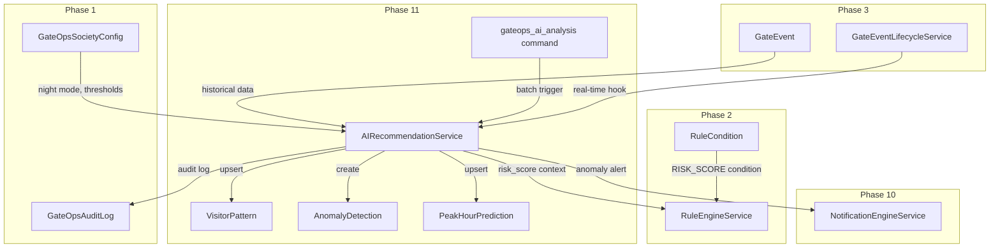
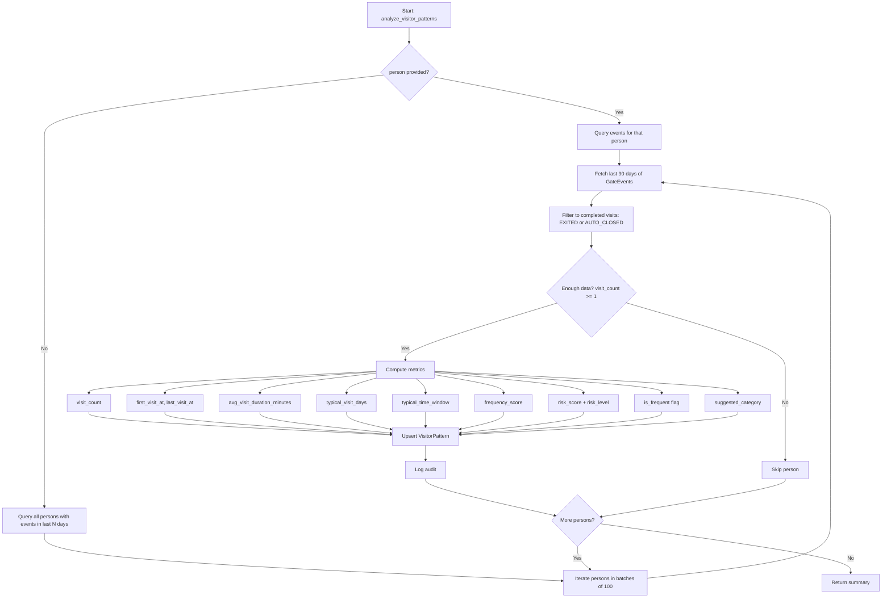
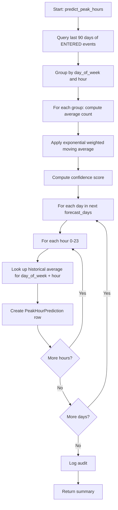
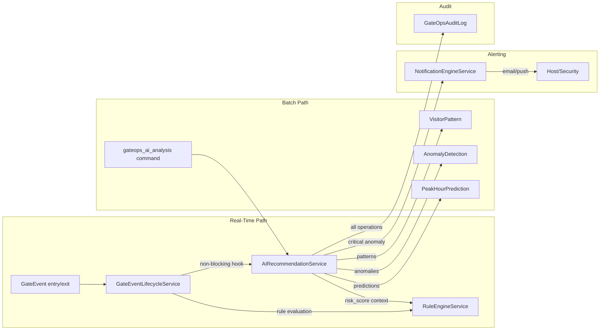
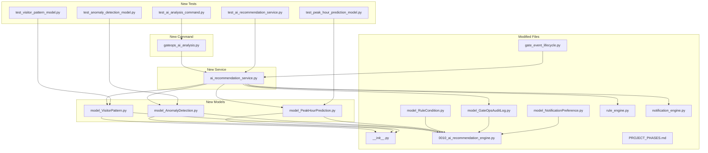

# Phase 11 — AI Recommendation Engine

> **Status:** Design Complete — Ready for Implementation
> **App:** `gateops`
> **Dependencies:** Phase 3 (GateEvent lifecycle), Phase 2 (Rule Engine), Phase 10 (Notification Engine), Phase 1 (GateOpsSocietyConfig)
> **Migration:** `0010_ai_recommendation_engine`

---

## Table of Contents

1. [Overview](#1-overview)
2. [New Models](#2-new-models)
   - 2.1 [`VisitorPattern`](#21-visitorpattern)
   - 2.2 [`AnomalyDetection`](#22-anomalydetection)
   - 2.3 [`PeakHourPrediction`](#23-peakhourprediction)
3. [Service Layer](#3-service-layer)
   - 3.1 [`AIRecommendationService`](#31-airecommendationservice)
   - 3.2 [Pattern Detection Algorithm](#32-pattern-detection-algorithm)
   - 3.3 [Anomaly Detection Algorithms](#33-anomaly-detection-algorithms)
   - 3.4 [Risk Scoring Methodology](#34-risk-scoring-methodology)
   - 3.5 [Peak-Hour Prediction Algorithm](#35-peak-hour-prediction-algorithm)
4. [Integration Points](#4-integration-points)
5. [Migration Plan](#5-migration-plan)
6. [Test Plan](#6-test-plan)
7. [File Structure](#7-file-structure)

---

## 1. Overview

Phase 11 introduces an **AI Recommendation Engine** that analyzes historical [`GateEvent`](gateops/models/model_GateEvent.py:10) data to deliver three capabilities:

| Capability | Description |
|---|---|
| **Frequent-Visitor Detection** | Identifies repeat visitors, learns their typical schedule, and suggests a [`VisitorCategory`](gateops/models/model_VisitorCategory.py:6) for faster gate processing. |
| **Anomaly Detection** | Scans gate events for suspicious patterns: forgotten exits, after-hours entries, unusual frequency spikes, blacklist bypass attempts, off-pattern visits, duplicate entries, and abnormally long stays. |
| **Risk Scoring & Peak-Hour Prediction** | Assigns a 0.0–1.0 risk score to every person/vehicle, feeds it into the [`RuleEngineService`](gateops/services/rule_engine.py:120) as a new `RISK_SCORE` condition, and predicts peak visitor hours for staffing optimization. |

### Design Principles

- **Never block gate operations** — all analysis runs asynchronously via a management command or in non-blocking hooks. A failure in the AI engine must never prevent a gate transition (matching the [`NotificationEngineService`](gateops/services/notification_engine.py:65) robustness philosophy).
- **Multi-tenant safety** — every model FKs to [`Society`](housing/models.py), every query is society-scoped, every service method accepts `*, society` as its first keyword argument.
- **Soft-delete pattern** — all new models use `is_active` + `deleted_at` (no mixin), matching [`Person`](gateops/models/model_Person.py:9), [`GateVehicle`](gateops/models/model_GateVehicle.py:7), [`Contractor`](gateops/models/model_Contractor.py), etc.
- **Append-only audit** — all mutations flow through [`GateOpsAuditLog.log()`](gateops/models/model_GateOpsAuditLog.py:82) with a new `ANOMALY_DETECTED` action.
- **Service-layer authority** — no caller creates [`VisitorPattern`](#21-visitorpattern) / [`AnomalyDetection`](#22-anomalydetection) / [`PeakHourPrediction`](#23-peakhourprediction) rows directly; all operations go through [`AIRecommendationService`](#31-airecommendationservice).

### Architecture Diagram



---

## 2. New Models

Three new models are introduced, each in its own file following the `gateops/models/model_*.py` convention.

### 2.1 `VisitorPattern`

**File:** `gateops/models/model_VisitorPattern.py`

Aggregates a person's historical visit data into a single pattern row. One row per `(society, person)` — updated incrementally as new gate events arrive.

#### Fields

| Field | Type | Constraints / Default | Description |
|---|---|---|---|
| `society` | `ForeignKey("housing.Society")` | `on_delete=CASCADE`, `related_name="visitor_patterns"` | Tenant scope. |
| `person` | `ForeignKey("gateops.Person")` | `on_delete=PROTECT`, `related_name="visitor_patterns"` | The visitor this pattern describes. `PROTECT` prevents deleting a `Person` with an active pattern (deactivate first). |
| `gate_vehicle` | `ForeignKey("gateops.GateVehicle")` | `on_delete=SET_NULL`, `null=True`, `blank=True`, `related_name="visitor_patterns"` | Primary vehicle associated with this person, if any. `SET_NULL` preserves patterns when a vehicle record is removed. |
| `visitor_category` | `ForeignKey("gateops.VisitorCategory")` | `on_delete=PROTECT`, `related_name="visitor_patterns"` | The most frequently used category for this visitor. `PROTECT` prevents category deletion while patterns reference it. |
| `suggested_category` | `ForeignKey("gateops.VisitorCategory")` | `on_delete=SET_NULL`, `null=True`, `blank=True`, `related_name="suggested_in_patterns"` | AI-suggested category for faster processing. May differ from `visitor_category` when the AI detects a better fit. `SET_NULL` so category reorganization doesn't orphan patterns. |
| `visit_count` | `PositiveIntegerField` | `default=0` | Total number of completed visits (status `EXITED` or `AUTO_CLOSED`). |
| `first_visit_at` | `DateTimeField` | `null=True`, `blank=True` | Timestamp of the earliest gate event for this person. |
| `last_visit_at` | `DateTimeField` | `null=True`, `blank=True` | Timestamp of the most recent gate event. |
| `last_event` | `ForeignKey("gateops.GateEvent")` | `on_delete=SET_NULL`, `null=True`, `blank=True`, `related_name="visitor_patterns"` | Reference to the most recent `GateEvent`. `SET_NULL` preserves the pattern if the event is deleted. |
| `avg_visit_duration_minutes` | `PositiveIntegerField` | `null=True`, `blank=True` | Average duration between `entered_at` and `exited_at` across all completed visits. `None` when no completed visits exist. |
| `typical_visit_days` | `JSONField` | `default=list` | List of ISO weekday codes the visitor typically comes on, e.g. `["mon", "tue", "wed", "thu", "fri"]`. Empty list for irregular visitors. |
| `typical_time_window` | `JSONField` | `default=dict` | Typical arrival window, e.g. `{"start": "08:00", "end": "10:00"}`. Empty dict when no clear pattern exists. |
| `is_frequent` | `BooleanField` | `default=False` | Derived flag: `True` when `visit_count >= society threshold` (default 5 visits in 30 days). Indexed for fast filtering. |
| `frequency_score` | `FloatField` | `default=0.0` | Normalized frequency score 0.0–1.0. Computed as `min(1.0, visits_per_week / expected_max_visits_per_week)`. |
| `risk_score` | `FloatField` | `default=0.0` | Composite risk score 0.0–1.0. See [§3.4](#34-risk-scoring-methodology). |
| `risk_level` | `CharField` | `max_length=10`, `choices=RiskLevel.choices`, `default=RiskLevel.LOW` | Categorical risk bucket derived from `risk_score`. |
| `last_analyzed_at` | `DateTimeField` | `null=True`, `blank=True` | When the AI service last recomputed this pattern. Used to determine staleness. |
| `is_active` | `BooleanField` | `default=True` | Soft-delete flag. |
| `deleted_at` | `DateTimeField` | `null=True`, `blank=True` | Soft-delete timestamp. |
| `created_at` | `DateTimeField` | `auto_now_add=True` | |
| `updated_at` | `DateTimeField` | `auto_now=True` | |

#### `RiskLevel` TextChoices

```python
class RiskLevel(models.TextChoices):
    LOW = "low", _("Low")          # 0.00 – 0.24
    MEDIUM = "medium", _("Medium")  # 0.25 – 0.49
    HIGH = "high", _("High")        # 0.50 – 0.74
    CRITICAL = "critical", _("Critical")  # 0.75 – 1.00
```

#### Meta Options

```python
class Meta:
    verbose_name = _("Visitor Pattern")
    verbose_name_plural = _("Visitor Patterns")
    ordering = ("-last_visit_at",)
    constraints = [
        models.UniqueConstraint(
            fields=["society", "person"],
            condition=models.Q(is_active=True),
            name="unique_active_visitor_pattern_per_society",
        ),
    ]
    indexes = [
        models.Index(fields=["society", "is_frequent"], name="vpat_soc_freq_idx"),
        models.Index(fields=["society", "risk_level"], name="vpat_soc_risk_idx"),
        models.Index(fields=["society", "last_visit_at"], name="vpat_soc_last_idx"),
        models.Index(fields=["society", "is_active"], name="vpat_soc_active_idx"),
    ]
```

#### `clean()` Validation

```python
def clean(self):
    super().clean()
    # Cross-society guard: person must belong to the same society.
    if self.person_id is not None and self.person.society_id != self.society_id:
        raise ValidationError({"person": _("Person must belong to the same society.")})
    # Cross-society guard: visitor_category must belong to the same society.
    if self.visitor_category_id is not None and self.visitor_category.society_id != self.society_id:
        raise ValidationError(
            {"visitor_category": _("Visitor category must belong to the same society.")}
        )
    # suggested_category cross-society guard.
    if self.suggested_category_id is not None and self.suggested_category.society_id != self.society_id:
        raise ValidationError(
            {"suggested_category": _("Suggested category must belong to the same society.")}
        )
    # risk_score must be in [0.0, 1.0].
    if not (0.0 <= self.risk_score <= 1.0):
        raise ValidationError({"risk_score": _("risk_score must be between 0.0 and 1.0.")})
    # frequency_score must be in [0.0, 1.0].
    if not (0.0 <= self.frequency_score <= 1.0):
        raise ValidationError({"frequency_score": _("frequency_score must be between 0.0 and 1.0.")})
    # risk_level must be consistent with risk_score.
    expected = self._risk_level_for_score(self.risk_score)
    if self.risk_level != expected:
        raise ValidationError(
            {"risk_level": _(f"risk_level {self.risk_level} does not match risk_score {self.risk_score} (expected {expected}).")}
        )
```

#### `__str__`

```python
def __str__(self):
    return f"Pattern — {self.person} — {self.visit_count} visits — {self.risk_level}"
```

#### Helper Method

```python
@staticmethod
def _risk_level_for_score(score: float) -> str:
    """Map a 0.0–1.0 risk score to its RiskLevel label."""
    if score >= 0.75:
        return VisitorPattern.RiskLevel.CRITICAL
    if score >= 0.50:
        return VisitorPattern.RiskLevel.HIGH
    if score >= 0.25:
        return VisitorPattern.RiskLevel.MEDIUM
    return VisitorPattern.RiskLevel.LOW
```

---

### 2.2 `AnomalyDetection`

**File:** `gateops/models/model_AnomalyDetection.py`

Records each anomaly detected by the AI engine. Each row is an immutable audit record of a suspicious event, with a small state machine (`OPEN` → `ACKNOWLEDGED` → `RESOLVED` / `FALSE_POSITIVE`).

#### Fields

| Field | Type | Constraints / Default | Description |
|---|---|---|---|
| `society` | `ForeignKey("housing.Society")` | `on_delete=CASCADE`, `related_name="anomaly_detections"` | Tenant scope. |
| `anomaly_type` | `CharField` | `max_length=30`, `choices=AnomalyType.choices` | The category of anomaly detected. |
| `severity` | `CharField` | `max_length=10`, `choices=Severity.choices`, `default=Severity.MEDIUM` | How serious the anomaly is. |
| `gate_event` | `ForeignKey("gateops.GateEvent")` | `on_delete=SET_NULL`, `null=True`, `blank=True`, `related_name="anomaly_detections"` | The event that triggered this anomaly. `SET_NULL` preserves the anomaly record if the event is later deleted. |
| `person` | `ForeignKey("gateops.Person")` | `on_delete=PROTECT`, `null=True`, `blank=True`, `related_name="anomaly_detections"` | The person associated with the anomaly. `PROTECT` prevents person deletion while anomalies reference them. |
| `gate_vehicle` | `ForeignKey("gateops.GateVehicle")` | `on_delete=SET_NULL`, `null=True`, `blank=True`, `related_name="anomaly_detections"` | The vehicle associated with the anomaly, if any. |
| `description` | `TextField` | | Human-readable summary of the anomaly. |
| `context` | `JSONField` | `default=dict` | Structured details for programmatic analysis. Varies by `anomaly_type` (see [§3.3](#33-anomaly-detection-algorithms) for per-type schema). |
| `status` | `CharField` | `max_length=20`, `choices=Status.choices`, `default=Status.OPEN`, `db_index=True` | Lifecycle state of the anomaly. |
| `detected_at` | `DateTimeField` | `auto_now_add=True` | When the AI engine created this record. |
| `resolved_at` | `DateTimeField` | `null=True`, `blank=True` | When the anomaly was resolved or marked false positive. |
| `resolved_by` | `ForeignKey(settings.AUTH_USER_MODEL)` | `on_delete=SET_NULL`, `null=True`, `blank=True`, `related_name="resolved_anomalies"` | The user who resolved the anomaly. |
| `resolution_notes` | `TextField` | `blank=True` | Notes entered by the resolver. |
| `is_active` | `BooleanField` | `default=True` | Soft-delete flag. |
| `deleted_at` | `DateTimeField` | `null=True`, `blank=True` | Soft-delete timestamp. |
| `created_at` | `DateTimeField` | `auto_now_add=True` | |
| `updated_at` | `DateTimeField` | `auto_now=True` | |

#### `AnomalyType` TextChoices

```python
class AnomalyType(models.TextChoices):
    FORGOTTEN_EXIT = "forgotten_exit", _("Forgotten Exit")
    AFTER_HOURS_ENTRY = "after_hours_entry", _("After-Hours Entry")
    UNUSUAL_FREQUENCY = "unusual_frequency", _("Unusual Frequency Spike")
    BLACKLIST_BYPASS = "blacklist_bypass", _("Blacklist Bypass Attempt")
    OFF_PATTERN_VISIT = "off_pattern_visit", _("Off-Pattern Visit")
    DUPLICATE_ENTRY = "duplicate_entry", _("Duplicate Entry")
    LONG_STAY = "long_stay", _("Abnormally Long Stay")
    SUSPICIOUS_PATTERN = "suspicious_pattern", _("Suspicious Pattern")
```

#### `Severity` TextChoices

```python
class Severity(models.TextChoices):
    LOW = "low", _("Low")
    MEDIUM = "medium", _("Medium")
    HIGH = "high", _("High")
    CRITICAL = "critical", _("Critical")
```

#### `Status` TextChoices

```python
class Status(models.TextChoices):
    OPEN = "open", _("Open")
    ACKNOWLEDGED = "acknowledged", _("Acknowledged")
    RESOLVED = "resolved", _("Resolved")
    FALSE_POSITIVE = "false_positive", _("False Positive")
```

#### Meta Options

```python
class Meta:
    verbose_name = _("Anomaly Detection")
    verbose_name_plural = _("Anomaly Detections")
    ordering = ("-detected_at",)
    indexes = [
        models.Index(fields=["society", "status"], name="anom_soc_status_idx"),
        models.Index(fields=["society", "anomaly_type"], name="anom_soc_type_idx"),
        models.Index(fields=["society", "severity"], name="anom_soc_sev_idx"),
        models.Index(fields=["society", "detected_at"], name="anom_soc_detected_idx"),
        models.Index(fields=["society", "is_active"], name="anom_soc_active_idx"),
    ]
```

#### `clean()` Validation

```python
def clean(self):
    super().clean()
    # Cross-society guard: person must belong to the same society.
    if self.person_id is not None and self.person.society_id != self.society_id:
        raise ValidationError({"person": _("Person must belong to the same society.")})
    # resolved_at implies status is RESOLVED or FALSE_POSITIVE.
    if self.resolved_at is not None and self.status not in {
        self.Status.RESOLVED,
        self.Status.FALSE_POSITIVE,
    }:
        raise ValidationError(
            {"resolved_at": _("resolved_at requires status RESOLVED or FALSE_POSITIVE.")}
        )
    # status RESOLVED/FALSE_POSITIVE implies resolved_at is set.
    if self.status in {self.Status.RESOLVED, self.Status.FALSE_POSITIVE} and self.resolved_at is None:
        raise ValidationError(
            {"status": _("RESOLVED/FALSE_POSITIVE requires resolved_at to be set.")}
        )
```

#### `__str__`

```python
def __str__(self):
    return f"Anomaly {self.pk} — {self.get_anomaly_type_display()} — {self.severity} — {self.status}"
```

---

### 2.3 `PeakHourPrediction`

**File:** `gateops/models/model_PeakHourPrediction.py`

Stores predicted visitor counts per `(society, day_of_week, hour)` slot. Generated by the batch analysis command and consumed by the analytics dashboard (Phase 13) and staffing recommendations.

#### Fields

| Field | Type | Constraints / Default | Description |
|---|---|---|---|
| `society` | `ForeignKey("housing.Society")` | `on_delete=CASCADE`, `related_name="peak_hour_predictions"` | Tenant scope. |
| `day_of_week` | `PositiveSmallIntegerField` | `0`–`6` (0=Monday, 6=Sunday) | ISO weekday. |
| `hour` | `PositiveSmallIntegerField` | `0`–`23` | Hour of day (24-hour clock). |
| `predicted_count` | `PositiveIntegerField` | `default=0` | Predicted number of visitor entries for this slot. |
| `confidence_score` | `FloatField` | `default=0.0` | 0.0–1.0 confidence based on data volume and variance. |
| `actual_count` | `PositiveIntegerField` | `null=True`, `blank=True` | Filled in after the hour passes, for accuracy tracking. |
| `analysis_date` | `DateField` | | The date this prediction was generated. Allows multiple prediction generations to coexist. |
| `is_active` | `BooleanField` | `default=True` | Soft-delete flag. |
| `deleted_at` | `DateTimeField` | `null=True`, `blank=True` | Soft-delete timestamp. |
| `created_at` | `DateTimeField` | `auto_now_add=True` | |
| `updated_at` | `DateTimeField` | `auto_now=True` | |

#### Meta Options

```python
class Meta:
    verbose_name = _("Peak Hour Prediction")
    verbose_name_plural = _("Peak Hour Predictions")
    ordering = ("day_of_week", "hour")
    constraints = [
        models.UniqueConstraint(
            fields=["society", "day_of_week", "hour", "analysis_date"],
            condition=models.Q(is_active=True),
            name="unique_active_peak_hour_per_slot",
        ),
    ]
    indexes = [
        models.Index(fields=["society", "day_of_week", "hour"], name="peak_soc_dow_hr_idx"),
        models.Index(fields=["society", "analysis_date"], name="peak_soc_date_idx"),
        models.Index(fields=["society", "is_active"], name="peak_soc_active_idx"),
    ]
```

#### `clean()` Validation

```python
def clean(self):
    super().clean()
    if not (0 <= self.day_of_week <= 6):
        raise ValidationError({"day_of_week": _("day_of_week must be 0–6 (Monday–Sunday).")})
    if not (0 <= self.hour <= 23):
        raise ValidationError({"hour": _("hour must be 0–23.")})
    if not (0.0 <= self.confidence_score <= 1.0):
        raise ValidationError({"confidence_score": _("confidence_score must be between 0.0 and 1.0.")})
```

#### `__str__`

```python
def __str__(self):
    days = ["Mon", "Tue", "Wed", "Thu", "Fri", "Sat", "Sun"]
    return f"{days[self.day_of_week]} {self.hour:02d}:00 — predicted {self.predicted_count} (confidence {self.confidence_score:.0%})"
```

---

## 3. Service Layer

### 3.1 `AIRecommendationService`

**File:** `gateops/services/ai_recommendation_service.py`

Follows the established service contract: all methods are `@staticmethod`, wrapped in `@transaction.atomic` where writes occur, use keyword-only arguments, and write audit logs via [`GateOpsAuditLog.log()`](gateops/models/model_GateOpsAuditLog.py:82) wrapped in `try/except` so logging failures never block operations.

#### Public Method Signatures

```python
class AIRecommendationService:
    """Service for AI-powered visitor pattern detection, anomaly detection,
    risk scoring, and peak-hour prediction.

    Every operation:
    1. Validates multi-tenant safety (society scoping).
    2. Reads historical GateEvent data for the society.
    3. Performs analysis (pattern detection / anomaly scan / risk scoring /
       peak-hour prediction).
    4. Persists results (VisitorPattern / AnomalyDetection / PeakHourPrediction).
    5. Creates a GateOpsAuditLog entry (append-only, non-blocking).
    6. Dispatches notifications for critical anomalies (non-blocking).
    """

    # ------------------------------------------------------------------ #
    # 1. Pattern Detection
    # ------------------------------------------------------------------ #

    @staticmethod
    def analyze_visitor_patterns(
        *, society, person=None, days=90, actor=None
    ) -> dict:
        """Detect and upsert VisitorPattern rows for the society.

        - If ``person`` is provided, analyzes only that person.
        - Otherwise, analyzes all persons with gate events in the last
          ``days`` days.
        - Returns a summary dict:
          ``{"patterns_updated": int, "patterns_created": int, "errors": int}``
        """

    @staticmethod
    def get_visitor_pattern(*, society, person) -> "VisitorPattern | None":
        """Return the active VisitorPattern for a person, or None."""

    @staticmethod
    def list_visitor_patterns(
        *, society, is_frequent=None, risk_level=None, include_inactive=False
    ) -> QuerySet:
        """List visitor patterns for the society, optionally filtered."""

    # ------------------------------------------------------------------ #
    # 2. Anomaly Detection
    # ------------------------------------------------------------------ #

    @staticmethod
    def detect_anomalies(
        *, society, since=None, actor=None
    ) -> dict:
        """Scan recent GateEvents for anomalies and create AnomalyDetection rows.

        - ``since`` defaults to 24 hours ago.
        - Runs all anomaly detectors (see §3.3).
        - Returns a summary dict:
          ``{"anomalies_created": int, "by_type": dict, "errors": int}``
        """

    @staticmethod
    def get_anomalies(
        *, society, status=None, severity=None, anomaly_type=None,
        include_inactive=False
    ) -> QuerySet:
        """List anomalies for the society, optionally filtered."""

    @staticmethod
    def get_anomaly(*, society, pk) -> "AnomalyDetection":
        """Return a single anomaly, scoped to the society. Raises Http404 if not found."""

    @staticmethod
    def acknowledge_anomaly(*, anomaly, actor=None) -> "AnomalyDetection":
        """Transition an OPEN anomaly to ACKNOWLEDGED."""

    @staticmethod
    def resolve_anomaly(
        *, anomaly, resolved_by, resolution_notes="", is_false_positive=False
    ) -> "AnomalyDetection":
        """Transition an anomaly to RESOLVED or FALSE_POSITIVE."""

    # ------------------------------------------------------------------ #
    # 3. Risk Scoring
    # ------------------------------------------------------------------ #

    @staticmethod
    def calculate_risk_score(
        *, society, person=None, gate_event=None
    ) -> dict:
        """Compute the risk score for a person or a specific gate event.

        Returns:
          ``{"risk_score": float, "risk_level": str, "factors": dict}``

        The ``factors`` dict breaks down the score by component (see §3.4).
        """

    @staticmethod
    def get_risk_assessment(
        *, society, person=None, gate_vehicle=None
    ) -> dict:
        """Return the current risk assessment for a person or vehicle.

        Reads from the cached VisitorPattern.risk_score if available;
        otherwise computes on-the-fly.
        """

    # ------------------------------------------------------------------ #
    # 4. Peak-Hour Prediction
    # ------------------------------------------------------------------ #

    @staticmethod
    def predict_peak_hours(
        *, society, forecast_days=7, actor=None
    ) -> dict:
        """Generate PeakHourPrediction rows for the next ``forecast_days`` days.

        - Analyzes the last 90 days of GateEvent data.
        - Returns:
          ``{"predictions_created": int, "analysis_date": date, "errors": int}``
        """

    @staticmethod
    def get_peak_hour_predictions(
        *, society, analysis_date=None, day_of_week=None
    ) -> QuerySet:
        """List peak-hour predictions for the society."""

    # ------------------------------------------------------------------ #
    # 5. Batch Analysis (called by management command)
    # ------------------------------------------------------------------ #

    @staticmethod
    def run_full_analysis(*, society, actor=None) -> dict:
        """Run the complete AI analysis pipeline for a society.

        Executes in order:
        1. analyze_visitor_patterns
        2. detect_anomalies
        3. predict_peak_hours

        Returns a combined summary dict.
        """

    # ------------------------------------------------------------------ #
    # Internal Helpers (prefixed with _)
    # ------------------------------------------------------------------ #

    @staticmethod
    def _detect_forgotten_exits(*, society, since) -> list[dict]:
        """Find ENTERED events with no exit after a threshold."""

    @staticmethod
    def _detect_after_hours_entries(*, society, since) -> list[dict]:
        """Find entries during night-mode hours."""

    @staticmethod
    def _detect_unusual_frequency(*, society, since) -> list[dict]:
        """Find persons with visit frequency spikes."""

    @staticmethod
    def _detect_blacklist_bypass(*, society, since) -> list[dict]:
        """Find events where a blacklisted person was approved/entered."""

    @staticmethod
    def _detect_off_pattern_visits(*, society, since) -> list[dict]:
        """Find frequent visitors visiting outside their typical pattern."""

    @staticmethod
    def _detect_duplicate_entries(*, society, since) -> list[dict]:
        """Find persons with multiple ENTERED events without intervening EXIT."""

    @staticmethod
    def _detect_long_stays(*, society, since) -> list[dict]:
        """Find visits exceeding the 95th percentile of historical durations."""

    @staticmethod
    def _detect_suspicious_patterns(*, society, since) -> list[dict]:
        """Find persons whose risk score crossed HIGH for the first time."""

    @staticmethod
    def _compute_frequency_score(events: QuerySet) -> float:
        """Compute a 0.0–1.0 frequency score from a queryset of events."""

    @staticmethod
    def _compute_risk_factors(*, society, person, events) -> dict:
        """Compute individual risk factor scores (see §3.4)."""

    @staticmethod
    def _compute_typical_days(events: QuerySet) -> list[str]:
        """Extract typical visit days from event history."""

    @staticmethod
    def _compute_typical_time_window(events: QuerySet) -> dict:
        """Extract typical arrival time window from event history."""

    @staticmethod
    def _compute_avg_duration(events: QuerySet) -> int | None:
        """Compute average visit duration in minutes."""

    @staticmethod
    def _update_or_create_pattern(
        *, society, person, events, actor=None
    ) -> "VisitorPattern":
        """Upsert a VisitorPattern row from computed metrics."""

    @staticmethod
    def _create_anomaly(
        *, society, anomaly_type, severity, gate_event=None,
        person=None, gate_vehicle=None, description="", context=None
    ) -> "AnomalyDetection":
        """Create an AnomalyDetection row with audit logging."""

    @staticmethod
    def _notify_anomaly(*, anomaly) -> None:
        """Dispatch a notification for a critical anomaly via NotificationEngineService.
        Wrapped in try/except so notification failure never blocks anomaly creation."""

    @staticmethod
    def _log_audit(
        *, society, action, entity_type, entity_id,
        before_value=None, after_value=None, actor=None
    ) -> None:
        """Write a GateOpsAuditLog entry. Wrapped in try/except (non-blocking)."""

    @staticmethod
    def _get_night_mode_hours(society) -> tuple[int, int] | None:
        """Return (start_hour, end_hour) from GateOpsSocietyConfig, or None."""

    @staticmethod
    def _get_frequent_visitor_threshold(society) -> int:
        """Return the minimum visit count for is_frequent=True. Default: 5."""
```

---

### 3.2 Pattern Detection Algorithm

The `analyze_visitor_patterns` method follows this sequence:



#### Detailed Steps

1. **Query persons**: If `person` is provided, analyze only that person. Otherwise, query `Person` objects that have at least one `GateEvent` in the last `days` days for this society. Process in batches of 100 to avoid memory pressure.

2. **Fetch events**: For each person, fetch all `GateEvent` rows where `society=society`, `person=person`, `status__in=[EXITED, AUTO_CLOSED]`, `created_at__gte=now - timedelta(days=days)`. Order by `created_at`.

3. **Compute metrics**:
   - `visit_count`: `events.count()`
   - `first_visit_at`: `events.first().created_at`
   - `last_visit_at`: `events.last().created_at`
   - `avg_visit_duration_minutes`: Average of `(exited_at - entered_at)` for events where both are set. `None` if no events have both timestamps.
   - `typical_visit_days`: Group events by `created_at.weekday()` (0=Monday). If any weekday accounts for ≥20% of visits, include it. Return as ISO codes `["mon", "tue", ...]`.
   - `typical_time_window`: Extract `arrived_at.time()` for all events. Compute the median arrival time. The window is `[median - 1 hour, median + 1 hour]`, clamped to `00:00`–`23:59`. Return as `{"start": "HH:MM", "end": "HH:MM"}`. Empty dict if fewer than 3 events.
   - `frequency_score`: `min(1.0, (visit_count / days) * 7 / EXPECTED_MAX_VISITS_PER_WEEK)` where `EXPECTED_MAX_VISITS_PER_WEEK = 10`.
   - `is_frequent`: `True` if `visit_count >= threshold` (default 5) AND the visits span at least 7 days.
   - `risk_score`: See [§3.4](#34-risk-scoring-methodology).
   - `suggested_category`: The `visitor_category` with the highest count among the person's events. If this matches the current `visitor_category`, `suggested_category` is set to `None` (no change needed).

4. **Upsert pattern**: Use `VisitorPattern.objects.update_or_create(society=society, person=person, defaults={...})`. Race-safe via the unique constraint.

5. **Audit log**: Log the upsert with `action=GateOpsAuditLog.Action.UPDATE` (or `CREATE` for new rows), wrapped in `try/except`.

---

### 3.3 Anomaly Detection Algorithms

The `detect_anomalies` method runs all eight detectors sequentially. Each detector returns a list of anomaly dicts; the service creates `AnomalyDetection` rows from them.

#### Detector 1: Forgotten Exit (`FORGOTTEN_EXIT`)

**Query**: `GateEvent.objects.filter(society=society, status=Status.ENTERED, entered_at__lt=now - threshold)`

**Threshold**: 12 hours (configurable via `GateOpsSocietyConfig` in a future enhancement; for now, hardcoded).

**Severity**: `HIGH` if >24 hours, `MEDIUM` if 12–24 hours.

**Context JSON**:
```json
{
    "entered_at": "2026-07-12T08:00:00Z",
    "hours_inside": 18.5,
    "gate": "Main Gate",
    "auto_close_scheduled": true,
    "auto_close_at": "2026-07-13T08:00:00Z"
}
```

#### Detector 2: After-Hours Entry (`AFTER_HOURS_ENTRY`)

**Query**: `GateEvent.objects.filter(society=society, status__in=[Status.ENTERED, Status.EXITED], entered_at__gte=since)`, then filter in Python where `entered_at.hour` falls within night-mode hours (from [`GateOpsSocietyConfig`](gateops/models/model_GateOpsSocietyConfig.py:6).`night_mode_start` / `night_mode_end`).

**Severity**: `HIGH` for entries between 00:00–04:00, `MEDIUM` for other night-mode hours.

**Context JSON**:
```json
{
    "entered_at": "2026-07-12T02:30:00Z",
    "night_mode_start": 22,
    "night_mode_end": 6,
    "visitor_category": "guest",
    "gate": "Main Gate"
}
```

#### Detector 3: Unusual Frequency Spike (`UNUSUAL_FREQUENCY`)

**Logic**: For each person with a `VisitorPattern`, compare the visit count in the last 7 days against their historical weekly average. If the recent count exceeds `2 × max(historical_average, 1)`, flag an anomaly.

**Severity**: `CRITICAL` if recent count > 3× average, `HIGH` if 2–3× average.

**Context JSON**:
```json
{
    "person_id": 42,
    "recent_visits_7d": 12,
    "historical_weekly_avg": 3.5,
    "spike_ratio": 3.43
}
```

#### Detector 4: Blacklist Bypass Attempt (`BLACKLIST_BYPASS`)

**Query**: `GateEvent.objects.filter(society=society, person__is_blacklisted=True, status__in=[Status.APPROVED, Status.ENTERED], created_at__gte=since)`

**Severity**: `CRITICAL` — a blacklisted person should never be approved or enter.

**Context JSON**:
```json
{
    "person_id": 99,
    "blacklist_reason": "Previous incident",
    "blacklist_until": "2026-12-31",
    "event_status": "entered",
    "approved_by": "guard_001"
}
```

#### Detector 5: Off-Pattern Visit (`OFF_PATTERN_VISIT`)

**Logic**: For each `VisitorPattern` where `is_frequent=True`, check if the person has a recent `GateEvent` whose `arrived_at` falls outside their `typical_visit_days` or `typical_time_window`.

**Severity**: `LOW` if outside time window but on a typical day, `MEDIUM` if on an atypical day.

**Context JSON**:
```json
{
    "person_id": 42,
    "typical_days": ["mon", "tue", "wed", "thu", "fri"],
    "actual_day": "sun",
    "typical_window": {"start": "08:00", "end": "10:00"},
    "actual_arrival": "14:30"
}
```

#### Detector 6: Duplicate Entry (`DUPLICATE_ENTRY`)

**Logic**: Find persons with multiple `GateEvent` rows in `Status.ENTERED` simultaneously (no intervening `EXITED`). Query: group `ENTERED` events by person, flag any person with count > 1.

**Severity**: `HIGH`.

**Context JSON**:
```json
{
    "person_id": 42,
    "open_entries": [
        {"event_id": 101, "entered_at": "2026-07-12T08:00:00Z", "gate": "Main Gate"},
        {"event_id": 105, "entered_at": "2026-07-12T14:00:00Z", "gate": "Side Gate"}
    ]
}
```

#### Detector 7: Abnormally Long Stay (`LONG_STAY`)

**Logic**: For events with `status=EXITED` where `exited_at - entered_at` exceeds the 95th percentile of all historical visit durations for that society. Compute the 95th percentile from the last 90 days of completed visits.

**Severity**: `MEDIUM` if duration > 95th percentile, `HIGH` if > 99th percentile.

**Context JSON**:
```json
{
    "event_id": 200,
    "entered_at": "2026-07-12T08:00:00Z",
    "exited_at": "2026-07-12T20:00:00Z",
    "duration_minutes": 720,
    "p95_duration_minutes": 240,
    "percentile": 97.5
}
```

#### Detector 8: Suspicious Pattern (`SUSPICIOUS_PATTERN`)

**Logic**: When a `VisitorPattern`'s `risk_score` crosses the `HIGH` threshold (≥0.50) for the first time (i.e., the previous `risk_level` was `LOW` or `MEDIUM`), create an anomaly.

**Severity**: Matches the new `risk_level` (`HIGH` or `CRITICAL`).

**Context JSON**:
```json
{
    "person_id": 42,
    "previous_risk_level": "medium",
    "new_risk_level": "high",
    "risk_score": 0.62,
    "top_factors": {
        "incomplete_exit_history": 0.15,
        "night_time_activity": 0.10,
        "duration_anomaly": 0.12
    }
}
```

#### Deduplication

Before creating an `AnomalyDetection` row, the service checks for an existing open anomaly of the same `anomaly_type` for the same `gate_event` (or `person` if `gate_event` is null). If one exists, the new anomaly is skipped to prevent duplicates.

---

### 3.4 Risk Scoring Methodology

The risk score is a composite of eight weighted factors, each scored 0.0–1.0, then multiplied by its weight and summed. The final score is clamped to [0.0, 1.0].

| # | Factor | Weight | Description |
|---|---|---|---|
| 1 | Visit Frequency Anomaly | 0.20 | Deviation from the person's own historical frequency baseline. Score = `min(1.0, |recent_freq - historical_freq| / max(historical_freq, 1))`. |
| 2 | Time Pattern Deviation | 0.15 | Fraction of recent visits outside the person's `typical_time_window`. Score = `off_pattern_visits / total_recent_visits`. |
| 3 | Blacklist/Watchlist Proximity | 0.20 | `1.0` if person is blacklisted, `0.5` if associated `GateVehicle` is watchlisted, `0.0` otherwise. |
| 4 | Incomplete Exit History | 0.15 | Fraction of the person's events that were `AUTO_CLOSED` (forgotten exit). Score = `auto_closed_count / total_visits`. |
| 5 | Duration Anomaly | 0.10 | `1.0` if the most recent visit duration exceeds the society's 95th percentile, `0.5` if it exceeds the median by 2×, `0.0` otherwise. |
| 6 | Cross-Category Visits | 0.05 | `1.0` if the person has visited under 3+ different `VisitorCategory` codes, `0.5` for 2 categories, `0.0` for 1. |
| 7 | Night-Time Activity | 0.10 | Fraction of recent visits during night-mode hours. Score = `night_visits / total_recent_visits`. |
| 8 | ID Verification Gaps | 0.05 | Fraction of recent visits where `id_verified=False`. Score = `unverified_count / total_recent_visits`. |
| | **Total** | **1.00** | |

#### Computation

```python
risk_score = min(1.0, sum(factor_score * weight for each factor))
risk_level = VisitorPattern._risk_level_for_score(risk_score)
```

#### Risk Level Mapping

| Score Range | Level | Color | Rule Engine Default Action |
|---|---|---|---|
| 0.00 – 0.24 | `LOW` | Green | No restriction (auto-approve eligible) |
| 0.25 – 0.49 | `MEDIUM` | Yellow | Require approval |
| 0.50 – 0.74 | `HIGH` | Orange | Require resident approval + notify security |
| 0.75 – 1.00 | `CRITICAL` | Red | Reject entry + escalate + notify security |

---

### 3.5 Peak-Hour Prediction Algorithm

The `predict_peak_hours` method generates [`PeakHourPrediction`](#23-peakhourprediction) rows for the next `forecast_days` days.

#### Algorithm



#### Detailed Steps

1. **Query history**: `GateEvent.objects.filter(society=society, status__in=[Status.ENTERED, Status.EXITED, Status.AUTO_CLOSED], entered_at__gte=now - timedelta(days=90))`

2. **Group and aggregate**: Group by `entered_at.weekday()` and `entered_at.hour`. For each `(day_of_week, hour)` slot, compute:
   - `avg_count`: Mean number of entries across all matching days in the 90-day window.
   - `weighted_avg`: Exponentially weighted moving average, with more recent weeks weighted higher. Weight decay factor: `0.85` per week.
   - `variance`: Standard deviation of weekly counts.

3. **Confidence score**: `confidence = min(1.0, data_points / 12)` where `data_points` is the number of weeks with data for this slot. A slot with 12+ weeks of data has 100% confidence. Slots with fewer than 3 data points get `confidence = 0.0` (prediction is unreliable).

4. **Generate predictions**: For each day in the next `forecast_days` days, and for each hour 0–23, look up the weighted average for that `(day_of_week, hour)` slot and create a `PeakHourPrediction` row with `analysis_date=today`.

5. **Upsert**: Use `update_or_create` with `(society, day_of_week, hour, analysis_date)` as the lookup key. This allows re-running the prediction on the same day to update without creating duplicates.

---

## 4. Integration Points

### 4.1 `GateEventLifecycleService` — Real-Time Hooks

**File to modify:** [`gateops/services/gate_event_lifecycle.py`](gateops/services/gate_event_lifecycle.py:63)

Two hooks are added to enable real-time anomaly detection without blocking gate operations:

#### Hook 1: `record_entry()` — Post-Entry Anomaly Check

After a successful entry transition, call `AIRecommendationService` to check for immediate anomalies (after-hours entry, duplicate entry, blacklist bypass). This is wrapped in `try/except` so a failure never blocks entry.

```python
# In GateEventLifecycleService.record_entry(), after _apply_transition():
try:
    AIRecommendationService._check_entry_anomalies(event)
except Exception:  # noqa: BLE001
    logger.exception(
        "AI anomaly check failed for event %s; entry not blocked.",
        event.event_uuid,
    )
```

#### Hook 2: `_build_rule_context()` — Risk Score Context Key

Add a `risk_score` key to the rule context dict so the rule engine can evaluate `RISK_SCORE` conditions:

```python
# In _build_rule_context(), after the existing context dict is built:
context["risk_score"] = AIRecommendationService._get_cached_risk_score(
    society=event.society, person=person
)
```

This is a lightweight read from `VisitorPattern.risk_score` (no computation). Returns `0.0` if no pattern exists.

### 4.2 `RuleEngineService` — New `RISK_SCORE` Condition

**Files to modify:**
- [`gateops/models/model_RuleCondition.py`](gateops/models/model_RuleCondition.py:6) — Add `RISK_SCORE` to `ConditionField` TextChoices
- [`gateops/services/rule_engine.py`](gateops/services/rule_engine.py:90) — Add `RISK_SCORE` to `_FIELD_CONTEXT_KEYS`

#### `RuleCondition.ConditionField` Addition

```python
class ConditionField(models.TextChoices):
    # ... existing choices ...
    RISK_SCORE = "risk_score", _("Risk Score")
```

#### `_FIELD_CONTEXT_KEYS` Addition

```python
_FIELD_CONTEXT_KEYS: dict[str, tuple] = {
    # ... existing keys ...
    RuleCondition.ConditionField.RISK_SCORE: ("risk_score",),
}
```

This allows societies to create rules like:
- "If `risk_score >= 0.75`, action = `REJECT`"
- "If `risk_score >= 0.50`, action = `REQUIRE_RESIDENT_APPROVAL`"
- "If `risk_score >= 0.25 AND time is night-mode`, action = `FLAG_FOR_REVIEW`"

### 4.3 `NotificationEngineService` — Anomaly Alerts

**File to modify:** [`gateops/services/notification_engine.py`](gateops/services/notification_engine.py:65)

The `AIRecommendationService._notify_anomaly()` method calls `NotificationEngineService.dispatch_for_event()` for `CRITICAL` anomalies, using a new trigger value. The notification is non-blocking (wrapped in `try/except`).

Two approaches (implementation chooses one):

**Option A (preferred):** Add `ANOMALY` to `NotificationPreference.Trigger`:
```python
class Trigger(models.TextChoices):
    ARRIVAL = "arrival", _("On Arrival")
    ENTRY = "entry", _("On Entry")
    EXIT = "exit", _("On Exit")
    NEVER = "never", _("Never")
    ANOMALY = "anomaly", _("On Anomaly")  # NEW
```

**Option B:** Create a dedicated `NotificationEngineService.dispatch_anomaly()` method that bypasses the preference system and always notifies security staff.

### 4.4 `GateOpsAuditLog` — New Action

**File to modify:** [`gateops/models/model_GateOpsAuditLog.py`](gateops/models/model_GateOpsAuditLog.py:20)

Add `ANOMALY_DETECTED` to the `Action` TextChoices:

```python
class Action(models.TextChoices):
    # ... existing actions ...
    ANOMALY_DETECTED = "anomaly_detected", _("Anomaly Detected")
    PATTERN_UPDATED = "pattern_updated", _("Pattern Updated")
    PREDICTION_GENERATED = "prediction_generated", _("Prediction Generated")
```

### 4.5 Management Command — Batch Analysis

**New file:** `gateops/management/commands/gateops_ai_analysis.py`

Follows the pattern established by [`gateops_auto_close.py`](gateops/management/commands/gateops_auto_close.py:21):

```python
class Command(BaseCommand):
    help = "Run AI recommendation engine analysis for gate events."

    def add_arguments(self, parser):
        parser.add_argument("--society", type=int, help="Society ID (default: all societies)")
        parser.add_argument("--dry-run", action="store_true", help="Analyze without persisting")
        parser.add_argument(
            "--skip", nargs="*", choices=["patterns", "anomalies", "predictions"],
            default=[], help="Skip specific analysis types"
        )

    def handle(self, *args, **options):
        # Iterate societies, call AIRecommendationService.run_full_analysis()
        # Catch exceptions per-society so one failure doesn't abort all.
```

**Recommended schedule:** Run hourly via cron or Celery beat for anomaly detection, and daily at 02:00 for full pattern analysis and peak-hour prediction.

### 4.6 Integration Summary Diagram



---

## 5. Migration Plan

**File:** `gateops/migrations/0010_ai_recommendation_engine.py`

**Dependencies:** `0009_notification_engine`

### Operations

```python
from django.db import migrations, models
import django.db.models.deletion
import django.utils.timezone


class Migration(migrations.Migration):

    initial = False

    dependencies = [
        ("gateops", "0009_notification_engine"),
    ]

    operations = [
        # 1. Create VisitorPattern
        migrations.CreateModel(
            name="VisitorPattern",
            fields=[
                ("id", models.AutoField(auto_created=True, primary_key=True, serialize=False)),
                ("visit_count", models.PositiveIntegerField(default=0)),
                ("first_visit_at", models.DateTimeField(blank=True, null=True)),
                ("last_visit_at", models.DateTimeField(blank=True, null=True)),
                ("avg_visit_duration_minutes", models.PositiveIntegerField(blank=True, null=True)),
                ("typical_visit_days", models.JSONField(default=list)),
                ("typical_time_window", models.JSONField(default=dict)),
                ("is_frequent", models.BooleanField(default=False)),
                ("frequency_score", models.FloatField(default=0.0)),
                ("risk_score", models.FloatField(default=0.0)),
                ("risk_level", models.CharField(
                    choices=[("low", "Low"), ("medium", "Medium"),
                             ("high", "High"), ("critical", "Critical")],
                    default="low", max_length=10,
                )),
                ("last_analyzed_at", models.DateTimeField(blank=True, null=True)),
                ("is_active", models.BooleanField(default=True)),
                ("deleted_at", models.DateTimeField(blank=True, null=True)),
                ("created_at", models.DateTimeField(auto_now_add=True)),
                ("updated_at", models.DateTimeField(auto_now=True)),
                ("society", models.ForeignKey(
                    on_delete=django.db.models.deletion.CASCADE,
                    related_name="visitor_patterns",
                    to="housing.society",
                )),
                ("person", models.ForeignKey(
                    on_delete=django.db.models.deletion.PROTECT,
                    related_name="visitor_patterns",
                    to="gateops.person",
                )),
                ("gate_vehicle", models.ForeignKey(
                    blank=True, null=True,
                    on_delete=django.db.models.deletion.SET_NULL,
                    related_name="visitor_patterns",
                    to="gateops.gatevehicle",
                )),
                ("visitor_category", models.ForeignKey(
                    on_delete=django.db.models.deletion.PROTECT,
                    related_name="visitor_patterns",
                    to="gateops.visitorcategory",
                )),
                ("suggested_category", models.ForeignKey(
                    blank=True, null=True,
                    on_delete=django.db.models.deletion.SET_NULL,
                    related_name="suggested_in_patterns",
                    to="gateops.visitorcategory",
                )),
                ("last_event", models.ForeignKey(
                    blank=True, null=True,
                    on_delete=django.db.models.deletion.SET_NULL,
                    related_name="visitor_patterns",
                    to="gateops.gateevent",
                )),
            ],
            options={
                "verbose_name": "Visitor Pattern",
                "verbose_name_plural": "Visitor Patterns",
                "ordering": ("-last_visit_at",),
                "indexes": [
                    models.Index(fields=["society", "is_frequent"], name="vpat_soc_freq_idx"),
                    models.Index(fields=["society", "risk_level"], name="vpat_soc_risk_idx"),
                    models.Index(fields=["society", "last_visit_at"], name="vpat_soc_last_idx"),
                    models.Index(fields=["society", "is_active"], name="vpat_soc_active_idx"),
                ],
                "constraints": [
                    models.UniqueConstraint(
                        condition=models.Q(is_active=True),
                        fields=["society", "person"],
                        name="unique_active_visitor_pattern_per_society",
                    ),
                ],
            },
        ),

        # 2. Create AnomalyDetection
        migrations.CreateModel(
            name="AnomalyDetection",
            fields=[
                ("id", models.AutoField(auto_created=True, primary_key=True, serialize=False)),
                ("anomaly_type", models.CharField(
                    choices=[
                        ("forgotten_exit", "Forgotten Exit"),
                        ("after_hours_entry", "After-Hours Entry"),
                        ("unusual_frequency", "Unusual Frequency Spike"),
                        ("blacklist_bypass", "Blacklist Bypass Attempt"),
                        ("off_pattern_visit", "Off-Pattern Visit"),
                        ("duplicate_entry", "Duplicate Entry"),
                        ("long_stay", "Abnormally Long Stay"),
                        ("suspicious_pattern", "Suspicious Pattern"),
                    ],
                    max_length=30,
                )),
                ("severity", models.CharField(
                    choices=[("low", "Low"), ("medium", "Medium"),
                             ("high", "High"), ("critical", "Critical")],
                    default="medium", max_length=10,
                )),
                ("description", models.TextField()),
                ("context", models.JSONField(default=dict)),
                ("status", models.CharField(
                    choices=[("open", "Open"), ("acknowledged", "Acknowledged"),
                             ("resolved", "Resolved"), ("false_positive", "False Positive")],
                    default="open", db_index=True, max_length=20,
                )),
                ("detected_at", models.DateTimeField(auto_now_add=True)),
                ("resolved_at", models.DateTimeField(blank=True, null=True)),
                ("resolution_notes", models.TextField(blank=True)),
                ("is_active", models.BooleanField(default=True)),
                ("deleted_at", models.DateTimeField(blank=True, null=True)),
                ("created_at", models.DateTimeField(auto_now_add=True)),
                ("updated_at", models.DateTimeField(auto_now=True)),
                ("society", models.ForeignKey(
                    on_delete=django.db.models.deletion.CASCADE,
                    related_name="anomaly_detections",
                    to="housing.society",
                )),
                ("gate_event", models.ForeignKey(
                    blank=True, null=True,
                    on_delete=django.db.models.deletion.SET_NULL,
                    related_name="anomaly_detections",
                    to="gateops.gateevent",
                )),
                ("person", models.ForeignKey(
                    blank=True, null=True,
                    on_delete=django.db.models.deletion.PROTECT,
                    related_name="anomaly_detections",
                    to="gateops.person",
                )),
                ("gate_vehicle", models.ForeignKey(
                    blank=True, null=True,
                    on_delete=django.db.models.deletion.SET_NULL,
                    related_name="anomaly_detections",
                    to="gateops.gatevehicle",
                )),
                ("resolved_by", models.ForeignKey(
                    blank=True, null=True,
                    on_delete=django.db.models.deletion.SET_NULL,
                    related_name="resolved_anomalies",
                    to=settings.AUTH_USER_MODEL,
                )),
            ],
            options={
                "verbose_name": "Anomaly Detection",
                "verbose_name_plural": "Anomaly Detections",
                "ordering": ("-detected_at",),
                "indexes": [
                    models.Index(fields=["society", "status"], name="anom_soc_status_idx"),
                    models.Index(fields=["society", "anomaly_type"], name="anom_soc_type_idx"),
                    models.Index(fields=["society", "severity"], name="anom_soc_sev_idx"),
                    models.Index(fields=["society", "detected_at"], name="anom_soc_detected_idx"),
                    models.Index(fields=["society", "is_active"], name="anom_soc_active_idx"),
                ],
            },
        ),

        # 3. Create PeakHourPrediction
        migrations.CreateModel(
            name="PeakHourPrediction",
            fields=[
                ("id", models.AutoField(auto_created=True, primary_key=True, serialize=False)),
                ("day_of_week", models.PositiveSmallIntegerField()),
                ("hour", models.PositiveSmallIntegerField()),
                ("predicted_count", models.PositiveIntegerField(default=0)),
                ("confidence_score", models.FloatField(default=0.0)),
                ("actual_count", models.PositiveIntegerField(blank=True, null=True)),
                ("analysis_date", models.DateField()),
                ("is_active", models.BooleanField(default=True)),
                ("deleted_at", models.DateTimeField(blank=True, null=True)),
                ("created_at", models.DateTimeField(auto_now_add=True)),
                ("updated_at", models.DateTimeField(auto_now=True)),
                ("society", models.ForeignKey(
                    on_delete=django.db.models.deletion.CASCADE,
                    related_name="peak_hour_predictions",
                    to="housing.society",
                )),
            ],
            options={
                "verbose_name": "Peak Hour Prediction",
                "verbose_name_plural": "Peak Hour Predictions",
                "ordering": ("day_of_week", "hour"),
                "indexes": [
                    models.Index(fields=["society", "day_of_week", "hour"], name="peak_soc_dow_hr_idx"),
                    models.Index(fields=["society", "analysis_date"], name="peak_soc_date_idx"),
                    models.Index(fields=["society", "is_active"], name="peak_soc_active_idx"),
                ],
                "constraints": [
                    models.UniqueConstraint(
                        condition=models.Q(is_active=True),
                        fields=["society", "day_of_week", "hour", "analysis_date"],
                        name="unique_active_peak_hour_per_slot",
                    ),
                ],
            },
        ),

        # 4. Add RISK_SCORE to RuleCondition.ConditionField
        #    (AddField with choices is a no-op at DB level for CharField,
        #     but documents the new valid choice.)
        migrations.AlterField(
            model_name="rulecondition",
            name="condition_field",
            field=models.CharField(
                choices=[
                    # ... all existing choices preserved ...
                    ("risk_score", "Risk Score"),
                ],
                max_length=30,
            ),
        ),

        # 5. Add new actions to GateOpsAuditLog.Action
        migrations.AlterField(
            model_name="gateopsauditlog",
            name="action",
            field=models.CharField(
                choices=[
                    # ... all existing choices preserved ...
                    ("anomaly_detected", "Anomaly Detected"),
                    ("pattern_updated", "Pattern Updated"),
                    ("prediction_generated", "Prediction Generated"),
                ],
                max_length=30,
            ),
        ),

        # 6. Add ANOMALY trigger to NotificationPreference.Trigger
        #    (Only if Option A from §4.3 is chosen.)
        migrations.AlterField(
            model_name="notificationpreference",
            name="trigger",
            field=models.CharField(
                choices=[
                    ("arrival", "On Arrival"),
                    ("entry", "On Entry"),
                    ("exit", "On Exit"),
                    ("never", "Never"),
                    ("anomaly", "On Anomaly"),
                ],
                default="arrival",
                max_length=20,
            ),
        ),
    ]
```

### Migration Notes

- The `AlterField` operations for `RuleCondition.condition_field`, `GateOpsAuditLog.action`, and `NotificationPreference.trigger` are schema-level no-ops for `CharField` (the DB column is already `VARCHAR`), but they update Django's migration state so the new choices are recognized.
- No data migration is needed — all new models start empty and are populated by the first run of `gateops_ai_analysis`.
- The migration is fully reversible (`AlterField` and `CreateModel` are reversible by default).

---

## 6. Test Plan

### Test Files

| File | Description |
|---|---|
| `gateops/tests/test_visitor_pattern_model.py` | Model-level tests for `VisitorPattern` |
| `gateops/tests/test_anomaly_detection_model.py` | Model-level tests for `AnomalyDetection` |
| `gateops/tests/test_peak_hour_prediction_model.py` | Model-level tests for `PeakHourPrediction` |
| `gateops/tests/test_ai_recommendation_service.py` | Service-level tests for `AIRecommendationService` |
| `gateops/tests/test_ai_analysis_command.py` | Management command tests for `gateops_ai_analysis` |

### Test Conventions

All tests follow the established pattern from [`test_contractor_service.py`](gateops/tests/test_contractor_service.py:49):
- Base class: `SocietyTestCase` from `core.test_base`
- `setUpTestData` at class level for shared fixtures
- Helper methods prefixed with `_make_*` for entity creation
- Three test classes per feature: `ModelTest`, `ServiceTest`, `CommandTest`

### Test Cases

#### `VisitorPatternModelTest`

| Test | Description |
|---|---|
| `test_creation_with_all_required_fields` | Create a pattern with all fields, verify persistence. |
| `test_str_representation` | Verify `__str__` output format. |
| `test_clean_rejects_cross_society_person` | Person from a different society raises `ValidationError`. |
| `test_clean_rejects_cross_society_visitor_category` | Category from a different society raises `ValidationError`. |
| `test_clean_rejects_cross_society_suggested_category` | Suggested category from a different society raises `ValidationError`. |
| `test_clean_rejects_risk_score_below_zero` | `risk_score = -0.1` raises `ValidationError`. |
| `test_clean_rejects_risk_score_above_one` | `risk_score = 1.5` raises `ValidationError`. |
| `test_clean_rejects_frequency_score_out_of_range` | `frequency_score` outside [0.0, 1.0] raises `ValidationError`. |
| `test_clean_rejects_risk_level_mismatch` | `risk_level=LOW` with `risk_score=0.8` raises `ValidationError`. |
| `test_risk_level_for_score_mapping` | Verify `_risk_level_for_score()` returns correct level for boundary values (0.0, 0.24, 0.25, 0.49, 0.50, 0.74, 0.75, 1.0). |
| `test_soft_delete_sets_is_active_false_and_deleted_at` | Deactivate pattern, verify `is_active=False` and `deleted_at` is set. |
| `test_unique_constraint_one_active_pattern_per_person` | Creating a second active pattern for the same `(society, person)` raises `IntegrityError`. |
| `test_soft_deleted_allows_new_pattern` | After soft-delete, a new active pattern can be created for the same person. |

#### `AnomalyDetectionModelTest`

| Test | Description |
|---|---|
| `test_creation_with_all_required_fields` | Create an anomaly, verify persistence. |
| `test_str_representation` | Verify `__str__` output format. |
| `test_clean_rejects_cross_society_person` | Person from a different society raises `ValidationError`. |
| `test_clean_rejects_resolved_at_without_resolved_status` | `resolved_at` set but `status=OPEN` raises `ValidationError`. |
| `test_clean_rejects_resolved_status_without_resolved_at` | `status=RESOLVED` but `resolved_at=None` raises `ValidationError`. |
| `test_default_status_is_open` | New anomaly has `status=OPEN`. |
| `test_default_severity_is_medium` | New anomaly has `severity=MEDIUM`. |
| `test_soft_delete_sets_is_active_false_and_deleted_at` | Soft-delete works correctly. |

#### `PeakHourPredictionModelTest`

| Test | Description |
|---|---|
| `test_creation_with_all_required_fields` | Create a prediction, verify persistence. |
| `test_str_representation` | Verify `__str__` output format. |
| `test_clean_rejects_day_of_week_out_of_range` | `day_of_week=7` raises `ValidationError`. |
| `test_clean_rejects_hour_out_of_range` | `hour=24` raises `ValidationError`. |
| `test_clean_rejects_confidence_score_out_of_range` | `confidence_score=1.5` raises `ValidationError`. |
| `test_unique_constraint_per_slot_per_date` | Duplicate `(society, day_of_week, hour, analysis_date)` raises `IntegrityError`. |
| `test_soft_delete_sets_is_active_false_and_deleted_at` | Soft-delete works correctly. |

#### `AIRecommendationServiceTest`

| Test | Description |
|---|---|
| **Pattern Detection** | |
| `test_analyze_visitor_patterns_creates_pattern_for_new_person` | Running analysis on a person with events creates a `VisitorPattern`. |
| `test_analyze_visitor_patterns_updates_existing_pattern` | Running analysis again updates `visit_count`, `last_visit_at`, etc. |
| `test_analyze_visitor_patterns_computes_typical_days` | Verify `typical_visit_days` is correctly computed from event history. |
| `test_analyze_visitor_patterns_computes_typical_time_window` | Verify `typical_time_window` is correctly computed. |
| `test_analyze_visitor_patterns_computes_avg_duration` | Verify `avg_visit_duration_minutes` is correctly computed. |
| `test_analyze_visitor_patterns_sets_is_frequent_above_threshold` | Person with ≥5 visits spanning 7+ days gets `is_frequent=True`. |
| `test_analyze_visitor_patterns_does_not_set_is_frequent_below_threshold` | Person with <5 visits gets `is_frequent=False`. |
| `test_analyze_visitor_patterns_skips_person_with_no_events` | Person with no events is skipped (no pattern created). |
| `test_analyze_visitor_patterns_society_scoped` | Analysis for one society does not affect another society's patterns. |
| `test_analyze_visitor_patterns_creates_audit_log` | Audit log entry is created with `PATTERN_UPDATED` action. |
| `test_analyze_visitor_patterns_audit_failure_doesnt_block` | Audit failure is caught and logged, pattern is still created. |
| `test_get_visitor_pattern_returns_pattern` | `get_visitor_pattern` returns the active pattern. |
| `test_get_visitor_pattern_returns_none_for_no_pattern` | Returns `None` when no pattern exists. |
| `test_list_visitor_patterns_filtered_by_risk_level` | `list_visitor_patterns(risk_level=HIGH)` returns only HIGH patterns. |
| **Anomaly Detection** | |
| `test_detect_forgotten_exits` | ENTERED event >12 hours old creates a `FORGOTTEN_EXIT` anomaly. |
| `test_detect_after_hours_entries` | Entry during night-mode hours creates `AFTER_HOURS_ENTRY` anomaly. |
| `test_detect_unusual_frequency_spike` | Person with 3× normal frequency creates `UNUSUAL_FREQUENCY` anomaly. |
| `test_detect_blacklist_bypass` | Blacklisted person who entered creates `BLACKLIST_BYPASS` anomaly. |
| `test_detect_off_pattern_visit` | Frequent visitor arriving on atypical day creates `OFF_PATTERN_VISIT` anomaly. |
| `test_detect_duplicate_entry` | Person with two ENTERED events creates `DUPLICATE_ENTRY` anomaly. |
| `test_detect_long_stay` | Visit exceeding 95th percentile creates `LONG_STAY` anomaly. |
| `test_detect_suspicious_pattern` | Risk score crossing HIGH threshold creates `SUSPICIOUS_PATTERN` anomaly. |
| `test_detect_anomalies_deduplicates` | Running detection twice for the same event does not create duplicate anomalies. |
| `test_detect_anomalies_creates_audit_log` | Each anomaly creates an `ANOMALY_DETECTED` audit log entry. |
| `test_detect_anomalies_notifies_for_critical` | CRITICAL anomaly triggers `NotificationEngineService.dispatch_for_event`. |
| `test_detect_anomalies_notification_failure_doesnt_block` | Notification failure is caught, anomaly is still created. |
| `test_detect_anomalies_society_scoped` | Detection for one society does not affect another. |
| `test_acknowledge_anomaly_transitions_to_acknowledged` | `acknowledge_anomaly` sets `status=ACKNOWLEDGED`. |
| `test_resolve_anomaly_transitions_to_resolved` | `resolve_anomaly` sets `status=RESOLVED` and `resolved_at`. |
| `test_resolve_anomaly_as_false_positive` | `resolve_anomaly(is_false_positive=True)` sets `status=FALSE_POSITIVE`. |
| `test_get_anomaly_404_for_other_society` | Anomaly from another society raises `Http404`. |
| **Risk Scoring** | |
| `test_calculate_risk_score_low_risk_person` | Person with normal patterns gets score <0.25. |
| `test_calculate_risk_score_high_risk_person` | Person with blacklist + night visits + no exits gets score ≥0.50. |
| `test_calculate_risk_score_returns_factors_breakdown` | Result includes per-factor scores in `factors` dict. |
| `test_calculate_risk_score_clamped_to_one` | Score never exceeds 1.0 even with all factors maxed. |
| `test_get_risk_assessment_uses_cached_score` | Returns cached `VisitorPattern.risk_score` when available. |
| `test_get_risk_assessment_computes_on_demand` | Computes score when no pattern exists. |
| **Peak-Hour Prediction** | |
| `test_predict_peak_hours_creates_predictions` | Generates 7×24=168 `PeakHourPrediction` rows. |
| `test_predict_peak_hours_computes_weighted_average` | Recent weeks weighted higher than old weeks. |
| `test_predict_peak_hours_confidence_based_on_data_volume` | Slots with <3 data points get `confidence=0.0`. |
| `test_predict_peak_hours_upserts_on_rerun` | Running twice on the same day updates, not duplicates. |
| `test_predict_peak_hours_society_scoped` | Predictions for one society don't affect another. |
| `test_predict_peak_hours_creates_audit_log` | Audit log entry with `PREDICTION_GENERATED` action. |
| **Batch Analysis** | |
| `test_run_full_analysis_runs_all_three` | Calls pattern detection, anomaly detection, and peak-hour prediction. |
| `test_run_full_analysis_returns_combined_summary` | Result dict has keys for all three analyses. |
| `test_run_full_analysis_society_scoped` | Only analyzes the specified society. |

#### `AIAnalysisCommandTest`

| Test | Description |
|---|---|
| `test_command_runs_for_all_societies` | Without `--society`, runs for all societies. |
| `test_command_runs_for_specific_society` | With `--society`, runs only for that society. |
| `test_command_dry_run_does_not_persist` | With `--dry-run`, no rows are created. |
| `test_command_skip_patterns` | With `--skip patterns`, pattern detection is skipped. |
| `test_command_continues_on_society_error` | Error for one society doesn't abort processing of others. |

---

## 7. File Structure

### New Files to Create

| File | Purpose |
|---|---|
| `gateops/models/model_VisitorPattern.py` | `VisitorPattern` model |
| `gateops/models/model_AnomalyDetection.py` | `AnomalyDetection` model |
| `gateops/models/model_PeakHourPrediction.py` | `PeakHourPrediction` model |
| `gateops/services/ai_recommendation_service.py` | `AIRecommendationService` — all AI logic |
| `gateops/migrations/0010_ai_recommendation_engine.py` | Migration for new models + altered fields |
| `gateops/management/commands/gateops_ai_analysis.py` | Batch analysis management command |
| `gateops/tests/test_visitor_pattern_model.py` | Model tests for `VisitorPattern` |
| `gateops/tests/test_anomaly_detection_model.py` | Model tests for `AnomalyDetection` |
| `gateops/tests/test_peak_hour_prediction_model.py` | Model tests for `PeakHourPrediction` |
| `gateops/tests/test_ai_recommendation_service.py` | Service tests for `AIRecommendationService` |
| `gateops/tests/test_ai_analysis_command.py` | Management command tests |

### Existing Files to Modify

| File | Change |
|---|---|
| [`gateops/models/__init__.py`](gateops/models/__init__.py) | Import and export `VisitorPattern`, `AnomalyDetection`, `PeakHourPrediction` in `__all__` |
| [`gateops/models/model_RuleCondition.py`](gateops/models/model_RuleCondition.py:21) | Add `RISK_SCORE = "risk_score"` to `ConditionField` TextChoices |
| [`gateops/models/model_GateOpsAuditLog.py`](gateops/models/model_GateOpsAuditLog.py:20) | Add `ANOMALY_DETECTED`, `PATTERN_UPDATED`, `PREDICTION_GENERATED` to `Action` TextChoices |
| [`gateops/models/model_NotificationPreference.py`](gateops/models/model_NotificationPreference.py:21) | Add `ANOMALY = "anomaly"` to `Trigger` TextChoices (Option A) |
| [`gateops/services/rule_engine.py`](gateops/services/rule_engine.py:90) | Add `RISK_SCORE` entry to `_FIELD_CONTEXT_KEYS` dict |
| [`gateops/services/gate_event_lifecycle.py`](gateops/services/gate_event_lifecycle.py:789) | Add `risk_score` key to `_build_rule_context()` context dict; add non-blocking anomaly check hook in `record_entry()` |
| [`gateops/services/notification_engine.py`](gateops/services/notification_engine.py:65) | Add `dispatch_anomaly()` method (or rely on `dispatch_for_event` with `ANOMALY` trigger) |
| [`documentation/PROJECT_PHASES.md`](documentation/PROJECT_PHASES.md) | Add Phase 11 section following the established format |

### File Dependency Graph



---

## Appendix: Constants and Configuration

### Default Thresholds

| Constant | Default | Description |
|---|---|---|
| `DEFAULT_ANALYSIS_WINDOW_DAYS` | `90` | How far back to look for pattern analysis. |
| `DEFAULT_ANOMALY_SCAN_WINDOW_HOURS` | `24` | How far back to scan for anomalies. |
| `DEFAULT_FORGOTTEN_EXIT_THRESHOLD_HOURS` | `12` | Hours after which an ENTERED event with no exit is flagged. |
| `DEFAULT_FREQUENT_VISITOR_THRESHOLD` | `5` | Minimum visit count for `is_frequent=True`. |
| `DEFAULT_FREQUENT_VISITOR_SPAN_DAYS` | `7` | Minimum span of days for frequent visitor. |
| `DEFAULT_FREQUENCY_SPIKE_RATIO` | `2.0` | Ratio of recent/historical frequency that triggers a spike anomaly. |
| `DEFAULT_LONG_STAY_PERCENTILE` | `95` | Percentile threshold for long-stay anomaly. |
| `DEFAULT_PEAK_HOUR_FORECAST_DAYS` | `7` | How many days ahead to predict. |
| `DEFAULT_EWMA_DECAY_FACTOR` | `0.85` | Weekly decay for exponentially weighted moving average. |
| `EXPECTED_MAX_VISITS_PER_WEEK` | `10` | Normalization factor for frequency_score. |
| `MIN_DATA_POINTS_FOR_CONFIDENCE` | `3` | Minimum weeks of data for non-zero confidence. |
| `FULL_CONFIDENCE_DATA_POINTS` | `12` | Weeks of data for 100% confidence. |

### Risk Score Weights (reiterated)

| Factor | Weight |
|---|---|
| Visit Frequency Anomaly | 0.20 |
| Time Pattern Deviation | 0.15 |
| Blacklist/Watchlist Proximity | 0.20 |
| Incomplete Exit History | 0.15 |
| Duration Anomaly | 0.10 |
| Cross-Category Visits | 0.05 |
| Night-Time Activity | 0.10 |
| ID Verification Gaps | 0.05 |
| **Total** | **1.00** |

---

*This document is a design specification. No implementation code should be written until this plan is reviewed and approved. Implementation will follow the file structure in [§7](#7-file-structure) and the test plan in [§6](#6-test-plan).*
