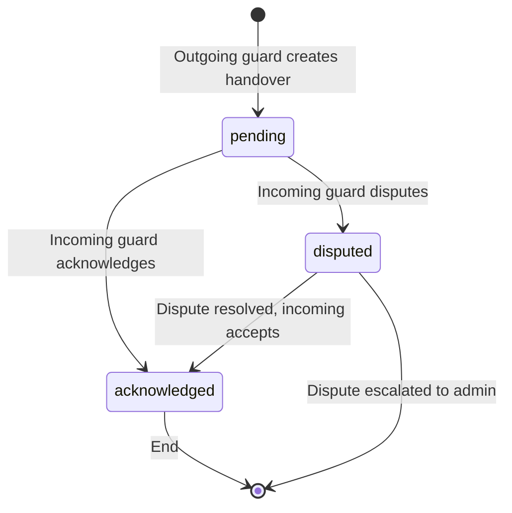
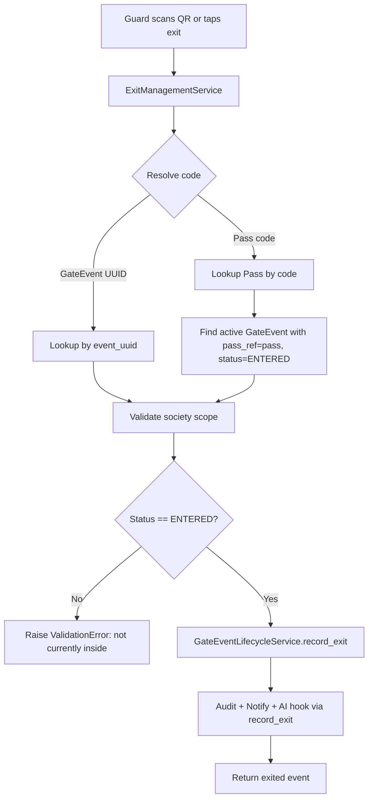
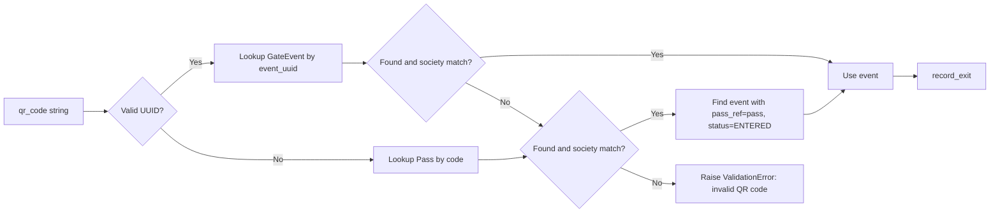
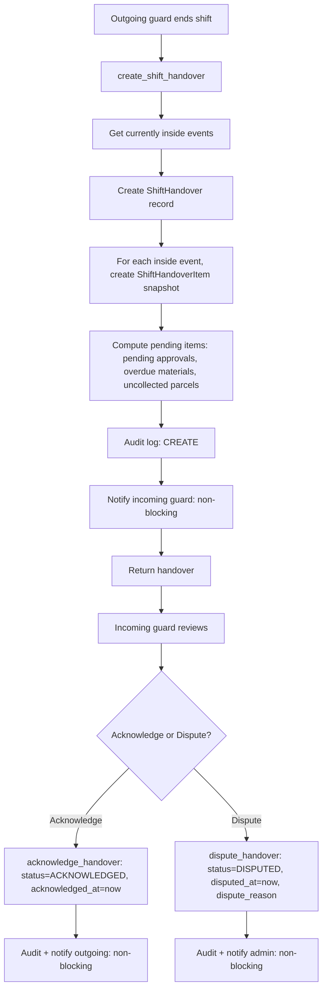
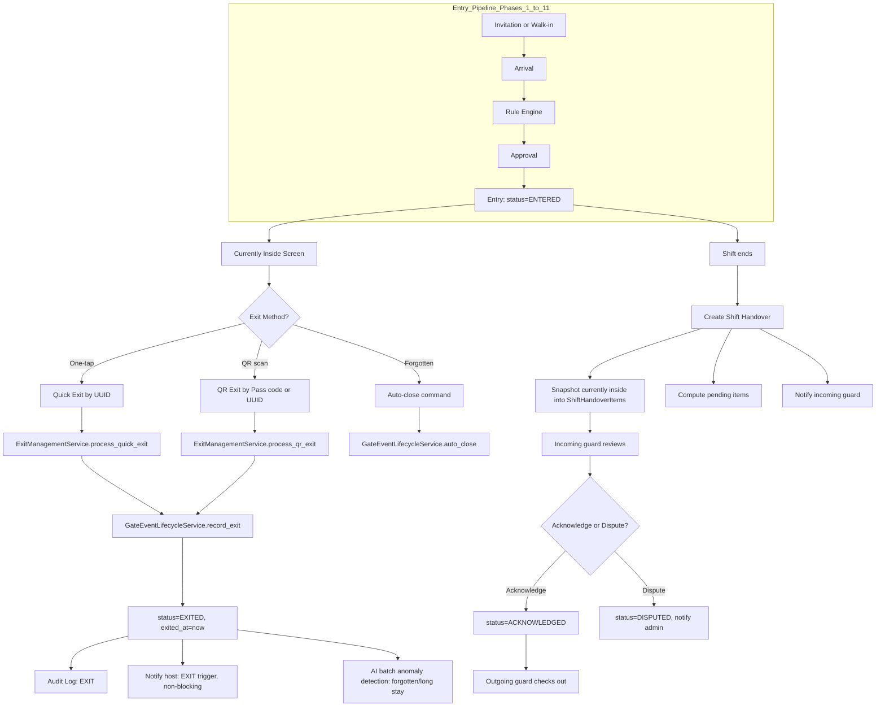

# Phase 12 — Exit Management: Architecture & Technical Specification

> **App:** `gateops` · **Phase:** 12 — Exit Management
> **Status:** Design / Pending Implementation
> **Last updated:** `2026-07-12`
> **Depends on:** Phases 1–11 (Foundation, Rule Engine, Visitor Lifecycle, Pass, Vehicle, Material, Parcel, Contractor, Notification Engine, AI Recommendation Engine)

---

## Table of Contents

1. [Executive Summary](#1-executive-summary)
2. [Scope & Goals](#2-scope--goals)
3. [Design Principles](#3-design-principles)
4. [New Models](#4-new-models)
   - 4.1 [`ShiftHandover`](#41-shifthandover)
   - 4.2 [`ShiftHandoverItem`](#42-shifthandoveritem)
5. [Service Layer](#5-service-layer)
   - 5.1 [`ExitManagementService`](#51-exitmanagementservice)
   - 5.2 [`ShiftHandoverService`](#52-shifthandoverservice)
6. [Views / URLs](#6-views--urls)
7. [Integration Points](#7-integration-points)
8. [Migration Plan](#8-migration-plan)
9. [Test Plan](#9-test-plan)
10. [File Structure](#10-file-structure)
11. [Business Invariants](#11-business-invariants)
12. [Open Questions / Decisions](#12-open-questions--decisions)

---

## 1. Executive Summary

Phase 12 — Exit Management completes the "visit session" loop of the
"Everything is a Gate Event" philosophy. Phases 1–11 built the full entry
pipeline (invitation → arrival → rule evaluation → approval → entry) plus the
auto-close safety net for forgotten exits. Phase 12 makes the **explicit exit**
fast, auditable, and shift-aware.

Three capabilities are introduced:

1. **One-tap / QR exit** — A guard processes an exit with a single tap (by
   `GateEvent` UUID) or by scanning a QR code (a `Pass.code` or the
   `GateEvent.event_uuid`). The exit transition itself is delegated to the
   existing [`GateEventLifecycleService.record_exit()`](gateops/services/gate_event_lifecycle.py:470)
   so the state machine, audit log, and host notification are reused — never
   duplicated.

2. **"Currently Inside" screen** — A real-time, filterable, paginated view of
   every `GateEvent` with `status=ENTERED` (not yet `EXITED`/`AUTO_CLOSED`).
   This is a query/view feature; no new model is required for it. The existing
   [`currently_inside_view`](gateops/views.py:948) is enhanced with filtering,
   pagination, and duration computation.

3. **Shift handover** — When a guard's shift ends, they hand over to the next
   guard. The handover snapshots who is currently inside, any pending items,
   and the incoming guard acknowledges responsibility. Two new models —
   [`ShiftHandover`](#41-shifthandover) and
   [`ShiftHandoverItem`](#42-shifthandoveritem) — record this with a
   `PENDING → ACKNOWLEDGED → DISPUTED` state machine and full audit logging.

### What Phase 12 does NOT do

- It does **not** introduce a separate "Exit" table — exit is a transition on
  the existing `GateEvent` (the core "never separate Entry and Exit tables"
  invariant from the [design document](plans/gate_operations_platform_design.md:33)).
- It does **not** duplicate the state machine, audit logging, or notification
  logic — all of that flows through `GateEventLifecycleService`.
- It does **not** add a new management command for exits (auto-close already
  exists; explicit exit is guard-initiated). A handover command is optional and
  described in [§7.4](#74-auto-close-command-interaction).

---

## 2. Scope & Goals

### In Scope

| Capability | Description |
| --- | --- |
| One-tap exit | `process_quick_exit(gate_event_id, gate, guard)` — exit by `GateEvent` UUID/PK |
| QR exit | `process_qr_exit(qr_code, gate, guard)` — resolve a scanned QR string to a `Pass.code` or `GateEvent.event_uuid`, then exit |
| Currently Inside query | `get_currently_inside(society, filters)` — filterable, paginated, duration-annotated queryset |
| Shift handover create | `create_shift_handover(...)` — snapshot currently-inside persons + pending items |
| Shift handover acknowledge | `acknowledge_handover(handover_id, incoming_guard)` |
| Shift handover dispute | `dispute_handover(handover_id, reason)` |
| Views/URLs | Currently-inside (enhanced), quick-exit, QR-exit, handover CRUD/acknowledge/dispute |
| Migration | `0011_exit_management` — new tables, FKs, indexes, audit action choices |

### Out of Scope (deferred to later phases)

- **WebSocket real-time push** for the "Currently Inside" screen (Phase 17 —
  Performance). Phase 12 uses server-rendered polling.
- **Offline sync queue** for exits (Phase 17). Phase 12 assumes online
  processing; the `event_uuid` field already supports future offline sync.
- **Biometric/RFID exit** (Phase 15 — Integration Layer). Phase 12's QR exit is
  the foundation; biometric hooks plug into `process_qr_exit` later.
- **Analytics on exit duration** (Phase 13). Phase 12 records the data; Phase
  13 computes the metrics.

---

## 3. Design Principles

Phase 12 follows the established `gateops` conventions discovered during
research:

1. **Delegate, don't duplicate.** The exit *transition* is owned by
   [`GateEventLifecycleService.record_exit()`](gateops/services/gate_event_lifecycle.py:470).
   `ExitManagementService` is a thin orchestration layer that resolves the
   event, validates it belongs to the society, and calls `record_exit()`. No
   state-machine logic is copied.

2. **Soft-delete pattern.** New models use `is_active` + `deleted_at` inline,
   matching [`SecurityGuard`](gateops/models/model_SecurityGuard.py:33),
   [`GuardShift`](gateops/models/model_GuardShift.py:21), and
   [`Pass`](gateops/models/model_Pass.py:62). No mixin.

3. **Multi-tenancy.** Every new model FKs to `Society`. Every query filters by
   `society`. Cross-tenant access is prevented by `clean()` cross-society
   guards (matching [`GuardShiftAssignment.clean()`](gateops/models/model_GuardShiftAssignment.py:63)).

4. **Audit everything.** Every state change creates a
   [`GateOpsAuditLog`](gateops/models/model_GateOpsAuditLog.py:6) entry via the
   `log()` classmethod. Audit logging is wrapped in `try/except` so a logging
   failure never blocks a gate operation (matching
   [`_log_audit`](gateops/services/gate_event_lifecycle.py:638)).

5. **Non-blocking integrations.** Notification and AI integrations are
   non-blocking — a failure in [`NotificationEngineService`](gateops/services/notification_engine.py:65)
   or [`AIRecommendationService`](gateops/services/ai_recommendation_service.py:138)
   never prevents an exit. This is already enforced inside
   `record_exit()` via [`_notify()`](gateops/services/gate_event_lifecycle.py:662).

6. **Service contract.** All service methods are `@staticmethod`, use
   keyword-only args, wrap writes in `@transaction.atomic`, and use
   `QuerySet.update()` for race-safe transitions (matching
   [`ContractorService`](gateops/services/contractor_service.py:83)).

7. **UUID as the external ID.** QR codes and quick-exit references use
   `GateEvent.event_uuid` (not the numeric `id`), matching the
   [`gate_event_record_exit_view`](gateops/views.py:898) URL pattern
   `events/<uuid:uuid>/exit/`.

8. **Additive migrations.** `0011_exit_management` only adds new tables and
   `AlterField` choice additions. No existing column is removed or narrowed,
   matching the [`0010`](gateops/migrations/0010_ai_recommendation_engine.py:8)
   pattern.

---

## 4. New Models

Two new models are introduced, both in new files under `gateops/models/` and
registered in [`gateops/models/__init__.py`](gateops/models/__init__.py).

### 4.1 `ShiftHandover`

**File:** `gateops/models/model_ShiftHandover.py`
**Purpose:** Records the handover of gate responsibility from an outgoing
guard to an incoming guard at the end of a shift. Snapshots the count of
persons currently inside and any pending items, and tracks an
acknowledgement lifecycle.

#### State Machine



Valid transitions:

| From | To | Trigger |
| --- | --- | --- |
| `pending` | `acknowledged` | Incoming guard calls `acknowledge_handover()` |
| `pending` | `disputed` | Incoming guard calls `dispute_handover()` |
| `disputed` | `acknowledged` | Dispute resolved, incoming guard acknowledges |

Invalid transitions (rejected with `ValidationError`):
- `acknowledged` → `pending` (cannot un-acknowledge)
- `acknowledged` → `disputed` (acknowledgement is final)
- `disputed` → `pending` (cannot revert to pending)

#### Fields

| Field | Type | Constraints | Description |
| --- | --- | --- | --- |
| `society` | `ForeignKey("housing.Society")` | `on_delete=CASCADE`, `related_name="shift_handovers"` | Tenant |
| `handover_uuid` | `UUIDField` | `default=uuid.uuid4`, `unique=True`, `editable=False`, `db_index=True` | External-safe ID for QR/API use |
| `outgoing_guard` | `ForeignKey("gateops.SecurityGuard")` | `on_delete=PROTECT`, `related_name="outgoing_handovers"` | Guard ending their shift |
| `incoming_guard` | `ForeignKey("gateops.SecurityGuard")` | `on_delete=PROTECT`, `related_name="incoming_handovers"` | Guard taking over |
| `gate` | `ForeignKey("gateops.Gate")` | `on_delete=PROTECT`, `related_name="shift_handovers"` | The gate this handover covers |
| `shift` | `ForeignKey("gateops.GuardShift")` | `on_delete=PROTECT`, `null=True, blank=True`, `related_name="handovers"` | The shift definition (nullable for ad-hoc handovers) |
| `outgoing_assignment` | `ForeignKey("gateops.GuardShiftAssignment")` | `on_delete=SET_NULL`, `null=True, blank=True`, `related_name="outgoing_handovers"` | The outgoing guard's assignment (nullable; SET_NULL preserves handover if assignment deleted) |
| `incoming_assignment` | `ForeignKey("gateops.GuardShiftAssignment")` | `on_delete=SET_NULL`, `null=True, blank=True`, `related_name="incoming_handovers"` | The incoming guard's assignment |
| `status` | `CharField` | `choices=Status.choices`, `max_length=20`, `default=PENDING`, `db_index=True` | Handover lifecycle state |
| `inside_count` | `PositiveIntegerField` | `default=0` | Snapshot: number of persons inside at handover time |
| `pending_items_count` | `PositiveIntegerField` | `default=0` | Snapshot: number of pending items (e.g., pending approvals, overdue materials) |
| `pending_items_summary` | `JSONField` | `default=dict` | Structured snapshot of pending items: `{"pending_approvals": 2, "overdue_materials": 1, "uncollected_parcels": 3}` |
| `outgoing_notes` | `TextField` | `blank=True` | Free-form notes from outgoing guard |
| `incoming_notes` | `TextField` | `blank=True` | Free-form notes from incoming guard (set on acknowledge) |
| `dispute_reason` | `TextField` | `blank=True` | Reason for dispute (set on dispute) |
| `handed_over_at` | `DateTimeField` | `auto_now_add=True` | When the outgoing guard created the handover |
| `acknowledged_at` | `DateTimeField` | `null=True, blank=True` | When the incoming guard acknowledged |
| `disputed_at` | `DateTimeField` | `null=True, blank=True` | When the incoming guard disputed |
| `created_by` | `ForeignKey(settings.AUTH_USER_MODEL)` | `on_delete=SET_NULL`, `null=True, blank=True`, `related_name="created_shift_handovers"` | Audit: who created (outgoing guard's user) |
| `acknowledged_by` | `ForeignKey(settings.AUTH_USER_MODEL)` | `on_delete=SET_NULL`, `null=True, blank=True`, `related_name="acknowledged_shift_handovers"` | Audit: who acknowledged (incoming guard's user) |
| `is_active` | `BooleanField` | `default=True` | Soft-delete flag |
| `deleted_at` | `DateTimeField` | `null=True, blank=True` | Soft-delete timestamp |
| `created_at` | `DateTimeField` | `auto_now_add=True` | Audit |
| `updated_at` | `DateTimeField` | `auto_now=True` | Audit |

#### TextChoices

```python
class Status(models.TextChoices):
    PENDING = "pending", _("Pending")
    ACKNOWLEDGED = "acknowledged", _("Acknowledged")
    DISPUTED = "disputed", _("Disputed")
```

#### Meta

```python
class Meta:
    verbose_name = _("Shift Handover")
    verbose_name_plural = _("Shift Handovers")
    ordering = ("-handed_over_at",)
    indexes = [
        models.Index(fields=["society", "status"], name="handover_soc_status_idx"),
        models.Index(fields=["society", "gate"], name="handover_soc_gate_idx"),
        models.Index(fields=["society", "outgoing_guard"], name="handover_soc_out_idx"),
        models.Index(fields=["society", "incoming_guard"], name="handover_soc_in_idx"),
        models.Index(fields=["society", "handed_over_at"], name="handover_soc_date_idx"),
        models.Index(fields=["society", "is_active"], name="handover_soc_act_idx"),
        models.Index(fields=["handover_uuid"], name="handover_uuid_idx"),
    ]
```

No `unique_together` — a guard can have multiple handovers over time. The
`(society, outgoing_guard, handed_over_at)` combination is not unique because
two handovers could theoretically be created in the same second (edge case);
the service layer enforces "one pending handover per outgoing guard per gate"
via a query check, not a DB constraint.

#### `__str__`

```python
def __str__(self):
    return (
        f"Handover {self.handover_uuid} — {self.outgoing_guard} → "
        f"{self.incoming_guard} @ {self.gate} [{self.status}]"
    )
```

#### `clean()` validation

```python
def clean(self):
    super().clean()
    # Cross-society guards: all FK targets must belong to the same society.
    if self.outgoing_guard.society_id != self.society_id:
        raise ValidationError({"outgoing_guard": _("Outgoing guard must belong to the same society.")})
    if self.incoming_guard.society_id != self.society_id:
        raise ValidationError({"incoming_guard": _("Incoming guard must belong to the same society.")})
    if self.gate.society_id != self.society_id:
        raise ValidationError({"gate": _("Gate must belong to the same society.")})
    if self.shift is not None and self.shift.society_id != self.society_id:
        raise ValidationError({"shift": _("Shift must belong to the same society.")})
    if self.outgoing_assignment is not None and self.outgoing_assignment.society_id != self.society_id:
        raise ValidationError({"outgoing_assignment": _("Outgoing assignment must belong to the same society.")})
    if self.incoming_assignment is not None and self.incoming_assignment.society_id != self.society_id:
        raise ValidationError({"incoming_assignment": _("Incoming assignment must belong to the same society.")})
    # A guard cannot hand over to themselves.
    if self.outgoing_guard_id == self.incoming_guard_id:
        raise ValidationError({"incoming_guard": _("Incoming guard must differ from outgoing guard.")})
    # acknowledged_at requires status ACKNOWLEDGED.
    if self.acknowledged_at is not None and self.status != self.Status.ACKNOWLEDGED:
        raise ValidationError({"acknowledged_at": _("acknowledged_at requires status ACKNOWLEDGED.")})
    # disputed_at requires status DISPUTED.
    if self.disputed_at is not None and self.status != self.Status.DISPUTED:
        raise ValidationError({"disputed_at": _("disputed_at requires status DISPUTED.")})
    # dispute_reason requires status DISPUTED.
    if self.dispute_reason and self.status != self.Status.DISPUTED:
        raise ValidationError({"dispute_reason": _("dispute_reason requires status DISPUTED.")})
```

#### `save()`

```python
def save(self, *args, **kwargs):
    self.clean()
    super().save(*args, **kwargs)
```

---

### 4.2 `ShiftHandoverItem`

**File:** `gateops/models/model_ShiftHandoverItem.py`
**Purpose:** Per-person snapshot record linking a `ShiftHandover` to each
`GateEvent` that was "currently inside" at handover time. This gives the
incoming guard a line-item view of who they are taking responsibility for,
and provides an immutable historical record even if the `GateEvent` is later
auto-closed or exited.

#### Fields

| Field | Type | Constraints | Description |
| --- | --- | --- | --- |
| `society` | `ForeignKey("housing.Society")` | `on_delete=CASCADE`, `related_name="shift_handover_items"` | Tenant (denormalized for query efficiency) |
| `handover` | `ForeignKey("gateops.ShiftHandover")` | `on_delete=CASCADE`, `related_name="items"` | Parent handover record |
| `gate_event` | `ForeignKey("gateops.GateEvent")` | `on_delete=SET_NULL`, `null=True, blank=True`, `related_name="handover_items"` | The event that was inside at handover time. SET_NULL preserves the item if the event is later deleted (though GateEvent uses PROTECT on person, events are not deleted in normal flow) |
| `person` | `ForeignKey("gateops.Person")` | `on_delete=PROTECT`, `null=True, blank=True`, `related_name="handover_items"` | The person who was inside (denormalized from gate_event.person for fast listing; PROTECT preserves the person master record) |
| `visitor_category` | `ForeignKey("gateops.VisitorCategory")` | `on_delete=PROTECT`, `null=True, blank=True`, `related_name="handover_items"` | Visitor type (denormalized from gate_event.visitor_category) |
| `entered_at` | `DateTimeField` | `null=True, blank=True` | Snapshot: when the person entered (denormalized from gate_event.entered_at) |
| `duration_minutes_at_handover` | `PositiveIntegerField` | `default=0` | Snapshot: minutes the person had been inside at handover time |
| `gate` | `ForeignKey("gateops.Gate")` | `on_delete=PROTECT`, `null=True, blank=True`, `related_name="handover_items"` | The gate the person entered through (denormalized) |
| `is_overstay` | `BooleanField` | `default=False` | Snapshot: whether the person had exceeded their `auto_close_at` at handover time |
| `notes` | `TextField` | `blank=True` | Per-item notes from outgoing guard |
| `created_at` | `DateTimeField` | `auto_now_add=True` | Audit |

No `is_active`/`deleted_at` — handover items are immutable snapshots. They are
deleted only if the parent `ShiftHandover` is deleted (CASCADE), and
`ShiftHandover` soft-delete does not cascade to items (items remain as
historical record). If true deletion of items is needed, it follows the parent
soft-delete; this is acceptable because items are append-only snapshots.

> **Design note:** Denormalizing `person`, `visitor_category`, `entered_at`,
> `gate`, and `duration_minutes_at_handover` onto the item row means the
> "handover receipt" can be rendered without joining to `GateEvent` (which may
> later transition to `EXITED`/`AUTO_CLOSED`). This matches the snapshot
> philosophy: a handover captures the state of the world *at handover time*.

#### Meta

```python
class Meta:
    verbose_name = _("Shift Handover Item")
    verbose_name_plural = _("Shift Handover Items")
    ordering = ("handover", "-entered_at")
    indexes = [
        models.Index(fields=["handover"], name="hitem_handover_idx"),
        models.Index(fields=["society", "person"], name="hitem_soc_person_idx"),
        models.Index(fields=["society", "gate_event"], name="hitem_soc_event_idx"),
    ]
    constraints = [
        # One item per handover per gate event (a person inside is listed once).
        models.UniqueConstraint(
            fields=["handover", "gate_event"],
            name="uniq_handover_item_per_event",
            condition=models.Q(gate_event__isnull=False),
        ),
    ]
```

#### `__str__`

```python
def __str__(self):
    person = self.person.name if self.person else "Unknown"
    return f"{person} inside {self.duration_minutes_at_handover}min @ {self.handover}"
```

#### `clean()` validation

```python
def clean(self):
    super().clean()
    if self.handover.society_id != self.society_id:
        raise ValidationError({"society": _("Society must match the handover's society.")})
    if self.gate_event is not None and self.gate_event.society_id != self.society_id:
        raise ValidationError({"gate_event": _("Gate event must belong to the same society.")})
    if self.person is not None and self.person.society_id != self.society_id:
        raise ValidationError({"person": _("Person must belong to the same society.")})
    if self.visitor_category is not None and self.visitor_category.society_id != self.society_id:
        raise ValidationError({"visitor_category": _("Visitor category must belong to the same society.")})
    if self.gate is not None and self.gate.society_id != self.society_id:
        raise ValidationError({"gate": _("Gate must belong to the same society.")})
```

#### `save()`

```python
def save(self, *args, **kwargs):
    self.clean()
    super().save(*args, **kwargs)
```

---

## 5. Service Layer

Two services are introduced, following the
[`ContractorService`](gateops/services/contractor_service.py:83) contract:
all `@staticmethod`, keyword-only args, `@transaction.atomic` on writes,
race-safe `QuerySet.update()` for transitions, and append-only audit logging
via [`GateOpsAuditLog.log()`](gateops/models/model_GateOpsAuditLog.py:86).

### 5.1 `ExitManagementService`

**File:** `gateops/services/exit_management.py`
**Purpose:** One-tap exit, QR exit, and the "currently inside" query. This
service is a thin orchestration layer — the actual exit transition is
delegated to
[`GateEventLifecycleService.record_exit()`](gateops/services/gate_event_lifecycle.py:470).



#### Methods

##### `process_quick_exit(*, society, gate_event_id, gate=None, guard=None) -> GateEvent`

One-tap exit by `GateEvent` identifier.

- `gate_event_id` accepts either a `UUID` string (the `event_uuid`) or an
  integer PK. The service normalizes: if it's a valid UUID string, look up by
  `event_uuid`; otherwise by `pk`.
- Validates the event belongs to `society` (cross-tenant rejection raises
  `Http404`-style `DoesNotExist` / `ValidationError`).
- Validates `event.status == GateEvent.Status.ENTERED`. If not, raises
  `ValidationError` with a clear message ("Event is not currently inside;
  current status: {status}").
- Optionally validates `event.gate == gate` if `gate` is provided (a guard at
  Gate B should not be able to exit a visitor who entered at Gate A unless the
  society config allows cross-gate exit — see [§12](#12-open-questions--decisions)).
  Default: allow cross-gate exit (a visitor can exit at any gate), but log the
  exit gate if it differs from the entry gate.
- Delegates to `GateEventLifecycleService.record_exit(event, guard=guard)`.
- Returns the exited `GateEvent`.
- Audit: the `record_exit()` call already creates a `GateOpsAuditLog` entry
  with action `EXIT`. `ExitManagementService` does **not** add a second audit
  entry for the "quick exit" — the exit audit is sufficient. (If we want to
  distinguish "quick exit" from "manual exit" in the audit trail, we can add
  an `exit_method` field to `GateEvent` in a future phase; for now, both flow
  through the same `record_exit()`.)

```python
@staticmethod
@transaction.atomic
def process_quick_exit(*, society, gate_event_id, gate=None, guard=None) -> GateEvent:
    """One-tap exit by GateEvent UUID or PK.

    Resolves the event, validates it is currently inside, and delegates the
    transition to GateEventLifecycleService.record_exit().
    """
    event = ExitManagementService._resolve_event(society, gate_event_id)
    ExitManagementService._validate_inside(event)
    if gate is not None and event.gate_id != gate.pk:
        # Cross-gate exit: allowed but noted. Future: society config toggle.
        pass
    return GateEventLifecycleService.record_exit(event, guard=guard)
```

##### `process_qr_exit(*, society, qr_code, gate=None, guard=None) -> GateEvent`

QR code-based exit. The `qr_code` string can be either:

1. A `Pass.code` — the credential string on a visitor's QR pass. The service
   looks up the `Pass`, then finds the active `GateEvent` linked to that pass
   (`gate_event.pass_ref = pass`, `status=ENTERED`).
2. A `GateEvent.event_uuid` (UUID string) — the event's own UUID, which may be
   encoded in a QR sticker given to the visitor at entry.

Resolution order:



- If the QR code is a valid UUID and matches a `GateEvent` in the society,
  use that event directly.
- Otherwise, look up `Pass` by `code` (scoped to `society`, `is_active=True`).
  If found, find the `GateEvent` with `pass_ref=pass`, `status=ENTERED`,
  `society=society`. If multiple events match (shouldn't happen with the
  unique pass constraint, but defensive), take the most recent by
  `entered_at`.
- If neither resolves, raise `ValidationError("Invalid QR code: no matching
  pass or gate event found.")`.
- Validates `status == ENTERED`.
- Delegates to `GateEventLifecycleService.record_exit(event, guard=guard)`.
- Does **not** mutate the `Pass` (no usage increment on exit — the pass was
  validated at entry). The pass's `usage_count` reflects entries, not exits.

```python
@staticmethod
@transaction.atomic
def process_qr_exit(*, society, qr_code, gate=None, guard=None) -> GateEvent:
    """QR-code-based exit: resolve Pass code or GateEvent UUID, then exit."""
    event = ExitManagementService._resolve_qr(society, qr_code)
    ExitManagementService._validate_inside(event)
    return GateEventLifecycleService.record_exit(event, guard=guard)
```

##### `get_currently_inside(*, society, filters=None, page=None, page_size=50) -> dict`

Query for all persons currently inside the society with filtering and
pagination. Returns a dict with `results` (list of annotated event dicts),
`total` (count), `page`, `page_size`, `total_pages`.

- Base queryset: `GateEvent.objects.filter(society=society,
  status=GateEvent.Status.ENTERED)`.
- Uses `select_related("person", "visitor_category", "gate", "guard",
  "host_unit")` to avoid N+1 (matching
  [`_gate_event_queryset`](gateops/views.py:731)).
- Annotates `duration_minutes = ExpressionWrapper` (now - `entered_at`) for
  duration display. Computed in Python for simplicity in v1; a DB annotation
  can be added if performance requires (see [§5.1.1](#performance-considerations)).
- Filters (all optional, passed as a dict):
  - `gate_id` — filter by entry gate.
  - `visitor_category_id` — filter by visitor category.
  - `person_id` — filter by specific person.
  - `min_duration_minutes` — only persons inside longer than this.
  - `max_duration_minutes` — only persons inside shorter than this.
  - `is_overstay` — boolean; if `True`, filter `auto_close_at__lte=now`
    (persons who have exceeded their auto-close window but haven't been
    auto-closed yet — a real-time overstay view).
  - `host_unit_id` — filter by host unit.
  - `search` — text search on `person__name` or `person__phone` (icontains).
- Ordering: `-entered_at` (most recent first), matching the existing
  [`currently_inside_view`](gateops/views.py:952).
- Pagination: Django's `Paginator` with `page_size` (default 50). Returns
  `total` and `total_pages` for UI.
- Returns serialized dicts (not model instances) to keep the view layer thin
  and prepare for future DRF serialization.

```python
@staticmethod
def get_currently_inside(*, society, filters=None, page=None, page_size=50) -> dict:
    """Return a paginated, filtered list of persons currently inside."""
    qs = GateEvent.objects.filter(
        society=society, status=GateEvent.Status.ENTERED
    ).select_related("person", "visitor_category", "gate", "guard", "host_unit")

    filters = filters or {}
    if filters.get("gate_id"):
        qs = qs.filter(gate_id=filters["gate_id"])
    if filters.get("visitor_category_id"):
        qs = qs.filter(visitor_category_id=filters["visitor_category_id"])
    if filters.get("person_id"):
        qs = qs.filter(person_id=filters["person_id"])
    if filters.get("host_unit_id"):
        qs = qs.filter(host_unit_id=filters["host_unit_id"])
    if filters.get("min_duration_minutes") is not None:
        cutoff = timezone.now() - timedelta(minutes=filters["min_duration_minutes"])
        qs = qs.filter(entered_at__lte=cutoff)
    if filters.get("max_duration_minutes") is not None:
        cutoff = timezone.now() - timedelta(minutes=filters["max_duration_minutes"])
        qs = qs.filter(entered_at__gte=cutoff)
    if filters.get("is_overstay"):
        qs = qs.filter(auto_close_at__lte=timezone.now())
    if filters.get("search"):
        qs = qs.filter(
            Q(person__name__icontains=filters["search"])
            | Q(person__phone__icontains=filters["search"])
        )

    qs = qs.order_by("-entered_at")
    total = qs.count()
    paginator = Paginator(qs, page_size)
    page_obj = paginator.get_page(page)
    now = timezone.now()
    results = [
        ExitManagementService._serialize_inside_event(e, now) for e in page_obj.object_list
    ]
    return {
        "results": results,
        "total": total,
        "page": page_obj.number,
        "page_size": page_size,
        "total_pages": paginator.num_pages,
    }
```

##### `get_currently_inside_count(*, society) -> int`

Lightweight count for dashboard badges. Returns
`GateEvent.objects.filter(society=society, status=ENTERED).count()`. Cached
for 60 seconds via Django's cache framework to avoid hammering the DB on
dashboard refresh.

##### `get_pending_handover_count(*, society, guard=None) -> int`

Count of pending handovers for a society (optionally for a specific incoming
guard). Used to surface "You have a handover to acknowledge" alerts.

#### Internal helpers

##### `_resolve_event(*, society, gate_event_id) -> GateEvent`

Normalize `gate_event_id` (UUID string or int PK) and fetch society-scoped
event. Raises `GateEvent.DoesNotExist` (which the view converts to `Http404`)
if not found or cross-society.

```python
@staticmethod
def _resolve_event(*, society, gate_event_id) -> GateEvent:
    # Try UUID first, then int PK.
    try:
        uuid_obj = uuid.UUID(str(gate_event_id))
        return GateEvent.objects.get(society=society, event_uuid=uuid_obj)
    except (ValueError, TypeError):
        pass
    try:
        pk = int(gate_event_id)
        return GateEvent.objects.get(society=society, pk=pk)
    except (ValueError, TypeError):
        raise GateEvent.DoesNotExist("GateEvent not found.")
```

##### `_resolve_qr(*, society, qr_code) -> GateEvent`

Resolve a QR code string to a `GateEvent`. Tries UUID lookup first, then
`Pass.code` lookup.

```python
@staticmethod
def _resolve_qr(*, society, qr_code) -> GateEvent:
    # 1. Try as GateEvent UUID.
    try:
        uuid_obj = uuid.UUID(str(qr_code))
        event = GateEvent.objects.filter(
            society=society, event_uuid=uuid_obj
        ).first()
        if event is not None:
            return event
    except (ValueError, TypeError):
        pass
    # 2. Try as Pass code.
    pass_obj = Pass.objects.filter(
        society=society, code=qr_code, is_active=True
    ).first()
    if pass_obj is not None:
        event = GateEvent.objects.filter(
            society=society, pass_ref=pass_obj, status=GateEvent.Status.ENTERED
        ).order_by("-entered_at").first()
        if event is not None:
            return event
    raise ValidationError("Invalid QR code: no matching pass or gate event found.")
```

##### `_validate_inside(event)`

Raise `ValidationError` if `event.status != GateEvent.Status.ENTERED`.

##### `_serialize_inside_event(event, now) -> dict`

Serialize a "currently inside" event for the view/API:

```python
{
    "id": event.pk,
    "event_uuid": str(event.event_uuid),
    "person_name": event.person.name if event.person else "Unknown",
    "person_phone": event.person.phone if event.person else "",
    "visitor_category": event.visitor_category.name,
    "visitor_category_code": event.visitor_category.code,
    "gate": event.gate.name,
    "gate_code": event.gate.code,
    "entered_at": event.entered_at.isoformat(),
    "duration_minutes": int((now - event.entered_at).total_seconds() // 60),
    "is_overstay": event.auto_close_at is not None and event.auto_close_at <= now,
    "auto_close_at": event.auto_close_at.isoformat() if event.auto_close_at else None,
    "host_unit": str(event.host_unit) if event.host_unit else None,
    "pass_code": event.pass_ref.code if event.pass_ref else None,
}
```

#### Performance Considerations

The "Currently Inside" screen is the most performance-sensitive feature in
Phase 12 because it can have large result sets (a busy society may have
hundreds of visitors inside simultaneously).

| Concern | Strategy |
| --- | --- |
| **N+1 queries** | `select_related` on `person`, `visitor_category`, `gate`, `guard`, `host_unit` (matching [`_gate_event_queryset`](gateops/views.py:731)). |
| **Count query cost** | The `total` count runs a separate `COUNT(*)`. For very large societies, cache the count for 60s via `cache.get_or_set("gateops:inside_count:{society_id}", ..., 60)`. The paginated list is always live. |
| **Duration computation** | Computed in Python in v1 (`(now - entered_at).total_seconds() // 60`). If profiling shows this is slow, add a DB annotation: `duration_minutes=ExpressionWrapper(Now() - F("entered_at"), output_field=DurationField())`. |
| **Overstay filter** | `auto_close_at__lte=now` uses the existing `gateevt_entered_idx` index on `(society, entered_at)`. A dedicated index on `(society, status, auto_close_at)` could be added if the overstay filter is frequent — deferred to Phase 13/17 based on usage. |
| **Pagination** | Django `Paginator` with `page_size=50`. The view passes `page` from the query string. |
| **Caching** | Only the count is cached (60s TTL). The list is always live — stale inside-lists are dangerous. |
| **Real-time updates** | v1 uses polling (page refresh). Phase 17 will add WebSocket push. |

---

### 5.2 `ShiftHandoverService`

**File:** `gateops/services/shift_handover_service.py`
**Purpose:** Create, acknowledge, dispute, list, and retrieve shift handovers.
Snapshots the currently-inside persons into `ShiftHandoverItem` rows.



#### Methods

##### `create_shift_handover(*, society, outgoing_guard, incoming_guard, gate, shift=None, outgoing_assignment=None, incoming_assignment=None, outgoing_notes="", actor=None) -> ShiftHandover`

Create a handover record with a snapshot of currently-inside persons.

- Validates `outgoing_guard`, `incoming_guard`, `gate` belong to `society`
  (the model's `clean()` also enforces this, but the service fails fast).
- Validates `outgoing_guard != incoming_guard`.
- Checks there is no existing `PENDING` handover for the same
  `(outgoing_guard, gate)` — if one exists, raises `ValidationError("A pending
  handover already exists for this guard at this gate. Acknowledge or dispute
  it first.")`. This prevents duplicate pending handovers.
- Fetches currently-inside events via
  `ExitManagementService.get_currently_inside(society=society, filters={"gate_id": gate.pk})`
  (filtered to the gate; if the society wants a society-wide handover, pass
  `gate=None` and the service uses all gates — but the `gate` field on
  `ShiftHandover` is required, so the caller picks the scope).
- Creates the `ShiftHandover` record with `status=PENDING`,
  `inside_count=len(events)`.
- Computes pending items:
  - Pending approvals: `GateEventApproval.objects.filter(society=society,
    decision="pending")` count.
  - Overdue materials: `MaterialMovement.objects.filter(society=society,
    returned_at__isnull=True, expected_return_at__lt=now)` count.
  - Uncollected parcels: `Parcel.objects.filter(society=society,
    status="received")` count.
- Stores `pending_items_count` and `pending_items_summary` as JSON.
- For each inside event, creates a `ShiftHandoverItem` with denormalized
  `person`, `visitor_category`, `entered_at`, `gate`, `duration_minutes_at_handover`,
  `is_overstay`.
- Audit: `GateOpsAuditLog.log(action=CREATE, entity_type="ShiftHandover", ...)`.
- Notification: non-blocking call to
  [`NotificationEngineService`](gateops/services/notification_engine.py:65) to
  notify the incoming guard (if they have a linked `User` with an email).
  Wrapped in `try/except`.
- Returns the `ShiftHandover`.

```python
@staticmethod
@transaction.atomic
def create_shift_handover(*, society, outgoing_guard, incoming_guard, gate,
                          shift=None, outgoing_assignment=None,
                          incoming_assignment=None, outgoing_notes="",
                          actor=None) -> ShiftHandover:
    # ... validation ...
    # Check no existing pending handover for this guard+gate.
    existing = ShiftHandover.objects.filter(
        society=society, outgoing_guard=outgoing_guard, gate=gate,
        status=ShiftHandover.Status.PENDING, is_active=True,
    ).exists()
    if existing:
        raise ValidationError("A pending handover already exists for this guard at this gate.")
    # Snapshot currently inside.
    inside = ExitManagementService.get_currently_inside(
        society=society, filters={"gate_id": gate.pk}, page_size=10000
    )
    events = inside["results"]
    pending = ShiftHandoverService._compute_pending_items(society)
    handover = ShiftHandover.objects.create(
        society=society, outgoing_guard=outgoing_guard,
        incoming_guard=incoming_guard, gate=gate, shift=shift,
        outgoing_assignment=outgoing_assignment,
        incoming_assignment=incoming_assignment,
        status=ShiftHandover.Status.PENDING,
        inside_count=len(events),
        pending_items_count=pending["total"],
        pending_items_summary=pending["summary"],
        outgoing_notes=outgoing_notes, created_by=actor,
    )
    now = timezone.now()
    for ev in events:
        ShiftHandoverItem.objects.create(
            society=society, handover=handover,
            gate_event=GateEvent.objects.get(pk=ev["id"]),
            person=..., visitor_category=..., gate=...,
            entered_at=..., duration_minutes_at_handover=ev["duration_minutes"],
            is_overstay=ev["is_overstay"],
        )
    ShiftHandoverService._log_audit(...)
    ShiftHandoverService._notify_incoming_guard(handover)  # non-blocking
    return handover
```

> **Note on snapshot creation:** The `get_currently_inside` call returns
> serialized dicts. For item creation, the service re-fetches the `GateEvent`
> instances (or uses `select_related` on the inside query to return instances
> in the first place). An optimized variant returns model instances directly
> for internal use; the dict serialization is for the view layer. The
> implementation can use a private `_get_currently_inside_events(society, gate)`
> that returns a queryset of `GateEvent` instances with `select_related`, and
> the public `get_currently_inside` wraps it with serialization + pagination.

##### `acknowledge_handover(*, society, handover_id, incoming_guard, notes="", actor=None) -> ShiftHandover`

Acknowledge receipt of a handover.

- Fetches the handover (society-scoped, `is_active=True`).
- Validates `handover.status == PENDING` (cannot acknowledge an already-
  acknowledged or disputed handover). Raises `ValidationError` otherwise.
- Validates `incoming_guard == handover.incoming_guard` (only the designated
  incoming guard can acknowledge). Raises `ValidationError` otherwise.
- Race-safe transition: `ShiftHandover.objects.filter(pk=handover.pk,
  status=PENDING).update(status=ACKNOWLEDGED, acknowledged_at=now,
  acknowledged_by=actor, incoming_notes=notes)`.
- If `update()` returns 0 rows, another process acknowledged it first —
  refresh and raise `ValidationError("Handover is no longer pending.")`.
- Audit: `GateOpsAuditLog.log(action=STATE_TRANSITION, ...)`.
- Notification: non-blocking notify the outgoing guard that the handover was
  acknowledged.
- Returns the updated `ShiftHandover`.

##### `dispute_handover(*, society, handover_id, incoming_guard, reason, actor=None) -> ShiftHandover`

Mark a handover as disputed.

- Fetches the handover (society-scoped).
- Validates `handover.status == PENDING`.
- Validates `incoming_guard == handover.incoming_guard`.
- `reason` is required (non-empty).
- Race-safe transition: `update(status=DISPUTED, disputed_at=now,
  dispute_reason=reason)`.
- Audit: `GateOpsAuditLog.log(action=STATE_TRANSITION, ...)`.
- Notification: non-blocking notify the outgoing guard AND society admin that
  a dispute was raised.
- Returns the updated `ShiftHandover`.

##### `list_handovers(*, society, status=None, gate=None, guard=None, include_inactive=False) -> QuerySet`

List handovers for a society with optional filters. Ordered by
`-handed_over_at`. Uses `select_related("outgoing_guard", "incoming_guard",
"gate", "shift")`.

##### `get_handover(*, society, handover_id) -> ShiftHandover`

Fetch a single society-scoped handover or raise `Http404`. Accepts UUID or PK.

##### `get_handover_items(*, society, handover_id) -> QuerySet`

List the `ShiftHandoverItem` rows for a handover. Society-scoped.

##### `get_pending_handovers_for_guard(*, society, guard) -> QuerySet`

Pending handovers where `incoming_guard=guard` — for the "You have a handover
to acknowledge" alert.

#### Internal helpers

##### `_compute_pending_items(society) -> dict`

```python
{
    "total": <int>,
    "summary": {
        "pending_approvals": <int>,
        "overdue_materials": <int>,
        "uncollected_parcels": <int>,
    },
}
```

##### `_log_audit(society, action, entity_type, entity_id, before, after, actor)`

Wraps `GateOpsAuditLog.log()` in `try/except` (matching
[`_log_audit`](gateops/services/gate_event_lifecycle.py:638)).

##### `_notify_incoming_guard(handover)` / `_notify_outgoing_guard(handover, event_type)`

Non-blocking notification dispatch. Uses
[`NotificationEngineService`](gateops/services/notification_engine.py:65) if a
suitable trigger exists, or falls back to direct `EmailQueue` creation for the
incoming guard's linked `User`. Wrapped in `try/except`.

---

## 6. Views / URLs

All views follow the existing function-based, server-rendered pattern in
[`gateops/views.py`](gateops/views.py) and [`gateops/urls.py`](gateops/urls.py).
They use `_selected_society_or_missing`, `_base_context`, `_audit`, and
`messages`/`redirect` exactly like the existing
[`gate_event_record_exit_view`](gateops/views.py:898) and
[`currently_inside_view`](gateops/views.py:948).

### URL Patterns (additions to `gateops/urls.py`)

```python
# --- Phase 12: Exit Management ---
path("currently-inside/", view=views.currently_inside_view, name="currently-inside"),  # ENHANCED (already exists)
path("exits/quick/", view=views.quick_exit_view, name="quick-exit"),                    # NEW
path("exits/qr/", view=views.qr_exit_view, name="qr-exit"),                              # NEW
path("exits/qr/scan/", view=views.qr_exit_scan_view, name="qr-exit-scan"),               # NEW (form page)
# Shift handover
path("handovers/", view=views.handover_list_view, name="handover-list"),                # NEW
path("handovers/create/", view=views.handover_create_view, name="handover-create"),     # NEW
path("handovers/<uuid:uuid>/", view=views.handover_detail_view, name="handover-detail"), # NEW
path("handovers/<uuid:uuid>/acknowledge/", view=views.handover_acknowledge_view, name="handover-acknowledge"),  # NEW
path("handovers/<uuid:uuid>/dispute/", view=views.handover_dispute_view, name="handover-dispute"),              # NEW
```

> **Note:** `currently-inside/` already exists at
> [`gateops/urls.py:30`](gateops/urls.py:30). Phase 12 **enhances** the
> existing view with filtering and pagination — no new URL is added for it.

### View Specifications

#### `currently_inside_view(request)` — ENHANCED

The existing view at [`gateops/views.py:948`](gateops/views.py:948) is
enhanced to accept GET query params for filtering and pagination, delegating
to `ExitManagementService.get_currently_inside()`.

- Reads filters from `request.GET`: `gate`, `visitor_category`, `person`,
  `min_duration`, `max_duration`, `is_overstay`, `host_unit`, `search`, `page`.
- Calls `ExitManagementService.get_currently_inside(society=society,
  filters=..., page=..., page_size=50)`.
- Renders `gateops/currently_inside.html` (existing template, enhanced with
  filter form + pagination controls).
- Context: `results` (list of dicts), `total`, `page`, `total_pages`,
  `filters` (echoed for form persistence), `inside_count` (cached badge count).

```python
def currently_inside_view(request):
    society, missing = _selected_society_or_missing(request)
    if missing:
        return missing
    filters = {
        "gate_id": request.GET.get("gate"),
        "visitor_category_id": request.GET.get("visitor_category"),
        "person_id": request.GET.get("person"),
        "host_unit_id": request.GET.get("host_unit"),
        "min_duration_minutes": request.GET.get("min_duration"),
        "max_duration_minutes": request.GET.get("max_duration"),
        "is_overstay": request.GET.get("is_overstay") == "1",
        "search": request.GET.get("search", "").strip() or None,
    }
    filters = {k: v for k, v in filters.items() if v}
    page = request.GET.get("page") or 1
    result = ExitManagementService.get_currently_inside(
        society=society, filters=filters, page=page, page_size=50
    )
    return render(
        request,
        "gateops/currently_inside.html",
        _base_context(
            request, society=society, active_tab="inside",
            results=result["results"], total=result["total"],
            page=result["page"], total_pages=result["total_pages"],
            filters=filters,
            inside_count=ExitManagementService.get_currently_inside_count(society=society),
            gates=Gate.objects.filter(society=society, is_active=True),
            visitor_categories=VisitorCategory.objects.filter(society=society, is_active=True),
        ),
    )
```

#### `quick_exit_view(request)` — NEW

POST-only endpoint for one-tap exit by `GateEvent` UUID/PK.

- `if request.method != "POST": return HttpResponseNotAllowed(["POST"])`.
- Reads `gate_event_id` from `request.POST`.
- Resolves `guard` from the request (future: guard profile linked to
  `request.user`; for now, `None` — the existing
  [`gate_event_record_exit_view`](gateops/views.py:906) passes `guard=None`).
- Calls `ExitManagementService.process_quick_exit(society=society,
  gate_event_id=..., guard=guard)`.
- On `ValidationError`: `messages.error(request, f"Could not process exit: {exc}")`.
- On success: `messages.success(request, "Exit recorded.")`.
- Redirects to `currently-inside` (or `event-detail` if we want to show the
  exited event). Default: redirect to `currently-inside` since the guard's
  workflow is the inside list.

#### `qr_exit_scan_view(request)` — NEW

GET form page where the guard enters/scans a QR code. Renders a simple form
with a `qr_code` text input (and camera-scanner hook for future). This is the
"landing page" for QR exit; the actual processing is `qr_exit_view`.

#### `qr_exit_view(request)` — NEW

POST-only endpoint for QR-code-based exit.

- Reads `qr_code` from `request.POST`.
- Calls `ExitManagementService.process_qr_exit(society=society,
  qr_code=..., guard=guard)`.
- On `ValidationError`: `messages.error(...)`.
- On success: `messages.success(request, "Exit recorded via QR.")`.
- Redirects to `currently-inside`.

#### `handover_list_view(request)` — NEW

GET list of handovers for the society with optional `status` and `gate`
filters. Delegates to `ShiftHandoverService.list_handovers()`. Renders
`gateops/handover_list.html`.

#### `handover_create_view(request)` — NEW

GET renders a form (outgoing guard, incoming guard, gate, shift, notes).
POST creates the handover via `ShiftHandoverService.create_shift_handover()`.
The form's guard/gate dropdowns are society-scoped. On success, redirects to
`handover-detail`.

#### `handover_detail_view(request, uuid)` — NEW

GET renders the handover with its items (via
`ShiftHandoverService.get_handover_items()`), status, and acknowledge/dispute
buttons (shown only if `status=PENDING` and the current user is the incoming
guard). Renders `gateops/handover_detail.html`.

#### `handover_acknowledge_view(request, uuid)` — NEW

POST-only. Reads `notes` from POST. Calls
`ShiftHandoverService.acknowledge_handover()`. Redirects to `handover-detail`.

#### `handover_dispute_view(request, uuid)` — NEW

POST-only. Reads `reason` from POST (required). Calls
`ShiftHandoverService.dispute_handover()`. Redirects to `handover-detail`.

### Forms (`gateops/forms.py` additions)

Following the existing crispy-forms pattern:

- `QuickExitForm` — single `gate_event_id` field (CharField, label "Gate Event
  ID or UUID").
- `QrExitForm` — single `qr_code` field (CharField, label "QR Code").
- `ShiftHandoverForm` — `outgoing_guard`, `incoming_guard`, `gate`, `shift`,
  `outgoing_notes` fields with society-scoped querysets (matching the
  `ContractorForm` pattern at [`gateops/forms.py:752`](gateops/forms.py:752)).
- `HandoverAcknowledgeForm` — `notes` field.
- `HandoverDisputeForm` — `reason` field (required).
- `CurrentlyInsideFilterForm` — GET form with `gate`, `visitor_category`,
  `min_duration`, `max_duration`, `is_overstay`, `search` fields (not
  crispy-save form; used for filtering).

### Templates (new files under `gateops/templates/gateops/`)

- `currently_inside.html` — ENHANCED (add filter form, pagination, duration
  column, overstay badge, quick-exit button per row).
- `qr_exit_scan.html` — NEW (QR scan form).
- `handover_list.html` — NEW.
- `handover_detail.html` — NEW (with items table, acknowledge/dispute forms).
- `handover_form.html` — NEW (create form).

---

## 7. Integration Points

### 7.1 `GateEventLifecycleService.record_exit()` — THE core integration

[`ExitManagementService`](#51-exitmanagementservice) **must** delegate the
actual exit transition to
[`GateEventLifecycleService.record_exit()`](gateops/services/gate_event_lifecycle.py:470).
This is the single most important integration: it ensures the state machine,
audit log, host notification, and AI hooks are all reused.

`record_exit()` already:
1. Validates the transition (`entered → exited`) via
   [`_validate_transition`](gateops/services/gate_event_lifecycle.py:611).
2. Sets `status=EXITED`, `exited_at=now`.
3. Creates a `GateOpsAuditLog` entry with action `EXIT` via
   [`_log_audit`](gateops/services/gate_event_lifecycle.py:638).
4. Dispatches the `EXIT` notification to the host via
   [`_notify`](gateops/services/gate_event_lifecycle.py:662) (non-blocking).

`ExitManagementService` adds:
- Resolution of the event by UUID/PK or QR code.
- Society-scope validation (cross-tenant rejection).
- `status == ENTERED` pre-validation (friendlier error before hitting the
  state machine).

It does **not** re-implement any of the above.

### 7.2 `NotificationEngineService` — host exit notification

The host is notified of the exit automatically by `record_exit()` →
[`_notify(event, NotificationPreference.Trigger.EXIT, ...)`](gateops/services/gate_event_lifecycle.py:492).
This uses the existing `gateops.visitor_exit` email template (added in Phase
10, see [`documentation/PROJECT_PHASES.md`](documentation/PROJECT_PHASES.md:225)).

Phase 12 adds **no new notification trigger** for the exit itself — the
existing `EXIT` trigger covers it. The only new notifications are for shift
handover (incoming guard notified of pending handover; outgoing guard notified
of acknowledgement/dispute). These use direct `EmailQueue` creation or a new
`gateops.shift_handover` template (see [§12](#12-open-questions--decisions)).

### 7.3 `AIRecommendationService` — exit anomalies

Currently, [`AIRecommendationService._check_entry_anomalies()`](gateops/services/ai_recommendation_service.py:712)
fires on entry (after-hours entry, duplicate entry, blacklist bypass). Phase
12 does **not** add a `_check_exit_anomalies()` hook in v1 — exit anomalies
(forgotten exit, long stay) are detected by the batch
[`detect_anomalies()`](gateops/services/ai_recommendation_service.py:260)
command, which already runs on a schedule.

However, a **future enhancement** (not in Phase 12 scope) could add a
real-time exit anomaly check in `record_exit()` — e.g., "exit at a different
gate than entry" or "exit much later than typical visit duration." This would
mirror the entry hook pattern. For now, the batch detector is sufficient.

The `risk_score` context injection (via
[`_get_cached_risk_score`](gateops/services/ai_recommendation_service.py:817))
is not relevant to exit (rules evaluate at entry, not exit), so no change is
needed.

### 7.4 Auto-close command interaction

The existing [`gateops_auto_close`](gateops/management/commands/gateops_auto_close.py:21)
command closes events with `status=ENTERED` and `auto_close_at__lte=now`.
Phase 12's "Currently Inside" screen shows these overstay events (via the
`is_overstay` filter), and the shift handover snapshot marks them with
`is_overstay=True` on the `ShiftHandoverItem`.

**Handover should account for auto-closed events:** When a handover is
created, the snapshot captures events with `status=ENTERED`. If the auto-close
command runs between handover creation and acknowledgement, some of those
events may transition to `AUTO_CLOSED`. The `ShiftHandoverItem` rows are
**immutable snapshots** — they retain the `entered_at` and
`duration_minutes_at_handover` from handover time, even if the event later
auto-closes. This is correct: the handover records what the outgoing guard
handed over, not the current state.

The incoming guard's "Currently Inside" view (post-acknowledgement) will
reflect the auto-closed events as no longer inside — which is also correct.

**Optional management command — `gateops_shift_handover_reminder`:** A
command that checks for guards whose shift has ended (based on
`GuardShiftAssignment` with `check_out_at__isnull=True` and shift end time
passed) and who have not created a handover. It can send a reminder
notification. This is **optional** and deferred — the design includes it as a
future enhancement, not a Phase 12 requirement.

### 7.5 `GuardShiftAssignment` — when is a handover needed?

A handover is "needed" when a guard's shift ends. The service layer can
expose a helper:

```python
@staticmethod
def get_guards_needing_handover(*, society, at=None) -> QuerySet:
    """Return GuardShiftAssignments where the shift has ended but no
    handover has been created and check_out_at is null."""
    at = at or timezone.now()
    today = at.date()
    # Assignments for today (or recent) where shift end time has passed.
    return GuardShiftAssignment.objects.filter(
        society=society, date=today, check_out_at__isnull=True,
    ).exclude(
        # Exclude those with a pending/acknowledged handover.
        outgoing_handovers__status__in=[
            ShiftHandover.Status.PENDING, ShiftHandover.Status.ACKNOWLEDGED
        ],
        outgoing_handovers__is_active=True,
    ).select_related("guard", "shift", "gate")
```

This is used by the handover-create view to pre-fill the outgoing guard and
gate, and by the optional reminder command. It is **not** a hard gate — a
guard can create a handover even if the system doesn't think one is needed
(ad-hoc handover).

---

## 8. Migration Plan

**Migration file:** `gateops/migrations/0011_exit_management.py`
**Depends on:** `0010_ai_recommendation_engine`
**Pattern:** Additive only — new tables + `AlterField` choice additions. No
existing column removed or narrowed (matching
[`0010`](gateops/migrations/0010_ai_recommendation_engine.py:8)).

### Operations

```python
class Migration(migrations.Migration):

    initial = False

    dependencies = [
        ("gateops", "0010_ai_recommendation_engine"),
        migrations.swappable_dependency(settings.AUTH_USER_MODEL),
    ]

    operations = [
        # 1. Create ShiftHandover
        migrations.CreateModel(
            name="ShiftHandover",
            fields=[
                ("id", models.BigAutoField(auto_created=True, primary_key=True, serialize=False, verbose_name="ID")),
                ("handover_uuid", models.UUIDField(default=uuid.uuid4, db_index=True, editable=False, unique=True, verbose_name="handover UUID")),
                ("status", models.CharField(choices=[("pending", "Pending"), ("acknowledged", "Acknowledged"), ("disputed", "Disputed")], db_index=True, default="pending", max_length=20, verbose_name="status")),
                ("inside_count", models.PositiveIntegerField(default=0, verbose_name="inside count")),
                ("pending_items_count", models.PositiveIntegerField(default=0, verbose_name="pending items count")),
                ("pending_items_summary", models.JSONField(default=dict, verbose_name="pending items summary")),
                ("outgoing_notes", models.TextField(blank=True, verbose_name="outgoing notes")),
                ("incoming_notes", models.TextField(blank=True, verbose_name="incoming notes")),
                ("dispute_reason", models.TextField(blank=True, verbose_name="dispute reason")),
                ("handed_over_at", models.DateTimeField(auto_now_add=True, verbose_name="handed over at")),
                ("acknowledged_at", models.DateTimeField(blank=True, null=True, verbose_name="acknowledged at")),
                ("disputed_at", models.DateTimeField(blank=True, null=True, verbose_name="disputed at")),
                ("is_active", models.BooleanField(default=True, verbose_name="active")),
                ("deleted_at", models.DateTimeField(blank=True, null=True, verbose_name="deleted at")),
                ("created_at", models.DateTimeField(auto_now_add=True, verbose_name="created at")),
                ("updated_at", models.DateTimeField(auto_now=True, verbose_name="updated at")),
                ("society", models.ForeignKey(on_delete=django.db.models.deletion.CASCADE, related_name="shift_handovers", to="housing.society", verbose_name="society")),
                ("outgoing_guard", models.ForeignKey(on_delete=django.db.models.deletion.PROTECT, related_name="outgoing_handovers", to="gateops.securityguard", verbose_name="outgoing guard")),
                ("incoming_guard", models.ForeignKey(on_delete=django.db.models.deletion.PROTECT, related_name="incoming_handovers", to="gateops.securityguard", verbose_name="incoming guard")),
                ("gate", models.ForeignKey(on_delete=django.db.models.deletion.PROTECT, related_name="shift_handovers", to="gateops.gate", verbose_name="gate")),
                ("shift", models.ForeignKey(blank=True, null=True, on_delete=django.db.models.deletion.PROTECT, related_name="handovers", to="gateops.guardshift", verbose_name="shift")),
                ("outgoing_assignment", models.ForeignKey(blank=True, null=True, on_delete=django.db.models.deletion.SET_NULL, related_name="outgoing_handovers", to="gateops.guardshiftassignment", verbose_name="outgoing assignment")),
                ("incoming_assignment", models.ForeignKey(blank=True, null=True, on_delete=django.db.models.deletion.SET_NULL, related_name="incoming_handovers", to="gateops.guardshiftassignment", verbose_name="incoming assignment")),
                ("created_by", models.ForeignKey(blank=True, null=True, on_delete=django.db.models.deletion.SET_NULL, related_name="created_shift_handovers", to=settings.AUTH_USER_MODEL, verbose_name="created by")),
                ("acknowledged_by", models.ForeignKey(blank=True, null=True, on_delete=django.db.models.deletion.SET_NULL, related_name="acknowledged_shift_handovers", to=settings.AUTH_USER_MODEL, verbose_name="acknowledged by")),
            ],
            options={
                "verbose_name": "Shift Handover",
                "verbose_name_plural": "Shift Handovers",
                "ordering": ("-handed_over_at",),
                "indexes": [
                    models.Index(fields=["society", "status"], name="handover_soc_status_idx"),
                    models.Index(fields=["society", "gate"], name="handover_soc_gate_idx"),
                    models.Index(fields=["society", "outgoing_guard"], name="handover_soc_out_idx"),
                    models.Index(fields=["society", "incoming_guard"], name="handover_soc_in_idx"),
                    models.Index(fields=["society", "handed_over_at"], name="handover_soc_date_idx"),
                    models.Index(fields=["society", "is_active"], name="handover_soc_act_idx"),
                    models.Index(fields=["handover_uuid"], name="handover_uuid_idx"),
                ],
            },
        ),
        # 2. Create ShiftHandoverItem
        migrations.CreateModel(
            name="ShiftHandoverItem",
            fields=[
                ("id", models.BigAutoField(auto_created=True, primary_key=True, serialize=False, verbose_name="ID")),
                ("entered_at", models.DateTimeField(blank=True, null=True, verbose_name="entered at")),
                ("duration_minutes_at_handover", models.PositiveIntegerField(default=0, verbose_name="duration minutes at handover")),
                ("is_overstay", models.BooleanField(default=False, verbose_name="is overstay")),
                ("notes", models.TextField(blank=True, verbose_name="notes")),
                ("created_at", models.DateTimeField(auto_now_add=True, verbose_name="created at")),
                ("society", models.ForeignKey(on_delete=django.db.models.deletion.CASCADE, related_name="shift_handover_items", to="housing.society", verbose_name="society")),
                ("handover", models.ForeignKey(on_delete=django.db.models.deletion.CASCADE, related_name="items", to="gateops.shifthandover", verbose_name="handover")),
                ("gate_event", models.ForeignKey(blank=True, null=True, on_delete=django.db.models.deletion.SET_NULL, related_name="handover_items", to="gateops.gateevent", verbose_name="gate event")),
                ("person", models.ForeignKey(blank=True, null=True, on_delete=django.db.models.deletion.PROTECT, related_name="handover_items", to="gateops.person", verbose_name="person")),
                ("visitor_category", models.ForeignKey(blank=True, null=True, on_delete=django.db.models.deletion.PROTECT, related_name="handover_items", to="gateops.visitorcategory", verbose_name="visitor category")),
                ("gate", models.ForeignKey(blank=True, null=True, on_delete=django.db.models.deletion.PROTECT, related_name="handover_items", to="gateops.gate", verbose_name="gate")),
            ],
            options={
                "verbose_name": "Shift Handover Item",
                "verbose_name_plural": "Shift Handover Items",
                "ordering": ("handover", "-entered_at"),
                "indexes": [
                    models.Index(fields=["handover"], name="hitem_handover_idx"),
                    models.Index(fields=["society", "person"], name="hitem_soc_person_idx"),
                    models.Index(fields=["society", "gate_event"], name="hitem_soc_event_idx"),
                ],
                "constraints": [
                    models.UniqueConstraint(
                        condition=models.Q(gate_event__isnull=False),
                        fields=["handover", "gate_event"],
                        name="uniq_handover_item_per_event",
                    ),
                ],
            },
        ),
        # 3. Add new audit actions to GateOpsAuditLog.action choices
        #    (HANDOVER_CREATED, HANDOVER_ACKNOWLEDGED, HANDOVER_DISPUTED)
        migrations.AlterField(
            model_name="gateopsauditlog",
            name="action",
            field=models.CharField(choices=[
                ("create", "Create"), ("update", "Update"), ("delete", "Delete"),
                ("approve", "Approve"), ("reject", "Reject"), ("entry", "Entry"),
                ("exit", "Exit"), ("rule_evaluated", "Rule Evaluated"),
                ("state_transition", "State Transition"), ("blacklist", "Blacklist"),
                ("escalate", "Escalate"),
                ("anomaly_detected", "Anomaly Detected"),
                ("pattern_updated", "Pattern Updated"),
                ("prediction_generated", "Prediction Generated"),
                ("handover_created", "Handover Created"),
                ("handover_acknowledged", "Handover Acknowledged"),
                ("handover_disputed", "Handover Disputed"),
            ], max_length=30),
        ),
    ]
```

### Notes

- The `AlterField` on `GateOpsAuditLog.action` is a schema-level no-op for
  `CharField` (the DB column is already `VARCHAR(30)`), but updates Django's
  migration state so the new choices are recognized — exactly the pattern used
  in [`0010`](gateops/migrations/0010_ai_recommendation_engine.py:134).
- No data migration is needed — all new tables start empty.
- The `uuid` import is needed at the top of the migration file
  (`import uuid`), matching how `GateEvent.event_uuid` is defined.

---

## 9. Test Plan

Tests follow the established pattern in
[`gateops/tests/test_contractor_service.py`](gateops/tests/test_contractor_service.py):
one test file per service/feature, using `SocietyTestCase` from
[`core/test_base`](core/test_base.py) and `SocietyFactory`/`UserFactory` from
[`core/test_factories`](core/test_factories.py).

### Test Files

| File | Test Classes | Coverage |
| --- | --- | --- |
| `gateops/tests/test_exit_models.py` | `ShiftHandoverModelTest`, `ShiftHandoverItemModelTest` | Model creation, `__str__`, `clean()` cross-society guards, defaults, soft-delete, unique constraints, state machine validation |
| `gateops/tests/test_exit_management_service.py` | `ExitManagementServiceTest` | `process_quick_exit` (UUID, PK, cross-society rejection, not-inside error, success), `process_qr_exit` (Pass code, GateEvent UUID, invalid code, cross-society, not-inside, success), `get_currently_inside` (no filter, gate filter, category filter, duration filter, overstay filter, search, pagination, count), `get_currently_inside_count` (cached), `get_pending_handover_count` |
| `gateops/tests/test_shift_handover_service.py` | `ShiftHandoverServiceTest` | `create_shift_handover` (success, snapshot items, pending items computation, duplicate-pending rejection, cross-society rejection, self-handover rejection, audit log), `acknowledge_handover` (success, wrong guard, not-pending, race safety), `dispute_handover` (success, missing reason, not-pending), `list_handovers`, `get_handover`, `get_handover_items`, `get_pending_handovers_for_guard`, `get_guards_needing_handover` |
| `gateops/tests/test_exit_views.py` | `ExitManagementViewTest` | `currently_inside_view` (200, filters, pagination, no-society 404), `quick_exit_view` (POST success, POST not-inside, GET not allowed), `qr_exit_view` (POST success via UUID, POST success via Pass code, POST invalid, GET not allowed), `handover_list_view`, `handover_create_view` (GET form, POST success), `handover_detail_view`, `handover_acknowledge_view` (POST success, wrong guard), `handover_dispute_view` (POST success, missing reason) |
| `gateops/tests/test_exit_integration.py` | `ExitIntegrationTest` | End-to-end: entry → quick exit → event is EXITED + audit log + host notified; entry → QR exit; entry → handover create → acknowledge → handover items snapshot correct; entry → auto-close runs → handover snapshot retains original state; cross-society isolation |

### Test Case Detail (key examples)

#### `test_process_quick_exit_by_uuid`
- Create a `GateEvent`, transition to `ENTERED`.
- Call `ExitManagementService.process_quick_exit(society=society,
  gate_event_id=str(event.event_uuid))`.
- Assert `event.status == EXITED`, `event.exited_at is not None`.
- Assert a `GateOpsAuditLog` with action `EXIT` exists.

#### `test_process_quick_exit_cross_society_rejected`
- Create event in society A, call `process_quick_exit` with society B.
- Assert `GateEvent.DoesNotExist` is raised.

#### `test_process_quick_exit_not_inside`
- Create a `GateEvent` with `status=ARRIVED`.
- Call `process_quick_exit`.
- Assert `ValidationError` with "not currently inside" message.

#### `test_process_qr_exit_by_pass_code`
- Create a `Pass`, create a `GateEvent` with `pass_ref=pass`, `status=ENTERED`.
- Call `process_qr_exit(society=society, qr_code=pass.code)`.
- Assert event is `EXITED`.

#### `test_process_qr_exit_by_event_uuid`
- Create a `GateEvent` with `status=ENTERED`.
- Call `process_qr_exit(society=society, qr_code=str(event.event_uuid))`.
- Assert event is `EXITED`.

#### `test_process_qr_exit_invalid_code`
- Call `process_qr_exit(society=society, qr_code="NONEXISTENT")`.
- Assert `ValidationError` with "Invalid QR code" message.

#### `test_get_currently_inside_with_filters`
- Create 3 entered events (different gates, categories, durations).
- Filter by gate, category, min_duration.
- Assert only matching events returned.

#### `test_get_currently_inside_pagination`
- Create 60 entered events.
- Call with `page_size=50, page=1` → 50 results, `total=60`, `total_pages=2`.
- Call with `page=2` → 10 results.

#### `test_create_shift_handover_snapshots_inside`
- Create 2 entered events.
- Call `create_shift_handover`.
- Assert `handover.inside_count == 2`.
- Assert 2 `ShiftHandoverItem` rows created with correct denormalized fields.

#### `test_create_shift_handover_duplicate_pending_rejected`
- Create a handover (PENDING).
- Attempt to create another for the same guard+gate.
- Assert `ValidationError`.

#### `test_acknowledge_handover_wrong_guard`
- Create a handover with incoming_guard=A.
- Call `acknowledge_handover` with incoming_guard=B.
- Assert `ValidationError`.

#### `test_acknowledge_handover_race_safe`
- Use `patch` to simulate concurrent acknowledgement.
- Assert the second call sees `status != PENDING` and raises.

#### `test_handover_snapshot_survives_auto_close`
- Create a handover (snapshot has 1 item).
- Run `auto_close` on the event.
- Assert the `ShiftHandoverItem` still has the original `entered_at` and
  `duration_minutes_at_handover`.

#### `test_quick_exit_triggers_host_notification`
- Create event, enter, quick-exit.
- Assert a `NotificationBundle` or `EmailQueue` entry was created for the
  `EXIT` trigger (non-blocking — test that it was attempted, not that it
  succeeded, matching the Phase 10 test pattern).

---

## 10. File Structure

### New Files

| File | Purpose |
| --- | --- |
| `gateops/models/model_ShiftHandover.py` | `ShiftHandover` model |
| `gateops/models/model_ShiftHandoverItem.py` | `ShiftHandoverItem` model |
| `gateops/services/exit_management.py` | `ExitManagementService` (quick exit, QR exit, currently inside) |
| `gateops/services/shift_handover_service.py` | `ShiftHandoverService` (create, acknowledge, dispute, list) |
| `gateops/migrations/0011_exit_management.py` | Schema migration |
| `gateops/tests/test_exit_models.py` | Model tests |
| `gateops/tests/test_exit_management_service.py` | `ExitManagementService` tests |
| `gateops/tests/test_shift_handover_service.py` | `ShiftHandoverService` tests |
| `gateops/tests/test_exit_views.py` | View tests |
| `gateops/tests/test_exit_integration.py` | End-to-end integration tests |
| `gateops/templates/gateops/qr_exit_scan.html` | QR exit scan form |
| `gateops/templates/gateops/handover_list.html` | Handover list |
| `gateops/templates/gateops/handover_detail.html` | Handover detail with items + acknowledge/dispute |
| `gateops/templates/gateops/handover_form.html` | Handover create form |

### Existing Files to Modify

| File | Change |
| --- | --- |
| [`gateops/models/__init__.py`](gateops/models/__init__.py) | Export `ShiftHandover`, `ShiftHandoverItem` + add to `__all__` |
| [`gateops/models/model_GateOpsAuditLog.py`](gateops/models/model_GateOpsAuditLog.py:20) | Add `HANDOVER_CREATED`, `HANDOVER_ACKNOWLEDGED`, `HANDOVER_DISPUTED` to `Action` TextChoices |
| [`gateops/views.py`](gateops/views.py) | Enhance `currently_inside_view` with filtering/pagination; add `quick_exit_view`, `qr_exit_view`, `qr_exit_scan_view`, `handover_list_view`, `handover_create_view`, `handover_detail_view`, `handover_acknowledge_view`, `handover_dispute_view` |
| [`gateops/urls.py`](gateops/urls.py) | Add Phase 12 URL routes (quick-exit, qr-exit, qr-exit-scan, handover-*) |
| [`gateops/forms.py`](gateops/forms.py) | Add `QuickExitForm`, `QrExitForm`, `ShiftHandoverForm`, `HandoverAcknowledgeForm`, `HandoverDisputeForm`, `CurrentlyInsideFilterForm` |
| [`gateops/admin.py`](gateops/admin.py) | Add `ShiftHandoverAdmin`, `ShiftHandoverItemAdmin` (list displays, filters) |
| `gateops/templates/gateops/currently_inside.html` | Enhance with filter form, pagination, duration column, overstay badge, quick-exit button |
| [`documentation/PROJECT_PHASES.md`](documentation/PROJECT_PHASES.md) | Add Phase 12 section (following the Phase 9–11 format) |

### Files NOT Modified (explicitly)

- [`gateops/services/gate_event_lifecycle.py`](gateops/services/gate_event_lifecycle.py) — **no change**. `record_exit()` is called as-is. (A future enhancement could add an `exit_method` parameter, but Phase 12 does not require it.)
- [`gateops/services/notification_engine.py`](gateops/services/notification_engine.py) — **no change**. The `EXIT` trigger already exists.
- [`gateops/services/ai_recommendation_service.py`](gateops/services/ai_recommendation_service.py) — **no change**. Exit anomalies are batch-detected.
- [`gateops/management/commands/gateops_auto_close.py`](gateops/management/commands/gateops_auto_close.py) — **no change**.

---

## 11. Business Invariants

The following invariants should be added to
[`documentation/LOGIC_AND_ARCHITECTURE.md`](documentation/LOGIC_AND_ARCHITECTURE.md)
following the existing table format:

| Domain | Invariant | Why It Matters |
| --- | --- | --- |
| GateOps/Exit | An exit transition must be delegated to `GateEventLifecycleService.record_exit()`; no service may set `status=EXITED` directly. | Single state-machine authority; prevents inconsistent audit/notification. |
| GateOps/Exit | A QR exit code must resolve to exactly one `GateEvent` with `status=ENTERED` in the society; ambiguity raises `ValidationError`. | Prevents exiting the wrong visitor. |
| GateOps/Exit | The "Currently Inside" query must filter by `society` and `status=ENTERED`; no cross-tenant or non-inside events may appear. | Multi-tenant isolation + data accuracy. |
| GateOps/Handover | A `ShiftHandover` with `status=PENDING` must have `acknowledged_at=None` and `disputed_at=None`. | State-machine integrity. |
| GateOps/Handover | A `ShiftHandover` may not transition from `ACKNOWLEDGED` to any other status (acknowledgement is terminal). | Finality of handover acceptance. |
| GateOps/Handover | Only the designated `incoming_guard` may acknowledge or dispute a handover. | Accountability; prevents unauthorized acknowledgement. |
| GateOps/Handover | A `ShiftHandoverItem` is an immutable snapshot; its `duration_minutes_at_handover` and `is_overstay` fields do not change after creation. | Historical accuracy; the handover receipt reflects state at handover time. |
| GateOps/Handover | There may be at most one `PENDING` `ShiftHandover` per `(outgoing_guard, gate)` at a time. | Prevents duplicate pending handovers. |
| GateOps/Handover | Every `ShiftHandover` state transition must create a `GateOpsAuditLog` entry. | Full auditability. |

---

## 12. Open Questions / Decisions

These are design decisions made during this spec, flagged for review before
implementation:

### Q1: Cross-gate exit — should a guard at Gate B be able to exit a visitor who entered at Gate A?

**Decision:** **Yes, allow by default.** A visitor who entered at the Main
Gate should be able to exit at the Service Gate. The `event.gate` records the
*entry* gate; the exit is processed by whichever guard is at whichever gate.
Future: add a `GateOpsSocietyConfig.restrict_exit_to_entry_gate` boolean
(default `False`) for societies that want to enforce same-gate exit.

**Rationale:** Most societies have multiple gates and visitors don't always
exit the way they entered. Restricting this would cause operational friction.

### Q2: Should `process_quick_exit` / `process_qr_exit` record the *exit gate* separately from the entry gate?

**Decision:** **Not in Phase 12.** The `GateEvent.gate` field records the entry
gate (it's set at arrival/entry and not changed on exit). Adding an `exit_gate`
FK would require a schema change and is not needed for v1. The audit log's
`device_info` or a future `exit_gate` field can capture this. The guard
processing the exit is recorded via `record_exit(event, guard=guard)` which
sets `event.guard = guard` — but this overwrites the entry guard. This is a
pre-existing behavior in [`record_exit`](gateops/services/gate_event_lifecycle.py:478),
not a Phase 12 issue.

**Future enhancement:** Add `exit_gate` and `exit_guard` as separate FKs on
`GateEvent` in a future phase, preserving both entry and exit context.

### Q3: Should the handover notification use a new email template (`gateops.shift_handover`) or the existing notification engine?

**Decision:** **Use a new `gateops.shift_handover` template** for the
incoming-guard notification, created in `notifications/services.py` following
the Phase 10 pattern. The existing `NotificationEngineService.dispatch_for_event()`
is event-centric (it takes a `GateEvent`), and a handover is not a gate event,
so it doesn't fit cleanly. Instead, `ShiftHandoverService._notify_incoming_guard()`
creates an `EmailQueue` entry directly with the new template.

**Alternative considered:** Extend `NotificationEngineService` with a
`dispatch_for_handover()` method. Rejected for Phase 12 — it adds complexity
for a single use case. The direct `EmailQueue` creation is simpler and matches
the "non-blocking, best-effort" philosophy.

### Q4: Should `ShiftHandoverItem` have `is_active`/`deleted_at` soft-delete?

**Decision:** **No.** Items are immutable snapshots created via `CASCADE`
from the parent `ShiftHandover`. They have no independent lifecycle. If the
parent is soft-deleted (`is_active=False`), the items remain as historical
record (they are not queried by `is_active`). This matches how
`GateEventApproval` (no soft-delete) relates to `GateEvent`.

### Q5: Should the "Currently Inside" count be cached?

**Decision:** **Yes, 60s TTL**, via `cache.get_or_set`. The list is always
live; only the count (for dashboard badges) is cached. This prevents a
`COUNT(*)` on every dashboard refresh. The cache key is
`gateops:inside_count:{society_id}`.

### Q6: Should there be a management command for shift handover reminders?

**Decision:** **Optional, deferred.** The design includes
`get_guards_needing_handover()` which can be used by a future
`gateops_shift_handover_reminder` command. This command is **not** part of
Phase 12's required scope — it's a nice-to-have that can be added if the
society requests proactive reminders. The handover-create view already
pre-fills from `GuardShiftAssignment`, so the manual flow works without the
command.

### Q7: Should `process_qr_exit` increment the `Pass.usage_count`?

**Decision:** **No.** The `usage_count` tracks *entries* (pass validations at
entry), not exits. An exit does not "use" the pass. This matches the
[`Pass.is_valid`](gateops/models/model_Pass.py:86) semantics, which is
checked at entry.

---

## Appendix: Mermaid — Full Phase 12 Flow



---

*End of Phase 12 Design Document*
