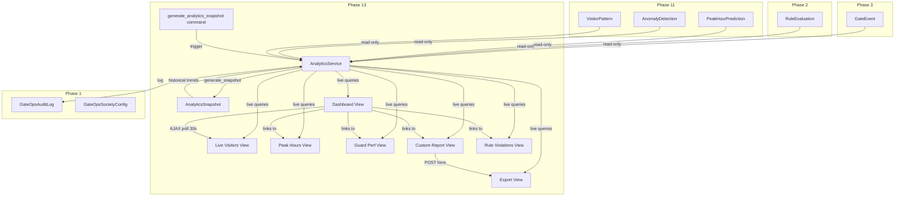
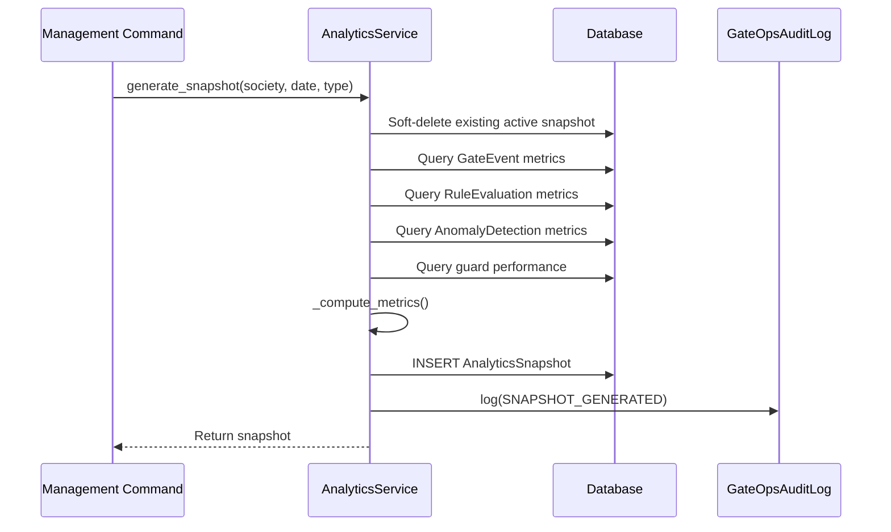
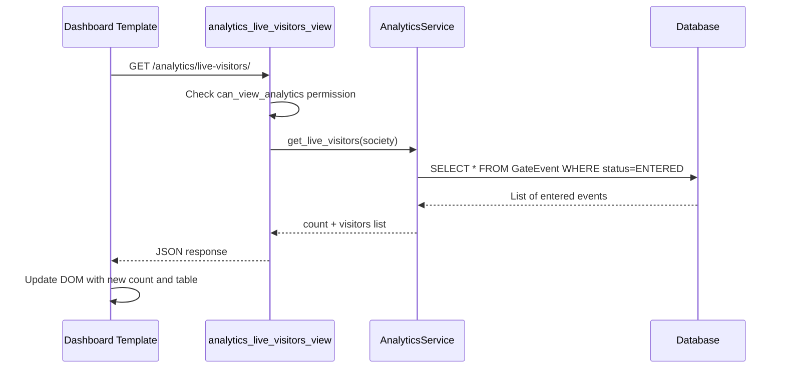

# Phase 13 — Analytics: Architecture & Technical Specification

> **Status:** Design Complete — Ready for Implementation
> **App:** `gateops`
> **Dependencies:** Phase 3 (GateEvent lifecycle), Phase 2 (Rule Engine / RuleEvaluation), Phase 4 (Pass Management), Phase 11 (AI Recommendation Engine — PeakHourPrediction, AnomalyDetection, VisitorPattern)
> **Migration:** `0012_analytics`

---

## Table of Contents

1. [Executive Summary](#1-executive-summary)
2. [Scope](#2-scope)
3. [Design Principles](#3-design-principles)
4. [New Models](#4-new-models)
   - 4.1 [`AnalyticsSnapshot`](#41-analyticssnapshot)
5. [Service Layer](#5-service-layer)
   - 5.1 [`AnalyticsService`](#51-analyticsservice)
6. [Views / URLs](#6-views--urls)
7. [Forms](#7-forms)
8. [Templates](#8-templates)
9. [Integration Points](#9-integration-points)
10. [Migration Plan](#10-migration-plan)
11. [Test Plan](#11-test-plan)
12. [Management Command](#12-management-command)
13. [File Structure](#13-file-structure)
14. [Business Invariants](#14-business-invariants)
15. [Open Questions / Future Enhancements](#15-open-questions--future-enhancements)
16. [Appendix: Mermaid — Full Phase 13 Flow](#appendix-mermaid--full-phase-13-flow)

---

## 1. Executive Summary

Phase 13 introduces a **read-only Analytics layer** for the GateOps platform. It aggregates data from five existing models — [`GateEvent`](gateops/models/model_GateEvent.py:10), [`RuleEvaluation`](gateops/models/model_RuleEvaluation.py:8), [`PeakHourPrediction`](gateops/models/model_PeakHourPrediction.py:7), [`AnomalyDetection`](gateops/models/model_AnomalyDetection.py:7), and [`VisitorPattern`](gateops/models/model_VisitorPattern.py:7) — and presents it through a server-rendered dashboard with Chart.js visualisations, CSV exports, and AJAX-polled live counters.

| Capability | Description |
|---|---|
| **Live Visitors** | Real-time count and filtered list of persons currently inside the society, with AJAX polling for auto-refresh. |
| **Peak-Hour Analysis** | Hourly visitor-traffic distribution for a selectable date range, overlaid with Phase 11 [`PeakHourPrediction`](gateops/models/model_PeakHourPrediction.py:7) data for comparison. |
| **Guard Performance** | Per-guard throughput metrics: entries processed, exits processed, average approval time, rule violations triggered. |
| **Custom Reports** | User-defined date-range reports with dimension filters (gate, visitor category, event type, status) and CSV export. |
| **Rule Violation Stats** | Aggregated counts of each [`RuleEvaluation.ActionTaken`](gateops/models/model_RuleEvaluation.py:29) value, top violated rules, and trend over time. |
| **Anomaly Stats** | Breakdown of [`AnomalyDetection`](gateops/models/model_AnomalyDetection.py:7) records by type, severity, and resolution status. |
| **Visitor Trends** | Daily/weekly/monthly entry-exit trends with comparison to Phase 11 [`VisitorPattern`](gateops/models/model_VisitorPattern.py:7) risk distribution. |
| **Historical Snapshots** | Pre-computed daily/weekly/monthly [`AnalyticsSnapshot`](#41-analyticssnapshot) rows generated by a management command for fast historical trend queries. |

### What Phase 13 does NOT do

- **Does not mutate any existing model.** All analytics queries are read-only `SELECT` operations against [`GateEvent`](gateops/models/model_GateEvent.py:10), [`RuleEvaluation`](gateops/models/model_RuleEvaluation.py:8), [`AnomalyDetection`](gateops/models/model_AnomalyDetection.py:7), [`VisitorPattern`](gateops/models/model_VisitorPattern.py:7), and [`PeakHourPrediction`](gateops/models/model_PeakHourPrediction.py:7).
- **Does not introduce real-time streaming.** Live data uses AJAX polling (every 30 seconds), not WebSockets or SSE.
- **Does not build a separate analytics database or data warehouse.** All queries run against the primary PostgreSQL database with appropriate indexes.
- **Does not implement PDF export.** CSV is the only export format in this phase; PDF is deferred to a future enhancement.
- **Does not implement role-based dashboard customisation.** All analytics views are available to any user with the `can_view_analytics` permission; per-widget visibility toggles are deferred.

---

## 2. Scope

### In Scope

| Item | Detail |
|---|---|
| **New model** | [`AnalyticsSnapshot`](#41-analyticssnapshot) — pre-computed aggregate metrics stored as JSON, with soft-delete. |
| **New service** | [`AnalyticsService`](#51-analyticsservice) — 10 methods covering all analytics queries + snapshot generation. |
| **New views** | 7 function-based views: dashboard, live-visitors, peak-hours, guard-performance, custom-report, rule-violations, export. |
| **New URLs** | 7 URL patterns under `/analytics/`. |
| **New forms** | 3 forms: `AnalyticsDateRangeForm`, `AnalyticsCustomReportForm`, `AnalyticsExportForm`. |
| **New templates** | 6 templates with Chart.js via CDN for bar/line/doughnut charts. |
| **New migration** | `0012_analytics.py` — creates `gateops_analyticssnapshot` table. |
| **New management command** | `generate_analytics_snapshot` — cron-driven daily/weekly/monthly snapshot generation. |
| **New tests** | 20+ test cases in `gateops/tests/test_analytics_service.py` and `gateops/tests/test_analytics_views.py`. |
| **Admin registration** | `AnalyticsSnapshotAdmin` with read-only metrics display. |
| **Permission** | New `can_view_analytics` permission added to [`GateOpsRole`](gateops/models/model_GateOpsRole.py) permissions text. |

### Out of Scope (deferred to later phases)

| Item | Deferred to |
|---|---|
| PDF report export | Future enhancement |
| Scheduled email reports | Phase 16 (Notification Enhancements) |
| Real-time WebSocket push | Future enhancement |
| Predictive staffing recommendations | Phase 17 (AI Prediction Service) |
| Occupancy heatmap | Phase 17 (AI Prediction Service) |
| Per-widget dashboard customisation | Future enhancement |
| Multi-society comparative analytics | Future enhancement (requires cross-society aggregation) |

---

## 3. Design Principles

1. **Read-only by default.** Analytics views never write to the database. The only write path is the `generate_analytics_snapshot` management command and the `AnalyticsService.generate_snapshot()` / `get_or_create_snapshot()` service methods, which operate exclusively on the [`AnalyticsSnapshot`](#41-analyticssnapshot) table.

2. **Live queries for real-time data; snapshots for historical trends.** Real-time dashboards (live visitors, current-day peak hours) query [`GateEvent`](gateops/models/model_GateEvent.py:10) directly. Historical trend charts (weekly/monthly visitor trends) read from pre-computed [`AnalyticsSnapshot`](#41-analyticssnapshot) rows for performance.

3. **Multi-tenant safety.** Every query is society-scoped. Every service method accepts `*, society` as its first keyword argument. Every view resolves the society via [`_selected_society_or_missing(request)`](gateops/views.py:197) before calling any service method. Cross-society data leakage is tested explicitly.

4. **Soft-delete pattern.** [`AnalyticsSnapshot`](#41-analyticssnapshot) follows the project convention: `is_active` + `deleted_at` inline fields (no mixin), `@property is_deleted`, custom `delete()` that sets `is_active=False` and `deleted_at=now()`. Matches [`ShiftHandover`](gateops/models/model_ShiftHandover.py:9), [`SecurityGuard`](gateops/models/model_SecurityGuard.py:9), [`Person`](gateops/models/model_Person.py:9), etc.

5. **Service-layer authority.** No view or template creates [`AnalyticsSnapshot`](#41-analyticssnapshot) rows directly. All snapshot operations go through [`AnalyticsService.generate_snapshot()`](#generate_snapshot) / [`AnalyticsService.get_or_create_snapshot()`](#get_or_create_snapshot).

6. **Chart.js via CDN.** No npm build step. Chart.js is loaded from `https://cdn.jsdelivr.net/npm/chart.js` in the `<head>` block of each analytics template. Data is passed from Django to JavaScript via `{{ data|json_script:"chart-data" }}` and read with `JSON.parse(document.getElementById('chart-data').textContent)`.

7. **CSV export first.** All exportable reports support CSV download via `HttpResponse(content_type="text/csv")` with `Content-Disposition: attachment`. No binary formats (PDF, Excel) in this phase.

8. **AJAX polling for live data.** The live-visitors view exposes a JSON endpoint that the dashboard template polls every 30 seconds via `fetch()`. No WebSocket or SSE.

9. **Append-only audit.** Snapshot generation is logged via [`GateOpsAuditLog.log()`](gateops/models/model_GateOpsAuditLog.py:82) with a new `SNAPSHOT_GENERATED` action.

10. **Additive migration.** Migration `0012_analytics.py` only creates the `gateops_analyticssnapshot` table. No existing table is altered.

---

## 4. New Models

### 4.1 `AnalyticsSnapshot`

**File:** `gateops/models/model_AnalyticsSnapshot.py`

Pre-computed aggregate metrics for a given `(society, date, snapshot_type)` tuple. Generated by the [`generate_analytics_snapshot`](#12-management-command) management command (daily at 23:59, weekly on Monday at 00:05, monthly on the 1st at 00:10). Used by historical trend charts to avoid expensive `GROUP BY` queries on large [`GateEvent`](gateops/models/model_GateEvent.py:10) tables.

```python
import uuid

from django.conf import settings
from django.core.exceptions import ValidationError
from django.db import models
from django.utils import timezone


class AnalyticsSnapshot(models.Model):
    """Pre-computed aggregate metrics for a society on a given date.

    Generated by the ``generate_analytics_snapshot`` management command.
    Read by ``AnalyticsService.get_visitor_trends()`` for historical charts.
    """

    class SnapshotType(models.TextChoices):
        DAILY = "DAILY", "Daily"
        WEEKLY = "WEEKLY", "Weekly"
        MONTHLY = "MONTHLY", "Monthly"
        CUSTOM = "CUSTOM", "Custom"

    id = models.BigAutoField(primary_key=True)
    snapshot_uuid = models.UUIDField(default=uuid.uuid4, editable=False, db_index=True)

    society = models.ForeignKey(
        settings.AUTH_USER_MODEL,
        on_delete=models.CASCADE,
        related_name="gateops_analytics_snapshots",
    )
    # The date this snapshot covers. For DAILY, this is the calendar date.
    # For WEEKLY, this is the Monday of the week. For MONTHLY, the 1st of the month.
    date = models.DateField()
    snapshot_type = models.CharField(
        max_length=10,
        choices=SnapshotType.choices,
        default=SnapshotType.DAILY,
    )

    # The actual metrics — a JSON field so we can evolve the schema without
    # migrations. See "Metrics JSON Schema" below for the expected structure.
    metrics = models.JSONField(default=dict)

    generated_at = models.DateTimeField(default=timezone.now)

    # --- Soft-delete pattern (inline, no mixin) ---
    is_active = models.BooleanField(default=True)
    deleted_at = models.DateTimeField(null=True, blank=True)

    created_at = models.DateTimeField(auto_now_add=True)
    updated_at = models.DateTimeField(auto_now=True)

    class Meta:
        ordering = ["-date", "-generated_at"]
        verbose_name = "Analytics Snapshot"
        verbose_name_plural = "Analytics Snapshots"
        constraints = [
            models.UniqueConstraint(
                fields=["society", "date", "snapshot_type"],
                condition=models.Q(is_active=True),
                name="unique_active_analytics_snapshot",
            ),
        ]
        indexes = [
            models.Index(fields=["society", "date"], name="analytics_snap_society_date"),
            models.Index(fields=["society", "snapshot_type"], name="analytics_snap_type"),
            models.Index(fields=["society", "-generated_at"], name="analytics_snap_generated"),
        ]

    def __str__(self):
        return f"{self.society} — {self.get_snapshot_type_display()} — {self.date}"

    @property
    def is_deleted(self) -> bool:
        return not self.is_active

    def clean(self):
        super().clean()
        if self.snapshot_type == self.SnapshotType.WEEKLY and self.date.weekday() != 0:
            raise ValidationError({"date": "Weekly snapshots must have a Monday date."})
        if self.snapshot_type == self.SnapshotType.MONTHLY and self.date.day != 1:
            raise ValidationError({"date": "Monthly snapshots must have the 1st of the month."})

    def delete(self, *args, **kwargs):
        """Soft-delete: set is_active=False and deleted_at=now()."""
        if not self.is_active:
            return
        self.is_active = False
        self.deleted_at = timezone.now()
        self.save(update_fields=["is_active", "deleted_at", "updated_at"])
```

#### Metrics JSON Schema

The `metrics` JSONField stores a dictionary with the following keys. All keys are optional — a snapshot may contain any subset depending on `snapshot_type` and available data.

```json
{
  "total_entries": 150,
  "total_exits": 145,
  "currently_inside": 5,
  "auto_closed": 3,
  "rejected": 2,
  "cancelled": 1,
  "expired": 0,
  "by_visitor_category": {
    "Guest": 40,
    "Delivery": 60,
    "Contractor": 30,
    "Service Staff": 20
  },
  "by_gate": {
    "Main Gate": 100,
    "Service Gate": 50
  },
  "by_event_type": {
    "VISITOR": 120,
    "CONTRACTOR": 30
  },
  "by_status": {
    "ENTERED": 150,
    "EXITED": 145,
    "AUTO_CLOSED": 3,
    "REJECTED": 2
  },
  "hourly_distribution": {
    "0": 0, "1": 0, "2": 0, "3": 0, "4": 0, "5": 2,
    "6": 5, "7": 12, "8": 25, "9": 20, "10": 15, "11": 18,
    "12": 10, "13": 8, "14": 12, "15": 15, "16": 10, "17": 8,
    "18": 5, "19": 3, "20": 2, "21": 0, "22": 0, "23": 0
  },
  "rule_evaluations": 148,
  "rule_actions": {
    "AUTO_APPROVE": 80,
    "REQUIRE_APPROVAL": 40,
    "REJECT": 10,
    "NO_MATCH": 15,
    "ERROR": 3
  },
  "anomalies_detected": 5,
  "anomalies_by_type": {
    "FORGOTTEN_EXIT": 2,
    "AFTER_HOURS_ENTRY": 1,
    "LONG_STAY": 2
  },
  "anomalies_by_severity": {
    "LOW": 2,
    "MEDIUM": 2,
    "HIGH": 1,
    "CRITICAL": 0
  },
  "guard_performance": [
    {
      "guard_id": 1,
      "guard_name": "Ram Singh",
      "entries_processed": 80,
      "exits_processed": 75,
      "approvals_given": 30,
      "rejections_given": 5,
      "rule_violations_triggered": 3,
      "avg_approval_time_seconds": 45.2
    }
  ],
  "peak_hour": 8,
  "peak_hour_count": 25,
  "avg_daily_visitors": 150.0,
  "total_passes_validated": 20,
  "total_passes_issued": 5
}
```

#### TextChoices

```python
class SnapshotType(models.TextChoices):
    DAILY = "DAILY", "Daily"
    WEEKLY = "WEEKLY", "Weekly"
    MONTHLY = "MONTHLY", "Monthly"
    CUSTOM = "CUSTOM", "Custom"
```

#### Meta

| Attribute | Value |
|---|---|
| `ordering` | `["-date", "-generated_at"]` |
| `verbose_name` | `"Analytics Snapshot"` |
| `verbose_name_plural` | `"Analytics Snapshots"` |
| `constraints` | `UniqueConstraint(fields=["society", "date", "snapshot_type"], condition=Q(is_active=True), name="unique_active_analytics_snapshot")` |
| `indexes` | `(society, date)`, `(society, snapshot_type)`, `(society, -generated_at)` |

#### `__str__`

```python
def __str__(self):
    return f"{self.society} — {self.get_snapshot_type_display()} — {self.date}"
```

#### `clean()` validation

- `WEEKLY` snapshots must have a Monday `date` (`date.weekday() == 0`).
- `MONTHLY` snapshots must have the 1st of the month (`date.day == 1`).
- `DAILY` and `CUSTOM` snapshots have no date constraint.

#### `save()`

No custom `save()` override needed. The `UniqueConstraint` with `condition=Q(is_active=True)` ensures only one active snapshot per `(society, date, snapshot_type)` tuple. Soft-deleted snapshots are excluded from the constraint, allowing re-generation.

#### Soft-delete

```python
def delete(self, *args, **kwargs):
    """Soft-delete: set is_active=False and deleted_at=now()."""
    if not self.is_active:
        return
    self.is_active = False
    self.deleted_at = timezone.now()
    self.save(update_fields=["is_active", "deleted_at", "updated_at"])
```

This matches the pattern in [`ShiftHandover`](gateops/models/model_ShiftHandover.py:9), [`SecurityGuard`](gateops/models/model_SecurityGuard.py:9), [`Person`](gateops/models/model_Person.py:9), and all other soft-delete models in the project.

---

## 5. Service Layer

### 5.1 `AnalyticsService`

**File:** `gateops/services/analytics_service.py`

All methods are `@staticmethod` with keyword-only arguments, matching the convention in [`ExitManagementService`](gateops/services/exit_management_service.py:51), [`ContractorService`](gateops/services/contractor_service.py:83), and [`AIRecommendationService`](gateops/services/ai_recommendation_service.py).

```python
"""Service layer for analytics (Phase 13 — Analytics).

Read-only queries against GateEvent, RuleEvaluation, AnomalyDetection,
VisitorPattern, and PeakHourPrediction. Snapshot generation writes only
to the AnalyticsSnapshot table.
"""

import csv
import json
from datetime import timedelta

from django.db import transaction
from django.db.models import Count, Q, Avg
from django.utils import timezone

from gateops.models import (
    AnalyticsSnapshot,
    AnomalyDetection,
    GateEvent,
    PeakHourPrediction,
    RuleEvaluation,
    VisitorPattern,
)
from gateops.models.model_GateOpsAuditLog import GateOpsAuditLog


class AnalyticsService:
    """Read-only analytics queries + snapshot generation.

    All methods accept ``*, society`` as the first keyword argument
    for multi-tenant safety. No method mutates any model other than
    AnalyticsSnapshot.
    """
```

---

##### `get_live_visitors(*, society, gate=None, visitor_category=None) -> dict`

Returns real-time data about persons currently inside the society. Queries [`GateEvent`](gateops/models/model_GateEvent.py:10) for events with `status=ENTERED` (entered but not yet exited). This is the data source for the AJAX-polled live counter on the dashboard.

**Parameters:**

| Parameter | Type | Required | Default | Description |
|---|---|---|---|---|
| `society` | `Society` | Yes | — | The society scope. |
| `gate` | `Gate` | No | `None` | Filter by entry gate. |
| `visitor_category` | `VisitorCategory` | No | `None` | Filter by visitor category. |

**Returns:**

```python
{
    "count": 5,
    "visitors": [
        {
            "gate_event_id": 42,
            "gate_event_uuid": "abc-123-...",
            "person_name": "Raj Kumar",
            "person_id": 10,
            "visitor_category": "Guest",
            "gate_name": "Main Gate",
            "gate_id": 1,
            "entered_at": "2026-07-12T10:30:00+05:30",
            "duration_minutes": 90,
            "event_type": "VISITOR",
            "vehicle_number": "MH12 AB 1234",
        },
        # ...
    ],
}
```

**Query logic:**

```python
@staticmethod
def get_live_visitors(*, society, gate=None, visitor_category=None) -> dict:
    now = timezone.now()
    qs = (
        GateEvent.objects.filter(
            society=society,
            status=GateEvent.Status.ENTERED,
            is_active=True,
        )
        .select_related("person", "gate", "visitor_category", "gate_vehicle")
        .order_by("-entered_at")
    )
    if gate is not None:
        qs = qs.filter(gate=gate)
    if visitor_category is not None:
        qs = qs.filter(visitor_category=visitor_category)

    visitors = []
    for event in qs:
        duration = (now - event.entered_at).total_seconds() / 60 if event.entered_at else 0
        visitors.append({
            "gate_event_id": event.id,
            "gate_event_uuid": str(event.gate_uuid),
            "person_name": event.person.full_name if event.person else "Unknown",
            "person_id": event.person_id,
            "visitor_category": event.visitor_category.name if event.visitor_category else None,
            "gate_name": event.gate.name if event.gate else None,
            "gate_id": event.gate_id,
            "entered_at": event.entered_at.isoformat() if event.entered_at else None,
            "duration_minutes": round(duration),
            "event_type": event.event_type,
            "vehicle_number": event.gate_vehicle.vehicle_number if event.gate_vehicle else None,
        })

    return {"count": len(visitors), "visitors": visitors}
```

**Indexes used:** `(society, status)` on `GateEvent`, `select_related` on `person`, `gate`, `visitor_category`, `gate_vehicle`.

---

##### `get_peak_hours(*, society, start_date, end_date, gate=None) -> dict`

Returns hourly visitor-traffic distribution for the given date range, overlaid with Phase 11 [`PeakHourPrediction`](gateops/models/model_PeakHourPrediction.py:7) data for comparison.

**Parameters:**

| Parameter | Type | Required | Default | Description |
|---|---|---|---|---|
| `society` | `Society` | Yes | — | The society scope. |
| `start_date` | `date` | Yes | — | Start of the date range (inclusive). |
| `end_date` | `date` | Yes | — | End of the date range (inclusive). |
| `gate` | `Gate` | No | `None` | Filter by gate. |

**Returns:**

```python
{
    "actual": {
        "0": 0, "1": 0, "2": 0, "3": 0, "4": 0, "5": 2,
        "6": 5, "7": 12, "8": 25, "9": 20, "10": 15, "11": 18,
        "12": 10, "13": 8, "14": 12, "15": 15, "16": 10, "17": 8,
        "18": 5, "19": 3, "20": 2, "21": 0, "22": 0, "23": 0
    },
    "predicted": {
        "0": 0, "1": 0, "2": 0, "3": 0, "4": 1, "5": 3,
        "6": 6, "7": 14, "8": 28, "9": 22, "10": 16, "11": 15,
        "12": 12, "13": 10, "14": 14, "15": 18, "16": 12, "17": 10,
        "18": 6, "19": 4, "20": 2, "21": 1, "22": 0, "23": 0
    },
    "peak_hour": 8,
    "peak_hour_count": 25,
    "total_entries": 150,
    "date_range": {"start": "2026-07-05", "end": "2026-07-12"},
}
```

**Query logic:**

```python
@staticmethod
def get_peak_hours(*, society, start_date, end_date, gate=None) -> dict:
    # --- Actual: GROUP BY hour of entered_at ---
    qs = GateEvent.objects.filter(
        society=society,
        status__in=[GateEvent.Status.ENTERED, GateEvent.Status.EXITED, GateEvent.Status.AUTO_CLOSED],
        is_active=True,
        entered_at__date__gte=start_date,
        entered_at__date__lte=end_date,
    )
    if gate is not None:
        qs = qs.filter(gate=gate)

    actual = {str(h): 0 for h in range(24)}
    for event in qs:
        if event.entered_at:
            actual[str(event.entered_at.hour)] += 1

    total_entries = sum(actual.values())
    peak_hour = max(actual, key=actual.get) if total_entries > 0 else 0
    peak_hour_count = actual[peak_hour] if total_entries > 0 else 0

    # --- Predicted: average PeakHourPrediction across matching days ---
    # Collect all day_of_week values in the date range
    days_in_range = set()
    current = start_date
    while current <= end_date:
        days_in_range.add(current.weekday())
        current += timedelta(days=1)

    predicted_qs = PeakHourPrediction.objects.filter(
        society=society,
        day_of_week__in=list(days_in_range),
        is_active=True,
    )
    predicted = {str(h): 0 for h in range(24)}
    day_count = len(days_in_range)
    if day_count > 0:
        for pred in predicted_qs:
            predicted[str(pred.hour)] += pred.predicted_count
        # Average across the number of distinct days
        for h in range(24):
            predicted[str(h)] = round(predicted[str(h)] / day_count, 1)

    return {
        "actual": actual,
        "predicted": predicted,
        "peak_hour": int(peak_hour),
        "peak_hour_count": peak_hour_count,
        "total_entries": total_entries,
        "date_range": {"start": start_date.isoformat(), "end": end_date.isoformat()},
    }
```

**Indexes used:** `(society, entered_at)` on `GateEvent`, `(society, day_of_week)` on `PeakHourPrediction`.

---

##### `get_guard_performance(*, society, start_date, end_date, guard=None) -> dict`

Returns per-guard throughput metrics for the given date range.

**Parameters:**

| Parameter | Type | Required | Default | Description |
|---|---|---|---|---|
| `society` | `Society` | Yes | — | The society scope. |
| `start_date` | `date` | Yes | — | Start of the date range (inclusive). |
| `end_date` | `date` | Yes | — | End of the date range (inclusive). |
| `guard` | `SecurityGuard` | No | `None` | Filter to a single guard. |

**Returns:**

```python
{
    "guards": [
        {
            "guard_id": 1,
            "guard_name": "Ram Singh",
            "entries_processed": 80,
            "exits_processed": 75,
            "approvals_given": 30,
            "rejections_given": 5,
            "rule_violations_triggered": 3,
            "avg_approval_time_seconds": 45.2,
        },
        # ...
    ],
    "totals": {
        "entries_processed": 150,
        "exits_processed": 145,
        "approvals_given": 60,
        "rejections_given": 10,
        "rule_violations_triggered": 5,
    },
}
```

**Query logic:**

```python
@staticmethod
def get_guard_performance(*, society, start_date, end_date, guard=None) -> dict:
    from gateops.models import SecurityGuard

    guards_qs = SecurityGuard.objects.filter(society=society, is_active=True)
    if guard is not None:
        guards_qs = guards_qs.filter(pk=guard.pk)

    # Entries: GateEvents where guard processed the entry
    entries_qs = GateEvent.objects.filter(
        society=society,
        is_active=True,
        entered_at__date__gte=start_date,
        entered_at__date__lte=end_date,
    ).values("guard").annotate(count=Count("id"))

    # Exits: GateEvents where guard processed the exit
    exits_qs = GateEvent.objects.filter(
        society=society,
        is_active=True,
        exited_at__date__gte=start_date,
        exited_at__date__lte=end_date,
    ).values("guard").annotate(count=Count("id"))

    # Approvals/Rejections: GateEventApproval records
    from gateops.models import GateEventApproval
    approvals_qs = GateEventApproval.objects.filter(
        gate_event__society=society,
        gate_event__is_active=True,
        decided_at__date__gte=start_date,
        decided_at__date__lte=end_date,
        decision="APPROVED",
    ).values("guard").annotate(count=Count("id"))

    rejections_qs = GateEventApproval.objects.filter(
        gate_event__society=society,
        gate_event__is_active=True,
        decided_at__date__gte=start_date,
        decided_at__date__lte=end_date,
        decision="REJECTED",
    ).values("guard").annotate(count=Count("id"))

    # Rule violations: RuleEvaluations linked to events processed by this guard
    violations_qs = RuleEvaluation.objects.filter(
        society=society,
        gate_event__guard__isnull=False,
        gate_event__is_active=True,
        evaluated_at__date__gte=start_date,
        evaluated_at__date__lte=end_date,
    ).exclude(
        action_taken__in=[RuleEvaluation.ActionTaken.AUTO_APPROVE, RuleEvaluation.ActionTaken.NO_MATCH]
    ).values("gate_event__guard").annotate(count=Count("id"))

    # Average approval time: time from arrived_at to approved_at
    avg_approval_qs = GateEvent.objects.filter(
        society=society,
        is_active=True,
        approved_at__isnull=False,
        arrived_at__isnull=False,
        approved_at__date__gte=start_date,
        approved_at__date__lte=end_date,
    ).values("guard").annotate(avg_time=Avg("approved_at") - Avg("arrived_at"))

    # Build lookup dicts
    entries_map = {item["guard"]: item["count"] for item in entries_qs}
    exits_map = {item["guard"]: item["count"] for item in exits_qs}
    approvals_map = {item["guard"]: item["count"] for item in approvals_qs}
    rejections_map = {item["guard"]: item["count"] for item in rejections_qs}
    violations_map = {item["gate_event__guard"]: item["count"] for item in violations_qs}
    avg_time_map = {item["guard"]: item["avg_time"] for item in avg_approval_qs}

    guards = []
    totals = {
        "entries_processed": 0,
        "exits_processed": 0,
        "approvals_given": 0,
        "rejections_given": 0,
        "rule_violations_triggered": 0,
    }

    for g in guards_qs:
        g_id = g.id
        avg_seconds = None
        if g_id in avg_time_map and avg_time_map[g_id] is not None:
            avg_seconds = avg_time_map[g_id].total_seconds()

        entry = {
            "guard_id": g_id,
            "guard_name": g.full_name,
            "entries_processed": entries_map.get(g_id, 0),
            "exits_processed": exits_map.get(g_id, 0),
            "approvals_given": approvals_map.get(g_id, 0),
            "rejections_given": rejections_map.get(g_id, 0),
            "rule_violations_triggered": violations_map.get(g_id, 0),
            "avg_approval_time_seconds": round(avg_seconds, 1) if avg_seconds else None,
        }
        guards.append(entry)
        for key in totals:
            totals[key] += entry[key]

    return {"guards": guards, "totals": totals}
```

---

##### `get_custom_report(*, society, start_date, end_date, gate=None, visitor_category=None, event_type=None, status=None) -> dict`

Returns a flexible, user-filtered report of gate events for the given date range.

**Parameters:**

| Parameter | Type | Required | Default | Description |
|---|---|---|---|---|
| `society` | `Society` | Yes | — | The society scope. |
| `start_date` | `date` | Yes | — | Start of the date range (inclusive). |
| `end_date` | `date` | Yes | — | End of the date range (inclusive). |
| `gate` | `Gate` | No | `None` | Filter by gate. |
| `visitor_category` | `VisitorCategory` | No | `None` | Filter by visitor category. |
| `event_type` | `str` | No | `None` | Filter by `GateEvent.EventType` value. |
| `status` | `str` | No | `None` | Filter by `GateEvent.Status` value. |

**Returns:**

```python
{
    "events": [
        {
            "gate_event_id": 42,
            "gate_event_uuid": "abc-123-...",
            "person_name": "Raj Kumar",
            "visitor_category": "Guest",
            "gate_name": "Main Gate",
            "event_type": "VISITOR",
            "status": "EXITED",
            "direction": "IN",
            "arrived_at": "2026-07-12T10:25:00+05:30",
            "entered_at": "2026-07-12T10:30:00+05:30",
            "exited_at": "2026-07-12T12:00:00+05:30",
            "duration_minutes": 90,
            "vehicle_number": "MH12 AB 1234",
        },
        # ...
    ],
    "summary": {
        "total_events": 150,
        "by_status": {"ENTERED": 5, "EXITED": 140, "AUTO_CLOSED": 3, "REJECTED": 2},
        "by_visitor_category": {"Guest": 40, "Delivery": 60, "Contractor": 30, "Service Staff": 20},
        "by_gate": {"Main Gate": 100, "Service Gate": 50},
    },
    "filters": {
        "start_date": "2026-07-05",
        "end_date": "2026-07-12",
        "gate": "Main Gate",
        "visitor_category": "Guest",
        "event_type": "VISITOR",
        "status": "EXITED",
    },
}
```

**Query logic:**

```python
@staticmethod
def get_custom_report(*, society, start_date, end_date, gate=None,
                       visitor_category=None, event_type=None, status=None) -> dict:
    qs = AnalyticsService._apply_date_range(
        GateEvent.objects.filter(society=society, is_active=True),
        start_date, end_date,
    )
    qs = AnalyticsService._apply_filters(
        qs, gate=gate, visitor_category=visitor_category,
        event_type=event_type, status=status,
    )
    qs = qs.select_related("person", "gate", "visitor_category", "gate_vehicle").order_by("-entered_at")

    events = []
    for event in qs:
        duration = None
        if event.entered_at and event.exited_at:
            duration = (event.exited_at - event.entered_at).total_seconds() / 60
        events.append({
            "gate_event_id": event.id,
            "gate_event_uuid": str(event.gate_uuid),
            "person_name": event.person.full_name if event.person else "Unknown",
            "visitor_category": event.visitor_category.name if event.visitor_category else None,
            "gate_name": event.gate.name if event.gate else None,
            "event_type": event.event_type,
            "status": event.status,
            "direction": event.direction,
            "arrived_at": event.arrived_at.isoformat() if event.arrived_at else None,
            "entered_at": event.entered_at.isoformat() if event.entered_at else None,
            "exited_at": event.exited_at.isoformat() if event.exited_at else None,
            "duration_minutes": round(duration) if duration else None,
            "vehicle_number": event.gate_vehicle.vehicle_number if event.gate_vehicle else None,
        })

    # Summary aggregates
    by_status = dict(qs.values_list("status").annotate(c=Count("id")).values_list("status", "c"))
    by_category = dict(
        qs.exclude(visitor_category__isnull=True)
        .values("visitor_category__name")
        .annotate(c=Count("id"))
        .values_list("visitor_category__name", "c")
    )
    by_gate = dict(
        qs.exclude(gate__isnull=True)
        .values("gate__name")
        .annotate(c=Count("id"))
        .values_list("gate__name", "c")
    )

    return {
        "events": events,
        "summary": {
            "total_events": len(events),
            "by_status": by_status,
            "by_visitor_category": by_category,
            "by_gate": by_gate,
        },
        "filters": {
            "start_date": start_date.isoformat(),
            "end_date": end_date.isoformat(),
            "gate": gate.name if gate else None,
            "visitor_category": visitor_category.name if visitor_category else None,
            "event_type": event_type,
            "status": status,
        },
    }
```

---

##### `get_rule_violation_stats(*, society, start_date, end_date) -> dict`

Returns aggregated counts of each [`RuleEvaluation.ActionTaken`](gateops/models/model_RuleEvaluation.py:29) value, top violated rules, and trend over time.

**Parameters:**

| Parameter | Type | Required | Default | Description |
|---|---|---|---|---|
| `society` | `Society` | Yes | — | The society scope. |
| `start_date` | `date` | Yes | — | Start of the date range (inclusive). |
| `end_date` | `date` | Yes | — | End of the date range (inclusive). |

**Returns:**

```python
{
    "total_evaluations": 148,
    "by_action": {
        "AUTO_APPROVE": 80,
        "REQUIRE_APPROVAL": 40,
        "REJECT": 10,
        "NO_MATCH": 15,
        "ERROR": 3
    },
    "top_violated_rules": [
        {"rule_id": 5, "rule_name": "After-hours visitor block", "violation_count": 8},
        {"rule_id": 3, "rule_name": "Blacklist check", "violation_count": 5},
        # ...
    ],
    "daily_trend": {
        "2026-07-05": 20,
        "2026-07-06": 18,
        # ...
    },
    "error_count": 3,
    "avg_execution_time_ms": 12.5,
}
```

**Query logic:**

```python
@staticmethod
def get_rule_violation_stats(*, society, start_date, end_date) -> dict:
    qs = RuleEvaluation.objects.filter(
        society=society,
        evaluated_at__date__gte=start_date,
        evaluated_at__date__lte=end_date,
    )

    by_action = dict(qs.values("action_taken").annotate(c=Count("id")).values_list("action_taken", "c"))

    # Top violated rules: rules with most non-AUTO_APPROVE, non-NO_MATCH evaluations
    violation_actions = [
        RuleEvaluation.ActionTaken.REJECT,
        RuleEvaluation.ActionTaken.REQUIRE_APPROVAL,
        RuleEvaluation.ActionTaken.REQUIRE_RESIDENT_APPROVAL,
        RuleEvaluation.ActionTaken.FLAG_FOR_REVIEW,
        RuleEvaluation.ActionTaken.ESCALATE,
        RuleEvaluation.ActionTaken.EMERGENCY_OVERRIDE,
    ]
    top_rules = (
        qs.filter(action_taken__in=violation_actions, rule__isnull=False)
        .values("rule__id", "rule__name")
        .annotate(violation_count=Count("id"))
        .order_by("-violation_count")[:10]
    )
    top_violated = [
        {"rule_id": item["rule__id"], "rule_name": item["rule__name"], "violation_count": item["violation_count"]}
        for item in top_rules
    ]

    # Daily trend
    daily = dict(
        qs.values("evaluated_at__date")
        .annotate(c=Count("id"))
        .values_list("evaluated_at__date", "c")
    )
    daily_trend = {k.isoformat(): v for k, v in sorted(daily.items())}

    error_count = qs.filter(action_taken=RuleEvaluation.ActionTaken.ERROR).count()
    avg_time = qs.aggregate(avg=Avg("execution_time_ms"))["avg"]

    return {
        "total_evaluations": qs.count(),
        "by_action": by_action,
        "top_violated_rules": top_violated,
        "daily_trend": daily_trend,
        "error_count": error_count,
        "avg_execution_time_ms": round(avg_time, 2) if avg_time else None,
    }
```

---

##### `get_anomaly_stats(*, society, start_date, end_date) -> dict`

Returns breakdown of [`AnomalyDetection`](gateops/models/model_AnomalyDetection.py:7) records by type, severity, and resolution status.

**Parameters:**

| Parameter | Type | Required | Default | Description |
|---|---|---|---|---|
| `society` | `Society` | Yes | — | The society scope. |
| `start_date` | `date` | Yes | — | Start of the date range (inclusive). |
| `end_date` | `date` | Yes | — | End of the date range (inclusive). |

**Returns:**

```python
{
    "total_anomalies": 5,
    "by_type": {
        "FORGOTTEN_EXIT": 2,
        "AFTER_HOURS_ENTRY": 1,
        "LONG_STAY": 2
    },
    "by_severity": {
        "LOW": 2,
        "MEDIUM": 2,
        "HIGH": 1,
        "CRITICAL": 0
    },
    "by_status": {
        "OPEN": 2,
        "ACKNOWLEDGED": 1,
        "RESOLVED": 2,
        "FALSE_POSITIVE": 0
    },
    "resolution_rate": 40.0,
    "critical_open": 0,
}
```

**Query logic:**

```python
@staticmethod
def get_anomaly_stats(*, society, start_date, end_date) -> dict:
    qs = AnomalyDetection.objects.filter(
        society=society,
        is_active=True,
        detected_at__date__gte=start_date,
        detected_at__date__lte=end_date,
    )

    total = qs.count()
    by_type = dict(qs.values("anomaly_type").annotate(c=Count("id")).values_list("anomaly_type", "c"))
    by_severity = dict(qs.values("severity").annotate(c=Count("id")).values_list("severity", "c"))
    by_status = dict(qs.values("status").annotate(c=Count("id")).values_list("status", "c"))

    resolved = by_status.get(AnomalyDetection.Status.RESOLVED, 0)
    false_positive = by_status.get(AnomalyDetection.Status.FALSE_POSITIVE, 0)
    resolution_rate = round(((resolved + false_positive) / total * 100), 1) if total > 0 else 0.0

    critical_open = qs.filter(
        severity=AnomalyDetection.Severity.CRITICAL,
        status=AnomalyDetection.Status.OPEN,
    ).count()

    return {
        "total_anomalies": total,
        "by_type": by_type,
        "by_severity": by_severity,
        "by_status": by_status,
        "resolution_rate": resolution_rate,
        "critical_open": critical_open,
    }
```

---

##### `get_visitor_trends(*, society, start_date, end_date, granularity="DAILY") -> dict`

Returns daily/weekly/monthly entry-exit trends. For `DAILY` granularity with a range ≤ 31 days, this queries [`GateEvent`](gateops/models/model_GateEvent.py:10) directly. For `WEEKLY` or `MONTHLY` granularity, or ranges > 31 days, it reads from pre-computed [`AnalyticsSnapshot`](#41-analyticssnapshot) rows for performance.

**Parameters:**

| Parameter | Type | Required | Default | Description |
|---|---|---|---|---|
| `society` | `Society` | Yes | — | The society scope. |
| `start_date` | `date` | Yes | — | Start of the date range (inclusive). |
| `end_date` | `date` | Yes | — | End of the date range (inclusive). |
| `granularity` | `str` | No | `"DAILY"` | One of `"DAILY"`, `"WEEKLY"`, `"MONTHLY"`. |

**Returns:**

```python
{
    "granularity": "DAILY",
    "data_points": [
        {"date": "2026-07-05", "entries": 20, "exits": 18, "auto_closed": 0, "rejected": 1},
        {"date": "2026-07-06", "entries": 25, "exits": 24, "auto_closed": 1, "rejected": 0},
        # ...
    ],
    "risk_distribution": {
        "LOW": 120,
        "MEDIUM": 25,
        "HIGH": 4,
        "CRITICAL": 1
    },
    "totals": {
        "entries": 150,
        "exits": 145,
        "auto_closed": 3,
        "rejected": 2,
    },
}
```

**Query logic:**

```python
@staticmethod
def get_visitor_trends(*, society, start_date, end_date, granularity="DAILY") -> dict:
    range_days = (end_date - start_date).days + 1

    if granularity == "DAILY" and range_days <= 31:
        # Live query for short ranges
        data_points = []
        current = start_date
        while current <= end_date:
            day_qs = GateEvent.objects.filter(
                society=society,
                is_active=True,
                entered_at__date=current,
            )
            entries = day_qs.filter(status__in=[
                GateEvent.Status.ENTERED, GateEvent.Status.EXITED, GateEvent.Status.AUTO_CLOSED
            ]).count()
            exits = day_qs.filter(status__in=[GateEvent.Status.EXITED, GateEvent.Status.AUTO_CLOSED]).count()
            auto_closed = day_qs.filter(status=GateEvent.Status.AUTO_CLOSED).count()
            rejected = day_qs.filter(status=GateEvent.Status.REJECTED).count()
            data_points.append({
                "date": current.isoformat(),
                "entries": entries,
                "exits": exits,
                "auto_closed": auto_closed,
                "rejected": rejected,
            })
            current += timedelta(days=1)
    else:
        # Read from pre-computed snapshots
        snapshots = AnalyticsSnapshot.objects.filter(
            society=society,
            is_active=True,
            date__gte=start_date,
            date__lte=end_date,
            snapshot_type=granularity,
        ).order_by("date")

        data_points = []
        for snap in snapshots:
            m = snap.metrics
            data_points.append({
                "date": snap.date.isoformat(),
                "entries": m.get("total_entries", 0),
                "exits": m.get("total_exits", 0),
                "auto_closed": m.get("auto_closed", 0),
                "rejected": m.get("rejected", 0),
            })

    # Risk distribution from VisitorPattern
    risk_qs = VisitorPattern.objects.filter(society=society, is_active=True)
    risk_distribution = dict(
        risk_qs.values("risk_level").annotate(c=Count("id")).values_list("risk_level", "c")
    )

    totals = {
        "entries": sum(dp["entries"] for dp in data_points),
        "exits": sum(dp["exits"] for dp in data_points),
        "auto_closed": sum(dp["auto_closed"] for dp in data_points),
        "rejected": sum(dp["rejected"] for dp in data_points),
    }

    return {
        "granularity": granularity,
        "data_points": data_points,
        "risk_distribution": risk_distribution,
        "totals": totals,
    }
```

---

##### `generate_snapshot(*, society, date, snapshot_type="DAILY", actor=None) -> AnalyticsSnapshot`

Generates and saves a new [`AnalyticsSnapshot`](#41-analyticssnapshot) for the given date and type. If an active snapshot already exists for the same `(society, date, snapshot_type)`, it is soft-deleted first (the new one replaces it). This method is the only write path for the analytics module.

**Parameters:**

| Parameter | Type | Required | Default | Description |
|---|---|---|---|---|
| `society` | `Society` | Yes | — | The society scope. |
| `date` | `date` | Yes | — | The date to snapshot. |
| `snapshot_type` | `str` | No | `"DAILY"` | One of `SnapshotType` values. |
| `actor` | `User` | No | `None` | The user who triggered the generation (for audit log). |

**Returns:** The created [`AnalyticsSnapshot`](#41-analyticssnapshot) instance.

**Query logic:**

```python
@staticmethod
@transaction.atomic
def generate_snapshot(*, society, date, snapshot_type=AnalyticsSnapshot.SnapshotType.DAILY, actor=None) -> AnalyticsSnapshot:
    # Soft-delete any existing active snapshot for this tuple
    AnalyticsSnapshot.objects.filter(
        society=society,
        date=date,
        snapshot_type=snapshot_type,
        is_active=True,
    ).update(is_active=False, deleted_at=timezone.now())

    # Compute the date range for this snapshot
    if snapshot_type == AnalyticsSnapshot.SnapshotType.DAILY:
        start = date
        end = date
    elif snapshot_type == AnalyticsSnapshot.SnapshotType.WEEKLY:
        start = date  # date is already a Monday (validated by clean())
        end = date + timedelta(days=6)
    elif snapshot_type == AnalyticsSnapshot.SnapshotType.MONTHLY:
        start = date  # date is the 1st
        # End of month: go to next month, subtract 1 day
        if date.month == 12:
            end = date.replace(day=31)
        else:
            end = date.replace(month=date.month + 1) - timedelta(days=1)
    else:
        start = date
        end = date

    # Gather metrics
    metrics = AnalyticsService._compute_metrics(society=society, start_date=start, end_date=end)

    snapshot = AnalyticsSnapshot.objects.create(
        society=society,
        date=date,
        snapshot_type=snapshot_type,
        metrics=metrics,
        generated_at=timezone.now(),
    )

    # Audit log
    try:
        GateOpsAuditLog.log(
            society=society,
            action=GateOpsAuditLog.Action.SNAPSHOT_GENERATED,
            entity_type="AnalyticsSnapshot",
            entity_id=snapshot.id,
            before_value=None,
            after_value={"snapshot_type": snapshot_type, "date": date.isoformat()},
            actor=actor,
        )
    except Exception:
        pass  # Audit log failure must not block snapshot creation

    return snapshot
```

---

##### `get_or_create_snapshot(*, society, date, snapshot_type="DAILY", actor=None) -> AnalyticsSnapshot`

Returns the existing active snapshot for the given `(society, date, snapshot_type)` if one exists, otherwise generates a new one. This is the idempotent entry point used by the management command and by views that need historical data.

**Parameters:** Same as [`generate_snapshot`](#generate_snapshot).

**Returns:** The existing or newly created [`AnalyticsSnapshot`](#41-analyticssnapshot) instance.

**Query logic:**

```python
@staticmethod
def get_or_create_snapshot(*, society, date, snapshot_type=AnalyticsSnapshot.SnapshotType.DAILY, actor=None) -> AnalyticsSnapshot:
    existing = AnalyticsSnapshot.objects.filter(
        society=society,
        date=date,
        snapshot_type=snapshot_type,
        is_active=True,
    ).first()
    if existing:
        return existing
    return AnalyticsService.generate_snapshot(
        society=society, date=date, snapshot_type=snapshot_type, actor=actor
    )
```

---

##### `_compute_metrics(*, society, start_date, end_date) -> dict`

Private helper that gathers all metrics for a date range and returns the metrics JSON dictionary. Called by [`generate_snapshot()`](#generate_snapshot).

```python
@staticmethod
def _compute_metrics(*, society, start_date, end_date) -> dict:
    now = timezone.now()
    qs = GateEvent.objects.filter(
        society=society,
        is_active=True,
        entered_at__date__gte=start_date,
        entered_at__date__lte=end_date,
    )

    total_entries = qs.filter(status__in=[
        GateEvent.Status.ENTERED, GateEvent.Status.EXITED, GateEvent.Status.AUTO_CLOSED
    ]).count()
    total_exits = qs.filter(status__in=[GateEvent.Status.EXITED, GateEvent.Status.AUTO_CLOSED]).count()
    currently_inside = GateEvent.objects.filter(
        society=society, status=GateEvent.Status.ENTERED, is_active=True
    ).count()
    auto_closed = qs.filter(status=GateEvent.Status.AUTO_CLOSED).count()
    rejected = qs.filter(status=GateEvent.Status.REJECTED).count()
    cancelled = qs.filter(status=GateEvent.Status.CANCELLED).count()
    expired = qs.filter(status=GateEvent.Status.EXPIRED).count()

    by_visitor_category = dict(
        qs.exclude(visitor_category__isnull=True)
        .values("visitor_category__name")
        .annotate(c=Count("id"))
        .values_list("visitor_category__name", "c")
    )
    by_gate = dict(
        qs.exclude(gate__isnull=True)
        .values("gate__name")
        .annotate(c=Count("id"))
        .values_list("gate__name", "c")
    )
    by_event_type = dict(qs.values("event_type").annotate(c=Count("id")).values_list("event_type", "c"))
    by_status = dict(qs.values("status").annotate(c=Count("id")).values_list("status", "c"))

    # Hourly distribution
    hourly = {str(h): 0 for h in range(24)}
    for event in qs:
        if event.entered_at:
            hourly[str(event.entered_at.hour)] += 1

    # Rule evaluations
    rule_qs = RuleEvaluation.objects.filter(
        society=society,
        evaluated_at__date__gte=start_date,
        evaluated_at__date__lte=end_date,
    )
    rule_actions = dict(rule_qs.values("action_taken").annotate(c=Count("id")).values_list("action_taken", "c"))

    # Anomalies
    anomaly_qs = AnomalyDetection.objects.filter(
        society=society,
        is_active=True,
        detected_at__date__gte=start_date,
        detected_at__date__lte=end_date,
    )
    anomalies_by_type = dict(anomaly_qs.values("anomaly_type").annotate(c=Count("id")).values_list("anomaly_type", "c"))
    anomalies_by_severity = dict(anomaly_qs.values("severity").annotate(c=Count("id")).values_list("severity", "c"))

    # Guard performance
    guard_perf = AnalyticsService.get_guard_performance(
        society=society, start_date=start_date, end_date=end_date
    )["guards"]

    # Peak hour
    peak_hour = max(hourly, key=hourly.get) if any(hourly.values()) else 0
    peak_hour_count = hourly[peak_hour] if any(hourly.values()) else 0

    return {
        "total_entries": total_entries,
        "total_exits": total_exits,
        "currently_inside": currently_inside,
        "auto_closed": auto_closed,
        "rejected": rejected,
        "cancelled": cancelled,
        "expired": expired,
        "by_visitor_category": by_visitor_category,
        "by_gate": by_gate,
        "by_event_type": by_event_type,
        "by_status": by_status,
        "hourly_distribution": hourly,
        "rule_evaluations": rule_qs.count(),
        "rule_actions": rule_actions,
        "anomalies_detected": anomaly_qs.count(),
        "anomalies_by_type": anomalies_by_type,
        "anomalies_by_severity": anomalies_by_severity,
        "guard_performance": guard_perf,
        "peak_hour": int(peak_hour),
        "peak_hour_count": peak_hour_count,
        "avg_daily_visitors": round(total_entries / max((end_date - start_date).days + 1, 1), 1),
    }
```

---

##### `_apply_date_range(qs, start_date, end_date) -> QuerySet`

Private helper that applies a date-range filter on `entered_at__date` to a GateEvent queryset.

```python
@staticmethod
def _apply_date_range(qs, start_date, end_date):
    return qs.filter(
        entered_at__date__gte=start_date,
        entered_at__date__lte=end_date,
    )
```

---

##### `_apply_filters(qs, gate=None, visitor_category=None, event_type=None, status=None) -> QuerySet`

Private helper that applies optional dimension filters to a GateEvent queryset.

```python
@staticmethod
def _apply_filters(qs, gate=None, visitor_category=None, event_type=None, status=None):
    if gate is not None:
        qs = qs.filter(gate=gate)
    if visitor_category is not None:
        qs = qs.filter(visitor_category=visitor_category)
    if event_type is not None:
        qs = qs.filter(event_type=event_type)
    if status is not None:
        qs = qs.filter(status=status)
    return qs
```

---

#### Performance Considerations

| Concern | Mitigation |
|---|---|
| **Large `GateEvent` tables** | All analytics queries use indexed lookups: `(society, status)`, `(society, entered_at)`. `select_related` avoids N+1 on FK fields. |
| **Historical trend queries** | For ranges > 31 days or `WEEKLY`/`MONTHLY` granularity, reads from pre-computed [`AnalyticsSnapshot`](#41-analyticssnapshot) rows instead of live `GROUP BY` on `GateEvent`. |
| **Live visitor count** | Uses `status=ENTERED` index. Count is cached for 60 seconds via `cache.get_or_set` in the view layer (matching the [`get_currently_inside_count`](gateops/services/exit_management_service.py:194) pattern from Phase 12). |
| **Guard performance aggregation** | Uses `values().annotate(Count())` for efficient SQL-level aggregation rather than Python loops. |
| **Snapshot generation** | Runs in a management command (off-request), wrapped in `@transaction.atomic`. Soft-deletes old snapshot before creating new one to maintain uniqueness. |
| **Chart data transfer** | Data passed to templates via `json_script` tag (safe HTML embedding), not inline JSON in `<script>` blocks. |

---

## 6. Views / URLs

### URL Configuration

**File:** `gateops/urls.py` (additions at the end, after Phase 12 routes)

```python
# --- Phase 13: Analytics ---------------------------------------------------
path("analytics/", view=views.analytics_dashboard_view, name="analytics-dashboard"),
path("analytics/live-visitors/", view=views.analytics_live_visitors_view, name="analytics-live-visitors"),
path("analytics/peak-hours/", view=views.analytics_peak_hours_view, name="analytics-peak-hours"),
path("analytics/guard-performance/", view=views.analytics_guard_performance_view, name="analytics-guard-performance"),
path("analytics/custom-report/", view=views.analytics_custom_report_view, name="analytics-custom-report"),
path("analytics/rule-violations/", view=views.analytics_rule_violations_view, name="analytics-rule-violations"),
path("analytics/export/", view=views.analytics_export_view, name="analytics-export"),
```

All views use `@login_required` and check the `can_view_analytics` permission via `request.user.has_perm("gateops.can_view_analytics")`. If the user lacks the permission, the view returns a 403 response.

### Permission Check Helper

A new helper is added to `gateops/views.py`:

```python
def _check_analytics_permission(request):
    """Return True if the user can view analytics, False otherwise."""
    return request.user.is_authenticated and request.user.has_perm("gateops.can_view_analytics")
```

---

#### `analytics_dashboard_view(request)` — NEW

The main analytics landing page. Shows summary cards (total entries today, currently inside, anomalies open, peak hour) and links to sub-pages. Includes the AJAX-polled live visitor counter.

```python
@login_required
def analytics_dashboard_view(request):
    society, missing = _selected_society_or_missing(request)
    if missing:
        return _render_missing_society(request)
    if not _check_analytics_permission(request):
        return HttpResponseForbidden("You do not have permission to view analytics.")

    today = timezone.localdate()
    live = AnalyticsService.get_live_visitors(society=society)
    anomaly_stats = AnalyticsService.get_anomaly_stats(
        society=society, start_date=today, end_date=today
    )
    peak = AnalyticsService.get_peak_hours(
        society=society, start_date=today, end_date=today
    )

    context = _base_context(
        request,
        active_tab="analytics",
        live_count=live["count"],
        anomaly_open=anomaly_stats["by_status"].get("OPEN", 0),
        peak_hour=peak["peak_hour"],
        peak_hour_count=peak["peak_hour_count"],
        today=today,
    )
    return render(request, "gateops/analytics_dashboard.html", context)
```

---

#### `analytics_live_visitors_view(request)` — NEW

Returns JSON for AJAX polling. Called by the dashboard template every 30 seconds via `fetch()`.

```python
@login_required
def analytics_live_visitors_view(request):
    society, missing = _selected_society_or_missing(request)
    if missing:
        return JsonResponse({"error": "No society selected"}, status=400)
    if not _check_analytics_permission(request):
        return JsonResponse({"error": "Permission denied"}, status=403)

    data = AnalyticsService.get_live_visitors(society=society)
    return JsonResponse(data)
```

---

#### `analytics_peak_hours_view(request)` — NEW

Shows the hourly traffic distribution chart (bar chart) with predicted overlay (line chart). Accepts `start_date` and `end_date` via GET parameters, defaulting to the last 7 days.

```python
@login_required
def analytics_peak_hours_view(request):
    society, missing = _selected_society_or_missing(request)
    if missing:
        return _render_missing_society(request)
    if not _check_analytics_permission(request):
        return HttpResponseForbidden("You do not have permission to view analytics.")

    form = AnalyticsDateRangeForm(request.GET or None, society=society)
    today = timezone.localdate()
    start_date = today - timedelta(days=7)
    end_date = today
    if form.is_valid():
        start_date = form.cleaned_data["start_date"]
        end_date = form.cleaned_data["end_date"]

    data = AnalyticsService.get_peak_hours(
        society=society, start_date=start_date, end_date=end_date
    )
    context = _base_context(request, active_tab="analytics", data=data, form=form)
    return render(request, "gateops/analytics_peak_hours.html", context)
```

---

#### `analytics_guard_performance_view(request)` — NEW

Shows per-guard throughput metrics in a table with a bar chart. Accepts date range via GET.

```python
@login_required
def analytics_guard_performance_view(request):
    society, missing = _selected_society_or_missing(request)
    if missing:
        return _render_missing_society(request)
    if not _check_analytics_permission(request):
        return HttpResponseForbidden("You do not have permission to view analytics.")

    form = AnalyticsDateRangeForm(request.GET or None, society=society)
    today = timezone.localdate()
    start_date = today - timedelta(days=7)
    end_date = today
    if form.is_valid():
        start_date = form.cleaned_data["start_date"]
        end_date = form.cleaned_data["end_date"]

    data = AnalyticsService.get_guard_performance(
        society=society, start_date=start_date, end_date=end_date
    )
    context = _base_context(request, active_tab="analytics", data=data, form=form)
    return render(request, "gateops/analytics_guard_performance.html", context)
```

---

#### `analytics_custom_report_view(request)` — NEW

Shows a filterable report of gate events with a summary table and CSV export button. Accepts filters via GET parameters.

```python
@login_required
def analytics_custom_report_view(request):
    society, missing = _selected_society_or_missing(request)
    if missing:
        return _render_missing_society(request)
    if not _check_analytics_permission(request):
        return HttpResponseForbidden("You do not have permission to view analytics.")

    form = AnalyticsCustomReportForm(request.GET or None, society=society)
    today = timezone.localdate()
    start_date = today - timedelta(days=7)
    end_date = today
    filters = {}
    if form.is_valid():
        start_date = form.cleaned_data["start_date"]
        end_date = form.cleaned_data["end_date"]
        filters = {
            "gate": form.cleaned_data.get("gate"),
            "visitor_category": form.cleaned_data.get("visitor_category"),
            "event_type": form.cleaned_data.get("event_type"),
            "status": form.cleaned_data.get("status"),
        }

    data = AnalyticsService.get_custom_report(
        society=society, start_date=start_date, end_date=end_date, **filters
    )
    context = _base_context(request, active_tab="analytics", data=data, form=form)
    return render(request, "gateops/analytics_custom_report.html", context)
```

---

#### `analytics_rule_violations_view(request)` — NEW

Shows rule violation statistics with a doughnut chart for action distribution and a line chart for daily trend.

```python
@login_required
def analytics_rule_violations_view(request):
    society, missing = _selected_society_or_missing(request)
    if missing:
        return _render_missing_society(request)
    if not _check_analytics_permission(request):
        return HttpResponseForbidden("You do not have permission to view analytics.")

    form = AnalyticsDateRangeForm(request.GET or None, society=society)
    today = timezone.localdate()
    start_date = today - timedelta(days=7)
    end_date = today
    if form.is_valid():
        start_date = form.cleaned_data["start_date"]
        end_date = form.cleaned_data["end_date"]

    data = AnalyticsService.get_rule_violation_stats(
        society=society, start_date=start_date, end_date=end_date
    )
    anomaly_data = AnalyticsService.get_anomaly_stats(
        society=society, start_date=start_date, end_date=end_date
    )
    context = _base_context(
        request, active_tab="analytics", data=data, anomaly_data=anomaly_data, form=form
    )
    return render(request, "gateops/analytics_rule_violations.html", context)
```

---

#### `analytics_export_view(request)` — NEW

POST-only view that generates a CSV export of the custom report. Accepts the same filters as the custom report view plus an `export_type` parameter (`events`, `guard_performance`, `rule_violations`, `anomalies`).

```python
@login_required
def analytics_export_view(request):
    if request.method != "POST":
        return HttpResponseNotAllowed(["POST"])
    society, missing = _selected_society_or_missing(request)
    if missing:
        return HttpResponseBadRequest("No society selected")
    if not _check_analytics_permission(request):
        return HttpResponseForbidden("You do not have permission to view analytics.")

    form = AnalyticsExportForm(request.POST, society=society)
    if not form.is_valid():
        return HttpResponseBadRequest("Invalid export parameters")

    export_type = form.cleaned_data["export_type"]
    start_date = form.cleaned_data["start_date"]
    end_date = form.cleaned_data["end_date"]

    response = HttpResponse(content_type="text/csv")
    response["Content-Disposition"] = f'attachment; filename="gateops_{export_type}_{start_date}_{end_date}.csv"'

    writer = csv.writer(response)
    if export_type == "events":
        data = AnalyticsService.get_custom_report(
            society=society, start_date=start_date, end_date=end_date,
            gate=form.cleaned_data.get("gate"),
            visitor_category=form.cleaned_data.get("visitor_category"),
            event_type=form.cleaned_data.get("event_type"),
            status=form.cleaned_data.get("status"),
        )
        writer.writerow([
            "Gate Event ID", "UUID", "Person", "Visitor Category", "Gate",
            "Event Type", "Status", "Arrived At", "Entered At", "Exited At",
            "Duration (min)", "Vehicle Number"
        ])
        for event in data["events"]:
            writer.writerow([
                event["gate_event_id"], event["gate_event_uuid"], event["person_name"],
                event["visitor_category"], event["gate_name"], event["event_type"],
                event["status"], event["arrived_at"], event["entered_at"],
                event["exited_at"], event["duration_minutes"], event["vehicle_number"]
            ])
    elif export_type == "guard_performance":
        data = AnalyticsService.get_guard_performance(
            society=society, start_date=start_date, end_date=end_date
        )
        writer.writerow([
            "Guard ID", "Guard Name", "Entries", "Exits", "Approvals",
            "Rejections", "Rule Violations", "Avg Approval Time (s)"
        ])
        for guard in data["guards"]:
            writer.writerow([
                guard["guard_id"], guard["guard_name"], guard["entries_processed"],
                guard["exits_processed"], guard["approvals_given"], guard["rejections_given"],
                guard["rule_violations_triggered"], guard["avg_approval_time_seconds"]
            ])
    elif export_type == "rule_violations":
        data = AnalyticsService.get_rule_violation_stats(
            society=society, start_date=start_date, end_date=end_date
        )
        writer.writerow(["Action", "Count"])
        for action, count in data["by_action"].items():
            writer.writerow([action, count])
        writer.writerow([])
        writer.writerow(["Rule ID", "Rule Name", "Violation Count"])
        for rule in data["top_violated_rules"]:
            writer.writerow([rule["rule_id"], rule["rule_name"], rule["violation_count"]])
    elif export_type == "anomalies":
        data = AnalyticsService.get_anomaly_stats(
            society=society, start_date=start_date, end_date=end_date
        )
        writer.writerow(["Type", "Count"])
        for atype, count in data["by_type"].items():
            writer.writerow([atype, count])
        writer.writerow([])
        writer.writerow(["Severity", "Count"])
        for severity, count in data["by_severity"].items():
            writer.writerow([severity, count])

    _audit(request, society, "EXPORT", "AnalyticsExport", None,
           after_value={"export_type": export_type, "start": start_date.isoformat(), "end": end_date.isoformat()})
    return response
```

---

## 7. Forms

### Forms (`gateops/forms.py` additions)

Three new forms are added at the end of `gateops/forms.py`, after the Phase 12 forms.

---

#### `AnalyticsDateRangeForm`

A simple form for selecting a date range. Used by peak-hours, guard-performance, and rule-violations views.

```python
class AnalyticsDateRangeForm(forms.Form):
    """Date range selector for analytics views."""

    start_date = forms.DateField(
        widget=forms.DateInput(attrs={"class": _FORM_CONTROL_CLASS, "type": "date"}),
        label="Start Date",
    )
    end_date = forms.DateField(
        widget=forms.DateInput(attrs={"class": _FORM_CONTROL_CLASS, "type": "date"}),
        label="End Date",
    )

    def __init__(self, *args, society=None, **kwargs):
        super().__init__(*args, **kwargs)
        self.helper = FormHelper()
        self.helper.form_method = "GET"
        self.helper.layout = Layout(
            Row(
                Column("start_date", css_class="col-md-4"),
                Column("end_date", css_class="col-md-4"),
                Column(Submit("submit", "Apply", css_class="btn btn-primary mt-4"), css_class="col-md-4"),
                css_class="row g-3",
            )
        )

    def clean(self):
        cleaned = super().clean()
        start = cleaned.get("start_date")
        end = cleaned.get("end_date")
        if start and end and start > end:
            raise ValidationError("Start date must be before or equal to end date.")
        return cleaned
```

---

#### `AnalyticsCustomReportForm`

An extended form for the custom report view, with dimension filters in addition to the date range.

```python
class AnalyticsCustomReportForm(SocietyScopedModelForm):
    """Filter form for the custom analytics report."""

    start_date = forms.DateField(
        widget=forms.DateInput(attrs={"class": _FORM_CONTROL_CLASS, "type": "date"}),
        label="Start Date",
    )
    end_date = forms.DateField(
        widget=forms.DateInput(attrs={"class": _FORM_CONTROL_CLASS, "type": "date"}),
        label="End Date",
    )
    gate = forms.ModelChoiceField(
        queryset=None,  # set in __init__
        required=False,
        widget=forms.Select(attrs={"class": _FORM_SELECT_CLASS}),
        label="Gate",
    )
    visitor_category = forms.ModelChoiceField(
        queryset=None,  # set in __init__
        required=False,
        widget=forms.Select(attrs={"class": _FORM_SELECT_CLASS}),
        label="Visitor Category",
    )
    event_type = forms.ChoiceField(
        choices=[("", "--- All ---")] + GateEvent.EventType.choices,
        required=False,
        widget=forms.Select(attrs={"class": _FORM_SELECT_CLASS}),
        label="Event Type",
    )
    status = forms.ChoiceField(
        choices=[("", "--- All ---")] + GateEvent.Status.choices,
        required=False,
        widget=forms.Select(attrs={"class": _FORM_SELECT_CLASS}),
        label="Status",
    )

    class Meta:
        model = None  # Not a ModelForm; uses SocietyScopedModelForm for society scoping only
        fields = []

    def __init__(self, *args, society=None, **kwargs):
        super().__init__(*args, society=society, **kwargs)
        if society:
            self.fields["gate"].queryset = Gate.objects.filter(society=society, is_active=True)
            self.fields["visitor_category"].queryset = VisitorCategory.objects.filter(
                society=society, is_active=True
            )
        self.helper = FormHelper()
        self.helper.form_method = "GET"
        self.helper.layout = Layout(
            Row(
                Column("start_date", css_class="col-md-3"),
                Column("end_date", css_class="col-md-3"),
                Column("gate", css_class="col-md-3"),
                Column("visitor_category", css_class="col-md-3"),
                css_class="row g-3",
            ),
            Row(
                Column("event_type", css_class="col-md-3"),
                Column("status", css_class="col-md-3"),
                Column(Submit("submit", "Generate Report", css_class="btn btn-primary mt-4"), css_class="col-md-3"),
                css_class="row g-3",
            ),
        )

    def clean(self):
        cleaned = super().clean()
        start = cleaned.get("start_date")
        end = cleaned.get("end_date")
        if start and end and start > end:
            raise ValidationError("Start date must be before or equal to end date.")
        return cleaned
```

---

#### `AnalyticsExportForm`

A POST form for the CSV export view. Extends the custom report form with an `export_type` field.

```python
class AnalyticsExportForm(forms.Form):
    """Form for CSV export of analytics data."""

    EXPORT_CHOICES = [
        ("events", "Gate Events"),
        ("guard_performance", "Guard Performance"),
        ("rule_violations", "Rule Violations"),
        ("anomalies", "Anomalies"),
    ]

    export_type = forms.ChoiceField(
        choices=EXPORT_CHOICES,
        widget=forms.Select(attrs={"class": _FORM_SELECT_CLASS}),
        label="Export Type",
    )
    start_date = forms.DateField(
        widget=forms.DateInput(attrs={"class": _FORM_CONTROL_CLASS, "type": "date"}),
        label="Start Date",
    )
    end_date = forms.DateField(
        widget=forms.DateInput(attrs={"class": _FORM_CONTROL_CLASS, "type": "date"}),
        label="End Date",
    )
    gate = forms.IntegerField(required=False, widget=forms.HiddenInput())
    visitor_category = forms.IntegerField(required=False, widget=forms.HiddenInput())
    event_type = forms.CharField(required=False, widget=forms.HiddenInput())
    status = forms.CharField(required=False, widget=forms.HiddenInput())

    def __init__(self, *args, society=None, **kwargs):
        super().__init__(*args, **kwargs)
        self.helper = FormHelper()
        self.helper.form_method = "POST"

    def clean(self):
        cleaned = super().clean()
        start = cleaned.get("start_date")
        end = cleaned.get("end_date")
        if start and end and start > end:
            raise ValidationError("Start date must be before or equal to end date.")
        return cleaned
```

---

## 8. Templates

All templates extend `base.html` and use the project's `content-card` / `action-bar` CSS classes with Bootstrap 5. Chart.js is loaded via CDN in each template's ``.

### Common Template Structure

```html




  <script src="https://cdn.jsdelivr.net/npm/chart.js@4.4.0/dist/chart.umd.min.js"></script>



  <div class="action-bar action-bar--responsive">
    <h1 class="h3 mb-0">Page Title</h1>
    <div class="action-bar__actions">
      <a href="" class="btn btn-outline-secondary btn-sm">
        <i class="bi bi-download"></i> Export CSV
      </a>
    </div>
  </div>

  <div class="content-card">
    <div class="content-card__header">
      <h2 class="h5 mb-0">Chart Title</h2>
    </div>
    <div class="content-card__body">
      <canvas id="myChart" height="80"></canvas>
    </div>
  </div>

  <script>
    const rawData = JSON.parse(document.getElementById('chart-data').textContent);
    // Chart.js initialization code...
  </script>

```

---

### 8.1 `analytics_dashboard.html`

**File:** `gateops/templates/gateops/analytics_dashboard.html`

The main analytics landing page. Shows four summary stat cards at the top (Currently Inside, Today's Entries, Open Anomalies, Peak Hour), followed by quick-link cards to sub-pages.

**Layout:**

```
┌─────────────────────────────────────────────────────────┐
│  Analytics Dashboard                          [Export]   │
├─────────────┬─────────────┬─────────────┬──────────────┤
│ Currently   │ Today's     │ Open        │ Peak Hour     │
│ Inside: 5   │ Entries:150 │ Anomalies:2 │ 08:00 (25)   │
├─────────────┴─────────────┴─────────────┴──────────────┤
│  Live Visitors (auto-refreshes every 30s)               │
│  ┌──────────────────────────────────────────────────┐   │
│  │ Person | Category | Gate | Entered | Duration    │   │
│  │ Raj K  | Guest    | Main | 10:30   | 90 min      │   │
│  └──────────────────────────────────────────────────┘   │
├─────────────────────────────────────────────────────────┤
│  ┌──────────────┐  ┌──────────────┐  ┌──────────────┐   │
│  │ Peak Hours   │  │ Guard Perf   │  │ Custom Report│   │
│  │ View Chart → │  │ View Table → │  │ Build Report→│   │
│  └──────────────┘  └──────────────┘  └──────────────┘   │
│  ┌──────────────┐  ┌──────────────┐                      │
│  │ Rule Viol.   │  │ Anomalies    │                      │
│  │ View Stats → │  │ View Stats → │                      │
│  └──────────────┘  └──────────────┘                      │
└─────────────────────────────────────────────────────────┘
```

**AJAX polling script:**

```javascript
async function refreshLiveVisitors() {
    try {
        const response = await fetch("");
        if (!response.ok) return;
        const data = await response.json();
        document.getElementById("live-count").textContent = data.count;
        const tbody = document.getElementById("live-visitors-tbody");
        tbody.innerHTML = data.visitors.map(v => `
            <tr>
                <td>${v.person_name}</td>
                <td>${v.visitor_category || '—'}</td>
                <td>${v.gate_name || '—'}</td>
                <td>${v.entered_at || '—'}</td>
                <td>${v.duration_minutes} min</td>
            </tr>
        `).join("");
    } catch (e) {
        console.error("Live visitor refresh failed:", e);
    }
}
setInterval(refreshLiveVisitors, 30000);
document.addEventListener("DOMContentLoaded", refreshLiveVisitors);
```

---

### 8.2 `analytics_peak_hours.html`

**File:** `gateops/templates/gateops/analytics_peak_hours.html`

Shows a combined bar+line chart: bars for actual hourly entries, a line for predicted entries from [`PeakHourPrediction`](gateops/models/model_PeakHourPrediction.py:7).

**Chart.js configuration:**

```javascript
const data = JSON.parse(document.getElementById('chart-data').textContent);
const ctx = document.getElementById('peakHoursChart').getContext('2d');
new Chart(ctx, {
    type: 'bar',
    data: {
        labels: Array.from({length: 24}, (_, i) => `${String(i).padStart(2, '0')}:00`),
        datasets: [
            {
                label: 'Actual Entries',
                data: Object.values(data.actual),
                backgroundColor: 'rgba(54, 162, 235, 0.6)',
                borderColor: 'rgba(54, 162, 235, 1)',
                borderWidth: 1,
            },
            {
                label: 'Predicted',
                type: 'line',
                data: Object.values(data.predicted),
                borderColor: 'rgba(255, 99, 132, 1)',
                backgroundColor: 'rgba(255, 99, 132, 0.2)',
                fill: false,
                tension: 0.3,
            },
        ],
    },
    options: {
        responsive: true,
        scales: {
            y: { beginAtZero: true, title: { text: 'Visitor Count' } },
            x: { title: { text: 'Hour of Day' } },
        },
    },
});
```

---

### 8.3 `analytics_guard_performance.html`

**File:** `gateops/templates/gateops/analytics_guard_performance.html`

Shows a table of guard metrics and a grouped bar chart comparing entries/exits/approvals per guard.

**Layout:**

```
┌─────────────────────────────────────────────────────────┐
│  Guard Performance                    [Date Range Form] │
├─────────────────────────────────────────────────────────┤
│  ┌──────────────────────────────────────────────────┐   │
│  │  Grouped Bar Chart: entries/exits/approvals     │   │
│  │  per guard                                       │   │
│  └──────────────────────────────────────────────────┘   │
├──────┬──────┬──────┬──────┬──────┬──────┬──────────────┤
│ Guard│ Entr │ Exit │ Appr │ Rej  │ Viol │ Avg Appr(s) │
├──────┼──────┼──────┼──────┼──────┼──────┼────────────┤
│ Ram  │  80  │  75  │  30  │   5  │   3  │ 45.2        │
│ Sham │  70  │  70  │  30  │   5  │   2  │ 38.5        │
├──────┴──────┴──────┴──────┴──────┴──────┴──────────────┤
│  TOTAL: 150   145    60    10     5                   │
└─────────────────────────────────────────────────────────┘
```

---

### 8.4 `analytics_custom_report.html`

**File:** `gateops/templates/gateops/analytics_custom_report.html`

Shows the filter form at the top, a summary section with counts by status/category/gate, and a paginated table of events. Includes a hidden export form that submits to the export view.

**Layout:**

```
┌─────────────────────────────────────────────────────────┐
│  Custom Report                        [Export CSV]      │
├─────────────────────────────────────────────────────────┤
│  [Start Date] [End Date] [Gate▼] [Category▼]           │
│  [Event Type▼] [Status▼] [Generate Report]             │
├─────────────────────────────────────────────────────────┤
│  Summary: Total Events: 150                            │
│  By Status: ENTERED:5  EXITED:140  AUTO_CLOSED:3  ...  │
│  By Category: Guest:40  Delivery:60  Contractor:30    │
│  By Gate: Main Gate:100  Service Gate:50               │
├──────┬────────┬──────┬──────┬──────┬──────┬────────────┤
│ UUID │ Person │ Cat  │ Gate │ Type │ Stat │ Duration   │
├──────┼────────┼──────┼──────┼──────┼──────┼────────────┤
│ abc..│ Raj K  │ Guest│ Main │ VIS  │ EXIT │ 90 min     │
│ def..│ Deliv. │ Deliv│ Serv │ VIS  │ EXIT │ 5 min      │
│ ...  │ ...    │ ...  │ ...  │ ...  │ ...  │ ...        │
├──────┴────────┴──────┴──────┴──────┴──────┴────────────┤
│  « Prev  Page 1 of 3  Next »                            │
└─────────────────────────────────────────────────────────┘
```

---

### 8.5 `analytics_rule_violations.html`

**File:** `gateops/templates/gateops/analytics_rule_violations.html`

Shows a doughnut chart for action distribution, a line chart for daily trend, a table of top violated rules, and anomaly statistics.

**Layout:**

```
┌─────────────────────────────────────────────────────────┐
│  Rule Violations & Anomalies       [Date Range Form]    │
├──────────────────────┬──────────────────────────────────┤
│  Action Distribution │  Daily Trend                     │
│  [Doughnut Chart]    │  [Line Chart]                    │
│  AUTO_APPROVE: 80    │  Entries per day over range      │
│  REQUIRE_APPROVAL:40 │                                  │
│  REJECT: 10          │                                  │
│  NO_MATCH: 15        │                                  │
│  ERROR: 3            │                                  │
├──────────────────────┴──────────────────────────────────┤
│  Top Violated Rules                                     │
│  ┌──────────────────────────────────────────────────┐   │
│  │ Rule Name              │ Violations              │   │
│  │ After-hours block      │ 8                       │   │
│  │ Blacklist check        │ 5                       │   │
│  └──────────────────────────────────────────────────┘   │
├─────────────────────────────────────────────────────────┤
│  Anomaly Summary                                       │
│  Total: 5  Open: 2  Resolved: 2  Resolution Rate: 40% │
│  By Type: FORGOTTEN_EXIT:2  AFTER_HOURS:1  LONG_STAY:2 │
│  By Severity: LOW:2  MEDIUM:2  HIGH:1                  │
└─────────────────────────────────────────────────────────┘
```

---

### 8.6 `analytics_live_visitors.html`

**File:** `gateops/templates/gateops/analytics_live_visitors.html`

A standalone page showing the full live-visitors table (not just the dashboard summary). Also auto-refreshes every 30 seconds. This is linked from the dashboard's "Currently Inside" stat card.

**Layout:**

```
┌─────────────────────────────────────────────────────────┐
│  Live Visitors (auto-refresh: 30s)                      │
├─────────────────────────────────────────────────────────┤
│  Total Inside: 5                                       │
├──────┬────────┬────────┬──────┬──────┬──────────────────┤
│ UUID │ Person │ Cat    │ Gate │ Entr │ Duration         │
├──────┼────────┼────────┼──────┼──────┼──────────────────┤
│ abc..│ Raj K  │ Guest  │ Main │ 10:30│ 90 min           │
│ def..│ Deliv. │ Deliv  │ Serv │ 11:00│ 60 min           │
│ ...  │ ...    │ ...    │ ...  │ ...  │ ...              │
└──────┴────────┴────────┴──────┴──────┴──────────────────┘
```

---

## 9. Integration Points

### 9.1 `GateEvent` — THE primary data source

All analytics queries read from [`GateEvent`](gateops/models/model_GateEvent.py:10). The key fields used:

| Field | Used by |
|---|---|
| `status` | `get_live_visitors` (filter `ENTERED`), `get_custom_report` (filter by status), `get_visitor_trends` (count by status) |
| `entered_at` | `get_peak_hours` (extract hour), `get_custom_report` (date range), `get_visitor_trends` (daily grouping) |
| `exited_at` | `get_guard_performance` (count exits), `get_custom_report` (duration calculation) |
| `gate` | `get_peak_hours` (filter), `get_custom_report` (filter + group by) |
| `guard` | `get_guard_performance` (group by guard) |
| `visitor_category` | `get_custom_report` (filter + group by), `get_live_visitors` (filter) |
| `event_type` | `get_custom_report` (filter + group by) |
| `approved_at` / `arrived_at` | `get_guard_performance` (avg approval time) |

**No modification to `GateEvent` is required.** All queries use existing indexes: `(society, status)`, `(society, entered_at)`, `(society, created_at)`.

---

### 9.2 `RuleEvaluation` — Rule violation stats

[`RuleEvaluation`](gateops/models/model_RuleEvaluation.py:8) is an append-only log of every rule-engine evaluation. `get_rule_violation_stats()` reads:

| Field | Used by |
|---|---|
| `action_taken` | `get_rule_violation_stats` (group by action), `_compute_metrics` (snapshot) |
| `evaluated_at` | `get_rule_violation_stats` (date range + daily trend) |
| `rule` | `get_rule_violation_stats` (top violated rules) |
| `execution_time_ms` | `get_rule_violation_stats` (avg execution time) |
| `gate_event__guard` | `get_guard_performance` (violations per guard) |

**No modification to `RuleEvaluation` is required.** Uses existing indexes: `(society, -evaluated_at)`, `(society, action_taken)`, `(society, rule)`.

---

### 9.3 `PeakHourPrediction` — Peak-hour comparison

[`PeakHourPrediction`](gateops/models/model_PeakHourPrediction.py:7) from Phase 11 provides predicted visitor counts per `(day_of_week, hour)` slot. `get_peak_hours()` reads these to overlay a predicted line on the actual hourly bar chart.

**No modification to `PeakHourPrediction` is required.**

---

### 9.4 `AnomalyDetection` — Anomaly statistics

[`AnomalyDetection`](gateops/models/model_AnomalyDetection.py:7) from Phase 11 provides anomaly records. `get_anomaly_stats()` reads:

| Field | Used by |
|---|---|
| `anomaly_type` | `get_anomaly_stats` (group by type) |
| `severity` | `get_anomaly_stats` (group by severity, count critical open) |
| `status` | `get_anomaly_stats` (group by status, resolution rate) |
| `detected_at` | `get_anomaly_stats` (date range) |

**No modification to `AnomalyDetection` is required.**

---

### 9.5 `VisitorPattern` — Risk distribution

[`VisitorPattern`](gateops/models/model_VisitorPattern.py:7) from Phase 11 provides risk-level classification per person. `get_visitor_trends()` reads `risk_level` to show risk distribution alongside entry-exit trends.

**No modification to `VisitorPattern` is required.**

---

### 9.6 `GateOpsAuditLog` — Snapshot generation audit

[`GateOpsAuditLog`](gateops/models/model_GateOpsAuditLog.py:6) receives a new `Action` value:

```python
SNAPSHOT_GENERATED = "SNAPSHOT_GENERATED", "Snapshot Generated"
```

This is added to the `Action` TextChoices in `model_GateOpsAuditLog.py`. The `generate_snapshot()` service method calls `GateOpsAuditLog.log()` with this action.

---

### 9.7 `GateOpsRole` — New permission

The `can_view_analytics` permission is added to the permissions text of [`GateOpsRole`](gateops/models/model_GateOpsRole.py). This is a data-level change, not a schema migration — the permissions are stored as a JSON/text field on `GateOpsRole`.

---

### 9.8 Future Phase 16 (Notification Enhancements)

Phase 16 may add scheduled email reports. The `AnalyticsService` methods are designed to be reusable: a future `ScheduledReportService` can call `get_custom_report()` or `get_visitor_trends()` and format the output as an email body.

---

### 9.9 Future Phase 17 (AI Prediction Service)

Phase 17 will consume historical [`AnalyticsSnapshot`](#41-analyticssnapshot) data for predictive staffing, rush prediction, and occupancy heatmaps. The `metrics` JSONField is designed to be extensible — new keys can be added without a migration.

---

## 10. Migration Plan

### Migration File: `gateops/migrations/0012_analytics.py`

```python
"""Phase 13 — Analytics: AnalyticsSnapshot model."""

from django.conf import settings
from django.db import migrations, models


class Migration(migrations.Migration):

    dependencies = [
        ("gateops", "0011_exit_management"),
    ]

    operations = [
        migrations.CreateModel(
            name="AnalyticsSnapshot",
            fields=[
                ("id", models.BigAutoField(primary_key=True, serialize=False)),
                ("snapshot_uuid", models.UUIDField(db_index=True, editable=False)),
                ("date", models.DateField()),
                ("snapshot_type", models.CharField(
                    choices=[
                        ("DAILY", "Daily"),
                        ("WEEKLY", "Weekly"),
                        ("MONTHLY", "Monthly"),
                        ("CUSTOM", "Custom"),
                    ],
                    default="DAILY",
                    max_length=10,
                )),
                ("metrics", models.JSONField(default=dict)),
                ("generated_at", models.DateTimeField()),
                ("is_active", models.BooleanField(default=True)),
                ("deleted_at", models.DateTimeField(blank=True, null=True)),
                ("created_at", models.DateTimeField(auto_now_add=True)),
                ("updated_at", models.DateTimeField(auto_now=True)),
                ("society", models.ForeignKey(
                    on_delete=models.CASCADE,
                    related_name="gateops_analytics_snapshots",
                    to=settings.AUTH_USER_MODEL,
                )),
            ],
            options={
                "verbose_name": "Analytics Snapshot",
                "verbose_name_plural": "Analytics Snapshots",
                "ordering": ["-date", "-generated_at"],
            },
        ),
        migrations.AddConstraint(
            model_name="analyticssnapshot",
            constraint=models.UniqueConstraint(
                condition=models.Q(("is_active", True)),
                fields=["society", "date", "snapshot_type"],
                name="unique_active_analytics_snapshot",
            ),
        ),
        migrations.AddIndex(
            model_name="analyticssnapshot",
            index=models.Index(fields=["society", "date"], name="analytics_snap_society_date"),
        ),
        migrations.AddIndex(
            model_name="analyticssnapshot",
            index=models.Index(fields=["society", "snapshot_type"], name="analytics_snap_type"),
        ),
        migrations.AddIndex(
            model_name="analyticssnapshot",
            index=models.Index(fields=["society", "-generated_at"], name="analytics_snap_generated"),
        ),
    ]
```

### Operations

| # | Operation | Description |
|---|---|---|
| 1 | `CreateModel` | Creates `gateops_analyticssnapshot` table with all fields. |
| 2 | `AddConstraint` | Adds `unique_active_analytics_snapshot` unique constraint (conditional on `is_active=True`). |
| 3 | `AddIndex` | Adds `(society, date)` index. |
| 4 | `AddIndex` | Adds `(society, snapshot_type)` index. |
| 5 | `AddIndex` | Adds `(society, -generated_at)` index. |

### Notes

- **No data migration needed.** The table starts empty. Snapshots are generated by the management command.
- **No existing table is altered.** This is a purely additive migration.
- **The `GateOpsAuditLog.Action` TextChoices** is updated in code (not via migration) since TextChoices are Python-level enums, not database constraints.
- **The `can_view_analytics` permission** is a data-level change to `GateOpsRole.permissions_text`, not a schema migration.

---

## 11. Test Plan

### Test Files

| File | Tests |
|---|---|
| `gateops/tests/test_analytics_service.py` | Service-layer tests (14 tests) |
| `gateops/tests/test_analytics_views.py` | View-layer tests (8 tests) |

All tests extend [`core.test_base.BaseTestCase`](core/test_base.py) which provides a society, user, and client fixture. Tests use [`core.test_factories`](core/test_factories.py) to create `GateEvent`, `RuleEvaluation`, `AnomalyDetection`, etc.

---

### Service Tests (`gateops/tests/test_analytics_service.py`)

#### `test_get_live_visitors_returns_entered_events`

Creates 3 `GateEvent` records with `status=ENTERED` and 2 with `status=EXITED`. Calls `AnalyticsService.get_live_visitors(society=society)`. Asserts `count == 3` and that each visitor dict has the expected fields.

#### `test_get_live_visitors_cross_society_isolated`

Creates `GateEvent` records for society A and society B. Calls `get_live_visitors(society=society_A)`. Asserts only society A's events are returned.

#### `test_get_live_visitors_with_gate_filter`

Creates events at two different gates. Calls `get_live_visitors(society=society, gate=gate_A)`. Asserts only gate A's visitors are returned.

#### `test_get_peak_hours_returns_hourly_distribution`

Creates 10 `GateEvent` records with `entered_at` spread across different hours. Calls `get_peak_hours(society=society, start_date=today, end_date=today)`. Asserts the `actual` dict has the correct counts per hour and `peak_hour` is correct.

#### `test_get_peak_hours_includes_predictions`

Creates `PeakHourPrediction` records for the relevant `day_of_week`. Calls `get_peak_hours()`. Asserts the `predicted` dict is populated and averaged correctly.

#### `test_get_guard_performance_returns_per_guard_metrics`

Creates `GateEvent` records processed by two different guards, plus `GateEventApproval` and `RuleEvaluation` records. Calls `get_guard_performance()`. Asserts each guard's `entries_processed`, `exits_processed`, `approvals_given`, `rejections_given`, and `rule_violations_triggered` are correct.

#### `test_get_custom_report_with_filters`

Creates `GateEvent` records with various gates, categories, and statuses. Calls `get_custom_report()` with `gate=gate_A`, `status=EXITED`. Asserts only matching events are returned and the summary aggregates are correct.

#### `test_get_custom_report_cross_society_rejected`

Creates events for two societies. Calls `get_custom_report(society=society_A)`. Asserts no events from society B are returned.

#### `test_get_rule_violation_stats_returns_action_distribution`

Creates `RuleEvaluation` records with various `action_taken` values. Calls `get_rule_violation_stats()`. Asserts `by_action` counts are correct and `top_violated_rules` is sorted by violation count descending.

#### `test_get_anomaly_stats_returns_type_and_severity_breakdown`

Creates `AnomalyDetection` records with various types, severities, and statuses. Calls `get_anomaly_stats()`. Asserts `by_type`, `by_severity`, `by_status`, `resolution_rate`, and `critical_open` are correct.

#### `test_get_visitor_trends_daily_live_query`

Creates `GateEvent` records across 3 days. Calls `get_visitor_trends(granularity="DAILY")`. Asserts `data_points` has one entry per day with correct entry/exit counts.

#### `test_get_visitor_trends_weekly_from_snapshots`

Creates `AnalyticsSnapshot` records with `snapshot_type=WEEKLY`. Calls `get_visitor_trends(granularity="WEEKLY")`. Asserts data is read from snapshots, not live queries.

#### `test_generate_snapshot_creates_and_soft_deletes_old`

Calls `generate_snapshot()` twice for the same `(society, date, DAILY)`. Asserts the first snapshot is soft-deleted (`is_active=False`, `deleted_at` is set) and the second is active.

#### `test_get_or_create_snapshot_idempotent`

Calls `get_or_create_snapshot()` twice for the same `(society, date, DAILY)`. Asserts the same snapshot instance is returned both times (no duplicate created).

---

### View Tests (`gateops/tests/test_analytics_views.py`)

#### `test_analytics_dashboard_requires_permission`

Creates a user without `can_view_analytics` permission. GETs `/gateops/analytics/`. Asserts 403 response.

#### `test_analytics_dashboard_requires_login`

GETs `/gateops/analytics/` without authentication. Asserts redirect to login page.

#### `test_analytics_dashboard_renders_with_data`

Creates a user with `can_view_analytics` permission and some `GateEvent` data. GETs `/gateops/analytics/`. Asserts 200 response and context contains `live_count`, `anomaly_open`, `peak_hour`.

#### `test_analytics_live_visitors_returns_json`

Creates `GateEvent` data. GETs `/gateops/analytics/live-visitors/`. Asserts JSON response with `count` and `visitors` keys.

#### `test_analytics_peak_hours_view_renders_chart_data`

GETs `/gateops/analytics/peak-hours/?start_date=2026-07-05&end_date=2026-07-12`. Asserts 200 response and context contains `data` with `actual` and `predicted` dicts.

#### `test_analytics_custom_report_with_filters`

GETs `/gateops/analytics/custom-report/?start_date=...&end_date=...&status=EXITED`. Asserts 200 response and context contains filtered events.

#### `test_analytics_export_csv_events`

POSTs to `/gateops/analytics/export/` with `export_type=events`. Asserts `Content-Type` is `text/csv`, `Content-Disposition` contains `attachment`, and CSV body contains the expected headers and data rows.

#### `test_analytics_export_requires_post`

GETs `/gateops/analytics/export/`. Asserts 405 Method Not Allowed.

---

## 12. Management Command

### `generate_analytics_snapshot`

**File:** `gateops/management/commands/generate_analytics_snapshot.py`

Generates daily, weekly, and monthly [`AnalyticsSnapshot`](#41-analyticssnapshot) rows for all societies. Designed to be run via cron:

```bash
# Daily at 23:59
59 23 * * * cd /app && python manage.py generate_analytics_snapshot --type DAILY

# Weekly on Monday at 00:05
5 0 * * 1 cd /app && python manage.py generate_analytics_snapshot --type WEEKLY

# Monthly on the 1st at 00:10
10 0 1 * * cd /app && python manage.py generate_analytics_snapshot --type MONTHLY
```

```python
"""Management command to generate analytics snapshots."""

from django.core.management.base import BaseCommand
from django.utils import timezone

from gateops.models import GateOpsSocietyConfig
from gateops.services.analytics_service import AnalyticsService


class Command(BaseCommand):
    help = "Generate AnalyticsSnapshot rows for all societies."

    def add_arguments(self, parser):
        parser.add_argument(
            "--type",
            choices=["DAILY", "WEEKLY", "MONTHLY"],
            default="DAILY",
            help="Snapshot type to generate (default: DAILY).",
        )
        parser.add_argument(
            "--date",
            type=str,
            default=None,
            help="Date for the snapshot (YYYY-MM-DD). Defaults to yesterday for DAILY, "
                 "last Monday for WEEKLY, 1st of last month for MONTHLY.",
        )
        parser.add_argument(
            "--society",
            type=str,
            default=None,
            help="Generate snapshot for a single society (by ID). Defaults to all societies.",
        )
        parser.add_argument(
            "--dry-run",
            action="store_true",
            help="Print what would be generated without writing to the database.",
        )

    def handle(self, *args, **options):
        snapshot_type = options["type"]
        dry_run = options["dry_run"]
        society_id = options.get("society")

        # Determine the date
        if options.get("date"):
            from datetime import datetime
            target_date = datetime.strptime(options["date"], "%Y-%m-%d").date()
        else:
            today = timezone.localdate()
            if snapshot_type == "DAILY":
                target_date = today - timezone.timedelta(days=1)
            elif snapshot_type == "WEEKLY":
                # Last Monday
                target_date = today - timezone.timedelta(days=today.weekday() + 7)
            elif snapshot_type == "MONTHLY":
                # 1st of last month
                if today.month == 1:
                    target_date = today.replace(year=today.year - 1, month=12, day=1)
                else:
                    target_date = today.replace(month=today.month - 1, day=1)

        # Determine societies
        if society_id:
            societies = GateOpsSocietyConfig.objects.filter(society_id=society_id)
        else:
            societies = GateOpsSocietyConfig.objects.all()

        if not societies.exists():
            self.stdout.write(self.style.WARNING("No societies found."))
            return

        self.stdout.write(
            f"Generating {snapshot_type} snapshot for {target_date} "
            f"across {societies.count()} societies..."
        )

        success_count = 0
        error_count = 0
        for config in societies:
            society = config.society
            try:
                if dry_run:
                    self.stdout.write(
                        f"  [DRY RUN] Would generate {snapshot_type} snapshot for "
                        f"{society} on {target_date}"
                    )
                else:
                    AnalyticsService.generate_snapshot(
                        society=society,
                        date=target_date,
                        snapshot_type=snapshot_type,
                    )
                    self.stdout.write(
                        self.style.SUCCESS(
                            f"  Generated {snapshot_type} snapshot for {society} on {target_date}"
                        )
                    )
                success_count += 1
            except Exception as e:
                self.stdout.write(
                    self.style.ERROR(
                        f"  Failed for {society}: {e}"
                    )
                )
                error_count += 1

        self.stdout.write(
            f"\nDone: {success_count} succeeded, {error_count} failed."
        )
```

---

## 13. File Structure

### New Files

| File | Description |
|---|---|
| `gateops/models/model_AnalyticsSnapshot.py` | `AnalyticsSnapshot` model with soft-delete. |
| `gateops/services/analytics_service.py` | `AnalyticsService` with 10 methods. |
| `gateops/migrations/0012_analytics.py` | Migration creating `gateops_analyticssnapshot` table. |
| `gateops/management/commands/generate_analytics_snapshot.py` | Management command for snapshot generation. |
| `gateops/templates/gateops/analytics_dashboard.html` | Main analytics dashboard template. |
| `gateops/templates/gateops/analytics_live_visitors.html` | Live visitors standalone page. |
| `gateops/templates/gateops/analytics_peak_hours.html` | Peak hours chart template. |
| `gateops/templates/gateops/analytics_guard_performance.html` | Guard performance table + chart template. |
| `gateops/templates/gateops/analytics_custom_report.html` | Custom report filter + table template. |
| `gateops/templates/gateops/analytics_rule_violations.html` | Rule violations + anomalies template. |
| `gateops/tests/test_analytics_service.py` | Service-layer tests (14 tests). |
| `gateops/tests/test_analytics_views.py` | View-layer tests (8 tests). |

### Existing Files to Modify

| File | Changes |
|---|---|
| `gateops/models/__init__.py` | Add `from .model_AnalyticsSnapshot import AnalyticsSnapshot` under Phase 13 comment; add to `__all__`. |
| `gateops/models/model_GateOpsAuditLog.py` | Add `SNAPSHOT_GENERATED = "SNAPSHOT_GENERATED", "Snapshot Generated"` to `Action` TextChoices. |
| `gateops/views.py` | Add `_check_analytics_permission()` helper and 7 new view functions. |
| `gateops/urls.py` | Add 7 URL patterns under `# --- Phase 13: Analytics ---` comment. |
| `gateops/forms.py` | Add `AnalyticsDateRangeForm`, `AnalyticsCustomReportForm`, `AnalyticsExportForm` at the end. |
| `gateops/admin.py` | Add `AnalyticsSnapshotAdmin` registration. |
| `gateops/templates/gateops/dashboard.html` | Add "Analytics" link card in the Phase 13 section. |

### Files NOT Modified (explicitly)

| File | Reason |
|---|---|
| `gateops/models/model_GateEvent.py` | No schema change; analytics reads existing fields. |
| `gateops/models/model_RuleEvaluation.py` | No schema change; analytics reads existing fields. |
| `gateops/models/model_AnomalyDetection.py` | No schema change; analytics reads existing fields. |
| `gateops/models/model_VisitorPattern.py` | No schema change; analytics reads existing fields. |
| `gateops/models/model_PeakHourPrediction.py` | No schema change; analytics reads existing fields. |
| `gateops/services/exit_management_service.py` | No change; analytics is a separate service. |
| `gateops/services/ai_recommendation_service.py` | No change; analytics reads Phase 11 data but does not modify it. |
| `gateops/services/rule_engine.py` | No change. |
| `gateops/services/notification_engine.py` | No change. |

---

## 14. Business Invariants

1. **Analytics queries are read-only.** No `AnalyticsService` method (except `generate_snapshot` and `get_or_create_snapshot`) writes to the database. Views never write.

2. **Snapshots are unique per `(society, date, snapshot_type)`.** Enforced by `UniqueConstraint(condition=Q(is_active=True))`. Re-generation soft-deletes the old snapshot before creating the new one.

3. **All queries are society-scoped.** Every service method accepts `*, society` as the first keyword argument. Cross-society data leakage is tested explicitly.

4. **Soft-delete is irreversible at the model level.** `AnalyticsSnapshot.delete()` sets `is_active=False` and `deleted_at=now()`. There is no `undelete()` method. A new snapshot can be generated to replace a soft-deleted one.

5. **Snapshot generation is atomic.** `generate_snapshot()` is wrapped in `@transaction.atomic`. If any step fails, the entire operation rolls back.

6. **Audit log is append-only.** `GateOpsAuditLog` entries for `SNAPSHOT_GENERATED` cannot be modified or deleted (enforced by `save()` and `delete()` raising `PermissionError` on the model).

7. **CSV export is POST-only.** The export view returns `405 Method Not Allowed` for GET requests, preventing accidental exports via URL navigation.

8. **Live data is never cached at the service level.** `get_live_visitors()` always queries the database directly. Caching (60s TTL) is applied only in the view layer for the count badge, matching the Phase 12 `get_currently_inside_count` pattern.

9. **Historical trends use snapshots for ranges > 31 days.** This prevents expensive `GROUP BY` queries on large `GateEvent` tables. The threshold is configurable in the service method.

10. **Permission enforcement is at the view level.** Every analytics view checks `_check_analytics_permission(request)` before rendering. The service layer does not enforce permissions (it trusts the caller).

---

## 15. Open Questions / Future Enhancements

### Q1: Should the live-visitors AJAX endpoint be rate-limited?

The dashboard polls `/analytics/live-visitors/` every 30 seconds. For societies with many concurrent dashboard viewers, this could generate significant load. Should we add a rate-limit (e.g., max 1 request per 10 seconds per user) or increase the polling interval?

**Recommendation:** Start with 30-second polling. If load becomes an issue, increase to 60 seconds or add a `Cache-Control: max-age=30` header to the AJAX response so CDN/proxy caching can absorb duplicate requests.

---

### Q2: Should `AnalyticsSnapshot` support custom date ranges (not just DAILY/WEEKLY/MONTHLY)?

The `SnapshotType.CUSTOM` value exists in the TextChoices but is not used by the management command. Should the custom report view offer a "Save as Snapshot" button that stores the filtered report as a `CUSTOM` snapshot for future reference?

**Recommendation:** Defer to a future enhancement. The `CUSTOM` type is reserved in the schema to avoid a future migration, but no UI for it is built in Phase 13.

---

### Q3: Should guard performance include response-time metrics (time from arrival to guard action)?

Currently, `get_guard_performance()` calculates `avg_approval_time_seconds` as the time from `arrived_at` to `approved_at`. Should we also track the time from `arrived_at` to the guard's first action (approve/reject), which may differ if there's a delay in the approval workflow?

**Recommendation:** Defer to a future enhancement. The current metric is sufficient for Phase 13. A more granular "time to first action" metric can be added later.

---

### Q4: Should the analytics dashboard support date-range presets (Today, Last 7 Days, Last 30 Days, This Month)?

Currently, each sub-page has its own date-range form. Should the dashboard have a global date-range selector that applies to all sub-pages via URL parameters?

**Recommendation:** Defer to a future enhancement. Each sub-page has its own form for now. A global selector can be added as a UX improvement.

---

### Q5: Should anomaly stats include a time-series chart (anomalies per day)?

Currently, `get_anomaly_stats()` returns aggregate counts by type/severity/status. Should it also return a daily trend (anomalies detected per day) like `get_rule_violation_stats()` does?

**Recommendation:** Yes, this should be added in a future iteration. The `AnomalyDetection.detected_at` field supports it. For Phase 13, the aggregate breakdown is sufficient.

---

### Q6: Should the CSV export support multiple sheets (Excel format)?

Currently, CSV is the only export format. Should we add Excel (`.xlsx`) export with multiple sheets (one per export type) for users who need to share reports with management?

**Recommendation:** Defer to a future enhancement. CSV is universally compatible and sufficient for Phase 13. Excel export would require adding `openpyxl` as a dependency.

---

### Q7: Should `AnalyticsSnapshot` metrics include a `schema_version` field?

The `metrics` JSONField is designed to be extensible, but there's no version tracking. If the schema evolves (new keys added, old keys renamed), old snapshots may have missing/renamed keys. Should we add a `schema_version` integer field to handle migrations of old snapshot data?

**Recommendation:** Yes, add a `metrics_schema_version` key inside the JSON (not a separate model field) starting at `1`. Future code can check this version and handle missing keys gracefully. No migration needed since it's inside the JSON.

---

## Appendix: Mermaid — Full Phase 13 Flow



### Snapshot Generation Flow



### Live Visitors AJAX Flow


