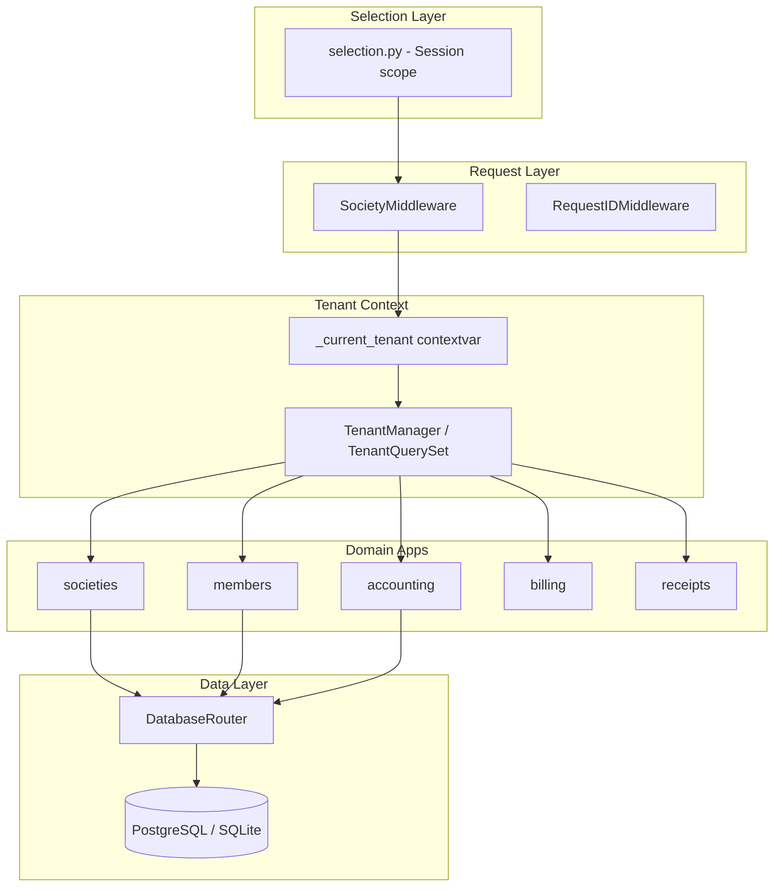
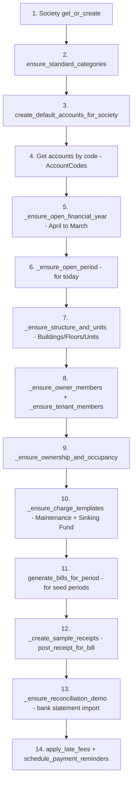
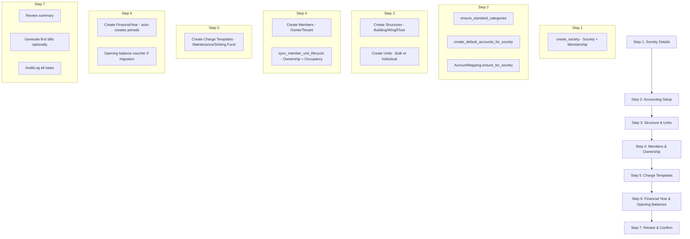
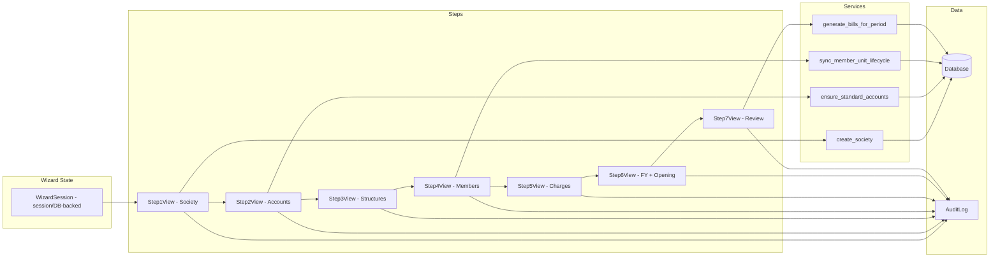

# Housynk — Architecture Analysis for Society Creation & Accounting Migration Wizard

> **Purpose:** This document is the foundation for planning a new **Society Creation & Accounting Migration Wizard** feature. It maps every subsystem the wizard must touch: multi-tenant data isolation, the standard chart of accounts, financial-year/period bootstrapping, structure/unit/member creation, charge templates, billing, receipts, and reconciliation.

---

## Table of Contents

1. [Project Structure](#1-project-structure)
2. [Core Models](#2-core-models)
3. [Services Layer](#3-services-layer)
4. [URL Patterns & Views](#4-url-patterns--views)
5. [Configuration & Settings](#5-configuration--settings)
6. [Existing Seed / Migration Commands](#6-existing-seed--migration-commands)
7. [Frontend Structure](#7-frontend-structure)
8. [Database](#8-database)
9. [Wizard Implementation Reference](#9-wizard-implementation-reference)

---

## 1. Project Structure

The project is a Django monolith called **Housynk** — a multi-tenant housing-society accounting platform. It follows a **domain-driven app layout** where [`housing/models.py`](housing/models.py:1) is a *compatibility shim* that re-exports models from their true domain apps. All models use `app_label = "housing"` in their `Meta` class for backward compatibility with existing migrations.

### App Inventory

| App | Path | Purpose |
|-----|------|---------|
| **config** | [`config/`](config/:1) | Django project root: settings, root URLconf, WSGI, home dashboard view |
| **core** | [`core/`](core/:1) | Cross-cutting infrastructure: `DatabaseRouter`, test base, test factories |
| **housing** | [`housing/`](housing/:1) | Compatibility shim + primary views/URLs/templates for society management, structure/unit dashboards, member management, billing, receipts, finance dashboards |
| **housing_accounting** | [`housing_accounting/`](housing_accounting/:1) | Project package: `users` app (custom User model, allauth integration), `selection` module (session-based society/FY scope), `contrib/sites` |
| **societies** | [`societies/`](societies/:1) | Multi-tenant core: `Society`, `Membership`, `SocietyConfig`, `TenantModel` abstract base, `TenantManager`/`TenantQuerySet`, middleware, field security, RBAC roles, services |
| **members** | [`members/`](members/:1) | `Member`, `Structure`, `Unit`, `UnitOwnership`, `UnitOccupancy`, `Nominee` models + forms/views/templates |
| **accounting** | [`accounting/`](accounting/:1) | Double-entry accounting: `Account`, `AccountCategory`, `AccountMapping`, `Voucher`, `LedgerEntry`, `FinancialYear`, `AccountingPeriod`, `VoucherTemplate`, `VoucherSequence`, `YearEndCloseLog`, `PeriodStatusLog` + services (standard accounts, GST vouchers, period workflow, year-end) |
| **billing** | [`billing/`](billing/:1) | `Bill`, `BillLine`, `ChargeTemplate` models + billing service (bill generation, late fees) + views/URLs/templates |
| **receipts** | [`receipts/`](receipts/:1) | `PaymentReceipt`, `ReceiptAllocation` models + receipt posting service |
| **reconciliation** | [`reconciliation/`](reconciliation/:1) | Bank statement import, matching, reconciliation workspace |
| **shares** | [`shares/`](shares/:1) | Share certificate management (`ShareCertificate` model) |
| **parking** | [`parking/`](parking/:1) | Vehicle, parking slots, permits, rotation policies — full parking management with services |
| **gateops** | [`gateops/`](gateops/:1) | Gate operations: contractors, contracts, workers, work permits, vehicles |
| **reports** | [`reports/`](reports/:1) | Financial reporting (trial balance, ledgers, etc.) |
| **auditlog** | [`auditlog/`](auditlog/:1) | Append-only platform-wide audit log (`AuditLog` model) |
| **notifications** | [`notifications/`](notifications/:1) | Email queue/log, email templates, email settings, reminder logs, email verification tokens + management commands |
| **administration** | [`administration/`](administration/:1) | Admin-level operations |

### Key Architectural Patterns



---

## 2. Core Models

### 2.1 Multi-Tenant Foundation

#### [`TenantModel`](societies/models/model_TenantModel.py:7) (Abstract Base)

All tenant-scoped models inherit from this abstract base:

| Field | Type | Notes |
|-------|------|-------|
| `society` | FK → `Society` | Tenant scope |
| `created_by` / `updated_by` / `deleted_by` | FK → `User` (nullable) | Audit trail |
| `uuid` | UUIDField | Unique identifier |
| `version` | PositiveIntegerField | Optimistic concurrency |
| `is_deleted` / `deleted_at` | Boolean / DateTime | Soft delete |
| `created_at` / `updated_at` | DateTime (nullable) | Timestamps (nullable for safe migration) |

#### [`TenantManager`](societies/managers.py:47) / [`TenantQuerySet`](societies/managers.py:11)

Automatic tenant filtering via **contextvars**:

- `_current_tenant = contextvars.ContextVar("current_tenant", default=None)` — set by [`SocietyMiddleware`](societies/middleware.py:5)
- `TenantQuerySet._apply_tenant_filter()` — filters by `society` if the model has a `society` field, and excludes `is_deleted=True`
- `TenantManager.get_queryset()` — applies the filter **once**; `use_in_migrations = True`
- `.including_deleted()` — bypasses soft-delete exclusion
- `.unscoped()` — bypasses all tenant filtering

#### [`Society`](societies/models/model_Society.py:4)

| Field | Type | Notes |
|-------|------|-------|
| `name` | CharField(200) | |
| `registration_number` | CharField | |
| `address` | TextField | |
| `created_by` | FK → `User` (PROTECT) | |
| `created_at` | DateTime | |

- `app_label = "housing"`
- `share_config` property — auto-creates [`SocietyConfig`](societies/models/model_SocietyConfig.py:9) with defaults on first access

#### [`Membership`](societies/models/model_Membership.py:4)

| Field | Type | Notes |
|-------|------|-------|
| `user` | FK → `User` | |
| `society` | FK → `Society` | |
| `role` | TextChoices | `OWNER`, `ADMIN`, `ACCOUNTANT`, `MEMBER`, `VIEWER` |
| `is_active` | Boolean | |
| `invited_by` | FK → `User` (nullable) | |
| `joined_at` | DateTime | |

- UniqueConstraint on `(user, society)`
- Indexes on `society`, `(user, society)`, `(society, is_active)`

#### [`SocietyConfig`](societies/models/model_SocietyConfig.py:9)

OneToOne to `Society`. Holds share/fee defaults:

| Field | Default | Notes |
|-------|---------|-------|
| `share_value` | 100 | |
| `default_share_count` | 5 | |
| `entrance_fee` | 500 | |
| `transfer_fee` | 100 | |
| `premium_amount` | 0 | |
| `allow_multiple_nominees` | False | |
| `require_approval` | False | |
| `auto_generate_vouchers` | True | |

Helper methods: `get_account_mapping()`, `get_share_capital_account()`, `get_bank_account()`

### 2.2 Accounting Models

#### [`Account`](accounting/models/model_Account.py:8)

| Field | Type | Notes |
|-------|------|-------|
| `society` | FK → `Society` | |
| `name` | CharField | |
| `code` | CharField | Regex `^\d+(\.\d+)*$` — hierarchical (e.g., `1.4.2.1`) |
| `category` | FK → `AccountCategory` | |
| `parent` | FK → self (nullable) | Tree structure |
| `account_type` | TextChoices | `ASSET`, `LIABILITY`, `INCOME`, `EXPENSE`, `EQUITY` |
| `sub_type` | TextChoices | `GST`, `BANK`, `MEMBER`, `FUND`, `EXPENSE`, `INCOME`, `GENERAL` |
| `is_active` | Boolean | |
| `system_protected` | Boolean | Prevents deletion |
| `is_gst` / `gst_type` | Boolean / TextChoices | GST configuration |
| `is_bank` | Boolean | |
| `is_member_related` | Boolean | Requires unit on ledger entries |
| `is_vendor_related` | Boolean | |
| `is_contra` / `is_clearing` | Boolean | |

**Properties:** `normal_side`, `level` (depth in tree), `is_leaf`, `full_path`

**Validation (`clean()`):**
- Code format must match regex
- Parent-child code prefix consistency
- Sibling code uniqueness
- `account_type` must match `category.account_type`
- GST rules (GST accounts must have `gst_type`)

#### [`AccountCategory`](accounting/models/model_AccountCategory.py:7)

| Field | Type | Notes |
|-------|------|-------|
| `society` | FK → `Society` | |
| `name` | CharField | |
| `account_type` | TextChoices | `ASSET`, `LIABILITY`, `INCOME`, `EXPENSE`, `EQUITY` |
| `code` | CharField | |

#### [`AccountMapping`](accounting/models/model_AccountMapping.py:12)

OneToOne to `Society`. Maps semantic concepts to specific accounts:

| Field | Expected account_type / sub_type |
|-------|----------------------------------|
| `share_capital_account` | EQUITY / FUND |
| `entrance_fee_account` | INCOME |
| `transfer_fee_account` | INCOME |
| `premium_account` | INCOME |
| `bank_account` | ASSET / BANK |

**`ensure_for_society(society)`** classmethod — creates default mapping using `AccountCodes` constants. This is called during society setup.

#### [`Voucher`](accounting/models/model_Voucher.py:14)

| Field | Type | Notes |
|-------|------|-------|
| `society` | FK → `Society` | |
| `voucher_type` | TextChoices | `GENERAL`, `RECEIPT`, `PAYMENT`, `ADJUSTMENT`, `OPENING`, `JOURNAL`, `BILL` |
| `voucher_number` | CharField | Auto-assigned on post via `VoucherSequence` |
| `voucher_date` | DateField | |
| `narration` | TextField | |
| `payment_mode` | TextChoices | `CASH`, `CHEQUE`, `BANK_TRANSFER`, `UPI`, `DD`, `OTHER` |
| `reference_number` | CharField | |
| `posted_at` | DateTime (nullable) | Null = draft |
| `reversal_of` | FK → self (nullable) | For reversal vouchers |

**`clean()` validation:**
- Balanced debit/credit totals
- No same-account debit + credit
- Voucher type policy: `RECEIPT` must debit cash/bank; `PAYMENT` must credit cash/bank
- GST policy validation

**`post()` method:**
- Checks `FinancialYear` is open for `voucher_date`
- Checks `AccountingPeriod` is open for `voucher_date`
- Assigns `voucher_number` via `VoucherSequence`
- Sets `posted_at`
- **Immutability after posting:** `society`, `voucher_type`, `voucher_date`, `narration` cannot be changed

#### [`LedgerEntry`](accounting/models/model_LedgerEntry.py:10)

| Field | Type | Notes |
|-------|------|-------|
| `voucher` | FK → `Voucher` | |
| `account` | FK → `Account` | |
| `unit` | FK → `Unit` (nullable) | Required for member-related accounts |
| `debit` | Decimal | |
| `credit` | Decimal | |
| `reference_type` | TextChoices | `BILL`, `RECEIPT`, `VOUCHER`, `MANUAL` |
| `reference_id` | IntegerField (nullable) | |

**Validation (`clean()`):**
- Cannot modify entries of posted vouchers
- Account must be active and belong to same society
- `unit` required for member-related accounts (code prefix `1.5.x` or `2.1.x`)
- `unit` forbidden for income/expense/equity accounts

#### [`FinancialYear`](accounting/models/model_FinancialYear.py:9)

| Field | Type | Notes |
|-------|------|-------|
| `society` | FK → `Society` | |
| `name` | CharField | e.g., "FY 2025-26" |
| `start_date` | DateField | |
| `end_date` | DateField | |
| `is_open` | Boolean | |

**`save()` auto-creates monthly `AccountingPeriod` records** via `_create_accounting_periods()`. Opens periods up to today's date.

**`get_open_year_for_date(date, society)`** classmethod — finds the open FY containing the given date.

#### [`AccountingPeriod`](accounting/models/model_AccountingPeriod.py:8)

| Field | Type | Notes |
|-------|------|-------|
| `society` | FK → `Society` | |
| `financial_year` | FK → `FinancialYear` | |
| `start_date` | DateField | |
| `end_date` | DateField | |
| `is_open` | Boolean | |

**`is_period_open(society, date)`** classmethod — checks if a period is open for a given date.

### 2.3 Members Models

#### [`Structure`](members/models/model_Structure.py:5)

Hierarchical building structure:

| Field | Type | Notes |
|-------|------|-------|
| `society` | FK → `Society` | |
| `parent` | FK → self (nullable) | Nesting |
| `structure_type` | TextChoices | `BUILDING`, `WING`, `BLOCK`, `TOWER`, `FLOOR` |
| `name` | CharField | |
| `display_order` | IntegerField | |

- `unique_together = (society, parent, name)`
- Nesting depth validation in `clean()`

#### [`Unit`](members/models/model_Unit.py:4)

| Field | Type | Notes |
|-------|------|-------|
| `structure` | FK → `Structure` | Parent structure |
| `unit_type` | TextChoices | `FLAT`, `SHOP`, `OFFICE`, `OTHER` |
| `identifier` | CharField | e.g., "A1-101" |
| `area_sqft` | DecimalField | |
| `chargeable_area_sqft` | DecimalField (nullable) | |
| `is_active` | Boolean | |

- `billing_area_sqft` property — returns `chargeable_area_sqft` or falls back to `area_sqft`

#### [`Member`](members/models/model_Member.py:7)

| Field | Type | Notes |
|-------|------|-------|
| `society` | FK → `Society` | |
| `unit` | FK → `Unit` | |
| `user` | FK → `User` (nullable) | Auto-provisioned from email |
| `full_name` | CharField | |
| `email` | EmailField | |
| `phone` | CharField (nullable) | |
| `role` | TextChoices | `OWNER`, `TENANT`, `NOMINEE` |
| `status` | TextChoices | `ACTIVE`, `INACTIVE` |
| `receivable_account` | FK → `Account` (nullable) | Member receivable |
| `start_date` / `end_date` | DateField | Tenancy period |
| `share_balance` | IntegerField | |
| `join_date` / `exit_date` | DateField (nullable) | |

- `unique_together = (society, unit, full_name, role)`

#### [`UnitOwnership`](members/models/model_UnitOwnership.py:6)

| Field | Type | Notes |
|-------|------|-------|
| `unit` | FK → `Unit` | |
| `owner` | FK → `User` | |
| `ownership_role` | TextChoices | `PRIMARY`, `JOINT`, `NOMINEE` |
| `start_date` / `end_date` | DateField | Ownership period |

#### [`UnitOccupancy`](members/models/model_UnitOccupancy.py:6)

| Field | Type | Notes |
|-------|------|-------|
| `unit` | FK → `Unit` | |
| `member` | FK → `Member` | |
| `occupant` | FK → `User` (nullable) | |
| `occupancy_type` | TextChoices | `OWNER`, `TENANT`, `VACANT` |
| `start_date` / `end_date` | DateField | Occupancy period |

### 2.4 Billing Models

#### [`Bill`](billing/models/model_Bill.py:9)

| Field | Type | Notes |
|-------|------|-------|
| `society` | FK → `Society` | |
| `member` | FK → `Member` | |
| `unit` | FK → `Unit` | |
| `receivable_account` | FK → `Account` | |
| `bill_number` | CharField | |
| `bill_period_start` / `bill_period_end` | DateField | |
| `bill_date` / `due_date` | DateField | |
| `total_amount` / `penalty_amount` | DecimalField | |
| `status` | TextChoices | `OPEN`, `PARTIAL`, `PAID`, `OVERDUE` |
| `voucher` | FK → `Voucher` (nullable) | Posted billing voucher |

- `allocated_amount` property — sum of receipt allocations
- `outstanding_amount` property — `total_amount + penalty_amount - allocated_amount`
- `refresh_status()` — recalculates status based on allocations and due date

#### [`ChargeTemplate`](billing/models/model_ChargeTemplate.py:10)

| Field | Type | Notes |
|-------|------|-------|
| `society` | FK → `Society` | |
| `name` | CharField | |
| `charge_type` | TextChoices | `FIXED`, `PER_SQFT`, `PER_PERSON`, `CUSTOM_FORMULA` |
| `rate` | DecimalField | |
| `frequency` | TextChoices | `MONTHLY`, `QUARTERLY`, `YEARLY` |
| `due_days` | IntegerField | Days after bill date for due date |
| `late_fee_percent` | DecimalField | |
| `effective_from` / `effective_to` | DateField | |
| `version_no` | IntegerField | Auto-incremented |
| `previous_version` | FK → self (nullable) | Versioning chain |
| `income_account` | FK → `Account` | |
| `receivable_account` | FK → `Account` | |

- **Versioning:** `save()` auto-increments `version_no`; prevents modification of templates already used in bills
- `delete()` is overridden to prevent deletion of used templates

### 2.5 Audit Log

#### [`AuditLog`](auditlog/models.py:21)

Append-only platform-wide audit log:

| Field | Type | Notes |
|-------|------|-------|
| `society` | FK → `Society` (nullable) | |
| `actor` | FK → `User` (nullable) | |
| `action` | TextChoices | `CREATE`, `UPDATE`, `DELETE`, `APPROVE`, `POST`, `REVERSE`, etc. |
| `entity_type` | CharField | Model name |
| `entity_id` | IntegerField (nullable) | |
| `before_value` / `after_value` | JSONField | State snapshots |
| `ip_address` | GenericIPAddressField | |
| `device_info` / `user_agent` | TextField | |
| `request_id` / `session_id` | CharField | Correlation |
| `module` | CharField | |
| `duration_ms` | IntegerField | |
| `reason` | TextField | |

- **`log()` classmethod** — primary entry point for creating audit entries
- **`save()` rejects updates** — append-only enforcement
- **`delete()` raises `PermissionError`** — cannot delete audit records

---

## 3. Services Layer

The services layer encapsulates business logic, keeping views thin and models focused on data. All services use `@transaction.atomic` for data integrity.

### 3.1 Society Services

#### [`create_society()`](societies/services.py:36)

```python
@transaction.atomic
def create_society(*, user, name, registration_number="", address=""):
```

Atomically creates:
1. `Society` record (with `created_by=user`)
2. `Membership` record (role=`OWNER`, `invited_by=user`)

This is the **entry point** for the wizard's first step.

#### Other Society Services

| Function | Purpose |
|----------|---------|
| [`create_user_by_admin()`](societies/services.py:54) | Admin creates a new user and grants society access |
| [`transfer_ownership()`](societies/services.py:79) | Transfer society ownership to another member |
| [`start_impersonation()`](societies/services.py:99) | Super-admin impersonation session |
| [`get_accessible_societies_qs()`](societies/services.py:11) | Returns societies a user has membership in |
| [`user_has_society_access()`](societies/services.py:23) | Permission check |

### 3.2 Standard Accounts Service

#### [`accounting/services/standard_accounts.py`](accounting/services/standard_accounts.py:1)

This is **critical for the wizard** — it bootstraps the entire chart of accounts.

**`NEW_ACCOUNT_TREE`** — A hardcoded list of ~150 tuples, each containing:
`(code, name, account_type, parent_code, sub_type, is_gst, gst_type, is_bank, is_contra, is_clearing, is_member_related, is_vendor_related)`

Example entries:
```
("1", "Assets", "ASSET", None, "GENERAL", False, None, False, ...)
("1.4", "Cash & Bank", "ASSET", "1", "BANK", False, None, False, ...)
("1.4.2", "Bank Accounts", "ASSET", "1.4", "BANK", False, None, False, ...)
("1.4.2.1", "Bank - Maintenance", "ASSET", "1.4.2", "BANK", False, None, True, ...)
("1.5", "Receivables", "ASSET", "1", "MEMBER", False, None, False, ...)
("1.5.1", "Member Receivables", "ASSET", "1.5", "MEMBER", False, None, False, ...)
("1.5.1.1", "Maintenance Due", "ASSET", "1.5.1", "MEMBER", False, None, False, ...)
("5.2.1", "Share Capital", "EQUITY", "5.2", "FUND", False, None, False, ...)
```

**`DEFAULT_CATEGORY_DEFINITIONS`** — 5 root categories: Assets, Liabilities, Income, Expenses, Equity/Funds

**Key functions:**

| Function | Purpose |
|----------|---------|
| [`ensure_standard_categories(society)`](accounting/services/standard_accounts.py:620) | Creates the 5 root `AccountCategory` records |
| [`create_default_accounts_for_society(society)`](accounting/services/standard_accounts.py:642) | Creates all ~150 accounts from `NEW_ACCOUNT_TREE` — **idempotent** |
| [`rebuild_accounts_for_society(society)`](accounting/services/standard_accounts.py:716) | Rebuilds accounts (for corrections) |
| [`ensure_standard_accounts(society)`](accounting/services/standard_accounts.py:729) | Combined: categories + accounts |
| [`derive_account_metadata(code, name, account_type)`](accounting/services/standard_accounts.py:569) | Derives sub_type and flags from code/name |

### 3.3 GST Vouchers Service

#### [`accounting/services/gst_vouchers.py`](accounting/services/gst_vouchers.py:1)

**`AccountCodes`** class — central registry of all standard account code constants:

```python
class AccountCodes:
    MAINTENANCE_DUE = "1.5.1.1"
    BANK_MAINTENANCE = "1.4.2.1"
    MAINTENANCE_CHARGES = "4.1.1"
    SHARE_CAPITAL = "5.2.1"
    ENTRANCE_FEE = "4.2.1"
    TRANSFER_FEE = "4.2.2"
    # ... ~30+ code constants
```

**Voucher creation functions:**

| Function | Purpose |
|----------|---------|
| [`create_maintenance_billing_with_gst()`](accounting/services/gst_vouchers.py:144) | Bill with GST calculation |
| [`create_expense_with_gst()`](accounting/services/gst_vouchers.py:185) | Expense voucher with GST |
| [`create_member_payment_receipt()`](accounting/services/gst_vouchers.py:220) | Member receipt |
| [`create_vendor_payment()`](accounting/services/gst_vouchers.py:251) | Vendor payment |
| [`create_fund_transfer()`](accounting/services/gst_vouchers.py:281) | Fund transfer between accounts |
| [`create_member_advance_receipt()`](accounting/services/gst_vouchers.py:311) | Member advance |
| [`create_member_advance_adjustment()`](accounting/services/gst_vouchers.py:341) | Advance adjustment |

**`_post_voucher()`** helper — internal function that creates a `Voucher` + `LedgerEntry` rows and posts it atomically.

### 3.4 Billing Service

#### [`billing/services.py`](billing/services.py:1)

| Function | Purpose |
|----------|---------|
| [`generate_bills_for_period()`](billing/services.py:105) | Creates `Bill` + `BillLine` records for all active members using due charge templates, then posts the billing voucher |
| [`apply_late_fees()`](billing/services.py:192) | Applies late fees to overdue bills |
| [`_post_bill_voucher(bill)`](billing/services.py:71) | Internal: debit receivable, credit income per bill line |
| [`_calculate_line_item()`](billing/services.py:45) | Calculates charge amount based on `charge_type` (FIXED/PER_SQFT/PER_PERSON) |
| [`_is_template_due()`](billing/services.py:20) | Checks if a charge template is due for a given period |

### 3.5 Receipts Service

#### [`receipts/services.py`](receipts/services.py:1)

| Function | Purpose |
|----------|---------|
| [`post_receipt_for_bill()`](receipts/services.py:12) | Creates `PaymentReceipt` + `ReceiptAllocation` + Receipt `Voucher` + posts it. Validates bill belongs to society, updates bill status. |

### 3.6 Period Workflow Service

#### [`accounting/services/period_workflow.py`](accounting/services/period_workflow.py:1)

| Function | Purpose |
|----------|---------|
| [`close_period()`](accounting/services/period_workflow.py:22) | Closes an `AccountingPeriod` (requires no draft vouchers), logs to `PeriodStatusLog` |
| [`reopen_period()`](accounting/services/period_workflow.py:52) | Reopens a closed period |

### 3.7 Year-End Service

#### [`accounting/services/year_end.py`](accounting/services/year_end.py:1)

| Function | Purpose |
|----------|---------|
| [`close_financial_year_with_carry_forward()`](accounting/services/year_end.py:36) | Closes all periods, creates next `FinancialYear`, builds opening voucher from trial balance, logs to `YearEndCloseLog` |

### 3.8 Membership Lifecycle Service

#### [`housing/services/membership_lifecycle.py`](housing/services/membership_lifecycle.py:1)

| Function | Purpose |
|----------|---------|
| [`sync_member_unit_lifecycle(member)`](housing/services/membership_lifecycle.py:36) | For `OWNER`: creates `UnitOwnership` + `OWNER` occupancy (if vacant). For `TENANT`: replaces active occupancy. |
| [`_resolve_owner_user(member)`](housing/services/membership_lifecycle.py:14) | Auto-provisions a `User` from member email if not linked |

### 3.9 Housing Services Re-exports

#### [`housing/services/__init__.py`](housing/services/__init__.py:1)

Re-exports key services for convenient access from views:
- `membership_lifecycle.sync_member_unit_lifecycle`
- `period_workflow.close_period`, `reopen_period`
- `year_end.close_financial_year_with_carry_forward`
- `gst_vouchers.*` (all voucher creation functions)
- `standard_accounts.*` (all account setup functions)

---

## 4. URL Patterns & Views

### 4.1 Root URL Configuration

#### [`config/urls.py`](config/urls.py:1)

| URL Pattern | Include / View | Notes |
|-------------|----------------|-------|
| `/` | `HomeDashboardView` | Main dashboard |
| `users/` | `housing_accounting.users.urls` | User management, selection update |
| `accounts/` | `allauth.urls` | Authentication (email-based login) |
| `housing/` | `housing.urls` | Society management (app_name="housing") |
| `accounting/` | `accounting.urls` | Accounting (app_name="accounting") |
| `reports/` | `reports.urls` | Financial reports |
| `shares/` | `shares.urls` | Share certificates |
| `billing/` | `billing.urls` | Billing views |
| `parking/` | `parking.urls` | Parking management |
| `receipts/` | `receipts.urls` | Receipts |
| `notifications/` | `notifications.urls` | Notifications |
| `members/` | `members.urls` | Member views |
| `administration/` | `administration.urls` | Admin operations |
| `reconciliation/` | `reconciliation.urls` | Bank reconciliation |
| `gateops/` | `gateops.urls` | Gate operations |
| `manifest.json` | `PWAManifestView` | PWA manifest |
| `sw.js` | `PWAServiceWorkerView` | PWA service worker |
| `offline/` | `PWAOfflineView` | PWA offline page |
| `{ADMIN_URL}` | `admin.site.urls` | Django admin |

### 4.2 Housing URLs

#### [`housing/urls.py`](housing/urls.py:1) (app_name="housing")

| URL Name | Pattern | View | Wizard Relevance |
|----------|---------|------|------------------|
| `society-add` | `societies/add/` | `SocietyCreateView` | **Step 1: Society creation** |
| `society-list` | `societies/` | `SocietyListView` | |
| `society-detail` | `societies/<int:pk>/` | `SocietyDetailView` | |
| `society-admin` | `societies/<int:pk>/admin/` | `SocietyAdminView` | |
| `society-voucher-templates` | `societies/<int:pk>/voucher-templates/` | `SocietyVoucherTemplatesView` | |
| `society-user-create` | `societies/<int:pk>/users/create/` | `SocietyUserCreateView` | |
| `structure-unit-dashboard` | `dashboard/` | `StructureUnitDashboardView` | |
| `unit-detail` | `units/<int:pk>/` | `UnitDetailView` | |
| `structure-add` | `structures/add/` | `StructureCreateView` | **Step 3: Structure creation** |
| `unit-add` | `units/add/` | `UnitCreateView` | **Step 3: Unit creation** |
| `unit-bulk-add` | `units/bulk-add/` | `BulkUnitCreateView` | **Step 3: Bulk unit creation** |
| `ownership-add` | `ownerships/add/` | `UnitOwnershipCreateView` | **Step 4: Ownership** |
| `occupancy-add` | `occupancies/add/` | `UnitOccupancyCreateView` | **Step 4: Occupancy** |
| `member-list` | `members/` | `MemberListView` | |
| `member-add` | `members/add/` | `MemberCreateView` | **Step 4: Member creation** |
| `member-edit` | `members/<int:pk>/edit/` | `MemberUpdateView` | |
| `member-form-options-api` | `api/member-form-options/` | `MemberFormOptionsAPIView` | AJAX form options |
| `unit-search-api` | `api/units/search/` | `UnitSearchAPIView` | AJAX unit search |
| `charge-template-add` | `charge-templates/add/` | `ChargeTemplateCreateView` | **Step 5: Charge templates** |
| `billing-generate` | `billing/generate/` | `BillingGenerateView` | **Step 6: Billing** |
| `finance-dashboard` | `finance/` | `FinanceDashboardView` | |
| `receipt-post` | `receipts/post/` | `ReceiptPostView` | |
| `outstanding-dashboard` | `outstanding/` | `OutstandingDashboardView` | |
| `reminder-schedule` | `reminders/schedule/` | `ReminderScheduleView` | |
| `email-verify` | `email/verify/<token>/` | `EmailVerificationView` | |

### 4.3 Accounting URLs

#### [`accounting/urls.py`](accounting/urls.py:1) (app_name="accounting")

| URL Name | Pattern | View |
|----------|---------|------|
| `dashboard` | `dashboard/` | Accounting dashboard |
| `account-list` | `accounts/` | Account list |
| `account-add` | `accounts/add/` | Account create |
| `account-tree` | `accounts/tree/` | Account tree view |
| `account-edit` | `accounts/<int:pk>/edit/` | Account edit |
| `account-ledger` | `accounts/<int:pk>/ledger/` | Account ledger |
| `account-ledger-export-csv` | `accounts/<int:pk>/ledger/export/` | CSV export |
| `trial-balance` | `trial-balance/` | Trial balance |
| `trial-balance-export-csv` | `trial-balance/export/` | CSV export |
| `voucher-list` | `vouchers/` | Voucher list |
| `voucher-entry` | `vouchers/new/` | Voucher entry |
| `voucher-template-list/add/edit/delete` | `vouchers/templates/...` | Voucher template CRUD |
| `voucher-posting` | `vouchers/posting/` | Voucher posting |
| `voucher-detail` | `vouchers/<int:pk>/` | Voucher detail |
| `voucher-post` | `vouchers/<int:pk>/post/` | Post voucher |
| `voucher-delete-draft` | `vouchers/<int:pk>/delete/` | Delete draft |
| `voucher-reverse` | `vouchers/<int:pk>/reverse/` | Reverse voucher |

### 4.4 Key Views for the Wizard

#### [`SocietyCreateView`](housing/views.py:635)

```python
class SocietyCreateView(LoginRequiredMixin, SuccessMessageMixin, CreateView):
    form_class = SocietyForm
    # In form_valid: calls create_society() service
```

Uses the [`create_society()`](societies/services.py:36) service to atomically create `Society` + `Membership(owner)`.

#### [`BulkUnitCreateView`](housing/views.py:711)

Grid-based bulk unit creation — creates multiple units for a structure in a single form submission. This pattern is directly relevant for the wizard's structure/unit step.

#### [`MemberCreateView`](housing/views.py:935)

Calls [`sync_member_unit_lifecycle(self.object)`](housing/services/membership_lifecycle.py:36) in `form_valid` to automatically create ownership and occupancy records.

#### [`HomeDashboardView`](config/views.py:29)

The main dashboard at `/`. Uses [`get_selected_scope()`](housing_accounting/selection.py:78) to filter all queries by the selected society and financial year. Aggregates metrics across all domain apps (societies, structures, units, members, bills, receipts, vouchers, vehicles, permits, reminders).

### 4.5 View Patterns

All views follow consistent patterns:
- `LoginRequiredMixin` on all views
- [`get_selected_scope(request)`](housing_accounting/selection.py:78) for tenant filtering
- `has_permission()` checks for role-based access
- [`AuditLog.log()`](auditlog/models.py:94) for all mutations
- `transaction.atomic()` for multi-step operations
- `messages.success/error/warning` for user feedback

---

## 5. Configuration & Settings

### 5.1 Settings Hierarchy

```
config/settings/
├── __init__.py
├── base.py      # Foundation: apps, middleware, database, auth
├── local.py     # Development: DEBUG=True, debug toolbar, SQLite fallback
├── production.py # Production: DEBUG=False, Redis cache, security headers
└── test.py      # Testing: fast hashers, in-memory email, no atomic requests
```

### 5.2 Base Settings

#### [`config/settings/base.py`](config/settings/base.py:1)

**Installed Apps (LOCAL_APPS order):**
```python
LOCAL_APPS = [
    "housing_accounting.users",
    "societies",
    "members",
    "shares",
    "billing",
    "receipts",
    "notifications",
    "auditlog",
    "reconciliation",
    "reports",
    "housing",
    "accounting",
    "parking",
    "administration",
    "gateops",
]
```

**Database Configuration:**
- Uses `dj_database_url` with default SQLite fallback
- Supabase/PostgreSQL support via `DATABASE_URL` env var
- `ATOMIC_REQUESTS = True` on all databases
- `DATABASE_ROUTERS = ["core.db_router.DatabaseRouter"]`

**Authentication:**
- `AUTH_USER_MODEL = "users.User"`
- django-allauth for email-based login
- Argon2 password hasher (primary)

**Middleware (relevant):**
```python
MIDDLEWARE = [
    # ... standard Django middleware ...
    "societies.request_id.RequestIDMiddleware",
    "societies.middleware.SocietyMiddleware",
    # ...
]
```

**Other:**
- `TIME_ZONE = "Asia/Kolkata"`
- `APP_DIRS = True` for template loading
- crispy_forms with bootstrap5 template pack

### 5.3 Local Settings

#### [`config/settings/local.py`](config/settings/local.py:1)

- `DEBUG = True`
- django-debug-toolbar enabled
- django-extensions enabled
- WhiteNoise for static files
- **Smart database selection:** `LOCAL_DATABASE_MODE` env var (`auto`/`sqlite`). In `auto` mode, checks if remote PostgreSQL is reachable; falls back to SQLite if not.
- Connection pooling: `CONN_MAX_AGE=300`, health checks enabled

### 5.4 Production Settings

#### [`config/settings/production.py`](config/settings/production.py:1)

- `DEBUG = False`
- `ALLOWED_HOSTS = [".onrender.com", "localhost", "127.0.0.1", "[::1]"]` + env overrides
- Redis cache (if `REDIS_URL` set), else LocMemCache
- Security: SSL redirect, secure cookies, HSTS, content-type nosniff
- WhiteNoise compressed manifest static files storage
- SMTP email backend
- Anymail integration
- Structured logging with `AdminEmailHandler` for 500 errors

### 5.5 Test Settings

#### [`config/settings/test.py`](config/settings/test.py:1)

- `DEBUG = False`
- MD5 password hasher (fast for tests)
- In-memory email backend
- LocMemCache
- `ATOMIC_REQUESTS = False` (faster test isolation)
- `CONN_MAX_AGE = 0`

### 5.6 Selection Module

#### [`housing_accounting/selection.py`](housing_accounting/selection.py:1)

Session-based society/financial-year scope selection:

| Function | Purpose |
|----------|---------|
| [`get_selected_scope(request, persist=False)`](housing_accounting/selection.py:78) | Returns `(society, financial_year)` tuple. Caches per-request. Falls back to first accessible society. |
| [`get_selected_society(request)`](housing_accounting/selection.py:66) | Returns selected society |
| [`get_selected_financial_year(request, society)`](housing_accounting/selection.py:71) | Returns selected FY (or default for society) |
| [`get_default_financial_year_for_society(society)`](housing_accounting/selection.py:11) | Finds current open FY, or most recent |

Session keys: `selected_society_id`, `selected_financial_year_id`

The [`global_selection`](housing_accounting/users/context_processors.py:17) context processor makes selection data available in all templates.

### 5.7 Database Router

#### [`core/db_router.py`](core/db_router.py:3)

Routes models to the correct database based on `app_label`:
- `analytics` app_label → `analytics` database
- `archive` app_label → `archive` database
- Everything else → `default` database
- `allow_migrate` ensures migrations only run on the matching database

### 5.8 Middleware

#### [`SocietyMiddleware`](societies/middleware.py:5)

```python
class SocietyMiddleware:
    def __call__(self, request):
        # Sets request.current_society, request.current_membership
        # Sets _current_tenant contextvar for TenantManager auto-filtering
        response = self.get_response(request)
        return response
```

This is the **linchpin of multi-tenancy** — it sets the contextvar that `TenantManager` reads to automatically filter all queries.

### 5.9 Field Security

#### [`societies/field_security.py`](societies/field_security.py:1)

Field-level visibility control:

| Function | Purpose |
|----------|---------|
| [`visible_fields(model_instance, user, society)`](societies/field_security.py:12) | Returns set of visible field names |
| [`hidden_fields(model_instance, user, society)`](societies/field_security.py:76) | Returns set of hidden field names |
| [`filter_dict_by_visibility(data, model_instance, user, society)`](societies/field_security.py:84) | Filters a dict to only visible fields |

Uses `FieldVisibility` model rules: society-specific overrides global, role `"*"` wildcard applies to all roles.

---

## 6. Existing Seed / Migration Commands

### 6.1 seed_deepsagar.py — The Canonical Society Creation Reference

#### [`housing/management/commands/seed_deepsagar.py`](housing/management/commands/seed_deepsagar.py:54)

This is the **most important reference for the wizard**. It demonstrates the complete end-to-end flow of creating a fully functional society with accounting, billing, and reconciliation.

**Execution flow:**



**Key constants:**
- `FINANCIAL_YEAR_START_MONTH = 4` (April)
- `DEFAULT_OWNER_COUNT = 100`
- `FLOORS_PER_BUILDING = 5`
- `UNITS_PER_FLOOR = 4`

**Helper methods:**

| Method | Purpose |
|--------|---------|
| [`_get_or_create_account()`](housing/management/commands/seed_deepsagar.py:269) | Get or create an account by name/category |
| [`_get_or_create_user()`](housing/management/commands/seed_deepsagar.py:298) | Get or create a User by email |
| [`_ensure_open_financial_year()`](housing/management/commands/seed_deepsagar.py:323) | Creates FY (April-March) if needed |
| [`_ensure_open_period()`](housing/management/commands/seed_deepsagar.py:351) | Ensures AccountingPeriod open for today |
| [`_building_names()`](housing/management/commands/seed_deepsagar.py:383) | Generates building names (A, B, C, ...) |
| [`_ensure_structure_and_units()`](housing/management/commands/seed_deepsagar.py:398) | Creates Buildings → Floors → Units |
| [`_upsert_member()`](housing/management/commands/seed_deepsagar.py:449) | Create or update a Member |
| [`_ensure_owner_members()`](housing/management/commands/seed_deepsagar.py:502) | Creates owner members for each unit |
| [`_ensure_tenant_members()`](housing/management/commands/seed_deepsagar.py:525) | Creates tenant members for some units |
| [`_ensure_ownership_and_occupancy()`](housing/management/commands/seed_deepsagar.py:548) | Creates UnitOwnership + UnitOccupancy |
| [`_periods_to_seed()`](housing/management/commands/seed_deepsagar.py:644) | Generates billing periods to seed |
| [`_ensure_charge_templates()`](housing/management/commands/seed_deepsagar.py:670) | Creates Maintenance + Sinking Fund templates |
| [`_ensure_template_period_coverage()`](housing/management/commands/seed_deepsagar.py:761) | Ensures templates cover seed periods |
| [`_create_sample_receipts()`](housing/management/commands/seed_deepsagar.py:809) | Creates sample receipts via `post_receipt_for_bill()` |
| [`_ensure_reconciliation_demo()`](housing/management/commands/seed_deepsagar.py:871) | Bank statement import + matching demo |
| [`_get_or_create_demo_receipt()`](housing/management/commands/seed_deepsagar.py:1042) | Idempotent demo receipt creation |
| [`_get_or_create_demo_vendor_payment()`](housing/management/commands/seed_deepsagar.py:1070) | Idempotent demo vendor payment |

### 6.2 seed_test_society_matrix.py — Ownership/Tenancy Matrix

#### [`housing/management/commands/seed_test_society_matrix.py`](housing/management/commands/seed_test_society_matrix.py:19)

Creates a "Test Society" with a rich ownership/tenancy matrix covering:
- Primary owners, joint owners, ownership history (start/end dates)
- Tenants with various occupancy periods
- Vacant units
- Nominees
- Mixed unit types (FLAT, SHOP)

**Flow:**
1. `Society.objects.get_or_create(name=society_name)`
2. `ensure_standard_categories(society)` + `create_default_accounts_for_society(society)`
3. Get receivable account by `AccountCodes.MAINTENANCE_DUE`
4. `_ensure_financial_year()` — FY 2025-26 (April to March)
5. `_seed_structures()` — Building A (Wing A1, Wing A2) + Building B, with floors
6. `_seed_units()` — 12 units across structures (11 FLAT + 1 SHOP)
7. `_rebuild_member_matrix()` — 20 owners + 7 tenants + nominees with various date ranges
8. `_rebuild_ownership_matrix()` — Primary/joint/history combinations
9. `_rebuild_occupancy_matrix()` — Owner/tenant/vacant combinations

This command is valuable for testing edge cases in ownership transfer and tenancy management.

---

## 7. Frontend Structure

### 7.1 Template Architecture

The project uses **Django server-side templates** as the primary frontend, with a separate React SPA in [`frontend/`](frontend/:1) that appears to be in early setup.

#### Django Templates

**Base template:** [`housing_accounting/templates/base.html`](housing_accounting/templates/base.html:1)

**Template directories:**
```
housing_accounting/templates/     # Project-wide: base.html, pages/, components/, account/, allauth/
housing/templates/housing/        # Housing app views
accounting/templates/accounting/  # Accounting views
billing/templates/billing/        # Billing views
members/templates/members/        # Member views
parking/templates/parking/        # Parking views
gateops/templates/gateops/        # Gate ops views
notifications/templates/notifications/ # Notification views
```

**Reusable components** (in `housing_accounting/templates/components/`):
- [`action_bar.html`](housing_accounting/templates/components/action_bar.html:1)
- [`empty_state.html`](housing_accounting/templates/components/empty_state.html:1)
- [`pagination.html`](housing_accounting/templates/components/pagination.html:1)
- [`stat_card.html`](housing_accounting/templates/components/stat_card.html:1)

**PWA support:**
- [`manifest.webmanifest`](housing_accounting/templates/pwa/manifest.webmanifest:1)
- [`service-worker.js`](housing_accounting/templates/pwa/service-worker.js:1)
- [`offline.html`](housing_accounting/templates/pages/offline.html:1)

**Form rendering:** crispy_forms with bootstrap5 template pack

### 7.2 React Frontend (Early Stage)

#### [`frontend/package.json`](frontend/package.json:1)

A React SPA setup exists but contains only `package.json` — no source files yet:

| Dependency | Version | Purpose |
|------------|---------|---------|
| React | ^18.2.0 | UI framework |
| React Router DOM | ^6.20.0 | Client-side routing |
| Redux Toolkit + React Redux | ^1.9.7 / ^8.1.3 | State management |
| Axios | ^1.6.2 | HTTP client |
| Ant Design | ^5.12.2 | UI component library |
| Tailwind CSS | ^3.3.5 | Utility CSS |
| date-fns | ^2.30.0 | Date utilities |
| lodash | ^4.17.21 | Utility functions |

**Build tooling:** Vite 5, TypeScript 5, ESLint, Jest + Testing Library

This frontend is not yet integrated with the Django backend — the wizard will likely be implemented as Django templates first, with potential React migration later.

### 7.3 AJAX Endpoints

The housing app provides AJAX endpoints for dynamic form behavior:

| Endpoint | View | Purpose |
|----------|------|---------|
| `api/member-form-options/` | [`MemberFormOptionsAPIView`](housing/views.py:1032) | Returns form options (structures, units, roles) as JSON |
| `api/units/search/` | [`UnitSearchAPIView`](housing/views.py:1075) | Search units by identifier/structure |

These patterns should be extended for wizard step transitions and dynamic form updates.

---

## 8. Database

### 8.1 Database Engine

- **Production:** PostgreSQL (via Supabase, `sslmode=require`)
- **Development:** SQLite (auto-fallback when PostgreSQL unreachable) or PostgreSQL
- **Configuration:** `dj_database_url` parses `DATABASE_URL` environment variable

### 8.2 Multi-Database Setup

Three databases configured in [`base.py`](config/settings/base.py:1):

| Database | Purpose | Router Rule |
|----------|---------|-------------|
| `default` | All application data | Everything except analytics/archive |
| `analytics` | Analytics/OLAP queries | Models with `app_label = "analytics"` |
| `archive` | Archived/historical data | Models with `app_label = "archive"` |

#### [`DatabaseRouter`](core/db_router.py:3)

Routes reads, writes, and migrations based on `app_label`:
```python
def db_for_read(self, model, **hints):
    if model._meta.app_label == "analytics": return "analytics"
    if model._meta.app_label == "archive": return "archive"
    return "default"
```

### 8.3 Transaction Configuration

- `ATOMIC_REQUESTS = True` on all databases (except test) — each HTTP request is wrapped in a transaction
- Services use explicit `@transaction.atomic` for multi-step operations
- Tests disable `ATOMIC_REQUESTS` for faster isolation

### 8.4 Connection Settings

| Setting | Local | Production |
|---------|-------|------------|
| `CONN_MAX_AGE` | 300s | 120s |
| `CONN_HEALTH_CHECKS` | True | True |
| `DISABLE_SERVER_SIDE_CURSORS` | True (default only) | True (all) |
| `connect_timeout` | 5s | 5s |
| `sslmode` | — | `require` (if `*_SSL_REQUIRE=True`) |

---

## 9. Wizard Implementation Reference

### 9.1 Complete Society Creation Flow

Based on the analysis of [`seed_deepsagar.py`](housing/management/commands/seed_deepsagar.py:54) and the existing [`SocietyCreateView`](housing/views.py:635), the wizard must orchestrate the following steps:



### 9.2 Service Dependencies

The wizard must call these services in order:

| Step | Service | Idempotent? |
|------|---------|-------------|
| 1 | [`create_society()`](societies/services.py:36) | No (creates new) |
| 2a | [`ensure_standard_categories(society)`](accounting/services/standard_accounts.py:620) | Yes |
| 2b | [`create_default_accounts_for_society(society)`](accounting/services/standard_accounts.py:642) | Yes |
| 2c | [`AccountMapping.ensure_for_society(society)`](accounting/models/model_AccountMapping.py:141) | Yes |
| 3 | Direct model creation (Structure, Unit) | Use `get_or_create` |
| 4a | Direct model creation (Member) | Use `get_or_create` |
| 4b | [`sync_member_unit_lifecycle(member)`](housing/services/membership_lifecycle.py:36) | Yes |
| 5 | Direct model creation (ChargeTemplate) | Check existing |
| 6a | Direct model creation (FinancialYear) — `save()` auto-creates periods | Use `get_or_create` |
| 6b | [`create_fund_transfer()`](accounting/services/gst_vouchers.py:281) or opening voucher | No |
| 7 | [`generate_bills_for_period()`](billing/services.py:105) | No (creates bills) |

### 9.3 Key Constraints & Validation Rules

1. **Account codes** must match regex `^\d+(\.\d+)*$` and maintain parent-child prefix consistency
2. **Vouchers** must have balanced debit/credit, no same-account debit+credit
3. **Receipt/Payment vouchers** must involve a cash/bank account
4. **Ledger entries** for member-related accounts (code `1.5.x` or `2.1.x`) require a `unit`
5. **FinancialYear.save()** auto-creates monthly AccountingPeriods — cannot be avoided
6. **ChargeTemplate** versioning prevents modification of used templates
7. **AuditLog** is append-only — all wizard steps must be logged via `AuditLog.log()`
8. **TenantManager** auto-filters by society — all queries are automatically scoped
9. **SocietyMiddleware** sets the tenant contextvar — the wizard must ensure this is set correctly for the new society
10. **ATOMIC_REQUESTS = True** — each request is transactional; multi-step wizard steps need explicit `@transaction.atomic`

### 9.4 Existing Patterns to Reuse

| Pattern | Source | Wizard Application |
|---------|--------|-------------------|
| Society creation | [`SocietyCreateView`](housing/views.py:635) + [`create_society()`](societies/services.py:36) | Step 1 |
| Bulk unit creation | [`BulkUnitCreateView`](housing/views.py:711) | Step 3 |
| Member + lifecycle sync | [`MemberCreateView`](housing/views.py:935) + [`sync_member_unit_lifecycle()`](housing/services/membership_lifecycle.py:36) | Step 4 |
| Charge template creation | [`ChargeTemplateCreateView`](housing/views.py:1109) | Step 5 |
| Bill generation | [`BillingGenerateView`](housing/views.py:1192) + [`generate_bills_for_period()`](billing/services.py:105) | Step 7 |
| AJAX form options | [`MemberFormOptionsAPIView`](housing/views.py:1032) | Dynamic step forms |
| Session-based scope | [`selection.py`](housing_accounting/selection.py:1) | Post-creation scope setting |
| Audit logging | [`AuditLog.log()`](auditlog/models.py:94) | All wizard steps |

### 9.5 Migration Considerations

For the "Accounting Migration" aspect of the wizard (importing existing data from another system):

1. **Opening balances** — Create an `OPENING` type voucher with debit/credit entries for each account's opening balance
2. **Member receivables** — Each member's outstanding balance becomes a ledger entry on their receivable account (`1.5.1.1`)
3. **Historical bills** — May need to create `Bill` records with `status=PAID` for historical periods
4. **Share capital** — Members' share balances need entries against `Share Capital` account (`5.2.1`)
5. **Bank balances** — Opening bank account balances via `BANK_MAINTENANCE` (`1.4.2.1`) or other bank accounts
6. **Financial year** — Migration should target the current or a historical FY; periods must be open for the migration date

### 9.6 Recommended Wizard Architecture



**Recommendations:**
- Use a **multi-step form wizard** pattern (Django's `FormWizard` or a custom session-backed approach)
- Store wizard state in the **session** (society_id, step progress) or a dedicated `WizardSession` model
- Each step should be **independently re-runnable** (idempotent services)
- Use **AJAX** for dynamic form updates (unit counts, member previews)
- **AuditLog** every step completion
- After completion, **set the session scope** to the new society via [`selection.py`](housing_accounting/selection.py:1)
- Consider a **dry-run / preview** mode before final commit
- Support **CSV import** for bulk member/unit data (extending the [`BulkUnitCreateView`](housing/views.py:711) pattern)

---

*This document serves as the architectural foundation for implementing the Society Creation & Accounting Migration Wizard. All service interfaces, model constraints, and existing patterns documented here should be respected during implementation.*
