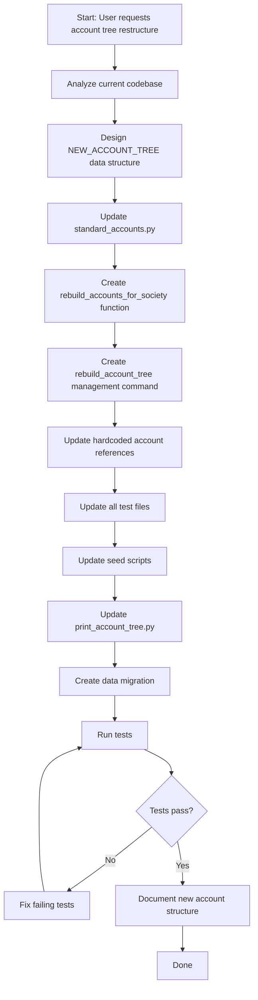

# Account Tree Restructure Plan

## Overview
Restructure the accounting hierarchy to follow proper parent-child relationships with hierarchical codes (1., 1.1, 1.1.1) for society accounting system.

## New Account Tree Structure

```
ROOT
│
├── 1. ASSETS (ASSET)
│   │
│   ├── 1.1 Fixed Assets (ASSET)
│   │   ├── Building Structure
│   │   ├── Lift & Elevator
│   │   ├── Generator / DG Set
│   │   ├── Water Pump & Motor
│   │   ├── CCTV System
│   │   ├── Furniture & Fixtures
│   │   ├── Office Equipment
│   │   └── Electrical Installations
│   │
│   ├── 1.2 Deposits (ASSET)
│   │   ├── Electricity Deposit
│   │   ├── Water Deposit
│   │   ├── Security Deposit Given
│   │   └── Other Utility Deposits
│   │
│   ├── 1.3 Investments (ASSET)
│   │   ├── Fixed Deposits (FD)
│   │   ├── Sinking Fund Investment
│   │   ├── Repair Fund Investment
│   │   └── Reserve Fund Investment
│   │
│   ├── 1.4 Bank & Cash (ASSET)
│   │   ├── Cash-in-Hand
│   │   ├── Bank Accounts (ASSET)
│   │   │   ├── Bank – Maintenance Account
│   │   │   ├── Bank – Sinking Fund
│   │   │   ├── Bank – Repair Fund
│   │   │   └── Bank – Parking Fund
│   │   └── Fund Transfer Account [BANK][CONTRA]
│   │
│   ├── 1.5 Receivables (ASSET)
│   │   ├── Member Receivable (ASSET)
│   │   │   ├── Maintenance Due
│   │   │   ├── Parking Due
│   │   │   ├── Interest on Arrears
│   │   │   └── Other Member Dues
│   │   ├── Vendor Receivable
│   │   └── Interest Receivable – Bank
│   │
│   ├── 1.6 Advances (ASSET)
│   │   ├── Vendor Advance
│   │   ├── Staff Advance
│   │   └── Prepaid Expenses
│   │
│   ├── 1.7 GST Input (ASSET)
│   │   ├── Input CGST
│   │   ├── Input SGST
│   │   └── Input IGST
│   │
│   └── 1.8 Other Assets (ASSET)
│       ├── Accrued Income
│       └── Suspense (Debit)
│
├── 2. LIABILITIES (LIABILITY)
│   │
│   ├── 2.1 Member Liabilities (LIABILITY)
│   │   ├── Advance Maintenance
│   │   ├── Member Advance
│   │   ├── Member Refund Payable
│   │   └── Security Deposit – Members
│   │
│   ├── 2.2 Vendor & Expense Payables (LIABILITY)
│   │   ├── Vendor Payable
│   │   ├── Expense Payable
│   │   └── Audit Fees Payable
│   │
│   ├── 2.3 Statutory Liabilities (LIABILITY)
│   │   ├── GST Payable (LIABILITY)
│   │   │   ├── Output CGST
│   │   │   ├── Output SGST
│   │   │   └── Output IGST
│   │   ├── TDS Payable
│   │   ├── Professional Tax Payable
│   │   └── GST TDS / Reverse Charge
│   │
│   ├── 2.4 Bank & Clearing (LIABILITY)
│   │   ├── Cheque Issued but Not Cleared
│   │   ├── Cheque Deposited but Not Cleared
│   │   └── Payment Gateway Clearing
│   │
│   ├── 2.5 Provisions (LIABILITY)
│   │   ├── Provision for Expenses
│   │   └── Provision for Audit
│   │
│   └── 2.6 Other Liabilities (LIABILITY)
│       └── Suspense Account
│
├── 3. INCOME (INCOME)
│   │
│   ├── 3.1 Member Income (INCOME)
│   │   ├── Maintenance Charges
│   │   ├── Service Charges
│   │   ├── Parking Charges
│   │   ├── Transfer Fees
│   │   ├── Non-Occupancy Charges
│   │   ├── Late Payment Penalty
│   │   └── Interest Income – Member
│   │
│   ├── 3.2 Financial Income (INCOME)
│   │   ├── Interest Income – Bank
│   │   └── Interest on FD
│   │
│   ├── 3.3 Commercial Income (INCOME)
│   │   ├── Rental Income – Common Area
│   │   ├── Advertisement Income
│   │   └── Mobile Tower Income
│   │
│   └── 3.4 Other Income (INCOME)
│       ├── Other Income
│       ├── Scrap Sale Income
│       └── Donation Received
│
├── 4. EXPENSES (EXPENSE)
│   │
│   ├── 4.1 Administrative (EXPENSE)
│   │   ├── Audit Fees
│   │   ├── Printing & Stationery
│   │   ├── Software Expense
│   │   ├── Legal Fees
│   │   └── Office Expenses
│   │
│   ├── 4.2 Utilities (EXPENSE)
│   │   ├── Electricity Expense
│   │   ├── Water Expense
│   │   ├── Internet Charges
│   │   └── Gas Charges
│   │
│   ├── 4.3 Maintenance (EXPENSE)
│   │   ├── Civil Repairs
│   │   ├── Plumbing Repairs
│   │   ├── Lift Maintenance
│   │   ├── Generator Maintenance
│   │   ├── Electrical Repairs
│   │   └── Garden Maintenance
│   │
│   ├── 4.4 Staff (EXPENSE)
│   │   ├── Salary Expense
│   │   ├── Bonus
│   │   ├── Staff Welfare
│   │   └── Uniform Expense
│   │
│   ├── 4.5 Security & Cleaning (EXPENSE)
│   │   ├── Security Charges
│   │   ├── Housekeeping Charges
│   │   └── Pest Control
│   │
│   ├── 4.6 Financial (EXPENSE)
│   │   ├── Bank Charges
│   │   ├── Depreciation Expense
│   │   └── Interest Expense
│   │
│   ├── 4.7 Compliance & Tax (EXPENSE)
│   │   ├── GST Expense (non-creditable)
│   │   └── Penalty & Late Fees
│   │
│   └── 4.8 Other (EXPENSE)
│       ├── Miscellaneous Expense
│       └── Rounding Off Account
│
└── 5. EQUITY / FUNDS (EQUITY)
    │
    ├── 5.1 Member Funds (EQUITY)
    │   ├── Sinking Fund
    │   ├── Repair & Maintenance Fund
    │   └── Parking Fund
    │
    ├── 5.2 Capital & Reserves (EQUITY)
    │   ├── Share Capital
    │   ├── General Reserve
    │   └── Opening Balance Fund
    │
    └── 5.3 Retained Earnings (EQUITY)
        └── Surplus / Deficit
```

## Implementation Steps

### Step 1: Update Account Model (`accounting/models/model_Account.py`)
- Ensure `code` field is properly used for hierarchical numbering
- Add validation to ensure parent-child code consistency
- Add property to get full account path

### Step 2: Redesign `standard_accounts.py`

#### NEW_ACCOUNT_TREE Data Structure
```python
NEW_ACCOUNT_TREE = [
    # (code, name, account_type, parent_code, sub_type, is_gst, gst_type, is_bank, is_contra, is_clearing, is_member_related, is_vendor_related)
    
    # Root nodes
    ("1", "Assets", "ASSET", None, "GENERAL", False, "NONE", False, False, False, False, False),
    ("2", "Liabilities", "LIABILITY", None, "GENERAL", False, "NONE", False, False, False, False, False),
    ("3", "Income", "INCOME", None, "GENERAL", False, "NONE", False, False, False, False, False),
    ("4", "Expenses", "EXPENSE", None, "GENERAL", False, "NONE", False, False, False, False, False),
    ("5", "Equity / Funds", "EQUITY", None, "GENERAL", False, "NONE", False, False, False, False, False),
    
    # 1. Assets children
    ("1.1", "Fixed Assets", "ASSET", "1", "GENERAL", False, "NONE", False, False, False, False, False),
    ("1.2", "Deposits", "ASSET", "1", "GENERAL", False, "NONE", False, False, False, False, False),
    ("1.3", "Investments", "ASSET", "1", "FUND", False, "NONE", False, False, False, False, False),
    ("1.4", "Bank & Cash", "ASSET", "1", "BANK", False, "NONE", True, False, False, False, False),
    ("1.5", "Receivables", "ASSET", "1", "MEMBER", False, "NONE", False, False, False, True, False),
    ("1.6", "Advances", "ASSET", "1", "GENERAL", False, "NONE", False, False, False, False, True),
    ("1.7", "GST Input", "ASSET", "1", "GST", True, "INPUT", False, False, False, False, False),
    ("1.8", "Other Assets", "ASSET", "1", "GENERAL", False, "NONE", False, False, False, False, False),
    
    # 1.1 Fixed Assets children
    ("1.1.1", "Building Structure", "ASSET", "1.1", "GENERAL", False, "NONE", False, False, False, False, False),
    ("1.1.2", "Lift & Elevator", "ASSET", "1.1", "GENERAL", False, "NONE", False, False, False, False, False),
    ("1.1.3", "Generator / DG Set", "ASSET", "1.1", "GENERAL", False, "NONE", False, False, False, False, False),
    ("1.1.4", "Water Pump & Motor", "ASSET", "1.1", "GENERAL", False, "NONE", False, False, False, False, False),
    ("1.1.5", "CCTV System", "ASSET", "1.1", "GENERAL", False, "NONE", False, False, False, False, False),
    ("1.1.6", "Furniture & Fixtures", "ASSET", "1.1", "GENERAL", False, "NONE", False, False, False, False, False),
    ("1.1.7", "Office Equipment", "ASSET", "1.1", "GENERAL", False, "NONE", False, False, False, False, False),
    ("1.1.8", "Electrical Installations", "ASSET", "1.1", "GENERAL", False, "NONE", False, False, False, False, False),
    
    # 1.2 Deposits children
    ("1.2.1", "Electricity Deposit", "ASSET", "1.2", "GENERAL", False, "NONE", False, False, False, False, False),
    ("1.2.2", "Water Deposit", "ASSET", "1.2", "GENERAL", False, "NONE", False, False, False, False, False),
    ("1.2.3", "Security Deposit Given", "ASSET", "1.2", "GENERAL", False, "NONE", False, False, False, False, False),
    ("1.2.4", "Other Utility Deposits", "ASSET", "1.2", "GENERAL", False, "NONE", False, False, False, False, False),
    
    # 1.3 Investments children
    ("1.3.1", "Fixed Deposits (FD)", "ASSET", "1.3", "FUND", False, "NONE", False, False, False, False, False),
    ("1.3.2", "Sinking Fund Investment", "ASSET", "1.3", "FUND", False, "NONE", False, False, False, False, False),
    ("1.3.3", "Repair Fund Investment", "ASSET", "1.3", "FUND", False, "NONE", False, False, False, False, False),
    ("1.3.4", "Reserve Fund Investment", "ASSET", "1.3", "FUND", False, "NONE", False, False, False, False, False),
    
    # 1.4 Bank & Cash children
    ("1.4.1", "Cash-in-Hand", "ASSET", "1.4", "BANK", False, "NONE", True, False, False, False, False),
    ("1.4.2", "Bank Accounts", "ASSET", "1.4", "BANK", False, "NONE", True, False, False, False, False),
    ("1.4.3", "Fund Transfer Account", "ASSET", "1.4", "BANK", False, "NONE", True, False, False, False, False),
    
    # 1.4.2 Bank Accounts children
    ("1.4.2.1", "Bank – Maintenance Account", "ASSET", "1.4.2", "BANK", False, "NONE", True, False, False, False, False),
    ("1.4.2.2", "Bank – Sinking Fund", "ASSET", "1.4.2", "BANK", False, "NONE", True, False, False, False, False),
    ("1.4.2.3", "Bank – Repair Fund", "ASSET", "1.4.2", "BANK", False, "NONE", True, False, False, False, False),
    ("1.4.2.4", "Bank – Parking Fund", "ASSET", "1.4.2", "BANK", False, "NONE", True, False, False, False, False),
    
    # 1.5 Receivables children
    ("1.5.1", "Member Receivable", "ASSET", "1.5", "MEMBER", False, "NONE", False, False, False, True, False),
    ("1.5.2", "Vendor Receivable", "ASSET", "1.5", "GENERAL", False, "NONE", False, False, False, False, True),
    ("1.5.3", "Interest Receivable – Bank", "ASSET", "1.5", "GENERAL", False, "NONE", False, False, False, False, False),
    
    # 1.5.1 Member Receivable children
    ("1.5.1.1", "Maintenance Due", "ASSET", "1.5.1", "MEMBER", False, "NONE", False, False, False, True, False),
    ("1.5.1.2", "Parking Due", "ASSET", "1.5.1", "MEMBER", False, "NONE", False, False, False, True, False),
    ("1.5.1.3", "Interest on Arrears", "ASSET", "1.5.1", "MEMBER", False, "NONE", False, False, False, True, False),
    ("1.5.1.4", "Other Member Dues", "ASSET", "1.5.1", "MEMBER", False, "NONE", False, False, False, True, False),
    
    # 1.6 Advances children
    ("1.6.1", "Vendor Advance", "ASSET", "1.6", "GENERAL", False, "NONE", False, False, False, False, True),
    ("1.6.2", "Staff Advance", "ASSET", "1.6", "GENERAL", False, "NONE", False, False, False, False, False),
    ("1.6.3", "Prepaid Expenses", "ASSET", "1.6", "GENERAL", False, "NONE", False, False, False, False, False),
    
    # 1.7 GST Input children
    ("1.7.1", "Input CGST", "ASSET", "1.7", "GST", True, "INPUT", False, False, False, False, False),
    ("1.7.2", "Input SGST", "ASSET", "1.7", "GST", True, "INPUT", False, False, False, False, False),
    ("1.7.3", "Input IGST", "ASSET", "1.7", "GST", True, "INPUT", False, False, False, False, False),
    
    # 1.8 Other Assets children
    ("1.8.1", "Accrued Income", "ASSET", "1.8", "GENERAL", False, "NONE", False, False, False, False, False),
    ("1.8.2", "Suspense (Debit)", "ASSET", "1.8", "GENERAL", False, "NONE", False, False, False, False, False),
    
    # 2. Liabilities children
    ("2.1", "Member Liabilities", "LIABILITY", "2", "MEMBER", False, "NONE", False, False, False, True, False),
    ("2.2", "Vendor & Expense Payables", "LIABILITY", "2", "EXPENSE", False, "NONE", False, False, False, False, True),
    ("2.3", "Statutory Liabilities", "LIABILITY", "2", "GST", False, "NONE", False, False, False, False, False),
    ("2.4", "Bank & Clearing", "LIABILITY", "2", "BANK", False, "NONE", False, False, True, False, False),
    ("2.5", "Provisions", "LIABILITY", "2", "GENERAL", False, "NONE", False, False, False, False, False),
    ("2.6", "Other Liabilities", "LIABILITY", "2", "GENERAL", False, "NONE", False, False, False, False, False),
    
    # 2.1 Member Liabilities children
    ("2.1.1", "Advance Maintenance", "LIABILITY", "2.1", "MEMBER", False, "NONE", False, False, False, True, False),
    ("2.1.2", "Member Advance", "LIABILITY", "2.1", "MEMBER", False, "NONE", False, False, False, True, False),
    ("2.1.3", "Member Refund Payable", "LIABILITY", "2.1", "MEMBER", False, "NONE", False, False, False, True, False),
    ("2.1.4", "Security Deposit – Members", "LIABILITY", "2.1", "MEMBER", False, "NONE", False, False, False, True, False),
    
    # 2.2 Vendor & Expense Payables children
    ("2.2.1", "Vendor Payable", "LIABILITY", "2.2", "EXPENSE", False, "NONE", False, False, False, False, True),
    ("2.2.2", "Expense Payable", "LIABILITY", "2.2", "EXPENSE", False, "NONE", False, False, False, False, False),
    ("2.2.3", "Audit Fees Payable", "LIABILITY", "2.2", "EXPENSE", False, "NONE", False, False, False, False, False),
    
    # 2.3 Statutory Liabilities children
    ("2.3.1", "GST Payable", "LIABILITY", "2.3", "GST", True, "OUTPUT", False, False, False, False, False),
    ("2.3.2", "TDS Payable", "LIABILITY", "2.3", "GENERAL", False, "NONE", False, False, False, False, False),
    ("2.3.3", "Professional Tax Payable", "LIABILITY", "2.3", "GENERAL", False, "NONE", False, False, False, False, False),
    ("2.3.4", "GST TDS / Reverse Charge", "LIABILITY", "2.3", "GST", False, "NONE", False, False, False, False, False),
    
    # 2.3.1 GST Payable children
    ("2.3.1.1", "Output CGST", "LIABILITY", "2.3.1", "GST", True, "OUTPUT", False, False, False, False, False),
    ("2.3.1.2", "Output SGST", "LIABILITY", "2.3.1", "GST", True, "OUTPUT", False, False, False, False, False),
    ("2.3.1.3", "Output IGST", "LIABILITY", "2.3.1", "GST", True, "OUTPUT", False, False, False, False, False),
    
    # 2.4 Bank & Clearing children
    ("2.4.1", "Cheque Issued but Not Cleared", "LIABILITY", "2.4", "BANK", False, "NONE", False, False, True, False, False),
    ("2.4.2", "Cheque Deposited but Not Cleared", "LIABILITY", "2.4", "BANK", False, "NONE", False, False, True, False, False),
    ("2.4.3", "Payment Gateway Clearing", "LIABILITY", "2.4", "BANK", False, "NONE", False, False, True, False, False),
    
    # 2.5 Provisions children
    ("2.5.1", "Provision for Expenses", "LIABILITY", "2.5", "GENERAL", False, "NONE", False, False, False, False, False),
    ("2.5.2", "Provision for Audit", "LIABILITY", "2.5", "GENERAL", False, "NONE", False, False, False, False, False),
    
    # 2.6 Other Liabilities children
    ("2.6.1", "Suspense Account", "LIABILITY", "2.6", "GENERAL", False, "NONE", False, False, False, False, False),
    
    # 3. Income children
    ("3.1", "Member Income", "INCOME", "3", "INCOME", False, "NONE", False, False, False, False, False),
    ("3.2", "Financial Income", "INCOME", "3", "INCOME", False, "NONE", False, False, False, False, False),
    ("3.3", "Commercial Income", "INCOME", "3", "INCOME", False, "NONE", False, False, False, False, False),
    ("3.4", "Other Income", "INCOME", "3", "INCOME", False, "NONE", False, "NONE", False, False, False, False),
    
    # 3.1 Member Income children
    ("3.1.1", "Maintenance Charges", "INCOME", "3.1", "INCOME", False, "NONE", False, False, False, False, False),
    ("3.1.2", "Service Charges", "INCOME", "3.1", "INCOME", False, "NONE", False, False, False, False, False),
    ("3.1.3", "Parking Charges", "INCOME", "3.1", "INCOME", False, "NONE", False, False, False, False, False),
    ("3.1.4", "Transfer Fees", "INCOME", "3.1", "INCOME", False, "NONE", False, False, False, False, False),
    ("3.1.5", "Non-Occupancy Charges", "INCOME", "3.1", "INCOME", False, "NONE", False, False, False, False, False),
    ("3.1.6", "Late Payment Penalty", "INCOME", "3.1", "INCOME", False, "NONE", False, False, False, False, False),
    ("3.1.7", "Interest Income – Member", "INCOME", "3.1", "INCOME", False, "NONE", False, False, False, False, False),
    
    # 3.2 Financial Income children
    ("3.2.1", "Interest Income – Bank", "INCOME", "3.2", "INCOME", False, "NONE", False, False, False, False, False),
    ("3.2.2", "Interest on FD", "INCOME", "3.2", "INCOME", False, "NONE", False, False, False, False, False),
    
    # 3.3 Commercial Income children
    ("3.3.1", "Rental Income – Common Area", "INCOME", "3.3", "INCOME", False, "NONE", False, False, False, False, False),
    ("3.3.2", "Advertisement Income", "INCOME", "3.3", "INCOME", False, "NONE", False, False, False, False, False),
    ("3.3.3", "Mobile Tower Income", "INCOME", "3.3", "INCOME", False, "NONE", False, False, False, False, False),
    
    # 3.4 Other Income children
    ("3.4.1", "Other Income", "INCOME", "3.4", "INCOME", False, "NONE", False, False, False, False, False),
    ("3.4.2", "Scrap Sale Income", "INCOME", "3.4", "INCOME", False, "NONE", False, False, False, False, False),
    ("3.4.3", "Donation Received", "INCOME", "3.4", "INCOME", False, "NONE", False, False, False, False, False),
    
    # 4. Expenses children
    ("4.1", "Administrative", "EXPENSE", "4", "EXPENSE", False, "NONE", False, False, False, False, False),
    ("4.2", "Utilities", "EXPENSE", "4", "EXPENSE", False, "NONE", False, False, False, False, False),
    ("4.3", "Maintenance", "EXPENSE", "4", "EXPENSE", False, "NONE", False, False, False, False, False),
    ("4.4", "Staff", "EXPENSE", "4", "EXPENSE", False, "NONE", False, False, False, False, False),
    ("4.5", "Security & Cleaning", "EXPENSE", "4", "EXPENSE", False, "NONE", False, False, False, False, False),
    ("4.6", "Financial", "EXPENSE", "4", "EXPENSE", False, "NONE", False, False, False, False, False),
    ("4.7", "Compliance & Tax", "EXPENSE", "4", "EXPENSE", False, "NONE", False, False, False, False, False),
    ("4.8", "Other", "EXPENSE", "4", "EXPENSE", False, "NONE", False, False, False, False, False),
    
    # 4.1 Administrative children
    ("4.1.1", "Audit Fees", "EXPENSE", "4.1", "EXPENSE", False, "NONE", False, False, False, False, False),
    ("4.1.2", "Printing & Stationery", "EXPENSE", "4.1", "EXPENSE", False, "NONE", False, False, False, False, False),
    ("4.1.3", "Software Expense", "EXPENSE", "4.1", "EXPENSE", False, "NONE", False, False, False, False, False),
    ("4.1.4", "Legal Fees", "EXPENSE", "4.1", "EXPENSE", False, "NONE", False, False, False, False, False),
    ("4.1.5", "Office Expenses", "EXPENSE", "4.1", "EXPENSE", False, "NONE", False, False, False, False, False),
    
    # 4.2 Utilities children
    ("4.2.1", "Electricity Expense", "EXPENSE", "4.2", "EXPENSE", False, "NONE", False, False, False, False, False),
    ("4.2.2", "Water Expense", "EXPENSE", "4.2", "EXPENSE", False, "NONE", False, False, False, False, False),
    ("4.2.3", "Internet Charges", "EXPENSE", "4.2", "EXPENSE", False, "NONE", False, False, False, False, False),
    ("4.2.4", "Gas Charges", "EXPENSE", "4.2", "EXPENSE", False, "NONE", False, False, False, False, False),
    
    # 4.3 Maintenance children
    ("4.3.1", "Civil Repairs", "EXPENSE", "4.3", "EXPENSE", False, "NONE", False, False, False, False, False),
    ("4.3.2", "Plumbing Repairs", "EXPENSE", "4.3", "EXPENSE", False, "NONE", False, False, False, False, False),
    ("4.3.3", "Lift Maintenance", "EXPENSE", "4.3", "EXPENSE", False, "NONE", False, False, False, False, False),
    ("4.3.4", "Generator Maintenance", "EXPENSE", "4.3", "EXPENSE", False, "NONE", False, False, False, False, False),
    ("4.3.5", "Electrical Repairs", "EXPENSE", "4.3", "EXPENSE", False, "NONE", False, False, False, False, False),
    ("4.3.6", "Garden Maintenance", "EXPENSE", "4.3", "EXPENSE", False, "NONE", False, False, False, False, False),
    
    # 4.4 Staff children
    ("4.4.1", "Salary Expense", "EXPENSE", "4.4", "EXPENSE", False, "NONE", False, False, False, False, False),
    ("4.4.2", "Bonus", "EXPENSE", "4.4", "EXPENSE", False, "NONE", False, False, False, False, False),
    ("4.4.3", "Staff Welfare", "EXPENSE", "4.4", "EXPENSE", False, "NONE", False, False, False, False, False),
    ("4.4.4", "Uniform Expense", "EXPENSE", "4.4", "EXPENSE", False, "NONE", False, False, False, False, False),
    
    # 4.5 Security & Cleaning children
    ("4.5.1", "Security Charges", "EXPENSE", "4.5", "EXPENSE", False, "NONE", False, False, False, False, False),
    ("4.5.2", "Housekeeping Charges", "EXPENSE", "4.5", "EXPENSE", False, "NONE", False, False, False, False, False),
    ("4.5.3", "Pest Control", "EXPENSE", "4.5", "EXPENSE", False, "NONE", False, False, False, False, False),
    
    # 4.6 Financial children
    ("4.6.1", "Bank Charges", "EXPENSE", "4.6", "EXPENSE", False, "NONE", False, False, False, False, False),
    ("4.6.2", "Depreciation Expense", "EXPENSE", "4.6", "EXPENSE", False, "NONE", False, False, False, False, False),
    ("4.6.3", "Interest Expense", "EXPENSE", "4.6", "EXPENSE", False, "NONE", False, False, False, False, False),
    
    # 4.7 Compliance & Tax children
    ("4.7.1", "GST Expense (non-creditable)", "EXPENSE", "4.7", "GST", False, "NONE", False, False, False, False, False),
    ("4.7.2", "Penalty & Late Fees", "EXPENSE", "4.7", "EXPENSE", False, "NONE", False, False, False, False, False),
    
    # 4.8 Other children
    ("4.8.1", "Miscellaneous Expense", "EXPENSE", "4.8", "EXPENSE", False, "NONE", False, False, False, False, False),
    ("4.8.2", "Rounding Off Account", "EXPENSE", "4.8", "EXPENSE", False, "NONE", False, False, False, False, False),
    
    # 5. Equity / Funds children
    ("5.1", "Member Funds", "EQUITY", "5", "FUND", False, "NONE", False, False, False, False, False),
    ("5.2", "Capital & Reserves", "EQUITY", "5", "FUND", False, "NONE", False, False, False, False, False),
    ("5.3", "Retained Earnings", "EQUITY", "5", "FUND", False, "NONE", False, False, False, False, False),
    
    # 5.1 Member Funds children
    ("5.1.1", "Sinking Fund", "EQUITY", "5.1", "FUND", False, "NONE", False, False, False, False, False),
    ("5.1.2", "Repair & Maintenance Fund", "EQUITY", "5.1", "FUND", False, "NONE", False, False, False, False, False),
    ("5.1.3", "Parking Fund", "EQUITY", "5.1", "FUND", False, "NONE", False, False, False, False, False),
    
    # 5.2 Capital & Reserves children
    ("5.2.1", "Share Capital", "EQUITY", "5.2", "FUND", False, "NONE", False, False, False, False, False),
    ("5.2.2", "General Reserve", "EQUITY", "5.2", "FUND", False, "NONE", False, False, False, False, False),
    ("5.2.3", "Opening Balance Fund", "EQUITY", "5.2", "FUND", False, "NONE", False, False, False, False, False),
    
    # 5.3 Retained Earnings children
    ("5.3.1", "Surplus / Deficit", "EQUITY", "5.3", "FUND", False, "NONE", False, False, False, False, False),
]
```

### Step 3: Update `standard_accounts.py` Functions

1. **`ensure_standard_categories()`** - Create categories based on root-level accounts
2. **`create_default_accounts_for_society()`** - Rewritten to use `NEW_ACCOUNT_TREE`
3. **`rebuild_accounts_for_society()`** - NEW: Delete all accounts and recreate from tree
4. **`derive_account_metadata()`** - Update to handle all new account types

### Step 4: Create Management Command

Create `accounting/management/commands/rebuild_account_tree.py`:
- Accepts `--society-id` or `--all` flag
- Calls `rebuild_accounts_for_society()` for each society
- Idempotent and safe to run multiple times

### Step 5: Update Hardcoded References

#### `accounting/services/gst_vouchers.py`
- Replace hardcoded account names with lookups by code or configurable constants
- Add account code constants at top of file

#### `reports/services.py`
- Update `Account.objects.filter(society=society, name="Maintenance Receivable")` lookups
- Use account codes instead of names

#### `accounting/models/model_LedgerEntry.py`
- Update account.name references

### Step 6: Update Tests

Update all test files that reference old account names:
- `accounting/tests/test_gst_voucher_services.py`
- `accounting/tests/test_voucher_frontend.py`
- `accounting/tests/test_voucher_type_policy.py`
- `accounting/tests/test_society_account_bootstrap.py`
- `reports/tests/test_services.py`
- `housing/tests/test_domain_frontend_pages.py`

### Step 7: Update Seed Scripts

- `housing/management/commands/seed_deepsagar.py`
- `housing/management/commands/seed_test_society_matrix.py`
- `housing/management/commands/seed_test_society_reports.py`

Remove manual account creation; rely on `create_default_accounts_for_society()`.

### Step 8: Update `print_account_tree.py`

- Display account codes alongside names
- Show proper indentation based on code hierarchy

### Step 9: Create Data Migration

Create migration to rebuild accounts for existing societies on deployment.

## Mermaid Diagram



## Account Code Validation Rules

1. Parent code must be a prefix of child code
2. Codes must follow pattern: `^\d+(\.\d+)*$`
3. Siblings must have unique codes
4. Root accounts: 1, 2, 3, 4, 5

## Notes

- All accounts will have `system_protected=True` to prevent accidental deletion
- The `code` field will be used for ordering and hierarchy validation
- Account categories will be simplified to root-level: Assets, Liabilities, Income, Expenses, Equity
- GST accounts properly placed under Statutory Liabilities (2.3.1)
- Fund accounts properly placed under Equity (5.x)
- Clearing accounts properly marked with `is_clearing=True`
- Contra account (Fund Transfer) properly marked with `is_contra=True`
