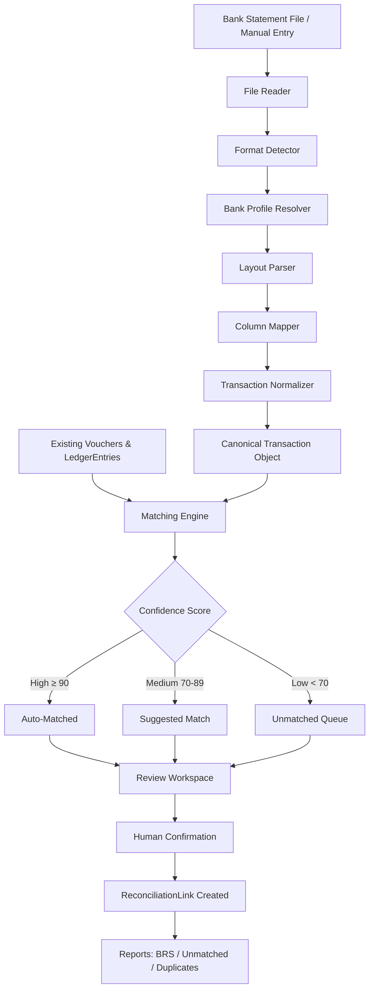
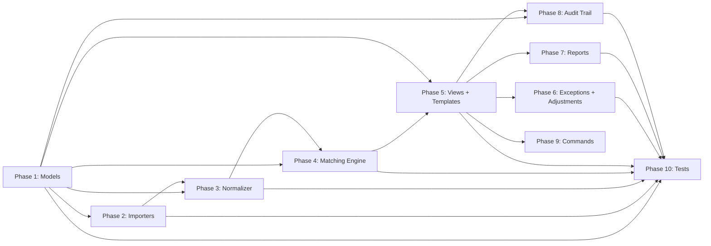

# Bank Reconciliation Engine — Execution Plan

**Based on:** [`bank_reconciliation_engine_design.md`](bank_reconciliation_engine_design.md)
**Status:** Ready for Implementation
**Target App:** [`reconciliation/`](../reconciliation/)

---

## Architecture Overview



---

## Phase 1: Core Data Models

**File:** `reconciliation/models.py`

Define the persistence layer for import, parsing metadata, normalization, reconciliation, and audit history. All are society-scoped and audit-trailed.

### 1.1 BankStatementImport

| Field | Type | Notes |
|---|---|---|
| `bank_account` | FK → `Account` | `limit_choices_to={'is_bank': True}` |
| `society` | FK → `Society` | Scoping |
| `file_name` | CharField(255) | Original filename |
| `file_hash` | CharField(64) | SHA-256 for dedup |
| `uploaded_by` | FK → `User` | |
| `uploaded_at` | DateTime | auto_now_add |
| `statement_start_date` | DateField | |
| `statement_end_date` | DateField | |
| `import_status` | CharField | PENDING / PROCESSING / COMPLETED / FAILED |
| `raw_file` | FileField | Stored permanently |
| `error_log` | TextField | blank=True |
| `source_type` | CharField | FILE / MANUAL / COPY_PASTE |

### 1.2 BankTransaction

| Field | Type | Notes |
|---|---|---|
| `bank_statement_import` | FK → `BankStatementImport` | CASCADE |
| `source_row_index` | IntegerField | Row number from source or manual grid |
| `transaction_date` | DateField | db_index |
| `value_date` | DateField | null=True |
| `narration` | TextField | Raw, immutable |
| `reference_no` | CharField(120) | db_index |
| `cheque_no` | CharField(30) | blank=True |
| `amount` | DecimalField(12,2) | |
| `dr_cr` | CharField(6) | DEBIT / CREDIT |
| `balance` | DecimalField(12,2) | null=True |
| `raw_row_data` | JSONField | Complete row preserved |
| `duplicate_hash` | CharField(64) | date+amount+narration+ref hash |

### 1.3 BankParserProfile

| Field | Type | Notes |
|---|---|---|
| `society` | FK → `Society` | Scope |
| `bank_name` | CharField(100) | HDFC, SBI, ICICI, etc. |
| `format_name` | CharField(120) | HDFC_RETAIL_XLSX_V2, etc. |
| `file_type` | CharField(20) | CSV / XLS / XLSX / PDF / TXT / JSON |
| `header_signature` | JSONField | Known headers / sheet names / layout clues |
| `parser_class` | CharField(255) | Dotted import path |
| `is_active` | BooleanField | Enable or disable support |
| `priority` | IntegerField | Resolve overlaps |
| `confidence_floor` | IntegerField | Minimum detection confidence |
| `notes` | TextField | blank=True |

### 1.4 BankTransactionNormalized

| Field | Type | Notes |
|---|---|---|
| `bank_transaction` | OneToOneField → `BankTransaction` | CASCADE |
| `cleaned_narration` | TextField | |
| `extracted_utr` | CharField(64) | blank=True |
| `extracted_flat_no` | CharField(20) | blank=True |
| `extracted_reference` | CharField(120) | blank=True |
| `extracted_amount_words` | CharField(255) | blank=True |
| `normalized_at` | DateTime | auto_now_add |

### 1.5 ReconciliationLink

| Field | Type | Notes |
|---|---|---|
| `society` | FK → `Society` | Scoping |
| `voucher_entry` | FK → `LedgerEntry` | Accounting side |
| `bank_transaction` | FK → `BankTransaction` | Bank side |
| `matched_amount` | DecimalField(12,2) | |
| `match_type` | CharField(20) | EXACT / PARTIAL / SPLIT / FORCE |
| `confidence_score` | IntegerField | 0-100 |
| `matched_by` | FK → `User` | |
| `matched_at` | DateTime | |
| `is_manual` | BooleanField | |
| `remarks` | TextField | blank=True |
| `status` | CharField(20) | PENDING / SUGGESTED / MATCHED / PARTIAL / DUPLICATE / EXCEPTION / REVERSED / FORCE_MATCHED / IGNORED |

### 1.6 ReconciliationHistory

| Field | Type | Notes |
|---|---|---|
| `reconciliation_link` | FK → `ReconciliationLink` | CASCADE |
| `action` | CharField(30) | CREATED / UPDATED / UNMATCHED / REVERSED |
| `previous_status` | CharField(20) | |
| `new_status` | CharField(20) | |
| `performed_by` | FK → `User` | |
| `performed_at` | DateTime | auto_now_add |
| `details` | JSONField | Additional context |

### Migration Path

1. Write all models in `reconciliation/models.py`
2. Run `python manage.py makemigrations reconciliation`
3. Run `python manage.py migrate reconciliation`
4. Register in Django Admin via `reconciliation/admin.py`

---

## Phase 2: File Reading, Detection, and Parser Services

**Directory:** `reconciliation/services/`

### 2.1 File Structure

| File | Purpose |
|---|---|
| `reconciliation/services/__init__.py` | Package init |
| `reconciliation/services/importer.py` | Base importer + factory |
| `reconciliation/services/file_reader.py` | Safe file opening and raw row extraction |
| `reconciliation/services/detector.py` | File type and bank format detector |
| `reconciliation/services/profile_resolver.py` | BankParserProfile lookup and priority resolution |
| `reconciliation/services/parsers/base.py` | Base parser interface |
| `reconciliation/services/parsers/registry.py` | Parser registration and lookup |
| `reconciliation/services/parsers/generic_parser.py` | Generic fallback parser |
| `reconciliation/services/parsers/hdfc/*.py` | HDFC format-specific parsers |
| `reconciliation/services/parsers/sbi/*.py` | SBI format-specific parsers |
| `reconciliation/services/parsers/icici/*.py` | ICICI format-specific parsers |
| `reconciliation/services/parsers/__init__.py` | Parser package init |
| `reconciliation/services/manual_entry.py` | Manual statement entry import path |

### 2.2 Implementation Details

- **Base Importer** (`importer.py`): Abstract class with `parse(file) -> list[CanonicalTransaction]`, `validate(row) -> bool`, file hash computation, and source metadata handling
- **File Reader**: Opens CSV/XLSX safely, detects encoding and delimiter, extracts sheets/rows, and preserves raw row payloads
- **Format Detector**: Produces `{bank, format, file_type, confidence}` using headers, sheet names, balance columns, narration patterns, and metadata
- **Profile Resolver**: Chooses the active `BankParserProfile` with the best confidence and priority for the society
- **Parser Registry**: Maps resolved bank format to a parser class, with `generic` fallback only when confidence is acceptable
- **Manual Entry Path**: Accept pasted rows or spreadsheet-style input and persist them through the same `BankStatementImport` and `BankTransaction` models with `source_type=MANUAL` or `COPY_PASTE`
- **Import Workflow**:
  1. Compute SHA-256 of uploaded file or deterministic source hash for pasted/manual batches
  2. Create `BankStatementImport` with status=PROCESSING and `source_type`
  3. Read raw input via file reader or manual grid adapter
  4. Detect bank format and resolve parser profile
  5. Parse to canonical transactions
  6. Normalize and persist `BankTransaction` records in bulk
  7. Populate `BankTransactionNormalized`
  8. Detect internal duplicates via `duplicate_hash`
  9. Mark import COMPLETED or FAILED with `error_log`

### 2.3 Bank Format Support

| Bank | Format | Key Columns |
|---|---|---|
| Generic | CSV / XLSX / copy-paste | Date, Narration, Ref, Amount, Dr/Cr |
| HDFC | Retail / Corporate / NetBanking variants | Date, Narration, Cheque, Withdrawal, Deposit, Balance |
| ICICI | Retail / Corporate variants | Date, Description, Ref No, Debit, Credit, Balance |
| SBI | Legacy / YONO variants | Txn Date, Description, Ref No, Debit, Credit, Balance |
| Future | PDF / OCR / TXT exports | Layout-dependent |

---

## Phase 3: Normalization Layer

**Directory:** `reconciliation/services/`

### 3.1 File: `reconciliation/services/normalizer.py`

Convert parser output into the canonical transaction object and extract structured data from raw bank narration:

1. **UTR Extraction**: Regex patterns for UTR/Transaction Reference Number formats
   - `r'(?:UTR|Ref)(?:\s*No)?[:\-\s]*(\w{8,22})'` (case-insensitive)
   
2. **Flat Number Extraction**: Common patterns in narration
   - `r'(?:Flat|Apt|Unit|#)[\s\-]*([A-Z]?\d{1,4})'`

3. **Amount in Words Extraction**: Parse amount-in-words patterns

4. **Narration Cleaning**: Remove noise, normalize whitespace, lowercase

5. **Trigger**: Called automatically after parsing and before reconciliation. Populates `BankTransactionNormalized`.

6. **Canonical Output**: The normalizer must preserve the raw payload, enrich it, and emit the same internal object shape for downstream matching and reporting.

---

## Phase 4: Matching Engine

**Directory:** `reconciliation/services/`

### 4.1 File: `reconciliation/services/matching.py`

### 4.2 Matching Rules (Priority Order)

| Priority | Rule | Confidence | Logic |
|---|---|---|---|
| 1 | Exact UTR Match | 99 | `Voucher.reference_number` == `extracted_utr` |
| 2 | Exact Cheque Match | 98 | `Voucher.reference_number` == `cheque_no` |
| 3 | Amount + Exact Date | 90 | Same amount + same date |
| 4 | Amount + Near Date (±3 days) | 85 | Same amount within 3-day window |
| 5 | Narration Fuzzy Match | 70 | `difflib.SequenceMatcher.ratio() > 0.80` |
| 6 | Flat Number + Amount | 75 | Extracted flat matches unit in LedgerEntry |

### 4.3 Engine Design

```python
class MatchingEngine:
    def __init__(self, society):
        self.society = society
    
    def run_full_match(self, bank_transactions=None) -> MatchResult:
        """Run all matching rules against all unmatched bank transactions."""
    
    def match_single(self, bank_txn) -> list[Suggestion]:
        """Generate match suggestions for a single bank transaction."""
    
    def confirm_match(self, link_id, user) -> ReconciliationLink:
        """Confirm a suggested match, creating a ReconciliationLink."""
    
    def force_match(self, voucher_entry, bank_txn, user) -> ReconciliationLink:
        """Manual override match."""
    
    def unmatch(self, link_id, user, reason) -> ReconciliationLink:
        """Reverse a previous match."""
```

### 4.4 Auto-Match Threshold

- Confidence ≥ 90: Auto-create `ReconciliationLink` with status=MATCHED
- Confidence 70–89: Create `ReconciliationLink` with status=SUGGESTED
- Confidence < 70: Leave unmatched

### 4.5 Matching Contract

- Matching only consumes canonical transaction objects and ledger entries
- Parser-specific logic must not leak into the matching engine
- AI may suggest candidates, but human approval is required for final financial reconciliation

### 4.6 Split Transaction Support

- One bank entry → many voucher entries: Multiple `ReconciliationLink` rows, `match_type=SPLIT`
- Many vouchers → one bank entry: Same approach, linked to single `BankTransaction`

---

## Phase 5: Reconciliation Workspace + Manual Entry UI (Views + Templates + URLs)

### 5.1 URL Structure

| URL | View | Purpose |
|---|---|---|
| `reconciliation/` | `DashboardView` | Overview dashboard |
| `reconciliation/import/` | `StatementImportView` | Upload bank statement |
| `reconciliation/import/<id>/` | `StatementImportDetailView` | Import results |
| `reconciliation/workspace/` | `WorkspaceView` | Main review workspace |
| `reconciliation/match/<link_id>/` | `ConfirmMatchView` | Confirm/unmatch action |
| `reconciliation/force-match/` | `ForceMatchView` | Manual force-match |
| `reconciliation/split/` | `SplitMatchView` | Split transaction |
| `reconciliation/exceptions/` | `ExceptionListView` | Exception management |
| `reconciliation/reports/brs/` | `BRSReportView` | Bank reconciliation statement |
| `reconciliation/reports/unmatched/` | `UnmatchedReportView` | Unmatched entries |
| `reconciliation/reports/duplicates/` | `DuplicateReportView` | Duplicate transactions |

### 5.2 Files to Create

| File | Purpose |
|---|---|
| `reconciliation/urls.py` | URL configuration |
| `reconciliation/views.py` | All view classes |
| `reconciliation/templates/reconciliation/dashboard.html` | Dashboard |
| `reconciliation/templates/reconciliation/import.html` | Statement upload form |
| `reconciliation/templates/reconciliation/import_detail.html` | Import result |
| `reconciliation/templates/reconciliation/workspace.html` | Review workspace |
| `reconciliation/templates/reconciliation/exceptions.html` | Exception list |
| `reconciliation/templates/reconciliation/report_brs.html` | BRS report |
| `reconciliation/templates/reconciliation/report_unmatched.html` | Unmatched report |
| `reconciliation/templates/reconciliation/manual_entry.html` | Spreadsheet-style manual entry screen |

### 5.3 Workspace UI Design

Keyboard shortcuts (per design doc §17.2):

| Key | Action |
|---|---|
| `M` | Match selected pair |
| `U` | Unmatch |
| `D` | Flag as duplicate |
| `A` | Create adjustment entry |
| `S` | Split transaction |

Layout: Left filters panel, Center transaction grid, Right suggestions panel.

### 5.4 Manual Statement Entry Workflow

This is not a separate data model. It is a first-class import path that writes through `BankStatementImport` and `BankTransaction`.

Recommended behavior:

1. Choose bank account and statement period
2. Paste rows or type them into a spreadsheet-style grid
3. Auto-suggest flat numbers, UTRs, and duplicate matches while typing
4. Save as `source_type=MANUAL` or `source_type=COPY_PASTE`
5. Run normalization and matching immediately after save

### 5.5 Integration Point

Register URL in [`config/urls.py`](../config/urls.py):
```python
path("reconciliation/", include("reconciliation.urls", namespace="reconciliation")),
```

---

## Phase 6: Exception Management & Adjustment Workflows

### 6.1 Exception Types

| Type | Side | Description |
|---|---|---|
| `BOOK_ONLY` | Book | Entry in books, missing in bank |
| `BANK_ONLY` | Bank | Entry in bank, missing in books |
| `AMOUNT_MISMATCH` | Both | Same ref but different amounts |
| `DATE_MISMATCH` | Both | Same amount but far dates |
| `DUPLICATE_BOOK` | Book | Possible duplicate in accounting |
| `DUPLICATE_BANK` | Bank | Possible duplicate in statement |

### 6.2 Adjustment Workflow

File: `reconciliation/services/adjustments.py`

When a BANK_ONLY exception is detected (e.g., bank charges ₹17):
1. System flags as EXCEPTION
2. User can click "Create Adjustment Voucher"
3. System pre-fills a Voucher form with:
   - Account: Bank Charges Expense (configured per society)
   - Amount: ₹17
   - Narration: "Bank charges as per statement dated ..."
   - Payment mode: BANK_TRANSFER
4. On posting, the voucher's LedgerEntry becomes available for reconciliation

---

## Phase 7: Reconciliation Reports

### 7.1 Bank Reconciliation Statement (BRS)

File: `reconciliation/services/reporting.py`

Standard BRS format:
1. Start with Book Balance (sum of bank account ledger)
2. Add: Book entries not yet in bank (uncleared deposits)
3. Less: Bank entries not in books (bank charges, interest)
4. Less: Uncleared cheques (payment vouchers not cleared)
5. = Reconciled Balance (should match bank statement closing balance)

### 7.2 Additional Reports

| Report | Description |
|---|---|
| Unmatched Book Entries | Voucher entries with no bank match |
| Unmatched Bank Entries | Bank transactions with no voucher match |
| Duplicate Report | Flagged duplicates from both sides |
| Exception Report | All items in EXCEPTION status |
| Reconciliation Summary | Counts by status, period-over-period |

---

## Phase 8: Audit Trail

### 8.1 Implementation

- `ReconciliationHistory` model (defined in Phase 1) records every state change
- Signal-based: `post_save` on `ReconciliationLink` triggers history entry when status changes
- All history records include `performed_by`, `performed_at`, `previous_status`, `new_status`

### 8.2 Audit Log Views

| View | Purpose |
|---|---|
| Link history detail | Timeline of a single reconciliation |
| User activity log | All actions by a user |
| Period audit report | All reconciliation actions in a date range |

---

## Phase 9: Management Commands

**Directory:** `reconciliation/management/commands/`

| Command | Purpose |
|---|---|
| `run_reconciliation.py` | Trigger auto-matching for a society |
| `import_statement.py` | CLI statement import (for automation) |
| `reconciliation_report.py` | Generate BRS via CLI |
| `cleanup_stale_imports.py` | Remove failed imports older than N days |

### 9.1 `run_reconciliation` Options

```
--society-id    Society to reconcile
--period        Month/date range
--auto-confirm  Auto-confirm high-confidence matches
--dry-run       Preview only, no DB changes
```

---

## Phase 10: Test Suite

**Directory:** `reconciliation/tests/`

### 10.1 Test Files

| File | Coverage |
|---|---|
| `test_models.py` | Model validation, constraints, relationships |
| `test_detector.py` | File type and bank format detection |
| `test_profiles.py` | BankParserProfile resolution and priority handling |
| `test_import.py` | CSV/XLSX/manual parsing, duplicate detection, error handling |
| `test_normalizer.py` | UTR extraction, narration cleaning, flat number parsing |
| `test_matching.py` | Each matching rule, confidence scoring, auto-match threshold |
| `test_reconciliation_links.py` | Create, unmatch, partial, split, force-match |
| `test_views.py` | Dashboard, workspace, import, report views |
| `test_commands.py` | Management command execution |
| `test_audit_trail.py` | History creation, immutability checks |

### 10.2 Key Test Scenarios

1. **Import**: Upload CSV → verify BankTransaction count, hash detection, duplicate rejection
2. **Manual Entry**: Paste rows into manual grid → verify same persistence path and source_type
3. **Detection**: Known HDFC format → verify detector confidence and profile selection
4. **Normalization**: Bank narration with UTR → verify extracted_utr populated
5. **Exact Match**: Voucher with UTR "ABC123" + bank transaction with same UTR → confidence 99, auto-matched
6. **Partial Match**: ₹5000 book vs ₹4998 bank → status PARTIAL, amount difference stored
7. **Split Match**: One ₹15000 bank entry matched to 3x ₹5000 vouchers
8. **Unmatch**: MATCHED link → REVERSED, history recorded
9. **Duplicate Detection**: Same file hash → import rejected
10. **Audit**: All status changes → ReconciliationHistory entries created

---

## Implementation Order & Dependencies



Phases 1-4 are foundational and must be completed first. Phases 5-8 build on them and can proceed in parallel after Phase 4. Phase 10 (tests) should be written alongside each phase.

---

## Files to Modify (Outside reconciliation/)

| File | Change |
|---|---|
| [`config/urls.py`](../config/urls.py) | Add `path("reconciliation/", ...)` |
| [`config/settings/base.py`](../config/settings/base.py) | Already has `reconciliation` in INSTALLED_APPS — verify |
| [`reconciliation/admin.py`](new) | Register all models in Django Admin |

---

## Risk Areas & Design Decisions

1. **Matching engine performance**: For large datasets, add Celery async task for `run_full_match()`. Index `reference_no`, `cheque_no`, `extracted_utr`, `duplicate_hash`.
2. **Bank format diversity**: The parser factory pattern allows adding new bank formats without changing core logic.
3. **Immutable bank data**: `BankTransaction` has no `save()` override that modifies data — it's insert-only. Use `get_or_create` with the duplicate hash.
4. **ReconciliationLink many-to-many**: A single `LedgerEntry` can link to multiple `BankTransaction` records and vice versa. The `matched_amount` field tracks partial matches.
5. **No changes to existing accounting models**: The design principle of never modifying original vouchers/entries is preserved — reconciliation only references them.
