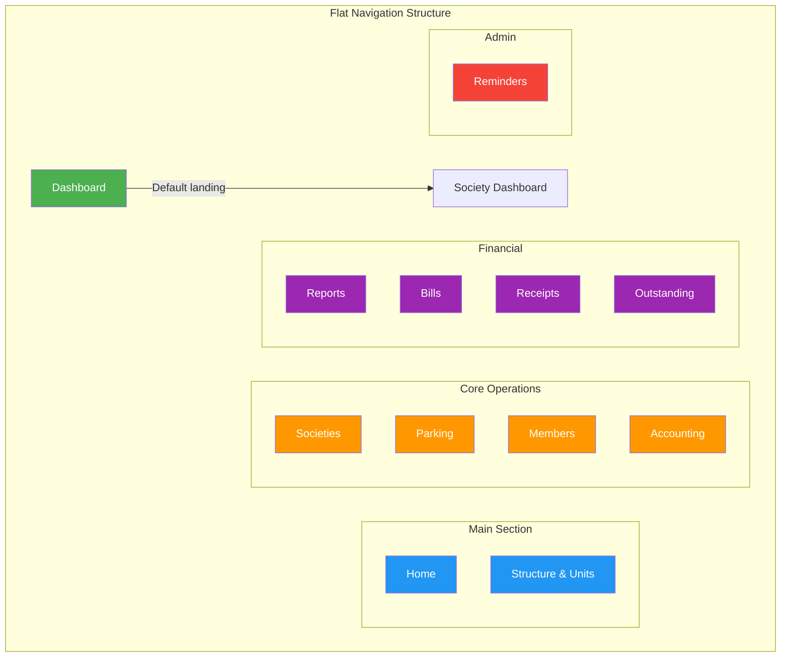

# Flat Navigation Architecture Plan

## Current State Analysis

### Existing Submenu Structure
1. **Society** → Admin, All Societies
2. **Parking** → Slots, Vehicles, Vehicle Limits
3. **Members** → Member List
4. **Accounting** → Reports, Accounts, Vouchers
5. **Reminders** → Reminder List, Schedule Reminder
6. **Billing** → Charge Templates, Bills, Outstanding
7. **Receipts** → Receipts

### Root Cause of Jitter
- Bootstrap collapse plugin with `collapseAllSubmenus()` in `project.js` (lines 30-46)
- Multiple DOM manipulations on click events
- CSS transitions conflicting with Bootstrap's animation

---

## Proposed Flat Navigation Design

### Navigation Architecture (No Submenus)

```
MAIN
├── Dashboard (NEW - direct shortcut)
├── Home
└── Structure & Units

CORE OPERATIONS
├── Societies (links directly to society-list)
├── Parking (links directly to parking dashboard)
├── Members (links directly to member-list)
└── Accounting (links directly to accounting dashboard)

FINANCIAL MANAGEMENT
├── Reports (direct link to reports index)
├── Bills (direct link to bill-list)
├── Receipts (direct link to receipt-list)
└── Outstanding (direct link to outstanding dashboard)

ADMINISTRATION
├── Reminders (direct link to reminder-list)
└── [Future admin items]
```

### Dashboard Integration Strategy

**Primary Dashboard Access:**
- Add "Dashboard" as first item in Main section
- Links to `housing:dashboard` (society dashboard)
- Icon: `fa-tachometer-alt` or `fa-dashboard`
- Active state: `current_namespace == 'housing' and current_url_name == 'dashboard'`

---

## Implementation Plan

### Step 1: Update base.html Navigation Structure

**Remove:**
- All `<div class="collapse" id="...">` submenu containers
- All `submenu-link` and `data-submenu-target` attributes
- All `submenu-caret` spans
- All nested `<ul class="nav nav-collapse">` elements

**Add:**
- Flat navigation items with direct links
- Dashboard shortcut as first item
- Proper active state detection for all pages

**New Navigation Structure:**
```html
<ul class="nav nav-secondary" role="navigation" aria-label="Main Navigation">
  <li class="nav-section">
    <span class="sidebar-mini-icon"><i class="fa fa-ellipsis-h"></i></span>
    <h4 class="text-section"></h4>
  </li>

  <li class="nav-item active">
    <a href="" aria-label="Dashboard">
      <i class="fas fa-tachometer-alt"></i>
      <p></p>
    </a>
  </li>

  <li class="nav-item active">
    <a href="" aria-label="Home">
      <i class="fas fa-home"></i>
      <p></p>
    </a>
  </li>

  <li class="nav-item active">
    <a href="">
      <i class="fas fa-sitemap"></i>
      <p></p>
    </a>
  </li>

  <li class="nav-section">
    <h4 class="text-section"></h4>
  </li>

  <li class="nav-item active">
    <a href="">
      <i class="fas fa-building"></i>
      <p></p>
    </a>
  </li>

  <li class="nav-item active">
    <a href="">
      <i class="fas fa-parking"></i>
      <p></p>
    </a>
  </li>

  <li class="nav-item active">
    <a href="">
      <i class="fas fa-users"></i>
      <p></p>
    </a>
  </li>

  <li class="nav-item active">
    <a href="">
      <i class="fas fa-calculator"></i>
      <p></p>
    </a>
  </li>

  <li class="nav-section">
    <h4 class="text-section"></h4>
  </li>

  <li class="nav-item active">
    <a href="">
      <i class="fas fa-chart-bar"></i>
      <p></p>
    </a>
  </li>

  <li class="nav-item active">
    <a href="">
      <i class="fas fa-file-invoice-dollar"></i>
      <p></p>
    </a>
  </li>

  <li class="nav-item active">
    <a href="">
      <i class="fas fa-receipt"></i>
      <p></p>
    </a>
  </li>

  <li class="nav-item active">
    <a href="">
      <i class="fas fa-exclamation-triangle"></i>
      <p></p>
    </a>
  </li>

  <li class="nav-section">
    <h4 class="text-section"></h4>
  </li>

  <li class="nav-item active">
    <a href="">
      <i class="fas fa-bell"></i>
      <p></p>
    </a>
  </li>
</ul>
```

---

### Step 2: Remove Submenu JavaScript

**File:** `staticfiles/js/project.js`

**Remove:**
- Lines 20-22: `submenuLinks` query selector
- Lines 25-74: `getSubmenuPanel()`, `collapseAllSubmenus()`, `toggleSubmenuByLink()`, `isCaretZoneClick()` functions
- Lines 110-127: Submenu click event handlers

**Keep:**
- Sidebar toggle functionality (lines 76-95, 129-136)
- Sidenav toggle functionality (lines 89-95, 138-144)
- Topbar toggle functionality (lines 97-103, 146-151)
- Voucher detail modal logic

**Simplified `initLayoutToggles()` function:**
```javascript
const initLayoutToggles = () => {
  const wrapper = document.querySelector(".wrapper");
  if (!wrapper) return;

  const htmlElement = document.documentElement;
  const sidebarToggles = Array.from(document.querySelectorAll(".toggle-sidebar"));
  const sidenavToggles = Array.from(document.querySelectorAll(".sidenav-toggler"));
  const topbarToggles = Array.from(document.querySelectorAll(".topbar-toggler"));

  const syncSidebarToggleState = () => {
    const isMinimized = wrapper.classList.contains("sidebar_minimize");
    sidebarToggles.forEach((button) => {
      button.classList.toggle("toggled", isMinimized);
      button.setAttribute("aria-expanded", String(!isMinimized));
      const icon = button.querySelector("i");
      if (icon) {
        icon.className = isMinimized ? "gg-more-vertical-alt" : "gg-menu-right";
      }
    });
  };

  const syncSidenavToggleState = () => {
    const isOpen = htmlElement.classList.contains("nav_open");
    sidenavToggles.forEach((button) => {
      button.classList.toggle("toggled", isOpen);
      button.setAttribute("aria-expanded", String(isOpen));
    });
  };

  const syncTopbarToggleState = () => {
    const isOpen = htmlElement.classList.contains("topbar_open");
    topbarToggles.forEach((button) => {
      button.classList.toggle("toggled", isOpen);
      button.setAttribute("aria-expanded", String(isOpen));
    });
  };

  syncSidebarToggleState();
  syncSidenavToggleState();
  syncTopbarToggleState();

  document.addEventListener("click", (event) => {
    const sidebarToggle = event.target.closest(".toggle-sidebar");
    if (sidebarToggle) {
      event.preventDefault();
      event.stopPropagation();
      wrapper.classList.toggle("sidebar_minimize");
      syncSidebarToggleState();
      window.dispatchEvent(new Event("resize"));
      return;
    }

    const sidenavToggle = event.target.closest(".sidenav-toggler");
    if (sidenavToggle) {
      event.preventDefault();
      event.stopPropagation();
      htmlElement.classList.toggle("nav_open");
      syncSidenavToggleState();
      return;
    }

    const topbarToggle = event.target.closest(".topbar-toggler");
    if (topbarToggle) {
      event.preventDefault();
      event.stopPropagation();
      htmlElement.classList.toggle("topbar_open");
      syncTopbarToggleState();
    }
  }, true);
};
```

---

### Step 3: Update CSS for Jitter-Free Transitions

**File:** `staticfiles/css/project.css`

**Add/Update:**
```css
/* ========== Sidebar Base Styles ========== */
.sidebar .nav-secondary {
  padding: 0.5rem 0;
}

.sidebar .nav-item {
  transition: background-color 0.15s ease;
}

.sidebar .nav-item a {
  transition: color 0.15s ease, background-color 0.15s ease;
}

/* Remove collapse-related styles */
.sidebar .collapse,
.sidebar .collapsing {
  display: none !important;
}

/* Smooth sidebar minimize transition */
.sidebar {
  transition: width 0.3s ease;
}

.wrapper.sidebar_minimize .sidebar {
  transition: width 0.3s ease;
}

/* Active state animation */
.sidebar .nav-item.active > a {
  position: relative;
  transition: all 0.2s ease;
}

.sidebar .nav-item.active > a::before {
  content: '';
  position: absolute;
  left: 0;
  top: 50%;
  transform: translateY(-50%);
  width: 3px;
  height: 60%;
  background: var(--color-primary);
  border-radius: 0 2px 2px 0;
  transition: height 0.2s ease;
}
```

**File:** `staticfiles/css/components.css`

Remove any submenu-specific styles if present.

---

### Step 4: Active State Detection Logic

**Create a template tag helper** (optional, for cleaner template code):

```python
# housing_accounting/templatetags/nav_helpers.py
from django import template

register = template.Library()

@register.simple_tag
def nav_active(request, namespace, url_names):
    """
    Check if current page matches navigation item.
    Usage: 
    """
    current_namespace = request.resolver_match.namespace
    current_url_name = request.resolver_match.url_name
    
    if isinstance(url_names, str):
        url_names = [u.strip() for u in url_names.split(',')]
    
    if namespace and current_namespace == namespace:
        if not url_names or current_url_name in url_names:
            return 'active'
    
    return ''
```

**Simplified template usage:**
```html
<li class="nav-item active">
  <!-- OR with helper -->
<li class="nav-item {{ request|nav_active:'housing,dashboard' }}">
```

---

### Step 5: Preserve Page Accessibility

**Ensure all current pages remain accessible through:**

1. **Direct navigation links** in sidebar
2. **Breadcrumbs** for hierarchical navigation
3. **Action buttons** within pages (e.g., "Add Member" on member list)
4. **Quick cards** on dashboard for common tasks

**Pages to preserve:**
- Society Admin (`housing:society-admin`)
- Society List (`housing:society-list`)
- Society Add (`housing:society-add`)
- Structure Add (`housing:structure-add`)
- Unit Add (`housing:unit-add`)
- Unit Bulk Add (`housing:unit-bulk-add`)
- Ownership Add (`housing:ownership-add`)
- Occupancy Add (`housing:occupancy-add`)
- Member Add (`housing:member-add`)
- Member Edit (`housing:member-edit`)
- Parking Slots (`parking:slot-list`)
- Parking Vehicles (`parking:vehicle-list`)
- Parking Limits (`parking:limit-list`)
- Accounting Accounts (`accounting:account-list`)
- Accounting Vouchers (`accounting:voucher-list`)
- Reports Index (`reports:index`)
- Charge Templates (`billing:charge-template-list`)
- Bills (`billing:bill-list`)
- Receipts (`receipts:receipt-list`)
- Outstanding (`housing:outstanding-dashboard`)
- Reminders (`notifications:reminder-list`)
- Reminder Schedule (`housing:reminder-schedule`)

---

## Mermaid Diagram: Navigation Flow



---

## Testing Checklist

- [ ] Dashboard link appears first in Main section
- [ ] All navigation items are flat (no expandable submenus)
- [ ] Clicking any nav item navigates directly (no collapse animation)
- [ ] Active state highlights correctly for all pages
- [ ] No JavaScript errors in console
- [ ] Sidebar minimize/expand works smoothly
- [ ] No jitter or layout shift on click
- [ ] Mobile responsive behavior works
- [ ] All original pages still accessible
- [ ] Breadcrumbs show correct hierarchy
- [ ] Keyboard navigation works (Tab, Enter, Arrow keys)
- [ ] Screen reader announces navigation correctly

---

## Benefits of Flat Navigation

1. **Eliminates jitter**: No more Bootstrap collapse animations
2. **Faster navigation**: One click to reach any page
3. **Simpler code**: Remove ~50 lines of submenu JavaScript
4. **Better UX**: Clear, predictable navigation
5. **Accessible**: Easier for screen readers to parse
6. **Maintainable**: Less complex HTML and JS

---

## Rollback Plan

If issues arise, revert:
1. `git checkout housing_accounting/templates/base.html`
2. `git checkout staticfiles/js/project.js`
3. `git checkout staticfiles/css/project.css`

---

## Estimated Files to Modify

| File | Change Type |
|------|-------------|
| `housing_accounting/templates/base.html` | Major (restructure nav) |
| `staticfiles/js/project.js` | Moderate (remove submenu JS) |
| `staticfiles/css/project.css` | Minor (add smooth transitions) |
| `staticfiles/css/components.css` | Minor (if submenu styles exist) |
| `housing_accounting/templatetags/nav_helpers.py` | Optional (new file for helpers) |
