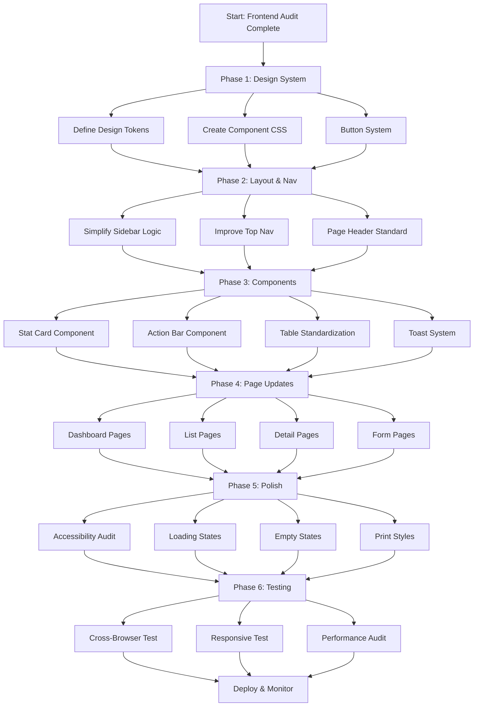

# Frontend Overhaul Plan: Housing Accounting System

## Executive Summary

Based on comprehensive audit of the current frontend, this plan addresses critical design flaws and proposes a user-friendly, responsive, production-ready interface. The current system uses Kaiadmin Lite but suffers from inconsistent styling, overcrowded interfaces, and poor mobile experience.

---

## Current State Analysis

### Critical Design Flaws Identified

| Issue Category | Specific Problems | Impact |
|----------------|-------------------|--------|
| **Inconsistent Styling** | `btn-main` and `btn-plus` classes used but not defined in CSS | Broken buttons, unpredictable behavior |
| **Overcrowded Actions** | Page-actions areas with 6-8 buttons crammed together | Poor UX, mobile unusable |
| **Mixed Card Styles** | `quick-card` vs `card h-100 shadow-sm` inconsistency | Visual confusion |
| **Sidebar Complexity** | Massive template conditionals for active states | Hard to maintain, buggy |
| **Form Inconsistencies** | Some forms not using BootstrapModelForm properly | Inconsistent validation display |
| **Mobile Experience** | Tables not truly mobile-friendly, tiny touch targets | Poor mobile usability |
| **No Loading States** | No feedback during async operations | User confusion |
| **Accessibility Gaps** | Missing ARIA labels, poor focus management | Excludes users with disabilities |
| **No Toast System** | Basic Django messages only | Poor user feedback |

---

## Target State Requirements

### Design Principles
1. **Mobile-First**: Design for mobile, enhance for desktop
2. **Consistency**: Unified design language across all pages
3. **Clarity**: Clear visual hierarchy and information architecture
4. **Accessibility**: WCAG 2.1 AA compliance
5. **Performance**: Minimal JS, optimized CSS, fast loads
6. **Maintainability**: Component-based, easy to extend

### Technical Requirements
- Bootstrap 5.3+ with custom design tokens
- CSS custom properties for theming
- Vanilla JS (no heavy frameworks)
- Django templates with consistent blocks
- Responsive tables with horizontal scroll on mobile
- Toast notification system
- Loading skeletons/states

---

## Implementation Plan

### Phase 1: Design System Foundation (Days 1-3)

#### Task 1.1: Define Design Tokens
**File**: `staticfiles/css/design-tokens.css`

```css
:root {
  /* Colors */
  --color-primary: #177dff;
  --color-primary-hover: #1366d6;
  --color-success: #1f9d46;
  --color-warning: #f9b115;
  --color-danger: #b42318;
  --color-info: #0ea5e9;
  
  /* Spacing */
  --space-xs: 0.25rem;
  --space-sm: 0.5rem;
  --space-md: 1rem;
  --space-lg: 1.5rem;
  --space-xl: 2rem;
  
  /* Border Radius */
  --radius-sm: 6px;
  --radius-md: 10px;
  --radius-lg: 12px;
  
  /* Typography */
  --font-size-xs: 0.75rem;
  --font-size-sm: 0.875rem;
  --font-size-base: 1rem;
  --font-size-lg: 1.125rem;
  
  /* Shadows */
  --shadow-sm: 0 1px 3px rgba(0,0,0,0.08);
  --shadow-md: 0 4px 12px rgba(0,0,0,0.1);
  --shadow-lg: 0 10px 30px rgba(0,0,0,0.12);
}
```

#### Task 1.2: Create Component CSS
**File**: `staticfiles/css/components.css`

Components to define:
- Button variants (primary, secondary, outline, ghost, danger)
- Card variants (stat-card, content-card, action-card)
- Table enhancements (striped, hover, compact)
- Form styling (floating labels, validation states)
- Badge variants (status-based colors)
- Toast notifications
- Skeleton loaders
- Empty states

#### Task 1.3: Define Button System
Replace inconsistent `btn-main` and `btn-plus` with:

```css
/* Standard buttons */
.btn-action {
  display: inline-flex;
  align-items: center;
  gap: 0.5rem;
  padding: 0.5rem 1rem;
  font-weight: 600;
  border-radius: var(--radius-sm);
  transition: all 0.2s ease;
}

.btn-action-icon {
  width: 36px;
  height: 36px;
  padding: 0;
  display: inline-flex;
  align-items: center;
  justify-content: center;
  border-radius: var(--radius-sm);
}

/* Action groups */
.action-bar {
  display: flex;
  flex-wrap: wrap;
  gap: 0.5rem;
  align-items: center;
  margin-bottom: var(--space-lg);
}

.action-bar--responsive {
  @media (max-width: 768px) {
    flex-direction: column;
    align-items: stretch;
  }
}
```

---

### Phase 2: Core Layout & Navigation (Days 4-6)

#### Task 2.1: Simplify Sidebar Active State Logic
**File**: `housing_accounting/templates/base.html`

**Problem**: Massive conditionals like:
```django

```

**Solution**: Create template tags for active state detection.

**File**: `housing_accounting/templatetags/nav_helpers.py`
```python
from django import template
register = template.Library()

@register.simple_tag
def nav_active(request, namespace, *url_names):
    current = request.resolver_match
    if current.namespace == namespace and current.url_name in url_names:
        return 'active'
    return ''
```

Usage:
```django
<li class="nav-item ">
```

#### Task 2.2: Improve Top Navigation
- Make society/financial year selector sticky on mobile
- Add hamburger menu for mobile actions
- Improve user dropdown

#### Task 2.3: Create Responsive Page Header
Standardize page headers with:
- Breadcrumb navigation
- Page title with icon
- Action buttons (responsive: dropdown on mobile)
- Context badges (role, society)

---

### Phase 3: Component Standardization (Days 7-10)

#### Task 3.1: Create Stat Card Component
**File**: `housing_accounting/templates/components/stat_card.html`

```django

<div class="stat-card">
  <div class="stat-card-icon bg-{{ color|default:'primary' }}-subtle">
    <i class="{{ icon }} text-{{ color|default:'primary' }}"></i>
  </div>
  <div class="stat-card-content">
    <p class="stat-card-label">{{ label }}</p>
    <h3 class="stat-card-value">{{ value }}</h3>
    
      <p class="stat-card-subtitle">{{ subtitle }}</p>
    
  </div>
</div>
```

#### Task 3.2: Create Action Bar Component
**File**: `housing_accounting/templates/components/action_bar.html`

```django

<div class="action-bar action-bar--responsive">
  
    <a href="{{ back_url }}" class="btn btn-outline-secondary">
      <i class="fas fa-arrow-left me-1"></i>
    </a>
  
  
  <div class="action-bar-group">
    
      <a href="{{ action.url }}" class="btn btn-{{ action.style|default:'outline-primary' }}">
        <i class="{{ action.icon }} me-1"></i>
        {{ action.label }}
      </a>
    
  </div>
  
  
    <div class="dropdown d-md-none">
      <button class="btn btn-outline-secondary" data-bs-toggle="dropdown">
        <i class="fas fa-ellipsis-v"></i>
      </button>
      <ul class="dropdown-menu">
        
          <li><a class="dropdown-item" href="{{ action.url }}">{{ action.label }}</a></li>
        
      </ul>
    </div>
  
</div>
```

#### Task 3.3: Standardize Table Component
Create responsive table wrapper with:
- Search/filter bar
- Pagination that collapses on mobile
- Empty state illustration
- Bulk actions support

#### Task 3.4: Create Toast Notification System
**File**: `staticfiles/js/toast.js`

```javascript
class ToastManager {
  show(message, type = 'info', duration = 3000) {
    // Create toast element
    // Auto-dismiss with progress bar
    // Stack multiple toasts
  }
}

window.toast = new ToastManager();
```

---

### Phase 4: Page-by-Page Improvements (Days 11-18)

#### Task 4.1: Dashboard Pages
**Files to update**:
- `housing/templates/housing/dashboard.html`
- `accounting/templates/accounting/dashboard.html`
- `parking/templates/parking/dashboard.html`

**Improvements**:
- Replace stats cards with new `stat-card` component
- Add quick action grid (2x2 on mobile, 4x1 on desktop)
- Recent items with better empty states
- Add period selector dropdown

#### Task 4.2: List Pages (Bills, Receipts, Vouchers, etc.)
**Files to update**:
- `billing/templates/billing/bill_list.html`
- `receipts/templates/receipts/receipt_list.html`
- `accounting/templates/accounting/voucher_list.html`
- `notifications/templates/notifications/reminder_list.html`

**Improvements**:
- Add filter/sort bar above table
- Make tables horizontally scrollable on mobile
- Add bulk action checkboxes
- Improve pagination (show "Showing X-Y of Z" text)
- Add "Export to CSV" button

#### Task 4.3: Detail Pages
**Files to update**:
- `housing/templates/housing/society_detail.html`
- `billing/templates/billing/bill_detail.html`
- `receipts/templates/receipts/receipt_detail.html`

**Improvements**:
- Tab-based navigation for sections
- Status timeline for bills/vouchers
- Related items section
- Action buttons in sticky header on mobile

#### Task 4.4: Form Pages
**Files to update**:
- `housing/templates/housing/form.html`
- All forms using `BootstrapModelForm`

**Improvements**:
- Multi-step forms for complex entries (voucher entry)
- Inline validation with clear error messages
- Autosave drafts
- Confirm navigation away with unsaved changes
- Better date picker (flatpickr or similar)

#### Task 4.5: Society Detail Page Overhaul
**File**: `housing/templates/housing/society_detail.html`

**Major improvements needed**:
- Collapse action buttons into responsive dropdown on mobile
- Improve structure hierarchy visualization
- Add search/filter for units
- Better member overview with avatars

---

### Phase 5: Accessibility & Polish (Days 19-21)

#### Task 5.1: Accessibility Audit & Fixes
- Add ARIA labels to all interactive elements
- Ensure proper heading hierarchy (h1 > h2 > h3)
- Add skip navigation link
- Improve focus indicators
- Ensure color contrast meets WCAG AA
- Add keyboard navigation for custom components
- Test with screen readers

#### Task 5.2: Loading States & Feedback
- Add skeleton loaders for async content
- Button loading states (disable + spinner)
- Form submission feedback
- Toast notifications for actions

#### Task 5.3: Empty States
Create illustrated empty states for:
- No societies
- No bills/receipts
- No search results
- No data in charts

#### Task 5.4: Print Styles
Add print-friendly styles for:
- Bills and receipts
- Reports
- Voucher details

---

### Phase 6: Testing & Validation (Days 22-23)

#### Task 6.1: Cross-Browser Testing
- Chrome/Edge (latest)
- Firefox (latest)
- Safari (latest)
- Mobile browsers (iOS Safari, Chrome Android)

#### Task 6.2: Responsive Testing
- 320px (iPhone SE)
- 375px (iPhone 12)
- 768px (iPad)
- 1024px (iPad Pro)
- 1440px (Desktop)

#### Task 6.3: Performance Audit
- Lighthouse score > 90
- First Contentful Paint < 1.5s
- Time to Interactive < 3s
- No render-blocking resources

---

## File Change Summary

### New Files to Create
```
staticfiles/css/design-tokens.css
staticfiles/css/components.css
staticfiles/css/accessibility.css
staticfiles/js/toast.js
staticfiles/js/components.js
housing_accounting/templatetags/nav_helpers.py
housing_accounting/templates/components/stat_card.html
housing_accounting/templates/components/action_bar.html
housing_accounting/templates/components/empty_state.html
housing_accounting/templates/components/pagination.html
```

### Files to Update
```
staticfiles/css/project.css (major refactor)
housing_accounting/templates/base.html (simplify sidebar)
housing/templates/housing/dashboard.html
housing/templates/housing/society_list.html
housing/templates/housing/society_detail.html
housing/templates/housing/form.html
billing/templates/billing/bill_list.html
receipts/templates/receipts/receipt_list.html
accounting/templates/accounting/dashboard.html
accounting/templates/accounting/voucher_entry.html
parking/templates/parking/dashboard.html
reports/templates/reports/index.html
notifications/templates/notifications/reminder_list.html
```

---

## Mermaid Diagram: Implementation Flow



---

## Success Metrics

| Metric | Current | Target |
|--------|---------|--------|
| Mobile Usability | Poor | Good (95+ Lighthouse) |
| Accessibility Score | Unknown | WCAG 2.1 AA |
| CSS Consistency | Low (undefined classes) | High (design tokens) |
| Page Load Speed | Unknown | < 2s FCP |
| Button Style Consistency | 60% | 100% |
| Form Validation UX | Basic | Inline + clear errors |

---

## Risks & Mitigations

| Risk | Impact | Mitigation |
|------|--------|------------|
| Breaking existing templates | High | Test each page after changes |
| Kaiadmin Lite conflicts | Medium | Override with higher specificity |
| IE11 support needed | Low | Modern browser baseline |
| Large template changes | Medium | Incremental updates per phase |

---

## Next Steps

1. Review and approve this plan
2. Switch to Code mode for implementation
3. Start with Phase 1 (Design System Foundation)
4. Commit after each phase completion
