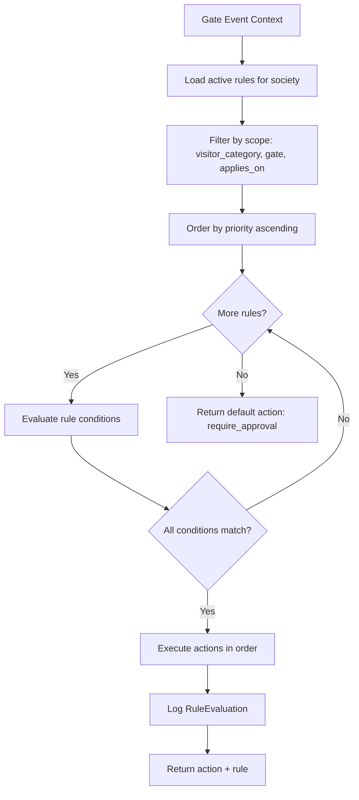
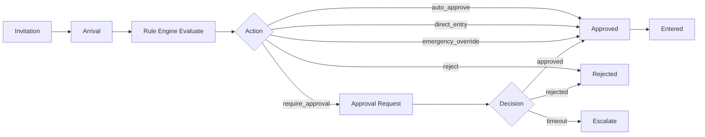
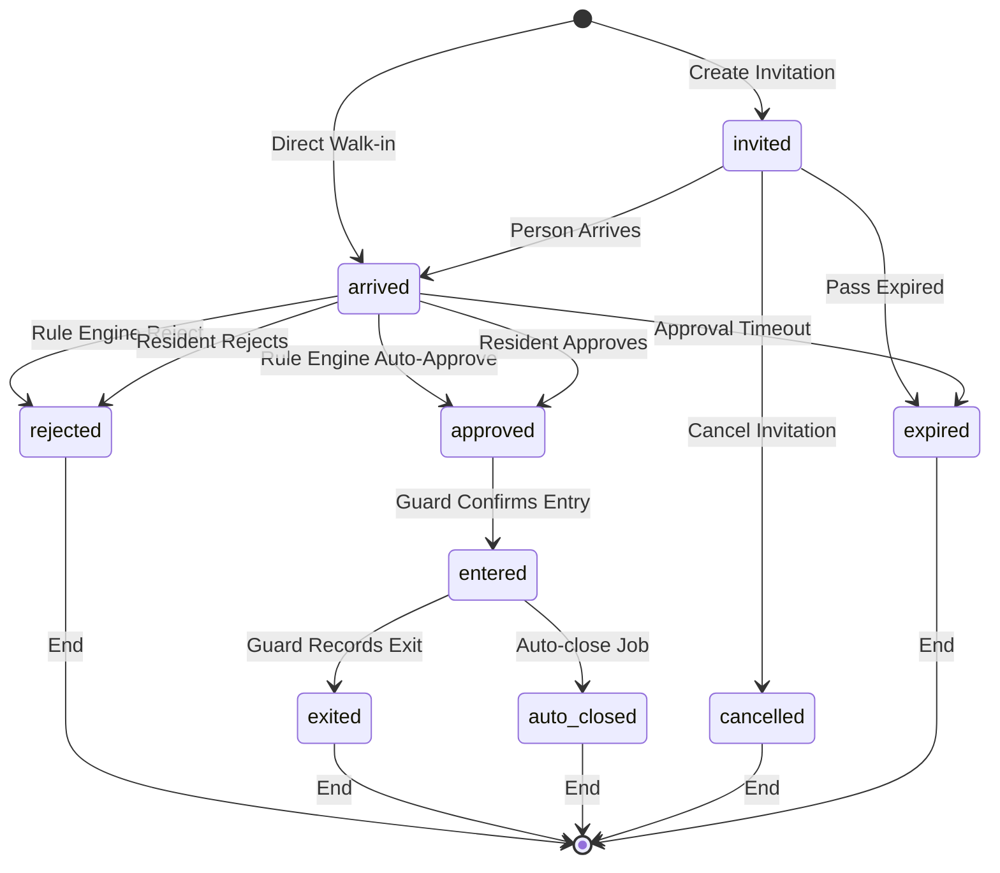

# Housynk Gate Operations Platform — Design Document

> **App name:** `gateops` · **Module:** Visitor Management (Phase 1-3) → Full Gate Operations Platform (Phase 4-18)
> **Status:** Design / Pending Implementation
> **Last updated:** `2026-06-28`

---

## Table of Contents

1. [Executive Summary](#1-executive-summary)
2. [App Structure](#2-app-structure)
3. [Phase 1 — Foundation Models](#3-phase-1--foundation-models-detailed)
4. [Phase 2 — Rule Engine](#4-phase-2--rule-engine-detailed)
5. [Phase 3 — Visitor Lifecycle / Gate Event](#5-phase-3--visitor-lifecycle--gate-event-detailed)
6. [Phases 4-18 — High-Level Outline](#6-phases-4-18--high-level-outline)
7. [Cross-Cutting Concerns](#7-cross-cutting-concerns)
8. [Integration Points](#8-integration-points)
9. [Business Invariants](#9-business-invariants)
10. [Implementation Sequence](#10-implementation-sequence)

---

## 1. Executive Summary

### The "Everything is a Gate Event" Philosophy

The Housynk Gate Operations Platform rejects the traditional "Visitor Register" mental model. Instead, **everything crossing the gate is a Gate Event** — a resident entry, a guest visit, a delivery, a parcel, a domestic helper, a contractor, a taxi, a material movement, an emergency vehicle, or a security incident. Every event has a lifecycle, an audit trail, and produces analytics.

This unification matters because it:

- **Eliminates data duplication** — a single `Person` master record is deduplicated across all event types ("do not duplicate visitor information").
- **Unifies the lifecycle** — entry and exit live in ONE `GateEvent` record (the "Visit Session"), never in separate tables. This prevents the "forgotten exit" problem where exit data lives in a different table that guards forget to update.
- **Enables a single rule engine** — one `Rule` model evaluates every gate decision, regardless of whether the entity is a guest, delivery, or contractor.
- **Produces unified analytics** — one event stream feeds dashboards for visitors, deliveries, contractors, vehicles, and materials.
- **Simplifies the guard UX** — one screen, one flow, one tap pattern for every gate interaction.

### Integration with the Existing `housing_accounting` Project

The `gateops` app is a **new Django app** added to the existing multi-tenant `housing_accounting` project. It reuses — and does NOT duplicate — the following existing infrastructure:

| Existing Component | Reused As | Location |
| --- | --- | --- |
| `Society` (tenant model) | Every `gateops` model's `society` FK | [`societies/models/model_Society.py`](societies/models/model_Society.py:4) |
| `Membership` + `Membership.Role` | RBAC foundation; `gateops` extends with `GateOpsRole` | [`societies/models/model_Membership.py`](societies/models/model_Membership.py:4) |
| `users.User` (`AUTH_USER_MODEL`) | Guard profiles, approvers, audit actors | [`config/settings/base.py`](config/settings/base.py:180) |
| `SocietyMiddleware` (`request.current_society`) | Tenant resolution in every view | [`societies/middleware.py`](societies/middleware.py:5) |
| `Structure` / `Unit` (tower/wing/flat) | Resident & unit resolution for approvals | [`members/models/model_Structure.py`](members/models/model_Structure.py:5), [`members/models/model_Unit.py`](members/models/model_Unit.py:4) |
| `notifications` (EmailQueue/EmailTemplate) | Notification dispatch channel | [`notifications/models/model_EmailQueue.py`](notifications/models/model_EmailQueue.py:5) |
| `notifications/crypto.py` (Fernet) | ID number encryption pattern | [`notifications/crypto.py`](notifications/crypto.py:24) |
| `core/db_router.DatabaseRouter` | Multi-DB routing (gateops stays on `default`) | [`core/db_router.py`](core/db_router.py:3) |
| Audit log pattern (`PeriodStatusLog`, `EmailLog`) | `GateOpsAuditLog` append-only design | [`accounting/models/model_PeriodStatusLog.py`](accounting/models/model_PeriodStatusLog.py:5) |
| Signal bootstrap pattern (`post_save` on `Society`) | Default `VisitorCategory`, `PassType` seeding | [`accounting/signals.py`](accounting/signals.py:21) |

### App Name Justification: `gateops`

The app is named **`gateops`** (Gate Operations) rather than `visitor_management` or `gate` because:

1. **Domain clarity** — "gateops" captures the full scope (visitors, vehicles, materials, parcels, contractors), not just visitors.
2. **Brevity** — short, lowercase, no underscores (matches `parking`, `billing`, `receipts`, `shares`).
3. **Extensibility** — the name accommodates all 18 phases without renaming.
4. **Convention match** — follows the existing single-word app naming (`accounting`, `billing`, `parking`, `receipts`, `shares`, `reports`).

---

## 2. App Structure

### Directory Tree

The `gateops/` app follows the established `models/model_*.py` + `services/` + `signals.py` + `apps.py` convention observed in [`accounting/`](accounting/models/__init__.py:1), [`reconciliation/`](reconciliation/models/__init__.py:1), and [`parking/`](parking/models/__init__.py:1):

```
gateops/
├── __init__.py
├── apps.py                          # GateOpsConfig with ready() importing signals
├── admin.py                         # Admin registrations
├── urls.py                          # URL routing (function-based views)
├── views.py                         # Server-rendered views (crispy-forms/bootstrap5)
├── forms.py                         # crispy-forms form definitions
├── signals.py                       # post_save on Society → bootstrap defaults
├── crypto.py                        # Fernet encryption for Person.id_number (reuses notifications pattern)
│
├── models/
│   ├── __init__.py                  # Re-exports all models with __all__
│   ├── model_GateOpsSocietyConfig.py
│   ├── model_Gate.py
│   ├── model_SecurityGuard.py
│   ├── model_GuardShift.py          # GuardShift + GuardShiftAssignment
│   ├── model_VisitorCategory.py
│   ├── model_VehicleCategory.py
│   ├── model_MaterialCategory.py
│   ├── model_PassType.py
│   ├── model_ApprovalType.py
│   ├── model_NotificationPreference.py
│   ├── model_GateOpsRole.py         # GateOpsRole (GateOpsPermission as JSON field)
│   ├── model_GateOpsAuditLog.py
│   ├── model_HolidayCalendar.py
│   ├── model_MasterSettings.py
│   ├── model_Rule.py                # Rule + RuleCondition + RuleAction
│   ├── model_RuleEvaluation.py
│   ├── model_Person.py
│   ├── model_GateEvent.py
│   ├── model_GateEventApproval.py
│   ├── model_GateEventPhoto.py
│   └── model_GateEventDocument.py
│
├── services/
│   ├── __init__.py
│   ├── rule_engine.py               # RuleEngineService — evaluates rules
│   ├── rule_test.py                 # RuleTestService — dry-run validation
│   ├── gate_event_lifecycle.py     # GateEventLifecycleService — state machine
│   ├── audit.py                     # AuditService — before/after diff logging
│   ├── bootstrap.py                 # create_default_gateops_config_for_society()
│   └── sync.py                      # Offline sync queue processing (Phase 17 prep)
│
├── migrations/
│   └── __init__.py
│
├── templates/
│   └── gateops/
│       ├── dashboard.html
│       ├── gate_event_form.html
│       ├── currently_inside.html
│       └── partials/
│
└── tests/
    ├── __init__.py
    ├── test_models.py
    ├── test_rule_engine.py
    ├── test_lifecycle.py
    └── test_bootstrap.py
```

### Dependencies on Existing Apps

| Dependency | Purpose | Import Path |
| --- | --- | --- |
| `societies` | `Society` tenant model, `Membership` for RBAC | `from societies.models import Society, Membership` |
| `members` | `Structure` (tower/wing), `Unit` (flat) for resident resolution | `from members.models import Structure, Unit` |
| `users` | `AUTH_USER_MODEL` for guards, approvers, audit actors | `settings.AUTH_USER_MODEL` |
| `notifications` | `EmailQueue`, `EmailTemplate` for notification dispatch | `from notifications.models import EmailQueue, EmailTemplate` |
| `core` | `DatabaseRouter` (gateops uses `default` DB) | implicit via `DATABASE_ROUTERS` |

### Registration

**In [`config/settings/base.py`](config/settings/base.py:147) `LOCAL_APPS`:**

```python
LOCAL_APPS = [
    "housing_accounting.users",
    "societies",
    "members",
    "shares",
    "billing",
    "receipts",
    "notifications",
    "auditlog",
    "reconciliation",
    "reports",
    "housing",
    "accounting",
    "parking",
    "administration",
    "gateops",  # ← NEW: Gate Operations Platform
]
```

**In [`config/urls.py`](config/urls.py:11) `urlpatterns`:**

```python
urlpatterns = [
    # ... existing paths ...
    path("gateops/", include("gateops.urls", namespace="gateops")),  # ← NEW
]
```

### `apps.py`

```python
from django.apps import AppConfig


class GateOpsConfig(AppConfig):
    default_auto_field = "django.db.models.BigAutoField"
    name = "gateops"
    verbose_name = "Gate Operations"

    def ready(self):
        from . import signals  # noqa: F401
```

---

## 3. Phase 1 — Foundation Models (DETAILED)

### Soft-Delete Pattern Design

The spec mandates **"no permanent deletion, soft delete only."** The existing codebase has **no generic soft-delete mixin** (confirmed: `parking/models/model_Vehicle.py` uses `is_active` + `deactivated_at` inline; `Membership` uses `is_active` alone).

**Decision: Per-model `is_active` + `deleted_at` fields, NO mixin.**

**Justification:**

1. **Convention match** — the codebase consistently uses inline `is_active` (see [`members/models/model_Unit.py:29`](members/models/model_Unit.py:29), [`societies/models/model_Membership.py:23`](societies/models/model_Membership.py:23), [`parking/models/model_Vehicle.py:61`](parking/models/model_Vehicle.py:61)). Introducing a mixin would break the established pattern.
2. **Domain-specific protection** — the spec explicitly states "No generic soft-delete mixin — domain-specific protection patterns." Different models need different protection semantics (e.g., `VisitorCategory` in-use by events cannot be deactivated; `SecurityGuard` with active shifts cannot be deleted).
3. **Query clarity** — inline fields make the soft-delete filter explicit in every queryset (`filter(is_active=True)`), avoiding hidden manager magic that could cause cross-tenant leaks.
4. **`deleted_at` vs `deactivated_at`** — `gateops` uses `deleted_at` (nullable `DateTimeField`) as the universal soft-delete timestamp, set when `is_active` flips to `False`. This is more explicit than `parking`'s `deactivated_at` and supports retention/anonymization jobs (Phase 16).

**Standard soft-delete fields on every editable master model:**

```python
is_active = models.BooleanField(default=True)
deleted_at = models.DateTimeField(null=True, blank=True)
```

**Protection rule:** `clean()` on each model validates that deactivation is not blocked by active references (e.g., a `VisitorCategory` referenced by an open `GateEvent` cannot be deactivated — it is `system_protected` until all events close).

---

### 3.1 `GateOpsSocietyConfig`

**File:** `gateops/models/model_GateOpsSocietyConfig.py`
**Purpose:** Society-level gate operations configuration. Extends the configurable philosophy — every society tunes its gate ops behavior without code changes. One-to-one with `Society`.

| Field | Type | Constraints | Description |
| --- | --- | --- | --- |
| `society` | `OneToOneField(Society)` | `on_delete=CASCADE`, `related_name="gateops_config"` | Tenant link |
| `default_approval_timeout_minutes` | `PositiveIntegerField` | `default=15` | Minutes before an approval request escalates |
| `photo_required` | `BooleanField` | `default=True` | Whether arrival photos are mandatory |
| `otp_length` | `PositiveIntegerField` | `default=6` | OTP digit count for OTP passes |
| `data_retention_days` | `PositiveIntegerField` | `default=365` | Days before visitor data is anonymized (Phase 16) |
| `offline_sync_window_hours` | `PositiveIntegerField` | `default=24` | Max hours a guard app can operate offline before forcing sync |
| `auto_close_enabled` | `BooleanField` | `default=True` | Whether forgotten exits auto-close |
| `auto_close_after_hours` | `PositiveIntegerField` | `default=12` | Hours after entry before auto-close triggers |
| `max_concurrent_visitors` | `PositiveIntegerField` | `default=0`, `0=unlimited` | Cap on visitors inside simultaneously |
| `require_id_verification` | `BooleanField` | `default=False` | Whether ID verification is mandatory for all |
| `night_mode_start` | `TimeField` | `null=True` | Start of night restrictions |
| `night_mode_end` | `TimeField` | `null=True` | End of night restrictions |
| `created_at` | `DateTimeField` | `auto_now_add=True` | Audit |
| `updated_at` | `DateTimeField` | `auto_now=True` | Audit |

**Meta:** `verbose_name`, compound index `["society"]`.

**`clean()` rules:**
- `otp_length` must be between 4 and 8.
- `auto_close_after_hours` must be ≥ 1.
- `night_mode_start` and `night_mode_end` must both be set or both be null.

**Code sketch:**

```python
class GateOpsSocietyConfig(models.Model):
    society = models.OneToOneField(
        "housing.Society", on_delete=models.CASCADE, related_name="gateops_config"
    )
    default_approval_timeout_minutes = models.PositiveIntegerField(default=15)
    photo_required = models.BooleanField(default=True)
    otp_length = models.PositiveIntegerField(default=6)
    data_retention_days = models.PositiveIntegerField(default=365)
    offline_sync_window_hours = models.PositiveIntegerField(default=24)
    auto_close_enabled = models.BooleanField(default=True)
    auto_close_after_hours = models.PositiveIntegerField(default=12)
    max_concurrent_visitors = models.PositiveIntegerField(default=0)
    require_id_verification = models.BooleanField(default=False)
    night_mode_start = models.TimeField(null=True, blank=True)
    night_mode_end = models.TimeField(null=True, blank=True)
    created_at = models.DateTimeField(auto_now_add=True)
    updated_at = models.DateTimeField(auto_now=True)

    class Meta:
        verbose_name = "Gate Operations Configuration"
        indexes = [models.Index(fields=["society"])]

    def clean(self):
        from django.core.exceptions import ValidationError
        if not 4 <= self.otp_length <= 8:
            raise ValidationError("OTP length must be between 4 and 8.")
        if self.auto_close_after_hours < 1:
            raise ValidationError("Auto-close hours must be at least 1.")
        if bool(self.night_mode_start) != bool(self.night_mode_end):
            raise ValidationError("Night mode start and end must both be set or both null.")

    def save(self, *args, **kwargs):
        self.clean()
        super().save(*args, **kwargs)
```

---

### 3.2 `Gate`

**File:** `gateops/models/model_Gate.py`
**Purpose:** Physical gate definition. A society may have multiple gates (main, service, emergency, pedestrian, vehicle).

| Field | Type | Constraints | Description |
| --- | --- | --- | --- |
| `society` | `ForeignKey(Society)` | `on_delete=CASCADE`, `related_name="gates"` | Tenant |
| `name` | `CharField` | `max_length=100` | e.g., "Main Gate", "Service Gate" |
| `code` | `CharField` | `max_length=20` | Short code e.g., "MAIN", "SERV" |
| `gate_type` | `CharField` | `choices=GateType.choices`, `max_length=20` | main/service/emergency/pedestrian/vehicle |
| `gps_lat` | `DecimalField` | `max_digits=9, decimal_places=6`, `null=True` | Latitude |
| `gps_lng` | `DecimalField` | `max_digits=9, decimal_places=6`, `null=True` | Longitude |
| `is_active` | `BooleanField` | `default=True` | Soft-delete flag |
| `deleted_at` | `DateTimeField` | `null=True, blank=True` | Soft-delete timestamp |
| `created_at` | `DateTimeField` | `auto_now_add=True` | Audit |

**`GateType` TextChoices:**

```python
class GateType(models.TextChoices):
    MAIN = "main", "Main"
    SERVICE = "service", "Service"
    EMERGENCY = "emergency", "Emergency"
    PEDESTRIAN = "pedestrian", "Pedestrian"
    VEHICLE = "vehicle", "Vehicle"
```

**Meta:** `UniqueConstraint(fields=["society", "code"], condition=Q(is_active=True), name="uniq_gate_code_per_society")`, compound index `["society", "is_active"]`.

**`clean()` rules:**
- `code` must be uppercase alphanumeric.
- GPS coordinates, if provided, must be valid ranges (-90..90, -180..180).

---

### 3.3 `SecurityGuard`

**File:** `gateops/models/model_SecurityGuard.py`
**Purpose:** Guard profile. Links to `users.User` if the guard has a login, OR standalone with name/phone/photo for agency-supplied guards without app accounts.

| Field | Type | Constraints | Description |
| --- | --- | --- | --- |
| `society` | `ForeignKey(Society)` | `on_delete=CASCADE`, `related_name="security_guards"` | Tenant |
| `user` | `ForeignKey(settings.AUTH_USER_MODEL)` | `on_delete=SET_NULL`, `null=True, blank=True`, `related_name="guard_profiles"` | Optional app login |
| `name` | `CharField` | `max_length=200` | Guard full name |
| `phone` | `CharField` | `max_length=20`, `blank=True` | Contact |
| `photo` | `ImageField` | `null=True, blank=True`, `upload_to="gateops/guards/"` | Guard photo |
| `badge_number` | `CharField` | `max_length=50`, `blank=True` | Agency badge |
| `agency_name` | `CharField` | `max_length=200, blank=True` | Security agency |
| `is_active` | `BooleanField` | `default=True` | Soft-delete |
| `deleted_at` | `DateTimeField` | `null=True, blank=True` | Soft-delete timestamp |
| `created_at` | `DateTimeField` | `auto_now_add=True` | Audit |
| `updated_at` | `DateTimeField` | `auto_now=True` | Audit |

**Meta:** `UniqueConstraint(fields=["society", "badge_number"], condition=Q(is_active=True, badge_number__gt=""), name="uniq_badge_per_society")`, index `["society", "is_active"]`.

**`clean()` rules:**
- Either `user` or `name` must be set (a guard must be identifiable).
- If `badge_number` is set, it must be unique among active guards in the society.

---

### 3.4 `GuardShift` + `GuardShiftAssignment`

**File:** `gateops/models/model_GuardShift.py`
**Purpose:** Shift definitions and per-day guard assignments to gates.

#### `GuardShift`

| Field | Type | Constraints | Description |
| --- | --- | --- | --- |
| `society` | `ForeignKey(Society)` | `on_delete=CASCADE`, `related_name="guard_shifts"` | Tenant |
| `name` | `CharField` | `max_length=100` | e.g., "Morning", "Night" |
| `start_time` | `TimeField` | | Shift start |
| `end_time` | `TimeField` | | Shift end |
| `is_active` | `BooleanField` | `default=True` | Soft-delete |
| `deleted_at` | `DateTimeField` | `null=True, blank=True` | Soft-delete timestamp |

**`clean()`:** `start_time != end_time`.

#### `GuardShiftAssignment`

| Field | Type | Constraints | Description |
| --- | --- | --- | --- |
| `society` | `ForeignKey(Society)` | `on_delete=CASCADE`, `related_name="guard_shift_assignments"` | Tenant (denormalized for query efficiency) |
| `guard` | `ForeignKey(SecurityGuard)` | `on_delete=PROTECT`, `related_name="shift_assignments"` | The guard |
| `shift` | `ForeignKey(GuardShift)` | `on_delete=PROTECT`, `related_name="assignments"` | The shift |
| `gate` | `ForeignKey(Gate)` | `on_delete=PROTECT`, `related_name="shift_assignments"` | Assigned gate |
| `date` | `DateField` | | Assignment date |
| `check_in_at` | `DateTimeField` | `null=True, blank=True` | Actual check-in |
| `check_out_at` | `DateTimeField` | `null=True, blank=True` | Actual check-out |
| `handover_notes` | `TextField` | `blank=True` | Shift handover notes |

**Meta:** `UniqueConstraint(fields=["society", "guard", "date", "shift"], name="uniq_guard_shift_per_day")`, index `["society", "date"]`.

**`clean()`:** `check_out_at` must be after `check_in_at` if both set.

---

### 3.5 `VisitorCategory`

**File:** `gateops/models/model_VisitorCategory.py`
**Purpose:** Configurable visitor type. Seed defaults but society-editable. This is the "do not hardcode visitor types" enforcer — every category is data, not code.

| Field | Type | Constraints | Description |
| --- | --- | --- | --- |
| `society` | `ForeignKey(Society)` | `on_delete=CASCADE`, `related_name="visitor_categories"` | Tenant |
| `name` | `CharField` | `max_length=100` | e.g., "Guest", "Delivery", "Maid" |
| `code` | `CharField` | `max_length=30` | e.g., "GUEST", "DELIVERY" |
| `icon` | `CharField` | `max_length=50, blank=True` | Icon identifier for UI |
| `is_delivery` | `BooleanField` | `default=False` | Delivery flag (affects notifications) |
| `is_domestic_help` | `BooleanField` | `default=False` | Domestic help flag |
| `is_contractor` | `BooleanField` | `default=False` | Contractor flag |
| `is_emergency` | `BooleanField` | `default=False` | Emergency vehicle/personnel |
| `is_resident` | `BooleanField` | `default=False` | Resident entry/exit |
| `requires_approval_default` | `BooleanField` | `default=False` | Default approval requirement |
| `default_pass_type` | `ForeignKey(PassType)` | `on_delete=SET_NULL`, `null=True, blank=True` | Default pass for this category |
| `sort_order` | `PositiveIntegerField` | `default=0` | UI ordering |
| `is_active` | `BooleanField` | `default=True` | Soft-delete |
| `deleted_at` | `DateTimeField` | `null=True, blank=True` | Soft-delete timestamp |

**Meta:** `UniqueConstraint(fields=["society", "code"], condition=Q(is_active=True), name="uniq_visitor_cat_code_per_society")`, index `["society", "is_active"]`.

**Seed defaults (created by `post_save` on `Society`):** Guest, Relative, Friend, Delivery, Courier, Food Delivery, Maid, Cook, Driver, Tutor, Vendor, Technician, Contractor, Labour, Society Staff, Police, Fire Brigade, Ambulance, Taxi, Unknown Visitor, VIP.

**`clean()`:** `code` must be uppercase. Cannot deactivate if referenced by an open `GateEvent`.

---

### 3.6 `VehicleCategory`

**File:** `gateops/models/model_VehicleCategory.py`
**Purpose:** Configurable vehicle type (separate from `parking.Vehicle` which tracks resident vehicles).

| Field | Type | Constraints | Description |
| --- | --- | --- | --- |
| `society` | `ForeignKey(Society)` | `on_delete=CASCADE`, `related_name="vehicle_categories"` | Tenant |
| `name` | `CharField` | `max_length=100` | e.g., "Car", "Bike", "Delivery Van" |
| `code` | `CharField` | `max_length=30` | e.g., "CAR", "BIKE" |
| `is_commercial` | `BooleanField` | `default=False` | Commercial vehicle |
| `is_delivery` | `BooleanField` | `default=False` | Delivery vehicle |
| `is_emergency` | `BooleanField` | `default=False` | Emergency vehicle |
| `is_electric` | `BooleanField` | `default=False` | EV |
| `is_oversized` | `BooleanField` | `default=False` | Oversized vehicle |
| `requires_approval_default` | `BooleanField` | `default=False` | Default approval |
| `sort_order` | `PositiveIntegerField` | `default=0` | UI ordering |
| `is_active` | `BooleanField` | `default=True` | Soft-delete |
| `deleted_at` | `DateTimeField` | `null=True, blank=True` | Soft-delete timestamp |

**Meta:** `UniqueConstraint(fields=["society", "code"], condition=Q(is_active=True), name="uniq_vehicle_cat_code_per_society")`.

---

### 3.7 `MaterialCategory`

**File:** `gateops/models/model_MaterialCategory.py`
**Purpose:** Configurable material type for material gate pass (Phase 7).

| Field | Type | Constraints | Description |
| --- | --- | --- | --- |
| `society` | `ForeignKey(Society)` | `on_delete=CASCADE`, `related_name="material_categories"` | Tenant |
| `name` | `CharField` | `max_length=100` | e.g., "Cement", "Furniture" |
| `code` | `CharField` | `max_length=30` | |
| `is_inbound_default` | `BooleanField` | `default=True` | Default direction |
| `requires_approval_default` | `BooleanField` | `default=False` | Default approval |
| `sort_order` | `PositiveIntegerField` | `default=0` | UI ordering |
| `is_active` | `BooleanField` | `default=True` | Soft-delete |
| `deleted_at` | `DateTimeField` | `null=True, blank=True` | Soft-delete timestamp |

**Meta:** `UniqueConstraint(fields=["society", "code"], condition=Q(is_active=True), name="uniq_material_cat_code_per_society")`.

---

### 3.8 `PassType`

**File:** `gateops/models/model_PassType.py`
**Purpose:** Configurable pass type defining validation method and duration.

| Field | Type | Constraints | Description |
| --- | --- | --- | --- |
| `society` | `ForeignKey(Society)` | `on_delete=CASCADE`, `related_name="pass_types"` | Tenant |
| `name` | `CharField` | `max_length=100` | e.g., "QR Pass", "OTP Pass" |
| `code` | `CharField` | `max_length=30` | |
| `validation_method` | `CharField` | `choices=ValidationMethod.choices`, `max_length=20` | qr/otp/pin/digital/none |
| `duration_type` | `CharField` | `choices=DurationType.choices`, `max_length=20` | one_time/daily/weekly/monthly/annual/recurring |
| `default_validity_hours` | `PositiveIntegerField` | `default=24` | Default validity window |
| `is_active` | `BooleanField` | `default=True` | Soft-delete |
| `deleted_at` | `DateTimeField` | `null=True, blank=True` | Soft-delete timestamp |

**TextChoices:**

```python
class ValidationMethod(models.TextChoices):
    QR = "qr", "QR Code"
    OTP = "otp", "OTP"
    PIN = "pin", "PIN"
    DIGITAL = "digital", "Digital Pass"
    NONE = "none", "None"

class DurationType(models.TextChoices):
    ONE_TIME = "one_time", "One Time"
    DAILY = "daily", "Daily"
    WEEKLY = "weekly", "Weekly"
    MONTHLY = "monthly", "Monthly"
    ANNUAL = "annual", "Annual"
    RECURRING = "recurring", "Recurring"
```

**Meta:** `UniqueConstraint(fields=["society", "code"], condition=Q(is_active=True), name="uniq_pass_type_code_per_society")`.

---

### 3.9 `ApprovalType`

**File:** `gateops/models/model_ApprovalType.py`
**Purpose:** Configurable approval workflow definition.

| Field | Type | Constraints | Description |
| --- | --- | --- | --- |
| `society` | `ForeignKey(Society)` | `on_delete=CASCADE`, `related_name="approval_types"` | Tenant |
| `name` | `CharField` | `max_length=100` | e.g., "Resident Approval", "Auto Approve" |
| `code` | `CharField` | `max_length=30` | |
| `approver` | `CharField` | `choices=Approver.choices`, `max_length=20` | auto/resident/security/admin/committee |
| `escalation_timeout_minutes` | `PositiveIntegerField` | `default=15` | Minutes before escalation |
| `is_active` | `BooleanField` | `default=True` | Soft-delete |
| `deleted_at` | `DateTimeField` | `null=True, blank=True` | Soft-delete timestamp |

**TextChoices:**

```python
class Approver(models.TextChoices):
    AUTO = "auto", "Auto Approve"
    RESIDENT = "resident", "Resident"
    SECURITY = "security", "Security Supervisor"
    ADMIN = "admin", "Society Admin"
    COMMITTEE = "committee", "Committee"
```

**Meta:** `UniqueConstraint(fields=["society", "code"], condition=Q(is_active=True), name="uniq_approval_type_code_per_society")`.

---

### 3.10 `NotificationPreference`

**File:** `gateops/models/model_NotificationPreference.py`
**Purpose:** Per-society, per-visitor-category notification configuration. Drives the "no spam" philosophy (Phase 10).

| Field | Type | Constraints | Description |
| --- | --- | --- | --- |
| `society` | `ForeignKey(Society)` | `on_delete=CASCADE`, `related_name="notification_preferences"` | Tenant |
| `visitor_category` | `ForeignKey(VisitorCategory)` | `on_delete=CASCADE`, `related_name="notification_preferences"` | Category this applies to |
| `channel` | `CharField` | `choices=Channel.choices`, `max_length=20` | push/sms/whatsapp/email/voice/none |
| `trigger` | `CharField` | `choices=Trigger.choices`, `max_length=20` | arrival/entry/exit/never |
| `is_silent` | `BooleanField` | `default=False` | Silent entry (no notification sound) |
| `bundle_window_minutes` | `PositiveIntegerField` | `default=0`, `0=no bundling` | Bundle notifications within this window |
| `is_active` | `BooleanField` | `default=True` | Soft-delete |
| `deleted_at` | `DateTimeField` | `null=True, blank=True` | Soft-delete timestamp |

**TextChoices:**

```python
class Channel(models.TextChoices):
    PUSH = "push", "Push"
    SMS = "sms", "SMS"
    WHATSAPP = "whatsapp", "WhatsApp"
    EMAIL = "email", "Email"
    VOICE = "voice", "Voice Call"
    NONE = "none", "None"

class Trigger(models.TextChoices):
    ARRIVAL = "arrival", "On Arrival"
    ENTRY = "entry", "On Entry"
    EXIT = "exit", "On Exit"
    NEVER = "never", "Never"
```

**Meta:** `UniqueConstraint(fields=["society", "visitor_category", "channel"], condition=Q(is_active=True), name="uniq_notif_pref_per_cat_channel")`.

---

### 3.11 `GateOpsRole` (with JSON permissions — `GateOpsPermission` design decision)

**File:** `gateops/models/model_GateOpsRole.py`
**Purpose:** RBAC for gate operations, extending the existing `Membership.Role` with gate-specific roles.

**Design Decision: JSON permissions field on `GateOpsRole` instead of a separate `GateOpsPermission` model.**

**Justification:**

1. **Convention match** — the existing RBAC uses `Membership.Role` TextChoices + `societies/roles.py` hierarchy (see [`societies/roles.py`](societies/roles.py:1)), NOT a granular permission model. A JSON field is closer to this pattern than a full permission table.
2. **Simplicity** — gate operations permissions are a fixed, well-known set (e.g., `can_approve_visitor`, `can_blacklist`, `can_manage_rules`). A JSON dict `{"can_approve_visitor": true, ...}` is sufficient and avoids a join table.
3. **Configurability** — societies can toggle permissions per role without migrations.
4. **Future migration path** — if granular permissions become necessary, the JSON field can be migrated to a `GateOpsPermission` model later without breaking the role model.

| Field | Type | Constraints | Description |
| --- | --- | --- | --- |
| `society` | `ForeignKey(Society)` | `on_delete=CASCADE`, `related_name="gateops_roles"` | Tenant |
| `name` | `CharField` | `max_length=100` | Role name |
| `code` | `CharField` | `choices=RoleCode.choices`, `max_length=30` | gate_admin/security_supervisor/guard/reception/resident/viewer |
| `permissions` | `JSONField` | `default=dict` | `{"can_approve_visitor": true, "can_blacklist": false, ...}` |
| `is_active` | `BooleanField` | `default=True` | Soft-delete |
| `deleted_at` | `DateTimeField` | `null=True, blank=True` | Soft-delete timestamp |

**TextChoices:**

```python
class RoleCode(models.TextChoices):
    GATE_ADMIN = "gate_admin", "Gate Admin"
    SECURITY_SUPERVISOR = "security_supervisor", "Security Supervisor"
    GUARD = "guard", "Guard"
    RECEPTION = "reception", "Reception"
    RESIDENT = "resident", "Resident"
    VIEWER = "viewer", "Viewer"
```

**Standard permission keys (documented, validated in `clean()`):**

| Permission Key | Description |
| --- | --- |
| `can_create_event` | Create a gate event |
| `can_approve_visitor` | Approve/reject visitors |
| `can_blacklist` | Blacklist a person |
| `can_manage_rules` | Create/edit rules |
| `can_manage_masters` | Edit visitor/vehicle/material categories |
| `can_view_analytics` | View analytics dashboard |
| `can_manage_guards` | Manage guard profiles/shifts |
| `can_override_rule` | Override a rule decision (admin only) |
| `can_export_data` | Export gate event data |

**Meta:** `UniqueConstraint(fields=["society", "code"], condition=Q(is_active=True), name="uniq_gateops_role_code_per_society")`.

---

### 3.12 `GateOpsAuditLog`

**File:** `gateops/models/model_GateOpsAuditLog.py`
**Purpose:** Centralized append-only audit log for ALL gate operations. Built now to satisfy Phase 16 requirements. Follows the `PeriodStatusLog` / `EmailLog` append-only pattern (see [`accounting/models/model_PeriodStatusLog.py`](accounting/models/model_PeriodStatusLog.py:5)).

| Field | Type | Constraints | Description |
| --- | --- | --- | --- |
| `society` | `ForeignKey(Society)` | `on_delete=CASCADE`, `related_name="gateops_audit_logs"` | Tenant |
| `actor` | `ForeignKey(settings.AUTH_USER_MODEL)` | `on_delete=SET_NULL`, `null=True, blank=True`, `related_name="gateops_actions"` | Who performed the action |
| `action` | `CharField` | `choices=Action.choices`, `max_length=30` | create/update/delete/state_change/rule_evaluated/approve/reject/blacklist |
| `entity_type` | `CharField` | `max_length=50` | Model name e.g., "GateEvent", "Person" |
| `entity_id` | `CharField` | `max_length=50` | PK or UUID of the entity |
| `before_value` | `JSONField` | `null=True, blank=True` | State before change |
| `after_value` | `JSONField` | `null=True, blank=True` | State after change |
| `ip_address` | `GenericIPAddressField` | `null=True, blank=True` | Request IP |
| `device_info` | `JSONField` | `default=dict, blank=True` | User-agent, app version, device ID |
| `gps_lat` | `DecimalField` | `max_digits=9, decimal_places=6`, `null=True` | Action location |
| `gps_lng` | `DecimalField` | `max_digits=9, decimal_places=6`, `null=True` | Action location |
| `rule_applied` | `ForeignKey(Rule)` | `on_delete=SET_NULL`, `null=True, blank=True`, `related_name="audit_logs"` | Rule that triggered this action (Phase 2) |
| `created_at` | `DateTimeField` | `auto_now_add=True` | Immutable timestamp |

**TextChoices:**

```python
class Action(models.TextChoices):
    CREATE = "create", "Create"
    UPDATE = "update", "Update"
    DELETE = "delete", "Delete"
    STATE_CHANGE = "state_change", "State Change"
    RULE_EVALUATED = "rule_evaluated", "Rule Evaluated"
    APPROVE = "approve", "Approve"
    REJECT = "reject", "Reject"
    BLACKLIST = "blacklist", "Blacklist"
    ESCALATE = "escalate", "Escalate"
```

**Meta:** `ordering = ("-created_at", "-id")`, index `["society", "entity_type", "entity_id"]`, index `["society", "created_at"]`.

**Immutability:** This model has NO `update` or `delete` path. The `save()` method rejects updates; deletion is blocked at the manager level (a custom manager without `delete()`). This enforces "no data deletion" for audit records.

---

### 3.13 `HolidayCalendar`

**File:** `gateops/models/model_HolidayCalendar.py`
**Purpose:** Society holiday calendar for rule conditions (e.g., "restrict contractor entry on holidays").

| Field | Type | Constraints | Description |
| --- | --- | --- | --- |
| `society` | `ForeignKey(Society)` | `on_delete=CASCADE`, `related_name="holidays"` | Tenant |
| `name` | `CharField` | `max_length=100` | Holiday name |
| `date` | `DateField` | | Holiday date |
| `is_recurring_annually` | `BooleanField` | `default=False` | Recurs every year on this date |
| `affects` | `CharField` | `choices=Affects.choices`, `max_length=20` | all/contractors/deliveries/visitors |
| `notes` | `TextField` | `blank=True` | Optional notes |

**TextChoices:**

```python
class Affects(models.TextChoices):
    ALL = "all", "All"
    CONTRACTORS = "contractors", "Contractors"
    DELIVERIES = "deliveries", "Deliveries"
    VISITORS = "visitors", "Visitors"
```

**Meta:** `UniqueConstraint(fields=["society", "date"], name="uniq_holiday_per_society_date")`, index `["society", "date"]`.

---

### 3.14 `MasterSettings`

**File:** `gateops/models/model_MasterSettings.py`
**Purpose:** Society master settings umbrella for miscellaneous configurable items not covered by `GateOpsSocietyConfig`. A flexible JSON store for future settings without schema changes.

| Field | Type | Constraints | Description |
| --- | --- | --- | --- |
| `society` | `OneToOneField(Society)` | `on_delete=CASCADE`, `related_name="gateops_master_settings"` | Tenant |
| `settings` | `JSONField` | `default=dict` | `{"default_language": "en", "enable_face_match": false, ...}` |
| `updated_by` | `ForeignKey(settings.AUTH_USER_MODEL)` | `on_delete=SET_NULL`, `null=True, blank=True` | Last editor |
| `updated_at` | `DateTimeField` | `auto_now=True` | Audit |

**Meta:** index `["society"]`.

---

## 4. Phase 2 — Rule Engine (DETAILED)

The Rule Engine is the heart of the platform. **Every decision passes through it.** No hardcoded business rules — everything is configurable data.

### 4.1 `Rule` Model

**File:** `gateops/models/model_Rule.py`
**Purpose:** A rule definition with priority, scope, and validity window.

| Field | Type | Constraints | Description |
| --- | --- | --- | --- |
| `society` | `ForeignKey(Society)` | `on_delete=CASCADE`, `related_name="rules"` | Tenant |
| `name` | `CharField` | `max_length=200` | Human-readable rule name |
| `code` | `CharField` | `max_length=50` | Unique code within society |
| `description` | `TextField` | `blank=True` | What this rule does |
| `priority` | `IntegerField` | `default=100` | Lower = higher priority (evaluated first) |
| `is_active` | `BooleanField` | `default=True` | Enable/disable |
| `deleted_at` | `DateTimeField` | `null=True, blank=True` | Soft-delete |
| `visitor_category` | `ForeignKey(VisitorCategory)` | `on_delete=CASCADE`, `null=True, blank=True` | Scope: visitor type |
| `vehicle_category` | `ForeignKey(VehicleCategory)` | `on_delete=CASCADE`, `null=True, blank=True` | Scope: vehicle type |
| `material_category` | `ForeignKey(MaterialCategory)` | `on_delete=CASCADE`, `null=True, blank=True` | Scope: material type |
| `gate` | `ForeignKey(Gate)` | `on_delete=CASCADE`, `null=True, blank=True` | Scope: specific gate |
| `valid_from` | `DateField` | `default=timezone.localdate` | Rule active from |
| `valid_until` | `DateField` | `null=True, blank=True` | Rule active until (null = forever) |
| `applies_on` | `CharField` | `choices=AppliesOn.choices`, `max_length=10` | entry/exit/both |
| `created_by` | `ForeignKey(settings.AUTH_USER_MODEL)` | `on_delete=SET_NULL`, `null=True, blank=True` | Audit |
| `created_at` | `DateTimeField` | `auto_now_add=True` | Audit |
| `updated_at` | `DateTimeField` | `auto_now=True` | Audit |

**TextChoices:**

```python
class AppliesOn(models.TextChoices):
    ENTRY = "entry", "Entry"
    EXIT = "exit", "Exit"
    BOTH = "both", "Both"
```

**Meta:** `UniqueConstraint(fields=["society", "code"], condition=Q(is_active=True), name="uniq_rule_code_per_society")`, index `["society", "is_active", "priority"]`.

**`clean()`:** `valid_until` must be after `valid_from` if set.

---

### 4.2 `RuleCondition` Model

**File:** `gateops/models/model_Rule.py` (same file)
**Purpose:** A condition predicate within a rule. Multiple conditions per rule, connected by `logical_connector`.

| Field | Type | Constraints | Description |
| --- | --- | --- | --- |
| `rule` | `ForeignKey(Rule)` | `on_delete=CASCADE`, `related_name="conditions"` | Parent rule |
| `field` | `CharField` | `choices=Field.choices`, `max_length=30` | What to check |
| `operator` | `CharField` | `choices=Operator.choices`, `max_length=20` | Comparison |
| `value` | `JSONField` | | Comparison value(s) |
| `logical_connector` | `CharField` | `choices=LogicalConnector.choices`, `max_length=5`, `default="and"` | and/or (connects to next condition) |

**TextChoices:**

```python
class Field(models.TextChoices):
    VISITOR_TYPE = "visitor_type", "Visitor Type"
    TIME = "time", "Time of Day"
    DATE = "date", "Date"
    TOWER = "tower", "Tower"
    WING = "wing", "Wing"
    FLAT = "flat", "Flat"
    RESIDENT = "resident", "Resident"
    VEHICLE = "vehicle", "Vehicle"
    GUARD = "guard", "Guard"
    GATE = "gate", "Gate"
    MAX_VISITORS = "max_visitors", "Max Visitors Inside"
    MAX_STAY = "max_stay", "Maximum Stay Hours"
    HOLIDAY = "holiday", "Holiday"
    BLACKLIST = "blacklist", "Blacklist Status"
    CONTRACTOR_EXPIRY = "contractor_expiry", "Contractor Expiry"
    PASS_VALID = "pass_valid", "Pass Validity"

class Operator(models.TextChoices):
    EQ = "eq", "Equals"
    NEQ = "neq", "Not Equals"
    GT = "gt", "Greater Than"
    GTE = "gte", "Greater Than or Equal"
    LT = "lt", "Less Than"
    LTE = "lte", "Less Than or Equal"
    IN = "in", "In"
    NOT_IN = "not_in", "Not In"
    CONTAINS = "contains", "Contains"
    REGEX = "regex", "Regex Match"
    BETWEEN = "between", "Between"

class LogicalConnector(models.TextChoices):
    AND = "and", "AND"
    OR = "or", "OR"
```

**Meta:** index `["rule"]`, `ordering = ["id"]` (condition order matters).

---

### 4.3 `RuleAction` Model

**File:** `gateops/models/model_Rule.py` (same file)
**Purpose:** The action to take when a rule's conditions match. A rule can have multiple actions executed in order.

| Field | Type | Constraints | Description |
| --- | --- | --- | --- |
| `rule` | `ForeignKey(Rule)` | `on_delete=CASCADE`, `related_name="actions"` | Parent rule |
| `action` | `CharField` | `choices=Action.choices`, `max_length=30` | What to do |
| `parameters` | `JSONField` | `default=dict` | Action-specific params (e.g., `{"notify_channels": ["push", "sms"]}`) |
| `execution_order` | `PositiveIntegerField` | `default=0` | Order within the rule |

**TextChoices:**

```python
class Action(models.TextChoices):
    AUTO_APPROVE = "auto_approve", "Auto Approve"
    REJECT = "reject", "Reject"
    REQUIRE_APPROVAL = "require_approval", "Require Approval"
    REQUIRE_RESIDENT_APPROVAL = "require_resident_approval", "Require Resident Approval"
    NOTIFY_SECURITY = "notify_security", "Notify Security"
    EMERGENCY_OVERRIDE = "emergency_override", "Emergency Override"
    DIRECT_ENTRY = "direct_entry", "Direct Entry"
    FLAG_FOR_REVIEW = "flag_for_review", "Flag for Review"
    SEND_NOTIFICATION = "send_notification", "Send Notification"
    ESCALATE = "escalate", "Escalate"
```

**Meta:** index `["rule", "execution_order"]`, `ordering = ["execution_order", "id"]`.

---

### 4.4 `RuleEvaluation` Log Model

**File:** `gateops/models/model_RuleEvaluation.py`
**Purpose:** Append-only log of every rule evaluation. Enables debugging, analytics, and audit.

| Field | Type | Constraints | Description |
| --- | --- | --- | --- |
| `society` | `ForeignKey(Society)` | `on_delete=CASCADE`, `related_name="rule_evaluations"` | Tenant |
| `rule` | `ForeignKey(Rule)` | `on_delete=PROTECT`, `related_name="evaluations"` | Rule evaluated |
| `gate_event` | `ForeignKey(GateEvent)` | `on_delete=SET_NULL`, `null=True, blank=True`, `related_name="rule_evaluations"` | Event that triggered (Phase 3) |
| `evaluated_at` | `DateTimeField` | `auto_now_add=True` | When |
| `input_context` | `JSONField` | | The context object passed to the engine |
| `matched_conditions` | `JSONField` | `default=list` | Which conditions matched |
| `action_taken` | `CharField` | `choices=RuleAction.Action.choices`, `max_length=30` | Final action |
| `execution_time_ms` | `PositiveIntegerField` | `default=0` | Evaluation duration |
| `created_by` | `ForeignKey(settings.AUTH_USER_MODEL)` | `on_delete=SET_NULL`, `null=True, blank=True` | Audit |

**Meta:** `ordering = ("-evaluated_at", "-id")`, index `["society", "evaluated_at"]`, index `["gate_event"]`.

---

### 4.5 `RuleEngineService` — Evaluation Algorithm

**File:** `gateops/services/rule_engine.py`

The service evaluates rules for a given gate event context. The algorithm:



**Evaluation context object structure:**

```python
{
    "society_id": 1,
    "gate_id": 5,
    "gate_type": "main",
    "visitor_category_code": "DELIVERY",
    "visitor_category_id": 12,
    "vehicle_category_code": null,
    "person": {
        "id": 42,
        "name": "Ramesh",
        "phone": "+919876543210",
        "is_blacklisted": false,
        "is_vip": false,
    },
    "vehicle": null,
    "tower": "A",
    "wing": "Wing 1",
    "flat": "101",
    "resident_id": 7,
    "guard_id": 3,
    "event_type": "arrival",
    "direction": "inbound",
    "current_time": "20:30",
    "current_date": "2026-06-28",
    "is_holiday": false,
    "visitors_inside_count": 15,
    "max_stay_hours": null,
    "pass": {
        "id": 8,
        "validation_method": "qr",
        "is_valid": true,
    },
    "contractor": null,
}
```

**Service interface:**

```python
class RuleEngineService:
    @staticmethod
    def evaluate(context: dict) -> RuleEvaluationResult:
        """
        Evaluate all active rules for the society in priority order.
        Returns the first matching rule's action.
        If no rule matches, returns default action: REQUIRE_APPROVAL.
        """
        ...

    @staticmethod
    def _evaluate_condition(condition: RuleCondition, context: dict) -> bool:
        """Evaluate a single condition against the context."""
        ...

    @staticmethod
    def _execute_action(action: RuleAction, context: dict) -> str:
        """Execute an action and return the action code."""
        ...
```

**Short-circuit logic:** Conditions within a rule are evaluated in order. The `logical_connector` determines AND/OR chaining. The rule matches if the full condition expression evaluates to `True`. The first matching rule (by priority) wins — its actions are executed and no further rules are evaluated.

---

### 4.6 `RuleTestService` — Dry-Run Validation

**File:** `gateops/services/rule_test.py`

Before activating a rule, admins can dry-run it against sample input to verify behavior.

```python
class RuleTestService:
    @staticmethod
    def dry_run(rule: Rule, sample_context: dict) -> dict:
        """
        Evaluate a single rule against sample context without side effects.
        Returns: {
            "matched": bool,
            "matched_conditions": [...],
            "actions": [...],
            "execution_time_ms": int,
        }
        """
        ...
```

This service does NOT create `RuleEvaluation` logs or execute actions — it only simulates evaluation.

---

### 4.7 Rule Engine Integration with Gate Event Lifecycle

The rule engine hooks into the `GateEvent` lifecycle at the **approval decision point** — after arrival, before entry. See [Section 5.4](#54-gateeventlifecycleservice) for the integration detail.



---

## 5. Phase 3 — Visitor Lifecycle / Gate Event (DETAILED)

### 5.1 `Person` Model

**File:** `gateops/models/model_Person.py`
**Purpose:** The master person record. Deduplicated across all gate events — "do not duplicate visitor information." A delivery person visiting 50 times has ONE `Person` record linked to 50 `GateEvent` records.

| Field | Type | Constraints | Description |
| --- | --- | --- | --- |
| `society` | `ForeignKey(Society)` | `on_delete=CASCADE`, `related_name="persons"` | Tenant |
| `name` | `CharField` | `max_length=200` | Full name |
| `phone` | `CharField` | `max_length=20`, `db_index=True` | Primary phone (dedup key) |
| `email` | `EmailField` | `blank=True` | Optional email |
| `photo` | `ImageField` | `null=True, blank=True`, `upload_to="gateops/persons/"` | Person photo |
| `id_type` | `CharField` | `choices=IdType.choices`, `max_length=20`, `null=True, blank=True` | aadhaar/pan/passport/dl/voter/other |
| `id_number_encrypted` | `TextField` | `blank=True` | Fernet-encrypted ID number |
| `is_blacklisted` | `BooleanField` | `default=False` | Blacklist flag |
| `blacklist_reason` | `TextField` | `blank=True` | Why blacklisted |
| `blacklist_until` | `DateField` | `null=True, blank=True` | Temporary blacklist expiry |
| `is_vip` | `BooleanField` | `default=False` | VIP flag |
| `created_at` | `DateTimeField` | `auto_now_add=True` | Audit |
| `updated_at` | `DateTimeField` | `auto_now=True` | Audit |
| `is_active` | `BooleanField` | `default=True` | Soft-delete |
| `deleted_at` | `DateTimeField` | `null=True, blank=True` | Soft-delete timestamp |

**TextChoices:**

```python
class IdType(models.TextChoices):
    AADHAAR = "aadhaar", "Aadhaar"
    PAN = "pan", "PAN"
    PASSPORT = "passport", "Passport"
    DL = "dl", "Driving License"
    VOTER = "voter", "Voter ID"
    OTHER = "other", "Other"
```

**Meta:** `UniqueConstraint(fields=["society", "phone"], condition=Q(is_active=True, phone__gt=""), name="uniq_person_phone_per_society")`, index `["society", "is_blacklisted"]`, index `["society", "is_vip"]`.

**ID encryption:** `id_number_encrypted` uses the Fernet pattern from [`notifications/crypto.py`](notifications/crypto.py:24). A `gateops/crypto.py` module provides `encrypt_id_number()` / `decrypt_id_number()` reusing the same key derivation. A `@property id_number` transparently decrypts on access.

**Dedup logic:** `Person.objects.get_or_create(society=..., phone=..., defaults={...})`. Phone is the primary dedup key. If phone is empty (walk-in unknown visitor), a new record is created each time (flagged for merge later).

**`clean()` rules:**
- `name` must not be empty.
- If `is_blacklisted` is True, `blacklist_reason` must be set.
- `blacklist_until` must be in the future if set.

---

### 5.2 `GateEvent` Model — THE Central Model

**File:** `gateops/models/model_GateEvent.py`
**Purpose:** The unified Gate Event / Visit Session. Entry and exit in ONE record. This is the "never separate Entry and Exit tables" enforcer.

| Field | Type | Constraints | Description |
| --- | --- | --- | --- |
| `society` | `ForeignKey(Society)` | `on_delete=CASCADE`, `related_name="gate_events"` | Tenant |
| `event_uuid` | `UUIDField` | `default=uuid.uuid4`, `unique=True`, `editable=False`, `db_index=True` | Offline-sync ID |
| `gate` | `ForeignKey(Gate)` | `on_delete=PROTECT`, `related_name="events"` | Entry/exit gate |
| `guard` | `ForeignKey(SecurityGuard)` | `on_delete=SET_NULL`, `null=True, blank=True`, `related_name="events"` | Guard who processed |
| `person` | `ForeignKey(Person)` | `on_delete=PROTECT`, `null=True, blank=True`, `related_name="gate_events"` | Person (null for unknown walk-in) |
| `visitor_category` | `ForeignKey(VisitorCategory)` | `on_delete=PROTECT`, `related_name="events"` | Visitor type |
| `vehicle` | `ForeignKey` | `on_delete=SET_NULL`, `null=True, blank=True` | Phase 6 vehicle link |
| `pass_ref` | `ForeignKey` | `on_delete=SET_NULL`, `null=True, blank=True` | Phase 5 pass link |
| `event_type` | `CharField` | `choices=EventType.choices`, `max_length=20` | invitation/arrival/entry/exit/auto_close/cancelled/expired/rejected |
| `status` | `CharField` | `choices=Status.choices`, `max_length=20` | invited/arrived/approved/rejected/entered/exited/auto_closed/cancelled/expired |
| `direction` | `CharField` | `choices=Direction.choices`, `max_length=10` | inbound/outbound |
| `purpose` | `TextField` | `blank=True` | Visit purpose |
| `expected_arrival_at` | `DateTimeField` | `null=True, blank=True` | For invitations |
| `arrived_at` | `DateTimeField` | `null=True, blank=True` | Actual arrival |
| `approved_at` | `DateTimeField` | `null=True, blank=True` | Approval timestamp |
| `approved_by` | `ForeignKey(settings.AUTH_USER_MODEL)` | `on_delete=SET_NULL`, `null=True, blank=True`, `related_name="approved_events"` | Approver |
| `entered_at` | `DateTimeField` | `null=True, blank=True` | Entry timestamp |
| `exited_at` | `DateTimeField` | `null=True, blank=True` | Exit timestamp |
| `auto_close_at` | `DateTimeField` | `null=True, blank=True` | Scheduled auto-close |
| `photo_url` | `URLField` | `blank=True` | Primary arrival photo (full photos in GateEventPhoto) |
| `id_verified` | `BooleanField` | `default=False` | ID verification flag |
| `notes` | `TextField` | `blank=True` | Free-form notes |
| `rule_evaluated` | `ForeignKey(RuleEvaluation)` | `on_delete=SET_NULL`, `null=True, blank=True` | Rule that decided this event |
| `rule_action` | `CharField` | `choices=RuleAction.Action.choices`, `max_length=30`, `blank=True` | Action taken by rule engine |
| `created_by` | `ForeignKey(settings.AUTH_USER_MODEL)` | `on_delete=SET_NULL`, `null=True, blank=True` | Audit |
| `created_at` | `DateTimeField` | `auto_now_add=True` | Audit |
| `updated_at` | `DateTimeField` | `auto_now=True` | Audit |

**TextChoices:**

```python
class EventType(models.TextChoices):
    INVITATION = "invitation", "Invitation"
    ARRIVAL = "arrival", "Arrival"
    ENTRY = "entry", "Entry"
    EXIT = "exit", "Exit"
    AUTO_CLOSE = "auto_close", "Auto Close"
    CANCELLED = "cancelled", "Cancelled"
    EXPIRED = "expired", "Expired"
    REJECTED = "rejected", "Rejected"

class Status(models.TextChoices):
    INVITED = "invited", "Invited"
    ARRIVED = "arrived", "Arrived"
    APPROVED = "approved", "Approved"
    REJECTED = "rejected", "Rejected"
    ENTERED = "entered", "Entered"
    EXITED = "exited", "Exited"
    AUTO_CLOSED = "auto_closed", "Auto Closed"
    CANCELLED = "cancelled", "Cancelled"
    EXPIRED = "expired", "Expired"

class Direction(models.TextChoices):
    INBOUND = "inbound", "Inbound"
    OUTBOUND = "outbound", "Outbound"
```

**Meta:** index `["society", "status"]`, index `["society", "entered_at"]` (for "currently inside" queries), index `["society", "created_at"]`, index `["event_uuid"]`.

**`clean()` rules:**
- `entered_at` requires `status == ENTERED` or later.
- `exited_at` requires `status` in `(EXITED, AUTO_CLOSED)`.
- `exited_at` must be after `entered_at` if both set.
- `approved_at` must be after `arrived_at` if both set.
- `auto_close_at` must be in the future if status is `ENTERED`.

---

### 5.3 `GateEventApproval` Model

**File:** `gateops/models/model_GateEventApproval.py`
**Purpose:** Approval request and decision record. Multiple approvals possible per event (escalation chain).

| Field | Type | Constraints | Description |
| --- | --- | --- | --- |
| `gate_event` | `ForeignKey(GateEvent)` | `on_delete=CASCADE`, `related_name="approvals"` | Parent event |
| `society` | `ForeignKey(Society)` | `on_delete=CASCADE`, `related_name="gate_event_approvals"` | Tenant (denormalized) |
| `requested_at` | `DateTimeField` | `auto_now_add=True` | When request was made |
| `requested_from` | `ForeignKey(settings.AUTH_USER_MODEL)` | `on_delete=SET_NULL`, `null=True, blank=True`, `related_name="approval_requests"` | Resident/approver |
| `decision` | `CharField` | `choices=Decision.choices`, `max_length=20`, `default="pending"` | pending/approved/rejected/escalated |
| `decided_at` | `DateTimeField` | `null=True, blank=True` | Decision timestamp |
| `decided_by` | `ForeignKey(settings.AUTH_USER_MODEL)` | `on_delete=SET_NULL`, `null=True, blank=True`, `related_name="approval_decisions"` | Who decided |
| `decision_method` | `CharField` | `choices=DecisionMethod.choices`, `max_length=20`, `blank=True` | app/sms/whatsapp/voice/in_person |
| `notes` | `TextField` | `blank=True` | Decision notes |
| `timeout_at` | `DateTimeField` | `null=True, blank=True` | Escalation deadline |

**TextChoices:**

```python
class Decision(models.TextChoices):
    PENDING = "pending", "Pending"
    APPROVED = "approved", "Approved"
    REJECTED = "rejected", "Rejected"
    ESCALATED = "escalated", "Escalated"

class DecisionMethod(models.TextChoices):
    APP = "app", "Mobile App"
    SMS = "sms", "SMS"
    WHATSAPP = "whatsapp", "WhatsApp"
    VOICE = "voice", "Voice Call"
    IN_PERSON = "in_person", "In Person"
```

**Meta:** index `["gate_event"]`, index `["society", "decision"]`.

---

### 5.4 `GateEventPhoto` Model

**File:** `gateops/models/model_GateEventPhoto.py`
**Purpose:** Multiple photos per event (arrival, exit, vehicle, material, ID document).

| Field | Type | Constraints | Description |
| --- | --- | --- | --- |
| `gate_event` | `ForeignKey(GateEvent)` | `on_delete=CASCADE`, `related_name="photos"` | Parent event |
| `society` | `ForeignKey(Society)` | `on_delete=CASCADE` | Tenant (denormalized) |
| `photo_type` | `CharField` | `choices=PhotoType.choices`, `max_length=20` | arrival/exit/vehicle/material/id_document |
| `image` | `ImageField` | `upload_to="gateops/events/"` | Photo file |
| `captured_at` | `DateTimeField` | `default=timezone.now` | When photo was taken |
| `uploaded_by` | `ForeignKey(settings.AUTH_USER_MODEL)` | `on_delete=SET_NULL`, `null=True, blank=True` | Audit |

**TextChoices:**

```python
class PhotoType(models.TextChoices):
    ARRIVAL = "arrival", "Arrival"
    EXIT = "exit", "Exit"
    VEHICLE = "vehicle", "Vehicle"
    MATERIAL = "material", "Material"
    ID_DOCUMENT = "id_document", "ID Document"
```

---

### 5.5 `GateEventDocument` Model

**File:** `gateops/models/model_GateEventDocument.py`
**Purpose:** Attached documents (work permits, material gate passes, contractor insurance, etc.).

| Field | Type | Constraints | Description |
| --- | --- | --- | --- |
| `gate_event` | `ForeignKey(GateEvent)` | `on_delete=CASCADE`, `related_name="documents"` | Parent event |
| `society` | `ForeignKey(Society)` | `on_delete=CASCADE` | Tenant (denormalized) |
| `document_type` | `CharField` | `max_length=50` | e.g., "work_permit", "gate_pass" |
| `file` | `FileField` | `upload_to="gateops/documents/"` | Document file |
| `uploaded_at` | `DateTimeField` | `auto_now_add=True` | Audit |

---

### 5.6 Lifecycle State Machine

The `GateEvent` status follows a strict state machine. Invalid transitions are rejected by `GateEventLifecycleService`.



**Valid transitions table:**

| From | To | Trigger |
| --- | --- | --- |
| `invited` | `arrived` | Person arrives at gate |
| `invited` | `cancelled` | Host cancels |
| `invited` | `expired` | Pass validity expires |
| `arrived` | `approved` | Rule engine auto-approve OR resident approves |
| `arrived` | `rejected` | Rule engine reject OR resident rejects |
| `arrived` | `expired` | Approval timeout |
| `approved` | `entered` | Guard confirms physical entry |
| `entered` | `exited` | Guard records exit |
| `entered` | `auto_closed` | Background auto-close job |

**Invalid transitions (rejected with `ValidationError`):**
- `exited` → `entered` (cannot re-enter a closed session)
- `rejected` → `approved` (must create a new event)
- `auto_closed` → `exited` (already closed)
- `cancelled` → any (terminal state)

---

### 5.7 `GateEventLifecycleService`

**File:** `gateops/services/gate_event_lifecycle.py`

This service manages all state transitions with validation, audit logging, and rule evaluation.

```python
class GateEventLifecycleService:
    @staticmethod
    def create_invitation(society, visitor_category, person, expected_arrival_at, created_by):
        """Create a GateEvent with status=invited."""
        ...

    @staticmethod
    def record_arrival(event, gate, guard, photo=None):
        """Transition invited → arrived. Triggers rule engine evaluation."""
        ...

    @staticmethod
    def evaluate_rules(event):
        """
        Hook point for the rule engine.
        Called after arrival, before approval decision.
        Sets event.rule_evaluated and event.rule_action.
        """
        from gateops.services.rule_engine import RuleEngineService
        context = build_context_from_event(event)
        result = RuleEngineService.evaluate(context)
        event.rule_evaluated = result.evaluation
        event.rule_action = result.action
        # Apply action: auto_approve → approve, reject → reject, etc.
        ...

    @staticmethod
    def approve(event, approved_by, method="app"):
        """Transition arrived → approved."""
        ...

    @staticmethod
    def reject(event, decided_by, reason=""):
        """Transition arrived → rejected."""
        ...

    @staticmethod
    def record_entry(event, guard):
        """Transition approved → entered. Sets entered_at, auto_close_at."""
        ...

    @staticmethod
    def record_exit(event, guard):
        """Transition entered → exited. Sets exited_at."""
        ...

    @staticmethod
    def auto_close(event):
        """Transition entered → auto_closed. Called by background job."""
        ...

    @staticmethod
    def cancel(event, cancelled_by, reason=""):
        """Transition invited → cancelled."""
        ...

    @staticmethod
    def _validate_transition(event, new_status):
        """Validate that the transition is allowed by the state machine."""
        ...

    @staticmethod
    def _log_audit(event, action, before, after, actor):
        """Create GateOpsAuditLog entry for every transition."""
        ...
```

**Every transition:**
1. Validates the transition is legal (state machine).
2. Captures `before` state as JSON.
3. Applies the transition.
4. Captures `after` state as JSON.
5. Creates a `GateOpsAuditLog` entry.
6. Triggers relevant notifications (via `NotificationPreference`).

---

### 5.8 Auto-Close & Overstay Detection

**Auto-close** handles the "do not rely on guards remembering exits" principle.

**Mechanism:** A Django management command `python manage.py gateops_auto_close` runs periodically (cron/celery beat). It:

1. Queries `GateEvent.objects.filter(society=..., status="entered", auto_close_at__lte=now)`.
2. For each, calls `GateEventLifecycleService.auto_close(event)`.
3. Logs to `GateOpsAuditLog` with action `STATE_CHANGE`.
4. Sends a notification to the host resident: "Visitor auto-closed after X hours."

**`auto_close_at` calculation:** Set at entry time as `entered_at + timedelta(hours=config.auto_close_after_hours)`.

**Overstay detection:** Before auto-closing, if `now > auto_close_at`, the event is flagged as "overstayed" in the audit log. This feeds Phase 11 AI recommendations and Phase 13 analytics.

---

## 6. Phases 4-18 — High-Level Outline

### Phase 4 — Visitor Types
- **Models:** No new models — `VisitorCategory` (Phase 1) already supports all types. Phase 4 is configuration/data, not schema.
- **Extends:** `VisitorCategory` with society-specific categories (Guest, Relative, Delivery, Maid, Contractor, etc.).
- **Services:** `VisitorCategoryService` for CRUD + reordering.
- **Dependencies:** Phase 1.

### Phase 5 — Pass Management
- **Models:** `Pass` (society FK, person FK, pass_type FK, code, valid_from, valid_until, status TextChoices: active/expired/suspended/revoked, usage_count, max_usage).
- **Extends:** `GateEvent.pass_ref` FK (already nullable in Phase 3).
- **Services:** `PassService` (generate QR/OTP/PIN, validate, revoke).
- **Dependencies:** Phase 1 (`PassType`), Phase 3 (`Person`, `GateEvent`).

### Phase 6 — Vehicle Module
- **Models:** `GateVehicle` (society FK, person FK, vehicle_number, vehicle_category FK, is_watchlisted, is_repeat). Links to existing `parking.Vehicle` for resident vehicles.
- **Extends:** `GateEvent.vehicle` FK (already nullable in Phase 3).
- **Services:** `VehicleService` (lookup, watchlist, ANPR-ready hooks).
- **Dependencies:** Phase 1 (`VehicleCategory`), Phase 3 (`GateEvent`), existing `parking` app.

### Phase 7 — Material Movement
- **Models:** `MaterialMovement` (gate_event FK, material_category FK, quantity, unit, owner, purpose, expected_return_at, returned_at, signature_image).
- **Extends:** `GateEvent` via `GateEventDocument` for material photos/gate passes.
- **Services:** `MaterialService` (gate pass generation, return tracking).
- **Dependencies:** Phase 1 (`MaterialCategory`), Phase 3.

### Phase 8 — Parcel Management
- **Models:** `Parcel` (society FK, gate_event FK, tracking_number, courier, is_cold_storage, is_fragile, is_cod, cod_amount, otp_code, status TextChoices: received/collected/returned/lost, stored_at, collected_by FK, collected_at).
- **Extends:** `GateEvent` (parcel arrival is a gate event).
- **Services:** `ParcelService` (OTP collection, bundling, return).
- **Dependencies:** Phase 3, Phase 10 (notifications).

### Phase 9 — Contractor Management
- **Models:** `Contractor` (society FK, company_name, supervisor, contact), `Contract` (contractor FK, start_date, end_date, max_workers), `Worker` (contractor FK, name, id_type, attendance), `WorkPermit` (contract FK, issued_at, expires_at, safety_docs).
- **Extends:** `Person` (contractor workers are persons), `GateEvent` (contractor entry is a gate event).
- **Services:** `ContractorService` (expiry checks, attendance, labour count).
- **Dependencies:** Phase 1, Phase 2 (rule: `CONTRACTOR_EXPIRY`), Phase 3.

### Phase 10 — Smart Notification Engine
- **Models:** No new models — `NotificationPreference` (Phase 1) + `notifications.EmailQueue` (existing) handle dispatch. May add `NotificationBundle` for bundling logic.
- **Extends:** `GateEventLifecycleService` notification hooks.
- **Services:** `NotificationEngineService` (smart routing, bundling, repeat-suppression, silent entry).
- **Dependencies:** Phase 1 (`NotificationPreference`), Phase 3, existing `notifications` app.

### Phase 11 — AI Recommendation Engine
- **Models:** `VisitorPattern` (society FK, person FK, visit_count, last_visit, suggested_category), `AnomalyDetection` (society FK, type, severity, context JSON).
- **Extends:** `Person` (repeat visitor detection), `GateEvent` (forgotten exit, suspicious pattern).
- **Services:** `RecommendationService` (frequent visitor, risk score, peak hour prediction).
- **Dependencies:** Phase 3 (event history), Phase 13 (analytics).

### Phase 12 — Exit Management
- **Models:** No new models — `GateEvent` already has `exited_at`. May add `ShiftHandover` (guard FK, shift FK, pending_events JSON, handed_over_at).
- **Extends:** `GateEventLifecycleService.record_exit()` + "Currently Inside" screen.
- **Services:** `ExitService` (one-tap exit, QR exit, auto-close trigger).
- **Dependencies:** Phase 3, Phase 1 (`GuardShiftAssignment`).

### Phase 13 — Analytics
- **Models:** `AnalyticsSnapshot` (society FK, date, metrics JSON) — optional, for pre-computed aggregates. Most analytics are live queries on `GateEvent`.
- **Extends:** `GateEvent` + `RuleEvaluation` as data sources.
- **Services:** `AnalyticsService` (live visitors, peak hours, guard performance, custom reports).
- **Dependencies:** Phase 3, Phase 2 (rule violations), Phase 4.

### Phase 14 — Society Rule Engine (Config UI)
- **Models:** No new models — `Rule`/`RuleCondition`/`RuleAction` (Phase 2) + `GateOpsSocietyConfig` (Phase 1) already support this. Phase 14 is a configuration UI layer.
- **Extends:** Rule CRUD views + approval matrix editor.
- **Services:** `SocietyRuleConfigService` (timing rules, night restrictions, max guests, holiday rules).
- **Dependencies:** Phase 2, Phase 1 (`HolidayCalendar`).

### Phase 15 — Integration Layer
- **Models:** `Integration` (society FK, name, provider TextChoices, config JSON, is_active), `WebhookEndpoint` (society FK, url, events JSON, secret, is_active).
- **Extends:** `GateEvent` via webhook dispatch on state changes.
- **Services:** `IntegrationService` (biometric, ANPR, boom barrier, RFID, CCTV, WhatsApp, SMS, payment gateway, public API).
- **Dependencies:** All prior phases.

### Phase 16 — Audit & Security
- **Models:** `GateOpsAuditLog` (already built in Phase 1). May add `DataRetentionJob` (society FK, last_run_at, records_anonymized).
- **Extends:** `GateOpsAuditLog` with GPS, device info (already designed).
- **Services:** `AuditService` (before/after diff), `DataRetentionService` (anonymization based on `data_retention_days`).
- **Dependencies:** Phase 1 (`GateOpsAuditLog`, `GateOpsSocietyConfig`).

### Phase 17 — Performance
- **Models:** `SyncQueue` (society FK, device_id, event_uuid, payload JSON, status TextChoices: pending/synced/conflict, synced_at, conflict_resolution JSON).
- **Extends:** `GateEvent.event_uuid` (already UUID-based for offline sync).
- **Services:** `SyncService` (offline queue processing, conflict resolution), WebSocket consumers for real-time dashboard.
- **Dependencies:** Phase 3 (`event_uuid`), Phase 1 (`offline_sync_window_hours`).

### Phase 18 — Future AI
- **Models:** `PredictionModel` (society FK, model_type, trained_at, accuracy), `PredictionResult` (society FK, model FK, prediction JSON, created_at).
- **Extends:** `Person` (face recognition vectors), `GateEvent` (behavioral patterns).
- **Services:** `AIPredictionService` (rush prediction, staffing, risk prediction, occupancy heatmap).
- **Dependencies:** Phase 11, Phase 13 (historical data).

---

## 7. Cross-Cutting Concerns

### 7.1 Multi-Tenancy

Every `gateops` model has `society = ForeignKey(Society, on_delete=CASCADE, related_name="...")`. Society isolation is enforced at the **query level** following the existing convention:

```python
# Every view/service resolves the tenant from request.current_society
society = request.current_society
events = GateEvent.objects.filter(society=society, status="entered")
```

This matches the pattern in [`societies/middleware.py`](societies/middleware.py:5) where `request.current_society` is set by `SocietyMiddleware`. No model-level manager magic — explicit `filter(society=...)` in every queryset, consistent with [`accounting/models/model_AccountingPeriod.py`](accounting/models/model_AccountingPeriod.py:48).

**Compound indexes** on `(society, ...)` follow the existing pattern (see [`societies/models/model_Membership.py`](societies/models/model_Membership.py:41)).

### 7.2 Audit

`GateOpsAuditLog` captures every state change with before/after JSON. The approach is **signal-based** — `post_save` receivers diff the model and log:

```python
# gateops/signals.py (sketch)
@receiver(post_save, sender=GateEvent)
def log_gate_event_change(sender, instance, created, **kwargs):
    if created:
        AuditService.log_create(instance)
    else:
        # Diff against the pre-save state captured in pre_save signal
        AuditService.log_update(instance, before, after)
```

This follows the `PeriodStatusLog` append-only pattern (see [`accounting/models/model_PeriodStatusLog.py`](accounting/models/model_PeriodStatusLog.py:5)) but with richer before/after JSON. The `GateOpsAuditLog` model is immutable — no update or delete path.

### 7.3 Offline Capability

The guard app must work offline. Design:

1. **UUID-based event IDs:** `GateEvent.event_uuid` (UUIDField) allows offline creation without ID conflicts.
2. **Sync queue table:** `SyncQueue` (Phase 17) stores pending events from offline devices. Each entry has `event_uuid`, `payload` (JSON), `status` (pending/synced/conflict).
3. **Conflict resolution:** Last-write-wins for non-critical fields; for status transitions, the server validates the transition is legal (state machine) and rejects illegal offline transitions with a conflict flag.
4. **Sync window:** `GateOpsSocietyConfig.offline_sync_window_hours` forces a sync after this window; events older than this window cannot be created offline.

### 7.4 Privacy & Data Retention

1. **ID number encryption:** `Person.id_number_encrypted` uses Fernet encryption via a `gateops/crypto.py` module that reuses the key derivation pattern from [`notifications/crypto.py`](notifications/crypto.py:15). The `@property id_number` transparently decrypts.
2. **Data retention:** `GateOpsSocietyConfig.data_retention_days` drives a periodic cleanup job (`DataRetentionService`) that anonymizes `Person` records and `GateEvent` details older than the retention window. The audit log (`GateOpsAuditLog`) is NEVER anonymized — it retains action metadata but can redact PII fields.
3. **Photo retention:** Photos are stored with a TTL; expired photos are replaced with a placeholder reference in the audit log.

### 7.5 API-Readiness

Although the current app is server-rendered (crispy-forms/bootstrap5, function-based views — see [`config/urls.py`](config/urls.py:11)), models are designed for future DRF serialization:

1. **No view coupling** — models have no imports from `views.py` or `forms.py`.
2. **Clean `__str__`** — every model has a human-readable `__str__`.
3. **Serializable fields** — all fields use standard Django types (no custom fields that break DRF serializers).
4. **UUID exposure** — `GateEvent.event_uuid` provides a stable external ID for API consumers.
5. **JSON fields** — `before_value`/`after_value`/`input_context`/`parameters` use `JSONField` which serializes natively.

---

## 8. Integration Points

### 8.1 `gateops` ↔ `societies`

- **`Society`** — every `gateops` model FKs to `Society` as the tenant.
- **`Membership`** — used for resident lookup (who to send approval requests to). `Membership.objects.filter(society=..., unit=..., role__in=["owner", "admin"])` resolves the approver for a flat.
- **`request.current_society`** — set by [`SocietyMiddleware`](societies/middleware.py:5), used in every `gateops` view.

### 8.2 `gateops` ↔ `members`

- **`Structure`** — tower/wing resolution. `Structure.objects.filter(society=..., structure_type="TOWER")` for tower dropdowns.
- **`Unit`** — flat resolution. `Unit.objects.filter(structure__society=...)` for flat lookup. The `GateEvent` context includes `tower`, `wing`, `flat` for rule evaluation.
- See [`members/models/model_Structure.py`](members/models/model_Structure.py:5) and [`members/models/model_Unit.py`](members/models/model_Unit.py:4).

### 8.3 `gateops` ↔ `notifications`

- **`NotificationPreference`** → **`EmailQueue`**: When a gate event triggers a notification, the `NotificationEngineService` (Phase 10) reads `NotificationPreference` and enqueues an `EmailQueue` entry (see [`notifications/models/model_EmailQueue.py`](notifications/models/model_EmailQueue.py:5)).
- **`EmailTemplate`**: Gate-specific templates (e.g., "visitor_arrival", "approval_request") are created via the existing template system (see [`notifications/models/model_EmailTemplate.py`](notifications/models/model_EmailTemplate.py:4)).
- **`notifications/crypto.py`**: Reused for `Person.id_number` encryption (see [`notifications/crypto.py`](notifications/crypto.py:24)).

### 8.4 `gateops` ↔ `accounting` (Future)

- **Contractor billing** (Phase 9): Contractor entries can generate accounting vouchers for contractor payments.
- **Material valuation** (Phase 7): Material movements can link to inventory accounts.
- Integration via the existing `Voucher` model (see [`accounting/models/model_Voucher.py`](accounting/models/model_Voucher.py:14)) — a `gateops` service creates vouchers through the accounting service layer, not direct model access.

### 8.5 `gateops` ↔ `parking` (Phase 6)

- **Vehicle link**: `GateEvent.vehicle` can reference a `parking.Vehicle` for resident vehicles (see [`parking/models/model_Vehicle.py`](parking/models/model_Vehicle.py:12)).
- **Parking slot allocation**: Temporary parking for visitor vehicles can query `parking.ParkingSlot` for availability.
- The `parking` app's signal pattern (see [`parking/signals.py`](parking/signals.py:1)) can trigger `gateops` rule re-evaluation when a vehicle's `rule_status` changes.

### 8.6 Signal-Based Bootstrap Pattern

Following the established pattern in [`accounting/signals.py`](accounting/signals.py:21) and [`societies/signals.py`](societies/signals.py:12), `gateops/signals.py` bootstraps default configuration when a new `Society` is created:

```python
# gateops/signals.py (sketch)
@receiver(post_save, sender=Society)
def bootstrap_gateops_defaults(sender, instance, created, **kwargs):
    if not created:
        return
    # 1. Create GateOpsSocietyConfig
    GateOpsSocietyConfig.objects.get_or_create(society=instance)
    # 2. Create default Gates (Main, Service)
    Gate.objects.get_or_create(society=instance, code="MAIN", defaults={...})
    # 3. Create default VisitorCategories (Guest, Delivery, Maid, ...)
    for code, name in DEFAULT_VISITOR_CATEGORIES:
        VisitorCategory.objects.get_or_create(society=instance, code=code, defaults={"name": name})
    # 4. Create default VehicleCategories
    for code, name in DEFAULT_VEHICLE_CATEGORIES:
        VehicleCategory.objects.get_or_create(society=instance, code=code, defaults={"name": name})
    # 5. Create default PassTypes (QR, OTP, PIN)
    for code, name in DEFAULT_PASS_TYPES:
        PassType.objects.get_or_create(society=instance, code=code, defaults={"name": name})
    # 6. Create default ApprovalTypes
    for code, name in DEFAULT_APPROVAL_TYPES:
        ApprovalType.objects.get_or_create(society=instance, code=code, defaults={"name": name})
    # 7. Create default GateOpsRoles
    for code in GateOpsRole.RoleCode.values:
        GateOpsRole.objects.get_or_create(society=instance, code=code, defaults={...})
```

This is imported via `GateOpsConfig.ready()` (see [`accounting/apps.py`](accounting/apps.py:8) for the pattern).

---

## 9. Business Invariants

The following invariants are to be added to [`documentation/LOGIC_AND_ARCHITECTURE.md`](documentation/LOGIC_AND_ARCHITECTURE.md:24) following the existing table format:

| Domain | Invariant | Why It Matters |
| --- | --- | --- |
| GateOps | A GateEvent cannot transition from `exited` to `entered`. | Prevents re-opening closed visit sessions; enforces lifecycle integrity. |
| GateOps | A GateEvent with status `entered` must have exactly one `entered_at` timestamp. | Ensures entry is recorded exactly once; prevents duplicate entry logs. |
| GateOps | Rule evaluation must complete before the approval decision is recorded. | Ensures every approval is rule-driven; no bypass of the rule engine. |
| GateOps | A blacklisted `Person` cannot be auto-approved by the rule engine. | Security enforcement; blacklisted persons require manual review. |
| GateOps | Pass validity must be checked at entry; an expired pass cannot permit entry. | Prevents unauthorized access via stale passes. |
| GateOps | Every GateEvent state transition must create a `GateOpsAuditLog` entry. | Full auditability; no silent state changes. |
| GateOps | A `Person` is deduplicated by `(society, phone)`; no duplicate person records per society. | Prevents data duplication; single source of truth per visitor. |
| GateOps | A `VisitorCategory` referenced by an open `GateEvent` cannot be deactivated. | Prevents orphaned event references; data integrity. |
| GateOps | `GateOpsAuditLog` is append-only; no update or delete is permitted. | Audit immutability; tamper-evident history. |
| GateOps | Every `gateops` model query must filter by `society`; no cross-tenant data access. | Multi-tenant isolation; prevents data leaks between societies. |
| GateOps | A `GateEvent` in status `entered` with `auto_close_at` in the past must be auto-closed by the background job. | Prevents indefinite "inside" state; handles forgotten exits. |
| GateOps | `Person.id_number_encrypted` must be encrypted at rest; plaintext ID numbers are never stored. | Privacy compliance; PII protection. |
| GateOps | A rule with higher priority (lower `priority` value) is evaluated before lower-priority rules. | Deterministic rule evaluation; predictable behavior. |
| GateOps | The first matching rule's actions are executed; subsequent rules are not evaluated. | Short-circuit evaluation; predictable, performant rule processing. |

---

## 10. Implementation Sequence

The ordered implementation steps, mapped to orchestrator subtasks. Each step is independently testable.

### Step 1: App Scaffold
- Create `gateops/` directory structure (apps.py, models/__init__.py, services/__init__.py, signals.py, migrations/__init__.py).
- Register in [`config/settings/base.py`](config/settings/base.py:147) `LOCAL_APPS`.
- Add URL include in [`config/urls.py`](config/urls.py:11).
- **Test:** `python manage.py check` passes.

### Step 2: Phase 1 Foundation Models — Core
- `GateOpsSocietyConfig`, `Gate`, `SecurityGuard`, `GuardShift`, `GuardShiftAssignment`.
- Migration `0001_initial`.
- **Test:** Model creation, `clean()` validation, soft-delete behavior.

### Step 3: Phase 1 Foundation Models — Categories
- `VisitorCategory`, `VehicleCategory`, `MaterialCategory`, `PassType`, `ApprovalType`.
- Migration `0002_categories`.
- **Test:** Unique constraints, default seeding.

### Step 4: Phase 1 Foundation Models — Config & Audit
- `NotificationPreference`, `GateOpsRole`, `GateOpsAuditLog`, `HolidayCalendar`, `MasterSettings`.
- Migration `0003_config_audit`.
- **Test:** Audit log immutability, JSON permissions validation.

### Step 5: Bootstrap Signals
- `gateops/signals.py` — `post_save` on `Society` creates defaults.
- `gateops/services/bootstrap.py`.
- **Test:** Create a new `Society`, verify all defaults exist.

### Step 6: Phase 2 Rule Engine Models
- `Rule`, `RuleCondition`, `RuleAction`, `RuleEvaluation`.
- Migration `0004_rule_engine`.
- **Test:** Rule CRUD, condition validation.

### Step 7: Rule Engine Service
- `gateops/services/rule_engine.py` — `RuleEngineService.evaluate()`.
- `gateops/services/rule_test.py` — `RuleTestService.dry_run()`.
- **Test:** Rule evaluation with sample contexts, short-circuit, priority ordering.

### Step 8: Phase 3 Visitor Lifecycle Models
- `Person` (with `gateops/crypto.py`), `GateEvent`, `GateEventApproval`, `GateEventPhoto`, `GateEventDocument`.
- Migration `0005_visitor_lifecycle`.
- **Test:** Model creation, encryption/decryption, dedup logic.

### Step 9: Lifecycle Service
- `gateops/services/gate_event_lifecycle.py` — state machine, transitions, audit logging.
- **Test:** All valid transitions, rejection of invalid transitions, audit log creation.

### Step 10: Rule Engine Integration
- Wire `GateEventLifecycleService.evaluate_rules()` into the arrival flow.
- **Test:** End-to-end: arrival → rule evaluation → auto-approve/reject → entry.

### Step 11: Auto-Close Job
- Management command `gateops_auto_close`.
- `gateops/services/` overstay detection.
- **Test:** Auto-close triggers, audit logging, notification.

### Step 12: Views & Templates (Server-Rendered)
- `gateops/views.py`, `gateops/forms.py`, `gateops/urls.py`.
- Templates: dashboard, gate_event_form, currently_inside.
- **Test:** View tests with `pytest`, RBAC enforcement.

### Step 13: Admin Registration
- `gateops/admin.py` — register all models with list displays, filters.
- **Test:** Admin loads without errors.

### Step 14: Documentation Update
- Update [`documentation/LOGIC_AND_ARCHITECTURE.md`](documentation/LOGIC_AND_ARCHITECTURE.md:24) with new invariants.
- Update [`documentation/PROJECT_PHASES.md`](documentation/PROJECT_PHASES.md:7) with GateOps phase.
- **Test:** Documentation review.

---

*End of Design Document*
